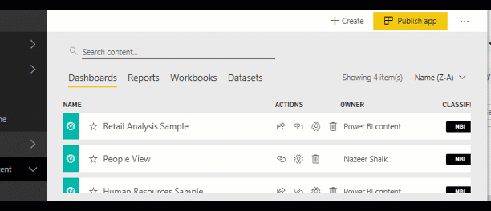
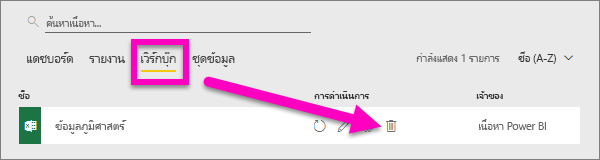

# ลบเกือบทุกสิ่งในบริการ Power BI
บทความนี้สอนวิธีการลบแดชบอร์ด รายงาน เวิร์กบุ๊ก ชุดข้อมูล แอปฯ การแสดงภาพ และพื้นที่ทำงานในบริการ Power BI

## ลบแดชบอร์ด
สามารถลบแดชบอร์ดได้ การลบแดชบอร์ดไม่ได้ลบชุดข้อมูลพื้นฐานหรือรายงานใด ๆ ที่เชื่อมโยงกับแดชบอร์ดนั้น

* ถ้าคุณเป็นเจ้าของแดชบอร์ด คุณสามารถลบออกได้ ถ้าคุณแชร์แดชบอร์ดกับเพื่อนร่วมงาน การลบแดชบอร์ดจากพื้นที่ทำงานของ Power BI จะลบแดชบอร์ดจากพื้นที่ทำงาน Power BI ของเพื่อนร่วมงานของคุณด้วย
* ถ้ามีการแชร์แดชบอร์ดกับคุณและคุณไม่ต้องการเห็นอีกต่อไป คุณสามารถลบออกได้  การลบแดชบอร์ดจะไม่เป็นการลบออกจากพื้นที่ทำงาน Power BI ของใคร
* หากแดชบอร์ดเป็นส่วนหนึ่งของการ[แพ็คเนื้อหาขององค์กร](../collaborate-share/service-organizational-content-pack-disconnect.md) วิธีเดียวที่จะลบออกได้คือการลบชุดข้อมูลที่เกี่ยวข้อง

### การลบแดชบอร์ด
1. ในพื้นที่ทำงานของคุณ เลือกแถบ**แดชบอร์ด**
2. ค้นหาแดชบอร์ดที่ต้องการลบแล้วเลือกไอคอนลบ .

    

## ลบรายงาน
ไม่ต้องกังวล การลบรายงานไม่ลบชุดข้อมูลที่มีรายงานอยู่  และการแสดงภาพใด ๆ ที่คุณปักหมุดจากรายงานจะปลอดภัย--การแสดงภาพเหล่านี้จะยังคงอยู่บนแดชบอร์ดจนกว่าคุณลบทีละอัน

### การลบรายงาน
1. ในพื้นที่ทำงานของคุณ เลือกแถบ**รายงาน**
2. ค้นหารายงานที่ต้องการลบแล้วเลือกไอคอนลบ   .   

    
3. ยืนยันการลบ

   

   > [!NOTE]
   > ถ้ารายงานดังกล่าวเป็นส่วนหนึ่งของการ[ชุดเนื้อหา](../collaborate-share/service-organizational-content-pack-introduction.md) คุณจะไม่สามารถลบออกโดยใช้วิธีการนี้  ดู[การลบการเชื่อมต่อไปยังชุดเนื้อหาขององค์กร](../collaborate-share/service-organizational-content-pack-disconnect.md)
   >
   >

## ลบสมุดงาน
สามารถลบสมุดงานได้ อย่างไรก็ตาม การลบสมุดงานจะลบรายงานและแผ่นแดชบอร์ดที่ประกอบด้วยข้อมูลจากสมุดงานทั้งหมดี้ด้วย

หากมีการจัดเก็บสมุดงานใน OneDrive for Business การลบสมุดงานจาก Power BI จะไม่ลบออกจาก OneDrive

### การลบสมุดงาน
1. ในพื้นที่ทำงานของคุณ เลือกแถบ**สมุดงาน**
2. ค้นหาสมุดงานที่ต้องการลบแล้วเลือก ลบ  icon.

    
3. ยืนยันการลบ

   

## ลบชุดข้อมูล
สามารถลบชุดข้อมูลได้ อย่างไรก็ตาม การลบชุดข้อมูลจะลบรายงานและแผ่นแดชบอร์ดที่มีข้อมูลจากชุดข้อมูลนั้นทั้งหมดด้วย

หากชุดข้อมูลเป็นส่วนหนึ่งของ[ชุดเนื้อหาระดับองค์กร](../collaborate-share/service-organizational-content-pack-disconnect.md)อย่างน้อยหนึ่งชุด วิธีเดียวที่จะลบชุดข้อมูลจากชุดเนื้อหาที่กำลังมีการใช้งานอยู่คือ รอให้มีการประมวลผลเสร็จเรียบร้อย จากนั้นนั้นลองลบอีกครั้ง

### การลบชุดข้อมูล
1. ในพื้นที่ทำงานของคุณ เลือกแถบ**ชุดข้อมูล**
2. ค้นหาชุดข้อมูลที่ต้องการลบแล้วเลือก **ตัวเลือกเพิ่มเติม** (...)  

    
3. จากรายการแบบเลื่อนลง เลือก**ลบ**

   
4. ยืนยันการลบ

   

## ลบพื้นที่ทำงาน
> [!WARNING]
> เมื่อคุณสร้างพื้นที่ทำงาน คุณจะสร้างกลุ่ม Office 365 ด้วย และเมื่อคุณลบพื้นที่ทำงาน คุณจะลบกลุ่ม Office365 ด้วย นั่นหมายความว่า กลุ่มจะถูกลบออกจากผลิตภัณฑ์ O365 อื่น ๆ เช่น SharePoint และทีม Microsoft
>
>

ในฐานะผู้สร้างพื้นที่ทำงาน คุณสามารถลบพื้นที่ทำงานได้ เมื่อคุณลบพื้นที่ทำงานแอปฯ แอปฯที่เชื่อมโยงสำหรับสมาชิกของกลุ่มทั้งหมดจะถูกลบไปด้วย และจะลบออกจาก AppSource ของคุณหากคุณได้เผยแพร่แอปฯไปยังทั้งองค์กรของคุณ การลบพื้นที่ทำงานจะแตกต่างจากการออกจากพื้นที่ทำงาน

### วิธีการลบพื้นที่ทำงาน ในกรณีที่คุณเป็นผู้ดูแลระบบ
1. จากบานหน้าต่างนำทาง ให้เลือก**พื้นที่ทำงาน**

2. เลือก **ตัวเลือกเพิ่มเติม** (...) ทางด้านขวาของพื้นที่ทำงานเพื่อลบ และเลือก**แก้ไขพื้นที่ทำงาน**

    

3. ในหน้าต่าง**การแก้ไขพื้นที่ทำงาน** เลือก**ลบพื้นที่ทำงาน** > **ลบ**

    

### วิธีการลบพื้นที่ทำงานจากรายการของคุณ
หากคุณไม่ต้องการเป็นสมาชิกของพื้นที่ทำงาน คุณสามารถ***ออก***จากพื้นที่ทำงานนั้น และระบบจะลบพื้นที่ทำงานจากรายการของคุณ การออกจากพื้นที่ทำงานจะมีอยู่แล้วสำหรับสมาชิกในพื้นที่ทำงานอื่น ๆ ทั้งหมด  

> [!IMPORTANT]
> หากคุณเป็นผู้ดูแลระบบเพียงคนเดียวในพื้นที่ทำงาน Power BI จะไม่อนุญาตให้คุณออกจากพื้นที่ทำงาน
>
>

1. เริ่มต้นในพื้นที่ทำงานที่คุณต้องการลบ

2. ที่มุมบนขวา เลือก **ตัวเลือกเพิ่มเติม** (...) แล้วเลือก**ออกจากพื้นที่ทำงาน** > **ออก**

      

   > [!NOTE]
   > ตัวเลือกที่คุณเห็นในรายการแบบเลื่อนลงขึ้นอยู่กับว่าคุณเป็นผู้ดูแลระบบหรือเป็นสมาชิกของพื้นที่ทำงานนั้น
   >
   >

## ลบหรือนำแอปฯออกไป
เราสามารถลบแอปฯออกจากหน้ารายการแอปฯของคุณได้ง่าย ๆ แต่เฉพาะผู้ดูแลระบบสำหรับแอปฯเท่านั้นที่สามารถลบแอปฯได้อย่างถาวร

### การลบแอปฯออกจากหน้ารายการแอปฯของคุณ
การลบแอปฯจากหน้ารายการแอปฯของคุณจะไม่ลบแอฯปสำหรับสมาชิกคนอื่น ๆ

1. ในหน้าต่างนำทาง เลือก**Apps**เมื่อต้องเปิดหน้ารายการแอปฯ
2. เลื่อนไปยังแอปฯที่ต้องการลบ แล้วเลือกไอคอนลบ

   

   หากคุณเอาแอปฯออกโดยไม่ได้ตั้งใจ คุณมีหลายตัวเลือกสำหรับการเรียกคือแอปฯดังกล่าว  คุณสามารถขอให้ผู้สร้างแอปฯส่งแอปฯกลับมาใหม่ คุณสามารถค้นหาอีเมลต้นฉบับที่มีลิงค์ไปยังแอปฯ คุณสามารถตรวจสอบ[ศูนย์การแจ้งเตือน](../consumer/end-user-notification-center.md)ของคุณเพื่อดูว่าแอปฯดังกล่าวยังคงอยู่ในรายการแจ้งเตือนหรือไม่ หรือคุณสามารถตรวจสอบ [ AppSource](../consumer/end-user-apps.md) ขององค์กรของคุณ

## ข้อควรพิจารณาและการแก้ไขปัญหา
บทความนี้ครอบคลุมวิธีการลบบล็อคก่อสร้างหลักของบริการ Power BI แต่ยังมีสิ่งอื่นอีกที่คุณสามารถลบได้ใน Power BI  

* [ลบแดชบอร์ดที่แนะนำของคุณ](../consumer/end-user-featured.md)
* [ลบแดชบอร์ด (ที่ไม่ใช่รายการโปรด)](../consumer/end-user-favorite.md)
* [ลบหน้ารายงาน](service-delete.md)
* [ลบแผ่นแดชบอร์ดหนึ่ง](service-dashboard-edit-tile.md)
* [ลบภาพการแสดงภาพรายงาน](service-delete.md)

มีคำถามเพิ่มเติมหรือไม่ [ลองไปที่ชุมชน Power BI](https://community.powerbi.com/)
