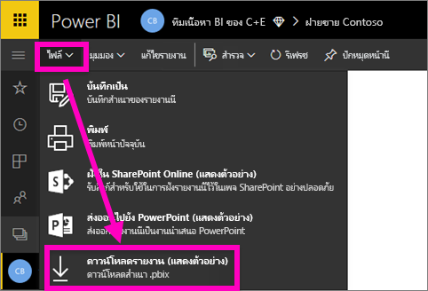
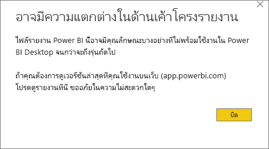
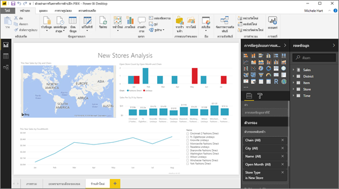

# ดาวน์โหลดรายงานจากบริการของ Power BI ไปยังไฟล์ Power BI Desktop (ตัวอย่าง)
ใน Power BI Desktop คุณสามารถเผยแพร่รายงาน (ไฟล์ *.pbix*) จากคอมพิวเตอร์ในเครื่องของคุณไปยังบริการของ Power BI ได้ รายงาน Power BI สามารถไปยังทิศทางอื่น ๆ ได้เช่นกัน: คุณสามารถดาวน์โหลดรายงานจากบริการของ Power BI ไปยังไฟล์ Power BI Desktop ส่วนขยายสำหรับรายงาน Power BI ในกรณีใดก็ตามคือ .pbix

มีข้อจำกัดบางประการที่ควรคำนึงถึง ซึ่งจะกล่าวถึงในส่วน [ข้อควรพิจารณาและการแก้ไขปัญหา](#considerations-and-troubleshooting) ของบทความนี้

## ดาวน์โหลดรายงานเป็นแบบ ไฟล์ .pbix

คุณสามารถดาวน์โหลดได้เฉพาะรายงาน [ที่สร้างขึ้นด้วย Power BI Desktop ](/learn/modules/publish-share-power-bi/2-publish-reports) หลังจากวันที่ 23 พฤศจิกายน 2016 และได้รับการปรับปรุงนับตั้งแต่จากนั้น ถ้ามีการสร้างก่อน ตัวเลือกเมนู**ดาวน์โหลดรายงาน**ในบริการของ Power BI จะเป็นสีเทา

การดาวน์โหลดไฟล์ .pbix ให้ทำตามขั้นตอนเหล่านี้:

1. ในบริการของ Power BI เปิดรายงานที่คุณต้องการดาวน์โหลดใน[มุมมองการแก้ไข](https://docs.microsoft.com/power-bi/service-interact-with-a-report-in-editing-view)

2. จากบานหน้าต่างนำทางด้านบน ให้เลือก**ไฟล์ > ดาวน์โหลดรายงาน**
   
3. ในขณะที่กำลังดาวน์โหลดรายงาน แบนเนอร์สถานะจะแสดงความคืบหน้า เมื่อไฟล์พร้อม คุณจะถูกขอให้เปิดหรือบันทึกไฟล์ .pbix ชื่อค่าเริ่มต้นของไฟล์ตรงกับชื่อเรื่องของรายงาน
   
4. ถ้าคุณไม่พร้อม [ติดตั้ง Power BI Desktop ](../fundamentals/desktop-get-the-desktop.md) จากนั้นให้เปิดไฟล์ .pbix ใน Power BI Desktop
   
    เมื่อคุณเปิดรายงานใน Power BI Desktop คุณอาจเห็นข้อความแจ้งเตือนให้คุณทราบว่าบางคุณลักษณะที่พร้อมใช้งานในรายงานการบริการของ Power BI อาจไม่พร้อมใช้งานใน Power BI Desktop
   
    

5. ตัวแก้ไขรายงานใน Power BI Desktop จะคล้ายคลึงกันตัวแก้ไขรายงานในบริการของ Power BI  
   
    

## ข้อควรพิจารณาและการแก้ไขปัญหา
มีข้อควรพิจารณาและขีดจำกัดที่สำคัญสองสามข้อที่เชื่อมโยงกับการดาวน์โหลดไฟล์ .pbix จากบริการ Power BI

* เมื่อต้องการดาวน์โหลดไฟล์ คุณต้องแก้ไขการเข้าถึงในรายงาน
* ต้องมีการสร้างรายงานโดยใช้ Power BI Desktop และ*เผยแพร่*ไปยังบริการของ Power BI หรือไฟล์ .pbix ต้องได้รับ*การอัปโหลด*ไปยังบริการของ Power BI
* ต้องมีการเผยแพร่หรืออัปเดตรายงานหลังจากวันที่ 23 พฤศจิกายน 2016 รายงานที่เผยแพร่ก่อนหน้านี้ยังไม่สามารถดาวน์โหลดได้
* คุณลักษณะนี้จะไม่สามารถใช้งานได้กับรายงานและชุดเนื้อหาที่สร้างขึ้นในบริการของ Power BI
* ใช้เวอร์ชันล่าสุดของ Power BI Desktop เสมอเมื่อเปิดไฟล์ที่ดาวน์โหลดแล้ว ไฟล์ .pbix ที่ดาวน์โหลดแล้วอาจไม่สามารถเปิดได้ในเวอร์ชันที่ไม่ใช่เวอร์ชั่นปัจจุบันของ Power BI Desktop
* หากผู้ดูแลระบบของคุณปิดใช้งานความสามารถในการดาวน์โหลดข้อมูล คุณลักษณะนี้จะไม่ปรากฏในบริการของ Power BI
* ชุดข้อมูลที่มีการรีเฟรชแบบเพิ่มทีละหน่วยไม่สามารถดาวน์โหลดเป็นไฟล์ .pbix ได้
* ถ้าคุณสร้างรายงาน Power BI โดยยึดตามชุดข้อมูลในพื้นที่ทำงานหนึ่งและเผยแพร่ไปยังพื้นที่ทำงานอื่น คุณและผู้ใช้ของคุณจะไม่สามารถดาวน์โหลดได้ ในขณะนี้ คุณลักษณะการดาวน์โหลดไม่ได้รับการสนับสนุนในสถานการณ์นี้

## ขั้นตอนถัดไป
ดูวิดีโอความยาวหนึ่งนาที**Guy in a Cube**สำหรับคุณลักษณะนี้:

<iframe width="560" height="315" src="https://www.youtube.com/embed/ymWqU5jiUl0" frameborder="0" allowfullscreen></iframe>

ต่อไปนี้คือบทความเพิ่มเติมที่สามารถช่วยให้คุณเรียนรู้วิธีการใช้บริการของ Power BI:

* [รายงานใน Power BI](../consumer/end-user-reports.md)
* [แนวคิดพื้นฐานสำหรับนักออกแบบในบริการ Power BI](../fundamentals/service-basic-concepts.md)

เมื่อคุณได้ติดตั้ง Power BI Desktop แล้ว บทความต่อไปนี้สามารถช่วยให้คุณเริ่มต้น และใช้งานอย่างรวดเร็ว:

* [เริ่มต้นใช้งาน Power BI Desktop](../fundamentals/desktop-getting-started.md)

มีคำถามเพิ่มเติมหรือไม่ [ลองไปที่ชุมชน Power BI](https://community.powerbi.com/)
