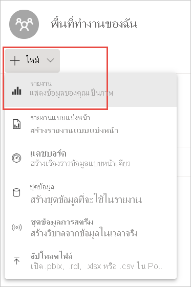

# บทช่วยสอน: จากสมุดงาน Excel ไปยังรายงานในบริการของ Power BI และต่อไปยัง Microsoft Teams
ผู้จัดการของคุณต้องการดูรายงานเกี่ยวกับยอดขายล่าสุดและตัวเลขกำไรของคุณภายในเย็นวันนี้ แต่ข้อมูลล่าสุดอยู่ในระบบต่าง ๆ ของบุคคลที่สามและไฟล์ในแล็ปท็อปของคุณ ในอดีตต้องใช้เวลาหลายชั่วโมงในการสร้างภาพและจัดรูปแบบรายงาน และคุณเริ่มที่จะรู้สึกกังวล

ไม่ต้องกังวล ด้วย Power BI คุณสามารถสร้างรายงานที่สวยงามและแชร์รายงานใน Microsoft Teams ได้ในเวลาไม่นาน

:::image type="content" source="media/service-from-excel-to-stunning-report/power-bi-financial-report-service.png" alt-text="ภาพหน้าจอของรายงานตัวอย่างด้านการเงินที่เสร็จเรียบร้อยแล้ว":::

ในบทช่วยสอนนี้ เราจะอัปโหลดไฟล์ Excel สร้างรายงานใหม่ และแชร์กับเพื่อนร่วมงานใน Microsoft Teams ซึ่งทั้งหมดนี้ทำได้ภายใน Power BI คุณจะได้เรียนรู้วิธีการต่อไปนี้:

> [!div class="checklist"]
> * จัดเตรียมข้อมูลของคุณใน Excel
> * ดาวน์โหลดข้อมูลตัวอย่าง
> * สร้างรายงานในบริการของ Power BI
> * ปักหมุดวิชวลรายงานไปยังแดชบอร์ด
> * แชร์ลิงก์ไปยังแดชบอร์ด
> * แชร์แดชบอร์ดใน Microsoft Teams

## จัดเตรียมข้อมูลใน Excel
เราใช้ไฟล์ Excel ง่าย ๆ เพื่อแสดงเป็นตัวอย่าง 

1. ก่อนที่คุณสามารถโหลดไฟล์ Excel ของคุณลงใน Power BI คุณต้องจัดระเบียบข้อมูลของคุณในตารางเดียวก่อน ในตารางแบบคงที่ แต่ละคอลัมน์ประกอบด้วยข้อมูลประเภทเดียวกัน ตัวอย่างเช่น ข้อความ วันที่ ตัวเลข หรือสกุลเงิน ตารางของคุณควรมีแถวส่วนหัว แต่ไม่มีคอลัมน์หรือแถวที่แสดงผลรวม

   

2. ถัดไป จัดรูปแบบข้อมูลของคุณเป็นหนึ่งตาราง ใน Excel ที่แถบ**หน้าแรก** ในกลุ่ม**สไตล์** เลือก**จัดรูปแบบเป็นตาราง** 

3. เลือกลักษณะตารางที่จะนำไปใช้กับแผ่นงานของคุณ 

   ขณะนี้แผ่นงาน Excel ของคุณพร้อมที่จะโหลดลงใน Power BI

   

## อัปโหลดไฟล์ Excel ของคุณไปยังบริการ Power BI
บริการ Power BI เชื่อมต่อกับแหล่งข้อมูลจำนวนมาก รวมถึงไฟล์ Excel ที่อยู่บนคอมพิวเตอร์ของคุณ 

 > [!NOTE] 
 > เพื่อทำตามส่วนที่เหลือของบทช่วยสอนนี้ ให้ดาวน์โหลด[สมุดงานตัวอย่างการเงิน](https://go.microsoft.com/fwlink/?LinkID=521962)

1. ลงชื่อเข้าบริการ Power BI เพื่อเริ่มใช้งาน หากคุณยังไม่ได้ลงทะเบียน[คุณสามารถทำได้โดยไม่มีค่าใช้จ่าย](https://powerbi.com)
1. ใน **พื้นที่ทำงานของฉัน** ให้เลือก **ใหม่** > **อัปโหลดไฟล์**

    :::image type="content" source="media/service-from-excel-to-stunning-report/power-bi-new-upload.png" alt-text="ภาพหน้าจอของตัวเลือกอัปโหลดไฟล์":::

1. เลือก**ไฟล์ภายในเครื่อง** เรียกดูตำแหน่งที่คุณบันทึกไฟล์ Excel ตัวอย่างการเงิน และเลือก**เปิด**
7. บนหน้า**ไฟล์ภายในเครื่อง** ให้เลือก**นำเข้า**

    ในตอนนี้คุณมีชุดข้อมูลตัวอย่างการเงินแล้ว และ Power BI จะสร้างแดชบอร์ดว่างโดยอัตโนมัติ หากคุณไม่เห็นแดชบอร์ด ให้รีเฟรชเบราว์เซอร์ของคุณ

    :::image type="content" source="media/service-from-excel-to-stunning-report/power-bi-financial-dataset.png" alt-text="ภาพหน้าจอของพื้นที่ทำงานของฉันที่มีชุดข้อมูลตัวอย่างการเงิน":::

2. คุณต้องการสร้างรายงาน ยังอยู่ใน**พื้นที่ทำงานของฉัน** ให้เลือก**รายงาน** > **ใหม่**

   

3. ในกล่องโต้ตอบ**เลือกชุดข้อมูลเพื่อสร้างรายงาน** ให้เลือกชุดข้อมูล**ตัวอย่างการเงิน**ของคุณ > **สร้าง**

   

## บันทึกรายงานของคุณ
 
รายงานเปิดขึ้นในมุมมองการแก้ไขและแสดงพื้นที่รายงานที่ว่างเปล่า ที่ด้านขวาคือบานหน้าต่าง**การแสดงภาพ** **ตัวกรอง** และ**เขตข้อมูล** ข้อมูลในตารางสมุดงาน Excel ของคุณปรากฏขึ้นในบานหน้าต่าง**เขตข้อมูล** ที่ด้านบนคือชื่อของตาราง **การเงิน** ที่ด้านล่างชื่อ Power BI จะแสดงรายการส่วนหัวของคอลัมน์เป็นแขตข้อมูลแต่ละช่อง

คุณเห็นสัญลักษณ์ซิกมาในรายการเขตข้อมูลหรือไม่ Power BI ตรวจพบว่าเขตข้อมูลเหล่านั้นเป็นตัวเลข Power BI ยังระบุเขตข้อมูลทางภูมิศาสตร์ที่มีสัญลักษณ์ลูกโลก

1. หากต้องการที่ว่างสำหรับพื้นที่รายงาน ให้เลือก**ซ่อนบานหน้าต่างการนำทาง** และลดขนาดบานหน้าต่าง**ตัวกรอง**

    :::image type="content" source="media/service-from-excel-to-stunning-report/power-bi-hide-nav-pane.png" alt-text="ภาพหน้าจอของการลดขนาดบานหน้าต่างการนำทาง"::: 

1. ตอนนี้คุณสามารถเริ่มต้นสร้างการแสดงภาพได้ สมมติว่าผู้จัดการของคุณต้องการเห็นผลกำไรเมื่อเวลาผ่านไป ในบานหน้าต่าง **เขตข้อมูล** ลาก**กำไร**ไปยังพื้นที่ของรายงาน 

   ตามค่าเริ่มต้น Power BI จะแสดงแผนภูมิคอลัมน์ที่มีคอลัมน์เดียว 

    :::image type="content" source="media/service-from-excel-to-stunning-report/power-bi-profit-column.png" alt-text="ภาพหน้าจอของแผนภูมิคอลัมน์ที่มีคอลัมน์เดียว":::

3. ลาก**วันที่**ไปยังพื้นที่ของรายงาน 

   Power BI อัปเดตแผนภูมิคอลัมน์เพื่อแสดงกำไรตามวันที่

   

    ธันวาคม 2014 เป็นเดือนที่มีกำไรมากที่สุด
   
    > [!TIP]
    > หากค่าแผนภูมิของคุณไม่เหมือนกับที่คุณคาดไว้ ให้ตรวจสอบการรวมข้อมูลของคุณ ตัวอย่างเช่น ในบริเวณ**ค่า** เลือกเขตข้อมูล**กำไร**ที่คุณเพิ่งเพิ่มเข้ามา และตรวจสอบให้แน่ใจว่าการรวมข้อมูลดำเนินการตามวิธีที่คุณต้องการ ในตัวอย่างนี้ เรากำลังใช้**ผลรวม**
    > 

### สร้างแผนที่

ผู้จัดการของคุณต้องการทราบว่าประเทศใดทำกำไรมากที่สุด สร้างความประทับใจให้ผู้จัดการด้วยการแสดงภาพแผนที่ 

1. เลือกพื้นที่ว่างบนพื้นที่รายงานของคุณ 

2. จากบานหน้าต่าง**เขตข้อมูล** ให้ลากเขตข้อมูล**ประเทศ**ไปยังพื้นที่รายงานของคุณ จากนั้นจึงลากเขตข้อมูล**กำไร**ไปยังแผนที่

   Power BI สร้างภาพแผนที่พร้อมฟองอากาศที่เป็นตัวแทนผลกำไรของแต่ละพื้นที่

   

    ดูเหมือนว่าประเทศในแถบยุโรปจะมีประสิทธิภาพเหนือกว่าประเทศในอเมริกาเหนือ

### สร้างวิชวลที่แสดงยอดขาย

คุณต้องการแสดงภาพที่นำเสนอยอดขายตามภาคส่วนผลิตภัณฑ์และการตลาดหรือไม่? ทำได้ง่าย 

1. เลือกพื้นที่ว่าง

1. ในบานหน้าต่าง **เขตข้อมูล** ให้เลือกเขตข้อมูล **การขาย**, **ผลิตภัณฑ์** และ **ภาคส่วน** 
   
   Power BI สร้างแผนภูมิคอลัมน์แบบคลัสเตอร์ 

2. เปลี่ยนชนิดของแผนภูมิโดยการเลือกไอคอนใดไอคอนหนึ่งในเมนู**การแสดงข้อมูลด้วยภาพ** เช่น เปลี่ยนเป็น**แผนภูมิคอลัมน์แบบเรียงซ้อนกัน** 

   

3. เมื่อต้องการเรียงลำดับแผนภูมิ เลือก **ตัวเลือกเพิ่มเติม** (...) > **เรียงลำดับตาม**

### จัดวิชวลให้เป็นระเบียบ

ทำการเปลี่ยนแปลงต่อไปนี้บนแท็บ**จัดรูปแบบ**ในบานหน้าต่างการแสดงภาพ

:::image type="content" source="media/desktop-excel-stunning-report/power-bi-format-tab-visualizations.png" alt-text="ภาพหน้าจอของแท็บจัดรูปแบบในบานหน้าต่างการแสดงภาพ":::

1. เลือกแผนภูมิคอลัมน์**กำไรตามวันที่** ในส่วน**ชื่อเรื่อง** ให้เปลี่ยน**ขนาดข้อความ**เป็น **16 pt** ตั้งค่า**เงา**เป็น**เปิด** 

1. เลือกแผนภูมิคอลัมน์แบบเรียงซ้อนของ**ยอดขายตามผลิตภัณฑ์และเซกเมนต์** ในส่วน**ชื่อเรื่อง** ให้เปลี่ยน**ขนาดข้อความ**ของชื่อเรื่องเป็น**16 pt** ตั้งค่า**เงา**เป็น**เปิด**

1. เลือกแผนที่**กำไรตามประเทศ** ในส่วน**ลักษณะแผนที่** ให้เปลี่ยน**ธีม**เป็น**โทนสีเทา** ในส่วน**ชื่อเรื่อง** ให้เปลี่ยน**ขนาดข้อความ**ของชื่อเรื่องเป็น**16 pt** ตั้งค่า**เงา**เป็น**เปิด**

## ปักหมุดไปยังแดชบอร์ด

ในตอนนี้ คุณสามารถปักหมุดวิชวลทั้งหมดของคุณไปยังแดชบอร์ดว่างที่ Power BI สร้างขึ้นตามค่าเริ่มต้น 

1. วางเมาส์เหนือวิชวลและเลือก**ปักหมุดวิชวล**

   

1. คุณจะต้องบันทึกรายงานของคุณก่อน คุณจึงจะสามารถปักหมุดวิชวลไปยังแดชบอร์ดได้ ตั้งชื่อรายงานของคุณ และเลือก**บันทึก**
1. ปักหมุดวิชวลแต่ละภาพไปยังแดชบอร์ดที่ Power BI สร้างขึ้น **ตัวอย่างการเงิน.xlsx**
1. เมื่อคุณปักหมุดวิชวลล่าสุด ให้เลือก**ไปที่แดชบอร์ด**
1. Power BI เพิ่มไทล์ข้อความตัวอย่างสำหรับตัวอย่างการเงิน.xlsx ไปยังแดชบอร์ดโดยอัตโนมัติ เลือก**ตัวเลือกเพิ่มเติม (...)**  > **ลบไทล์**

    :::image type="content" source="media/service-from-excel-to-stunning-report/power-bi-tile-more-options.png" alt-text="ภาพหน้าจอของตัวเลือกเพิ่มเติมสำหรับไทล์":::

1. จัดเรียงใหม่และปรับขนาดไทล์ในแบบที่คุณต้องการ

แดชบอร์ดและรายงานพร้อมแล้ว

## แชร์ลิงก์ไปยังแดชบอร์ดของคุณ

ในตอนนี้ก็ถึงเวลาที่จะแชร์แดชบอร์ดของคุณกับผู้จัดการแล้ว คุณสามารถแชร์แดชบอร์ดและรายงานที่สำคัญของคุณกับเพื่อนร่วมงานที่มีบัญชี Power BI บุคคลเหล่านี้สามารถโต้ตอบกับรายงานของคุณ แต่ไม่สามารถบันทึกการเปลี่ยนแปลงได้ หากคุณอนุญาต พวกเขาสามารถแชร์ต่อกับผู้อื่นหรือสร้างรายงานใหม่ที่ยึดตามชุดข้อมูลพื้นฐานได้

1. เมื่อต้องการแชร์รายงานของคุณ ที่ด้านบนสุดของแดชบอร์ด ให้เลือก**แชร์**

   

2. ในหน้า**แชร์แดชบอร์ด** ให้ป้อนที่อยู่อีเมลของผู้รับในกล่อง**ป้อนที่อยู่อีเมล** และเพิ่มข้อความในกล่องด้านล่าง 

3. ตัดสินใจว่าคุณต้องการใช้ตัวเลือกใด หากมี:

    - **อนุญาตให้ผู้รับแชร์แดชบอร์ดของคุณ** 
    - **อนุญาตให้ผู้รับสร้างเนื้อหาใหม่โดยใช้ชุดข้อมูลพื้นฐาน**
    - **ส่งการแจ้งเตือนทางอีเมลไปยังผู้รับ**

   

1. เลือก **แชร์**

## แชร์ไปยัง Microsoft Teams

คุณยังสามารถแชร์รายงานและแดชบอร์ดให้เพื่อนร่วมงานของคุณได้โดยตรงใน Microsoft Teams

1. หากต้องการแชร์ใน Teams ให้เลือก**แชร์ไปยัง Teams** ที่ด้านบนสุดของแดชบอร์ด

   

2. Power BI แสดงกล่องโต้ตอบ**แชร์ไปยัง Teams** ใส่ชื่อของบุคคล กลุ่ม หรือช่อง และเลือก**แชร์** 
   
    :::image type="content" source="media/service-from-excel-to-stunning-report/power-bi-share-teams-dialog.png" alt-text="ภาพหน้าจอของกล่องโต้ตอบแชร์ไปยัง Teams":::

3. ลิงก์จะปรากฏใน**โพสต์**สำหรับบุคคล กลุ่ม หรือช่องดังกล่าว

   

## ขั้นตอนถัดไป

* ในตอนนี้คุณได้สร้างรายงานพื้นฐานในบริการของ Power BI แล้ววิธีการสร้างรายงานใน Power BI Desktop ล่ะ? ลองใช้บทช่วยสอน [จากเวิร์กบุ๊ก Excel ไปสู่รายงานอันน่าทึ่งใน Power BI Desktop](desktop-excel-stunning-report.md)

มีคำถามเพิ่มเติมหรือไม่ [ลองไปที่ชุมชน Power BI](https://community.powerbi.com/)
