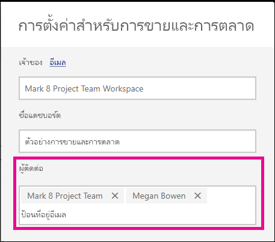

# ตั้งค่าข้อมูลติดต่อสำหรับรายงานและแดชบอร์ดในบริการของ Power BI
บทความนี้สอนวิธีการตั้งค่าข้อมูลติดต่อสำหรับแดชบอร์ดหรือรายงานในบริการของ Power BI

> [!NOTE]
> สามารถตั้งค่าข้อมูลติดต่อสำหรับรายการต่าง ๆ ในพื้นที่ทำงานแบบคลาสสิคหรือแบบใหม่ได้ คุณไม่สามารถตั้งค่าข้อมูลติดต่อสำหรับรายการต่าง ๆ ในพื้นที่ทำงานของฉัน บัตรข้อมูลจะแสดงเมื่อดูรายงานหรือแดชบอร์ดใน[รูปลักษณ์ใหม่](../consumer/service-new-look.md)

คุณสามารถเพิ่มผู้ใช้หรือกลุ่มหลายรายลงในผู้ติดต่อสำหรับรายการต่าง ๆ ได้ พวกเขาสามารถเป็น:
* บุคคล
* Microsoft 365 Group
* อีเมลที่เปิดใช้งานกลุ่มความปลอดภัย
* รายการแจกจ่าย

ตามค่าเริ่มต้น บุคคลที่สร้างรายงานหรือแดชบอร์ดใหม่คือผู้ติดต่อ หากคุณตั้งค่าค่าหนึ่ง ค่าดังกล่าวจะแทนที่ค่าเริ่มต้น แน่นอนว่าคุณสามารถลบบุคคลหรือกลุ่มทั้งหมดออกจากรายการผู้ติดต่อ เมื่อคุณทำเช่นนี้สำหรับพื้นที่ทำงานแบบคลาสสิก Microsoft 365 Group สำหรับพื้นที่ทำงานจะแสดงขึ้นมา สำหรับพื้นที่ทำงานในประสบการณ์ในพื้นที่ทำงานใหม่ จะมีการใช้[รายการผู้ติดต่อของพื้นที่ทำงาน](../collaborate-share/service-create-the-new-workspaces.md#create-a-contact-list) หากไม่ได้ตั้งค่ารายการผู้ติดต่อของพื้นที่ทำงาน ผู้ดูแลระบบพื้นที่ทำงานจะแสดงขึ้นมา

ข้อมูลติดต่อจะแสดงบุคคลที่กำลังดูรายการ 

 

เมื่อคุณคลิกที่รายชื่อผู้ติดต่อ จะมีการสร้างอีเมลเพื่อให้คุณสามารถถามข้อสงสัยหรือขอความช่วยเหลือได้ 

 
 
นอกจากนี้ ยังมีการใช้ข้อมูลรายการผู้ติดต่อในสถานที่อื่น ๆ ตัวอย่างเช่น จะปรากฏขึ้นในบางสถานการณ์ข้อผิดพลาดในกล่องโต้ตอบข้อผิดพลาด ข้อความอีเมลแบบอัตโนมัติที่เกี่ยวข้องกับรายการจะถูกส่งไปยังรายการผู้ติดต่อ เช่น คำขอการเข้าถึง 

> [!NOTE]
> เมื่อเผยแพร่แอป ข้อมูลติดต่อที่ตั้งค่าไว้ในแต่ละรายการจะถูกตั้งค่าเป็นบุคคลที่เผยแพร่หรืออัปเดตแอป คุณสามารถตั้งค่า URL การสนับสนุนแอปได้ เพื่อให้ผู้ใช้แอปสามารถขอความช่วยเหลือตามที่จำเป็นได้

## ตั้งค่าข้อมูลติดต่อสำหรับรายงาน
1. ในพื้นที่ทำงานของคุณ เลือกแถบ**รายงาน**
2. ค้นหารายงานที่ต้องการและเลือกไอคอน**การตั้งค่า**
3. ค้นหาเขตข้อมูลการป้อนข้อมูลของ**ผู้ติดต่อ**และตั้งค่าค่า

     

## ตั้งค่าข้อมูลติดต่อสำหรับแดชบอร์ด
1. ในพื้นที่ทำงานของคุณ เลือกแถบ**แดชบอร์ด**
2. ค้นหาแดชบอร์ดที่ต้องการและเลือกไอคอน**การตั้งค่า**
3. ค้นหาเขตข้อมูลการป้อนข้อมูลของ**ผู้ติดต่อ**และตั้งค่าค่า

     

## ข้อจำกัดและข้อควรพิจารณา
* ผู้ติดต่อจะถูกตั้งค่าโดยอัตโนมัติสำหรับรายการใหม่ที่สร้างขึ้นในบริการของ Power BI รายการที่มีอยู่จะแสดงค่าเริ่มต้นของพื้นที่ทำงาน
* คุณสามารถตั้งค่าผู้ใช้หรือกลุ่มใด ๆ ในรายการผู้ติดต่อ แต่จะไม่ได้รับสิทธิ์กับรายการโดยอัตโนมัติ ใช้การแชร์หรือให้ผู้ใช้ที่ต้องการเข้าถึงพื้นที่ทำงานผ่านบทบาท 
* รายการผู้ติดต่อระดับรายการจะไม่ได้รับการส่งไปยังแอปเมื่อมีการเผยแพร่ ประสบการณ์การนำทางในแอปใหม่มี URL การสนับสนุนที่คุณกำหนดค่าเพื่อช่วยจัดการคำติชมจากผู้ใช้แอปจำนวนมาก

## ขั้นตอนถัดไป

มีคำถามเพิ่มเติมหรือไม่ [ลองไปที่ชุมชน Power BI](https://community.powerbi.com/)
