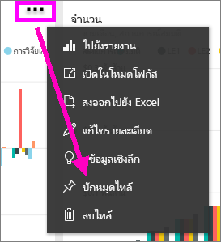

# ปักหมุดไทล์จากแดชบอร์ดหนึ่งไปยังอีกแดชบอร์ด
วิธีหนึ่งในการเพิ่ม[แดชบอร์ดไทล์](../consumer/end-user-tiles.md)ใหม่คือ การคัดลอกจากแดชบอร์ดอื่น แต่ละไทล์เหล่านี้ เป็นลิงก์กลับไปยังตำแหน่งที่ถูกสร้างขึ้นเมื่อคลิก ใน Q&A หรือรายงาน 

> [!NOTE]
> คุณไม่สามารถปักหมุดไทล์จากแดชบอร์ดทแชร์ได้

## ปักหมุดไทล์ไปยังแดชบอร์ดอื่น
1. [รับข้อมูล](../connect-data/service-get-data.md) ตัวอย่างนี้จะใช้[ตัวอย่างการวิเคราะห IT Spend Analysis ](sample-it-spend.md)
2. เปิด[แดชบอร์ด](../consumer/end-user-dashboards.md)
3. วางเมาส์เหนือที่ไทล์คุณต้องการปักหมุด เลือก**ตัวเลือกเพิ่มเติม** (...) และเลือก**ปักหมุดไทล์**  
   
   
4. ปักหมุดไทล์ลงในแดชบอร์ดที่มีอยู่ หรือแดชบอร์ดใหม่ 
   
   * **แดชบอร์ดที่มีอยู่** ให้เลือกชื่อของแดชบอร์ดจากรายการแบบดร๊อปดาวน์
   * **แดชบอร์ดใหม่** พิมพ์ชื่อของแดชบอร์ดใหม่
   
   
5. เลือก**หมุด**
   ข้อความว่าสำเร็จแล้ว(ใกล้กับมุมบนขวา) ช่วยให้คุณทราบว่า การแสดงภาพถูกเพิ่มเป็นไทล์ ลงในแดชบอร์ดของคุณ
   
   
6. เลือก**ไปยังแดชบอร์ด** เพื่อดูไทล์ใหม่ ที่นั่น คุณสามารถ[เปลี่ยนชื่อ ปรับขนาด ลิงก์ และย้าย](service-dashboard-edit-tile.md)การแสดงภาพที่ปักหมุดไว้ได้

## ขั้นตอนถัดไป
[เปิด ใน Power BI](../consumer/end-user-tiles.md)  
[แดชบอร์ดใน Power BI](../consumer/end-user-dashboards.md)  
มีคำถามเพิ่มเติมหรือไม่ [ลองไปที่ชุมชน Power BI](https://community.powerbi.com/)
