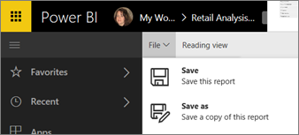
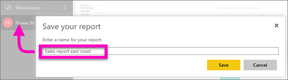

# จัดลำดับหน้าในรายงานในบริการ Power BI และ Power BI Desktop
หลังจากที่คุณทำการเปลี่ยนแปลงไปยังรายงานใน Power BI คุณสามารถบันทึก บันทึก ด้วยชื่อใหม่ หรือเพียงแค่ปิดโดยไม่บันทึกการเปลี่ยนแปลงของคุณ เช่น คุณเปิดรายงาน สร้างภาพ และปักหมุดลงในแดชบอร์ดของคุณ ถ้าคุณปิดเดี๋ยวนี้โดยไม่บันทึกการเปลี่ยนแปลงของคุณ ไทล์จะยังคงดำรงอยู่บนแดชบอร์ด แต่การแสดงภาพไม่ถูกบันทึกในรายงาน เมื่อคุณคลิกที่ไทล์ในแดชบอร์ด รายงานเปิดขึ้น แต่การแสดงภาพไม่มีข้อมูลในรายงาน

> [!TIP]
> ตั้งใจดูว่าที่พื้นที่ทำงานใดที่จะเปิดใช้งานเพื่อให้คุณสามารถค้นหารายงานบันทึกไว้ รายงานจะถูกบันทึกไปยังพื้นที่ทำงานที่มีการเคลื่อนไหวอยู่
> 
> 

### เมื่อต้องบันทึกรายงาน มีขั้นตอนดังนี้
1. ถ้าคุณพยายามที่จะนำทางออกจากรายงาน และรายงานมีการเปลี่ยนแปลง Power BI จะแสดงข้อความเตือนขึ้น
   
   
2. อีกวิธีหนึ่งในการบันทึกรายงานคือการเลือก **ไฟล์** \> **บันทึก** หรือ **บันทึกเป็น** ถ้าคุณอยู่ใน[มุมมองการอ่าน](../consumer/end-user-reading-view.md)คุณจะเห็นตัวเลือกในการบันทึกเป็นเฉพาะ 
   
   
3. ถ้านี่เป็นรายงานใหม่ (บันทึก) หรือเวอร์ชันใหม่ของรายงานที่มีอยู่ (บันทึกเป็น) โปรดตั้งชื่อคำอธิบายให้แก่มัน  **รายงานจะถูกบันทึกไปยังพื้นที่ทำงานที่มีการเคลื่อนไหวอยู่**
   
    

### ขั้นตอนถัดไป
อ่านข้อมูลเพิ่มเติมเกี่ยวกับ[รายงานใน Power BI](../consumer/end-user-reports.md)

[แนวคิดพื้นฐานสำหรับนักออกแบบในบริการ Power BI](../fundamentals/service-basic-concepts.md)

มีคำถามเพิ่มเติมหรือไม่ [ลองไปที่ชุมชน Power BI](https://community.powerbi.com/)
