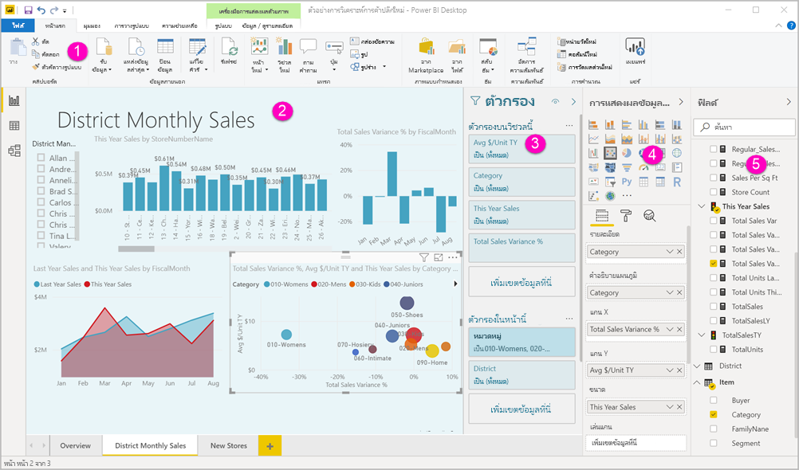
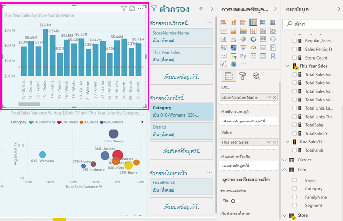
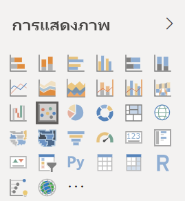
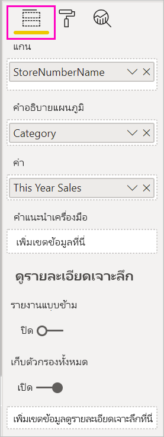
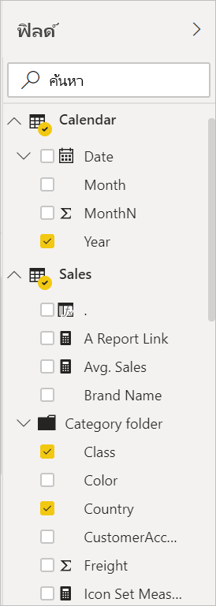

# แนะนำตัวแก้ไขรายงานใน Power BI

ใน Power BI Desktop และในบริการของ Power BI *ตัวแก้ไขรายงาน* คือ ที่ที่คุณออกแบบรายงานที่ผู้ใช้ของคุณเห็น ด้วยแผนภูมิ ตาราง แผนที่และวิชวลอื่น ๆ ซึ่งคล้ายกับในสองสภาพแวดล้อม โดยทั่วไปคุณจะเริ่มต้นด้วยการสร้างรายงานใน Power BI Desktop จากนั้นจึงเผยแพร่รายงานไปยังบริการของ Power BI ซึ่งเป็นที่ที่คุณสามารถดำเนินการปรับเปลี่ยนต่อได้ นอกจากนี้บริการของ Power BI ยังเป็นที่ที่คุณสร้างแดชบอร์ดโดยยึดตามรายงานของคุณอีกด้วย

หลังจากที่สร้างแดชบอร์ดและรายงานของคุณแล้ว คุณจึงสามารถแจกจ่ายให้แก่ผู้ใช้รายงานของคุณได้ ทั้งนี้จะขึ้นอยู่กับวิธีที่คุณแชร์ ผู้ใช้ปลายทางของคุณอาจสามารถโต้ตอบได้ในมุมมองการอ่านซึ่งอยู่ในบริการของ Power BI แต่จะไม่สามารถแก้ไขได้ อ่านเพิ่มเติมเกี่ยวกับ [สิ่งที่ผู้ใช้รายงานสามารถทำได้ในบริการของ Power BI](../consumer/end-user-reading-view.md) 

วิดีโอนี้แสดงเครื่องมือแก้ไขรายงานใน Power BI Desktop วิดีโอนี้แสดงตัวแก้ไขรายงานใน Power BI Desktop 

<iframe width="560" height="315" src="https://www.youtube.com/embed/IkJda4O7oGs" frameborder="0" allowfullscreen></iframe>

ในบริการ Power BI ตัวแก้ไขรายงานพร้อมใช้งานในมุมมองการแก้ไขเท่านั้น หากต้องการเปิดรายงานในมุมมองการแก้ไข คุณต้องเป็นเจ้าของรายงานหรือผู้สร้าง หรือเป็นผู้มีส่วนร่วมในพื้นที่ทำงานที่เป็นที่ตั้งของรายงาน

ตัวแก้ไขรายงาน Power BI จะถูกแบ่งออกเป็นส่วนหลักหลายส่วน:  

1. บานหน้าต่างนำทางด้านบน
1. พื้นที่รายงาน
1. พื้นที่ตัวกรอง
1. บานหน้าต่างการแสดงรูปภาพ
1. บานหน้าต่างเขตข้อมูล

## 1. บานหน้าต่างนำทางด้านบน
การดำเนินการที่พร้อมใช้งานจากบานหน้าต่างนำทางด้านบนมีจำนวนมากมาย โดยมีการดำเนินการใหม่ ๆ ที่เพิ่มเข้ามาตลอดเวลา สำหรับข้อมูลเกี่ยวกับการดำเนินการเฉพาะ ให้ใช้สารบัญการจัดเก็บเอกสาร Power BI หรือกล่องการค้นหา

## 2. พื้นที่รายงาน
พื้นที่รายงานคือ ตำแหน่งที่แสดงงานของคุณ เมื่อคุณใช้พื้นที่่ช่องข้อมูล ตัวกรอง และพื้นที่การแสดงภาพเพื่อสร้างภาพ ภาพเหล่านี้จะถูกสร้างขึ้นและแสดงอยู่บนพื้นที่รายงานของคุณ แต่ละแถบที่ด้านล่างของพื้นที่แสดงหน้าในรายงานดังกล่าว เลือกแถบเพื่อเปิดหน้านั้น 

## พื้นที่ตัวแก้ไขรายงาน

คุณจะเห็นบานหน้าต่างสามบานเมื่อคุณเปิดรายงานครั้งแรก: ตัวกรอง การแสดงภาพและเขตข้อมูล สองบานหน้าต่างแรกทางด้านซ้าย ตัวกรองและการแสดงภาพ ควบคุมลักษณะปรากฏของการแสดงภาพของคุณ -- ประเภท สี การกรอง การจัดรูปแบบ บานหน้าต่างสุดท้ายทางด้านขวา เขตข้อมูล จัดการข้อมูลสำคัญที่ใช้ในการแสดงภาพ เนื้อหาที่แสดงในตัวแก้ไขรายงานแตกต่างกัน ตามการเลือกของคุณที่ดำเนินการในพื้นที่รายงาน 

ตัวอย่างเช่น เมื่อคุณเลือกวิชวลแต่ละภาพเช่น แผนภูมิคอลัมน์นี้:

**บานหน้าต่างตัวกรอง** จะแสดงตัวกรองใด ๆ บนวิชวล หน้าหรือบนหน้าทั้งหมด ในกรณีนี้ มีตัวกรองระดับหน้า แต่ไม่มีตัวกรองระดับวิชวล

**ด้านบนของบานหน้าต่างการแสดงภาพ** จะระบุชนิดของวิชวลที่ใช้อยู่ ในตัวอย่างนี้ คือ แผนภูมิคอลัมน์แบบกลุ่ม 

**ด้านล่างของบานหน้าต่างการแสดงภาพ**มีอยู่สามแท็บ:

**เขตข้อมูลการแสดงภาพ**จะแสดงเขตข้อมูลในวิชวล คุณอาจต้องเลื่อนลงเพื่อดูรายละเอียดทั้งหมด แผนภูมินี้ใช้ StoreNumberName และยอดขายของปีนี้

 **การจัดรูปแบบ** เพื่อแสดงบานหน้าต่างการจัดรูปแบบสำหรับการแสดงภาพที่เลือก ให้เลือกไอคอนลูกกลิ้งระบายสี

 **การวิเคราะห์** เพื่อแสดงบานหน้าต่างการวิเคราะห์ ให้เลือกไอคอนแว่นขยาย

**บานหน้าต่างเขตข้อมูล** จะแสดงรายการตารางทั้งหมดที่พร้อมใช้งานในแบบจำลองข้อมูล เมื่อคุณขยายตาราง คุณจะเห็นเขตข้อมูลในตารางนั้น เครื่องหมายถูกสีเหลืองช่วยให้คุณทราบว่าอย่างน้อยหนึ่งเขตข้อมูลจากตารางนั้นจะอยู่ในการแสดงภาพ

อ่านต่อสำหรับรายละเอียดเกี่ยวกับแต่ละบานหน้าต่าง

## 3. พื้นที่ตัวกรอง
ใช้พื้นที่ตัวกรองเพื่อดู ตั้งค่า และปรับเปลี่ยนตัวกรองแบบถาวรไปยังรายงานของคุณที่หน้า รายงาน การเจาะลึกข้อมูล และระดับภาพ ใช่ คุณสามารถกรองเพิ่มเติมบนหน้ารายงานและวิชวลได้โดยการเลือกองค์ประกอบของวิชวล หรือโดยใช้เครื่องมือเช่น ตัวแบ่งส่วนข้อมูล เป็นต้น การกรองในบานหน้าต่างตัวกรองมีข้อดีที่ว่าจะมีการบันทึกสถานะของตัวกรองถูกพร้อมกับรายงาน 

บานหน้าต่างตัวกรองมีคุณลักษณะอื่นหนึ่งคุณลักษณะที่ทรงพลัง: คุณสามารถกรองโดยใช้เขตข้อมูล *ซึ่งไม่ได้มีการใช้อยู่แล้วในหนึ่งวิชวลในรายงานของคุณ* อนุญาตให้ฉันอธิบาย เมื่อคุณสร้างการแสดงภาพ Power BI จะเพิ่มเขตข้อมูลทั้งหมดที่ในการแสดงภาพของคุณไปยังพื้นที่ตัวกรองระดับวิชวลของบานหน้าต่างตัวกรองโดยอัตโนมัติ แต่ถ้าคุณต้องการตั้งค่าวิชวล หน้า การเจาะลึกผ่านข้อมูล หรือตัวกรองรายงาน โดยใช้พื้นที่ข้อมูลที่ไม่ได้ใช้ในการแสดงภาพในขณะนี้ คุณเพียงลากมันไปยังหนึ่งในกลุ่มตัวกรอง

ประสบการณ์การใช้งานตัวกรองใหม่นำเสนอความยืดหยุ่นที่มากขึ้น ตัวอย่างเช่น่ คุณสามารถจัดรูปแบบตัวกรองให้มีลักษณะเหมือนรายงานได้ นอกจากนี้คุณยังสามารถล็อคหรือซ่อนตัวกรองจากผู้ใช้รายงานของคุณได้อีกด้วย 

อ่านเพิ่มเติมเกี่ยวกับ [ประสบการณ์การใช้งานตัวกรองใหม่](power-bi-report-filter.md)

## 4. บานหน้าต่างการแสดงรูปภาพ

บานหน้าต่างการแสดงภาพมีอยู่สี่ส่วนด้วยกัน เราจะเริ่มต้นที่ด้านบนของบานหน้าต่าง

ตรงนี้คือ ที่ที่คุณเลือกชนิดของการแสดงภาพ ไอคอนขนาดเล็กแสดงชนิดของการแสดงภาพที่แตกต่างกันที่คุณสามารถสร้างได้ ในรูปด้านบน มีการเลือกแผนภูมิฟอง หากคุณเริ่มสร้างการแสดงภาพโดยการเลือกเขตข้อมูลโดยไม่เลือกชนิดการแสดงภาพก่อน Power BI จะเลือกชนิดการแสดงภาพให้กับคุณ คุณสามารถใช้ส่วนที่เลือกของ Power BI ได้ต่อไป หรือเปลี่ยนประเภทได้โดยการเลือกไอคอนอื่น

คุณสามารถดาวน์โหลดการแสดงภาพแบบกำหนดเองไปยัง Power BI Desktop ได้ ไอคอนเหล่านั้นจะแสดงในบานหน้าต่างนี้เช่นกัน 

### จัดการเขตข้อมูลในการแสดงภาพ

กลุ่มข้อมูล (บางครั้งเรียกว่า*บ่อ*) ในบานหน้าต่างนี้แตกต่างกันขึ้นอยู่กับชนิดของการแสดงภาพที่คุณได้เลือกไว้  ตัวอย่างเช่น หากคุณได้เลือกแผนภูมิแท่ง คุณจะเห็นแกน คำอธิบายแผนภูมิและค่าต่าง ๆ เมื่อคุณเลือกหนึ่งเขตข้อมูล หรือลากเขตข้อมูลลงบนพื้นที่ทำงานดังกล่าว Power BI จะเพิ่มเขตข้อมูลนั้นไปยังหนึ่งกลุ่มข้อมูล  นอกจากนี้ คุณยังสามารถลากเขตข้อมูลจากรายการพื้นที่ข้อมูลลงในกลุ่มข้อมูลได้โดยตรง  บางกลุ่มข้อมูลจะจำกัดเฉพาะสำหรับข้อมูลบางประเภท  ตัวอย่างเช่น **ค่า**จะไม่ยอมรับช่องข้อมูลที่ไม่ใช่ตัวเลข ดังนั้นถ้าคุณลากเขตข้อมูล**ชนิด**ลงในกลุ่มข้อมูล**ค่า** Power BI จะเปลี่ยนเขตข้อมูลนั้นเป็น**จำนวนของชนิด**

สำหรับข้อมูลเพิ่มเติม ดู [เพิ่มการแสดงภาพไปยังรายงาน Power BI](../visuals/power-bi-report-add-visualizations-i.md)

ส่วนนี้ของบานหน้าต่างยังมีตัวเลือกใน การควบคุมลักษณะการทำงานของ[การเข้าถึงรายละเอียด](desktop-drillthrough.md) และการกรอง

### จัดรูปแบบภาพของคุณ
เลือกไอคอนลูกกลิ้งระบายสีเพื่อแสดงพื้นที่จัดรูปแบบ ตัวเลือกที่พร้อมใช้งานขึ้นอยู่กับประเภทของการแสดงภาพที่เลือก

ความสามารถในการจัดรูปแบบคลอบคลุม  เมื่อต้องการเรียนรู้เพิ่มเติม สำรวจด้วยตัวเองหรือเยี่ยมชมบทความเหล่านี้:

* [กำหนดชื่อเรื่องการแสดงภาพ พื้นหลัง และคำอธิบายแผนภูมิ](../visuals/power-bi-visualization-customize-title-background-and-legend.md)
* [จัดรูปแบบสี](../visuals/service-getting-started-with-color-formatting-and-axis-properties.md)
* [คุณสมบัติแกน X และแกน Y ที่กำหนดด้วยตนเอง](../visuals/power-bi-visualization-customize-x-axis-and-y-axis.md)

### เพิ่มการวิเคราะห์ไปยังการแสดงภาพของคุณ
เมื่อต้องการแสดงพื้นที่ Analystics เลือกไอคอนแว่นขยาย ตัวเลือกที่พร้อมใช้งานขึ้นอยู่กับประเภทของการแสดงภาพที่เลือก

ด้วยบานหน้าต่างการวิเคราะห์ในบริการของ Power BI คุณสามารถเพิ่มสายการอ้างอิงแบบไดนามิกให้กับการแสดงภาพ และเน้นไปที่แนวโน้มสำคัญหรือข้อมูลเชิงลึกได้ เรียนรู้เพิ่มเติม ดู [บานหน้าต่างการวิเคราะห์ใน Power BI Desktop](../transform-model/desktop-analytics-pane.md)

## 5. พื้นที่ช่องข้อมูล
บานหน้าต่างเขตข้อมูลแสดงตาราง โฟลเดอร์และเขตข้อมูลในข้อมูลของคุณที่พร้อมใช้งานสำหรับคุณในการสร้างการแสดงภาพ

|  |  |
| --- | --- |
|  |<ul><li>ลากช่องข้อมูลไปยังหน้าดังกล่าวเพื่อเริ่มการแสดงภาพแบบใหม่  นอกจากนี้ คุณยังสามารถลากช่องข้อมูลลงในการแสดงภาพที่มีอยู่เพื่อเพิ่มช่องข้อมูลเมื่อต้องการแสดงภาพนั้น  </li> <li>เมื่อคุณเพิ่มเครื่องหมายถูกถัดจากช่องข้อมูล Power BI จะเพิ่มช่องดังกล่าวไปยังการแสดงภาพที่มีใช้งานอยู่ (หรือการแสดงภาพใหม่) นอกจากนี้ จะตัดสินใจว่าจะวางช่องนั้นในกลุ่มข้อมูลใด  ตัวอย่างเช่น ควรใช้ช่องข้อมูลในคำอธิบายแผนภูมิ แกน หรือค่าหรือไม่? Power BI จะทำการสุ่มเพื่อให้ได้ผลดีที่สุด และคุณสามารถย้ายจากกลุ่มข้อมูลดังกล่าวที่ไปยังอีกกลุ่ม ถ้าจำเป็น   </li><li>ไม่ว่าวิธีใด แต่ละช่องข้อมูลที่เลือกจะถูกเพิ่มไปยังพื้นที่การแสดงภาพในตัวแก้ไขรายงาน</li></ul> |

หากคุณกำลังใช้ Power BI Desktop อยู่ คุณยังมีตัวเลือกในการแสดง/ซ่อนเขตข้อมูล เพิ่มการคำนวณ และอื่น ๆ

## ไอคอนเขตข้อมูล

Power BI ใช้หลายไอคอนที่แตกต่างกันเพื่อระบุชนิดของเขตข้อมูลในรายงาน เมื่อคุณสามารถจดจำเขตข้อมูลเหล่านั้น คุณจะเข้าใจถึงวิธีการที่เขตข้อมูลเหล่านั้นดำเนินการในวิชวลที่แตกต่างกันได้ดียิ่งขึ้น ต่อไปนี้เป็นส่วนหนึ่งของชนิดทั่วไป

|ไอคอน  |ความหมาย  |
|---------|---------|
|  | โฟลเดอร์ในรายการเขตข้อมูล |
| | เขตข้อมูลตัวเลข: เขตข้อมูลตัวเลขคือ ผลรวมที่สามารถบวกหรือเฉลี่ยได้ เป็นต้น ผลรวมเป็นการนำเข้าข้อมูลและถูกกำหนดในแบบจำลองข้อมูลที่เป็นไปตามรายงานของคุณ) สำหรับข้อมูลเพิ่มเติม ดู[ผลรวมในรายงาน Power BI](service-aggregates.md) |
| | คอลัมน์จากการคำนวณที่มีชนิดข้อมูลที่ไม่ใช่ตัวเลข: คอลัมน์ที่ไม่ใช่ตัวเลขใหม่ที่คุณสร้างขึ้นด้วยสูตร Data Analysis Expressions (DAX) ที่กำหนดค่าของคอลัมน์ อ่านเพิ่มเติมเกี่ยวกับ [คอลัมน์จากการคำนวณ](../transform-model/desktop-calculated-columns.md) |
|     |   คอลัมน์จากการคำนวณที่เป็นตัวเลข: คอลัมน์ใหม่ที่คุณสร้างขึ้นด้วยสูตร Data Analysis Expressions (DAX) ที่กำหนดค่าของคอลัมน์ อ่านเพิ่มเติมเกี่ยวกับ [คอลัมน์จากการคำนวณ](../transform-model/desktop-calculated-columns.md) |
| |  หน่วยวัด: แต่ละหน่วยวัดมีสูตรคำนวณที่ตายตัว คุณไม่สามารถเปลี่ยนการคำนวณได้ ตัวอย่างเช่น ถ้านั่นเป็นผลรวม ค่านั้นจะสามารถเป็นผลรวมได้เท่านั้น ไม่มีการจัดเก็บค่าในคอลัมน์ ค่าถูกคำนวณเพื่อให้ได้ผลลัพธ์อย่างรวดเร็ว ซึ่งขึ้นอยู่กับตำแหน่งที่ตั้งของค่าเหล่านั้นในวิชวลเท่านั้น สำหรับข้อมูลเพิ่มเติม อ่าน [การทำความเข้าใจเกี่ยวกับหน่วยวัด](../transform-model/desktop-measures.md) |
|     | กลุ่มหน่วยวัด  |
| |      KPI: เป็นภาพสัญลักษณ์ที่แสดงปริมาณความก้าวหน้าของงานที่ทำเพื่อมุ่งไปยังเป้าหมายที่วัดผลได้ อ่านเพิ่มเติมเกี่ยวกับวิชวล [ตัวบ่งชี้ประสิทธิภาพหลัก (KPI)](../visuals/power-bi-visualization-kpi.md) |
|     |  ลำดับชั้นของเขตข้อมูล: เลือกลูกศรเพื่อดูเขตข้อมูลที่ประกอบเป็นค่าลำดับชั้น  ดูวิดีโอ Power BI นี้บน YouTube เกี่ยวกับ[การสร้างและการทำงานกับค่าลำดับชั้น](https://www.youtube.com/watch?v=q8WDUAiTGeU) สำหรับข้อมูลเพิ่มเติม |
|     | ข้อมูลทางภูมิศาสตร์: สามารถใช้เขตข้อมูลตำแหน่งที่ตั้งเพื่อสร้างการแสดงภาพของแผนที่ได้ |
|      | เขตข้อมูลข้อมูลประจำตัว: เขตข้อมูลที่มีไอคอนนคือ *เขตข้อมูลที่ไม่ซ้ำกัน* มีการตั้งค่าให้แสดงค่าทั้งหมด แม้ว่าเป็นค่าที่ซ้ำกันก็ตาม ตัวอย่างเช่น ข้อมูลของคุณอาจมีบันทึกสำหรับผู้ที่มีชื่อ 'Robin Smith' สองคนที่แตกต่างกัน และแต่ละรายการจะถือว่าไม่ซ้ำกัน และจะไม่นำมารวมกัน   |
|   | พารามิเตอร์... ตั้งค่าพารามิเตอร์เพื่อสร้างส่วนของรายงานและแบบจำลองข้อมูลของคุณ (เช่น ตัวกรองคิวรี การอ้างอิงแหล่งข้อมูล ข้อกำหนดหน่วยวัด ฯลฯ) จะขึ้นอยู่กับค่าพารามิเตอร์อย่างน้อยหนึ่งรายการ ดูบล็อก Power BI นี้โพสต์เกี่ยวกับ[พารามิเตอร์คิวรี](https://powerbi.microsoft.com/blog/deep-dive-into-query-parameters-and-power-bi-templates/) สำหรับข้อมูลเพิ่มเติม |
|  | เขตข้อมูลวันที่ปฏิทินที่มีตารางวันที่อยู่แล้วในตัว |

## ขั้นตอนถัดไป
[สร้างรายงาน](service-report-create-new.md)

อ่านเพิ่มเติมเกี่ยวกับรายงานใน[บริการ Power BI](service-report-create-new.md), [Power BI Desktop](desktop-report-view.md)และ[Power BI สำหรับแอปสำหรับอุปกรณ์เคลื่อนที่](../consumer/mobile/mobile-apps-view-phone-report.md)

[แนวคิดพื้นฐานสำหรับนักออกแบบ Power BI](../fundamentals/service-basic-concepts.md)

มีคำถามเพิ่มเติมหรือไม่ [ลองไปที่ชุมชน Power BI](https://community.powerbi.com/)
