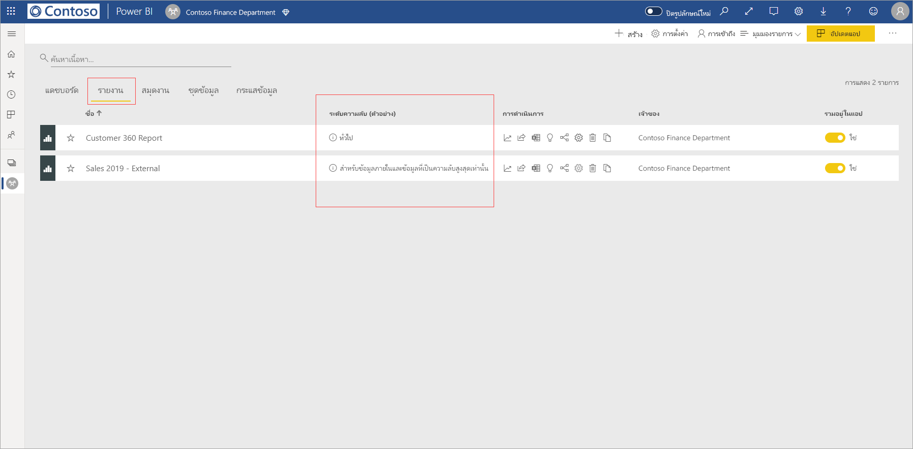
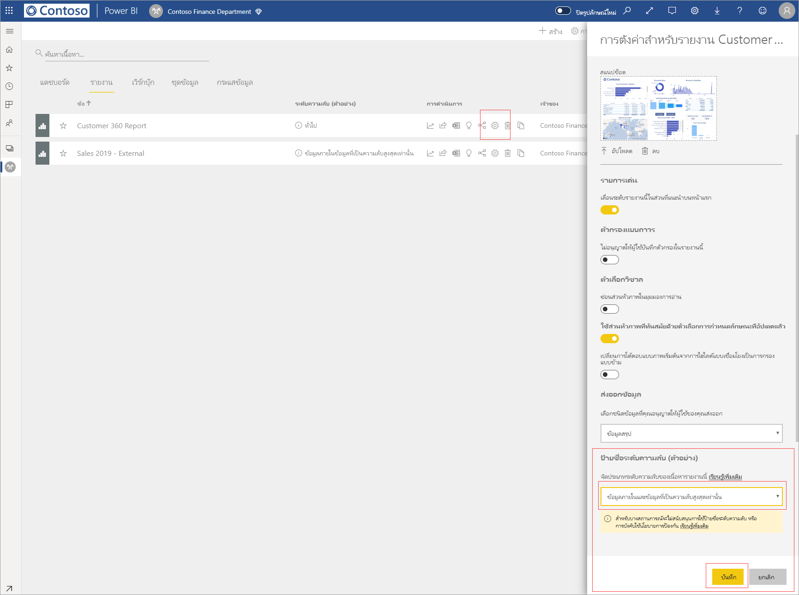
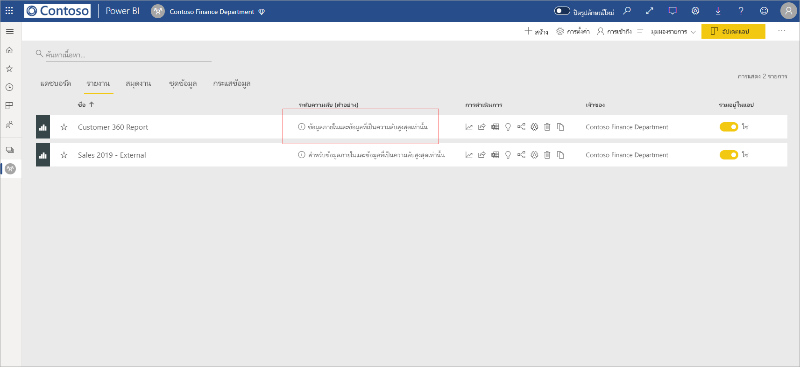
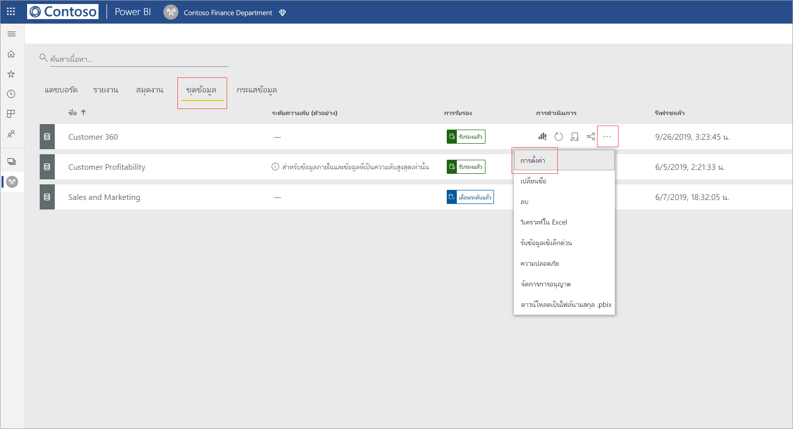
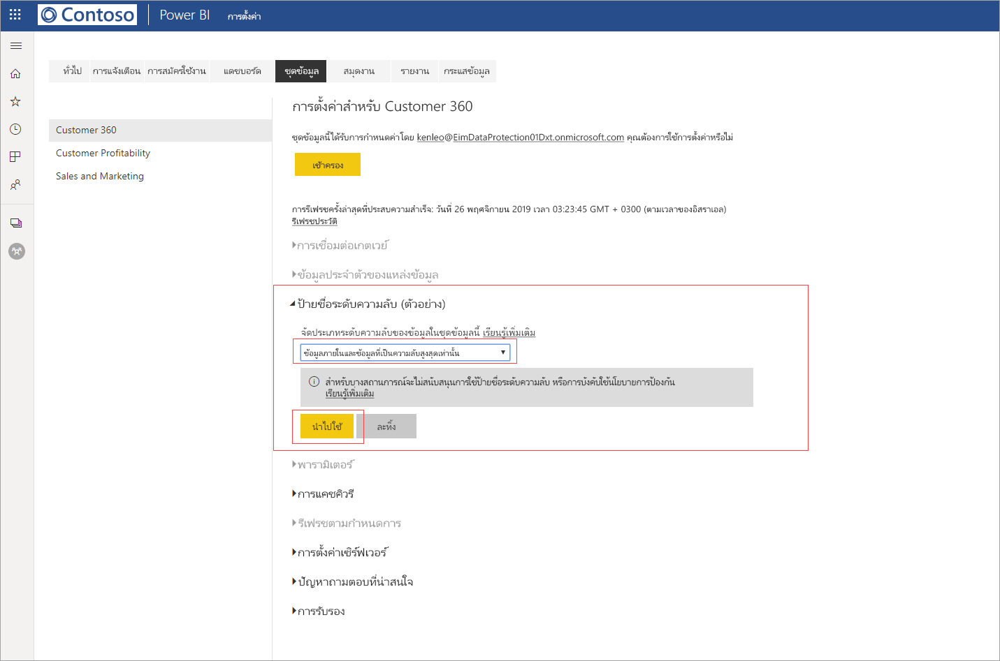
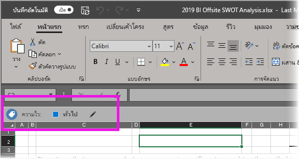

# ใช้ป้ายชื่อระดับความลับใน Power BI (ตัวอย่าง)

เมื่อเปิดใช้งานป้ายชื่อระดับความลับในบริการของ Power BI คุณสามารถปกป้องแดชบอร์ด รายงาน ชุดข้อมูล และกระแสข้อมูลของคุณจากการเข้าถึงโดยไม่ได้รับอนุญาตและการรั่วไหลโดยใช้ป้ายชื่อระดับความลับของข้อมูลกับแหล่งข้อมูลดังกล่าว การติดป้ายข้อมูลด้วยป้ายชื่อระดับความลับของข้อมูลอย่างถูกต้องช่วยให้มั่นใจได้ว่าเฉพาะผู้ที่ได้รับอนุญาตเท่านั้นที่สามารถเข้าถึงข้อมูลของคุณได้

เมื่อเปิดใช้งานการป้องกันข้อมูล ป้ายชื่อระดับความลับจะปรากฏในคอลัมน์ความลับในมุมมองรายการของแดชบอร์ด รายงาน ชุดข้อมูล และกระแสข้อมูล

> [!NOTE]
> การนำป้ายชื่อระดับความลับไปใช้กับแดชบอร์ด รายงาน ชุดข้อมูล และกระแสข้อมูลของ Power BI ต้องมีสิทธิ์การใช้งานและสิทธิ์อนุญาตบางอย่าง โปรดดู [การใช้ป้ายชื่อระดับความลับ](#applying-sensitivity-labels)สำหรับรายละเอียด

## การใช้ป้ายชื่อระดับความลับ

เมื่อต้องการใช้ป้ายชื่อระดับความลับใน Power BI และองค์กรของคุณต้องมีข้อกำหนดดังต่อไปนี้อยู่ก่อน:

* องค์กรของคุณต้องกำหนดป้ายชื่อระดับความลับใน [ศูนย์ความปลอดภัยของ Microsoft 365](https://security.microsoft.com/) หรือ [ศูนย์การปฏิบัติตามข้อบังคับ Microsoft 365](https://compliance.microsoft.com/)
* คุณต้องเป็นสมาชิกของกลุ่มความปลอดภัยที่มีสิทธิ์ใช้ป้ายชื่อระดับความลับของข้อมูลตามที่อธิบายไว้ในบทความชื่อ [เปิดใช้งานป้ายชื่อระดับความลับของข้อมูลใน Power BI (ตัวอย่าง)](../admin/service-security-enable-data-sensitivity-labels.md#enable-data-sensitivity-labels)
* คุณต้องมีสิทธิ์การใช้งาน Power BI Pro และสิทธิ์แก้ไขบนแหล่งข้อมูลที่คุณต้องการติดป้ายชื่อ 
* คุณต้องมีสิทธิ์การใช้งานของ Azure Information Protection แบบ Premium P1 หรือ Premium P2 คุณสามารถซื้อ Microsoft Azure Information Protection แบบสแตนด์อโลนหรือผ่านหนึ่งในชุดโปรแกรมการอนุญาตให้ใช้สิทธิของ Microsoft ได้ โปรดดู [การกำหนดราคา Azure Information Protection](https://azure.microsoft.com/pricing/details/information-protection/) สำหรับรายละเอียด

เมื่อต้องการใช้หรือเปลี่ยนป้ายชื่อระดับความลับในรายงาน ให้คลิกไอคอนการตั้งค่ารายงานบนรายการพื้นที่ทำงาน แล้วไปที่ส่วนความลับของข้อมูลในบานหน้าต่างการตั้งค่าด้านข้าง เลือกป้ายชื่อระดับความลับที่เหมาะสมและบันทึกการตั้งค่า

ป้ายชื่อระดับความลับที่อัปเดตแล้วจะปรากฏในคอลัมน์ความลับ 

การใช้หรือการเปลี่ยนป้ายชื่อระดับความลับบนแดชบอร์ดเป็นไปตามขั้นตอนเดียวกันกับที่อธิบายไว้สำหรับรายงาน 

นอกจากนี้ คุณยังสามารถตั้งค่าป้ายชื่อระดับความลับบนชุดข้อมูลและกระแสข้อมูลได้ รูปภาพต่อไปนี้แสดงวิธีการตั้งค่าป้ายชื่อระดับความลับบนชุดข้อมูล ขั้นตอนสำหรับกระแสข้อมูลจะคล้ายกัน

เมื่อต้องการตั้งค่าป้ายชื่อระดับความลับบนชุดข้อมูล ให้เลือกแท็บชุดข้อมูล คลิกที่สามจุดบนชุดข้อมูลที่คุณต้องการใช้ป้ายชื่อและเลือก **การตั้งค่า**

บนหน้าการตั้งค่าสำหรับชุดข้อมูล ให้เปิดส่วนป้ายชื่อระดับความลับ เลือกป้ายชื่อระดับความลับที่ต้องการ แล้วคลิก **นำไปใช้**

การใช้หรือการเปลี่ยนป้ายชื่อระดับความลับบนกระแสข้อมูลเป็นไปตามขั้นตอนเดียวกันกับที่อธิบายไว้สำหรับชุดข้อมูล

## การลบป้ายชื่อระดับความลับ
หากต้องการลบป้ายชื่อระดับความลับออกจากรายงาน แดชบอร์ด ชุดข้อมูลหรือกระแสข้อมูล ให้ทำตาม[ขั้นตอนเดียวกับที่ใช้สำหรับการใช้งานป้ายชื่อ](#applying-sensitivity-labels) แต่เลือก **(ไม่มี)** เมื่อได้รับพร้อมท์ให้จัดประเภทระดับความลับของข้อมูล 

## การป้องกันข้อมูลในไฟล์ที่ส่งออก

เมื่อคุณ [ส่งออกข้อมูลจากรายงาน](https://docs.microsoft.com/power-bi/consumer/end-user-export) ที่มีป้ายชื่อระดับความลับ ป้ายชื่อระดับความลับดังกล่าวจะสืบทอดไปยังไฟล์ที่สร้างขึ้น (Excel, PowerPoint และ PDF; แต่ไม่รองรับไฟล์ CSV) ป้ายชื่อระดับความลับจะปรากฏในไฟล์ และการเข้าถึงไฟล์จะถูกจำกัดเฉพาะสำหรับผู้ที่มีสิทธิ์เพียงพอเท่านั้น

## ข้อควรพิจารณาและข้อจำกัด

การใช้ป้ายชื่อระดับความลับของข้อมูลมีข้อควรพิจารณาดังต่อไปนี้:

* การดูหรือใช้ป้ายชื่อระดับความลับ Microsoft Information Protection ใน Power BI ต้องมีสิทธิ์การใช้งานของ Azure Information Protection แบบ Premium P1 หรือ Premium P2 คุณสามารถซื้อ Microsoft Azure Information Protection แบบสแตนด์อโลนหรือผ่านหนึ่งในชุดโปรแกรมการอนุญาตให้ใช้สิทธิของ Microsoft ได้ โปรดดู [การกำหนดราคา Azure Information Protection](https://azure.microsoft.com/pricing/details/information-protection/) สำหรับรายละเอียด
* ป้ายชื่อระดับความลับสามารถใช้ได้เฉพาะบนแดชบอร์ด รายงาน ชุดข้อมูล และกระแสข้อมูลเท่านั้น
* การบังคับใช้ตัวควบคุมการป้องกันและป้ายชื่อบนไฟล์ที่ส่งออกจะรองรับเฉพาะไฟล์ Excel, PowerPoint และ PDF เท่านั้น การป้องกันและป้ายชื่อไม่ได้มีการบังคับใช้เมื่อมีการส่งออกข้อมูลเป็นไฟล์ CSV สมัครใช้งานอีเมล วิชวลแบบฝังตัว และการพิมพ์
* ผู้ใช้ที่ส่งออกไฟล์จาก Power BI มีสิทธิ์ในการเข้าถึงและการแก้ไขไฟล์นั้นตามการตั้งค่าป้ายชื่อระดับความลับ ผู้ใช้ที่ส่งออกข้อมูลไม่ได้รับสิทธิ์การเป็นเจ้าของสำหรับไฟล์ดังกล่าว 
* ในขณะนี้ ป้ายชื่อระดับความลับยังไม่สามารถใช้ได้สำหรับ [รายงานที่มีการแบ่งหน้า]( https://docs.microsoft.com/power-bi/paginated-reports-report-builder-power-bi) และสมุดงาน 
* ป้ายชื่อระดับความลับบนแอสเซท Power BI สามารถมองเห็นได้เฉพาะในรายการพื้นที่ทำงานและมุมมองสายข้อมูลเท่านั้น ในขณะนี้ป้ายชื่อจะไม่สามารถมองเห็นได้ในรายการโปรด ที่แชร์กับฉัน ล่าสุด หรือมุมมองแอป อย่างไรก็ตาม โปรดทราบว่าป้ายชื่อที่ใช้กับแอสเซท Power BI แม้ว่าจะไม่สามารถมองเห็นได้ จะยังคงอยู่ในข้อมูลที่ส่งออกไปเป็นไฟล์ Excel, PowerPoint และ PDF เสมอ
* *การตั้งค่าการเข้ารหัสไฟล์* ของป้ายชื่อระดับความลับ ที่กำหนดค่าใน [ศูนย์การรักษาความปลอดภัย Microsoft 365](https://security.microsoft.com/) หรือ [ศูนย์การปฏิบัติตามข้อบังคับ Microsoft 365](https://compliance.microsoft.com/) นำไปใช้เฉพาะกับไฟล์ที่ *ส่งออกจาก* Power BI เท่านั้น ซึ่งไม่ได้บังคับใช้ *ภายใน* Power BI
* [การป้องกัน HYOK](https://docs.microsoft.com/azure/information-protection/configure-adrms-restrictions) ไม่ได้รับการรองรับสำหรับป้ายชื่อที่ใช้ใน Power BI
* การดูและการใช้ป้ายชื่อในแอป Office มี[ข้อกำหนดเรื่องสิทธิ์การใช้งาน](https://docs.microsoft.com/microsoft-365/compliance/sensitivity-labels-office-apps#subscription-and-licensing-requirements-for-sensitivity-labels)
* ป้ายชื่อระดับความลับได้รับการรองรับสำหรับผู้เช่าในระบบคลาวด์ (สาธารณะ) ส่วนกลางเท่านั้น ป้ายชื่อระดับความลับไม่ได้รับการรองรับสำหรับผู้เช่าในระบบคลาวด์อื่นๆ
* ป้ายชื่อระดับความลับไม่ได้รับการสนับสนุนสำหรับ[ผู้ใช้ภายนอก (ผู้ใช้ที่เป็นผู้เยี่ยมชม Azure Active Directory B2B)](../service-admin-azure-ad-b2b.md) ซึ่งหมายความว่าผู้ใช้ภายนอกไม่สามารถดูป้ายชื่อ และจะถูกบล็อกจากการส่งออกข้อมูลไปเป็นไฟล์ Excel, PDF และ PPTX [ลบป้ายชื่อออก](#removing-sensitivity-labels) เพื่อเปิดใช้งานผู้ใช้ภายนอกเพื่อส่งออกข้อมูลไปยังประเภทไฟล์เหล่านั้น

## ขั้นตอนถัดไป

บทความนี้อธิบายวิธีการใช้งานป้ายชื่อระดับความลับของข้อมูลใน Power BI บทความต่อไปนี้แสดงรายละเอียดเพิ่มเติมเกี่ยวกับการป้องกันข้อมูลใน Power BI 

* [ภาพรวมของการป้องกันข้อมูลใน Power BI](../admin/service-security-data-protection-overview.md)
* [เปิดใช้งานป้ายชื่อระดับความลับของข้อมูลใน Power BI](../admin/service-security-enable-data-sensitivity-labels.md)
* [ใช้ตัวควบคุม Microsoft Cloud App Security ใน Power BI](../admin/service-security-using-microsoft-cloud-app-security-controls.md)