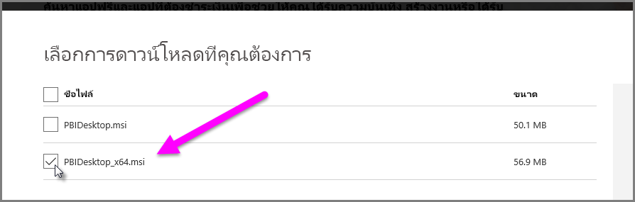

# แก้ไขปัญหาการนำเข้าไฟล์ Access และ .XLS ใน Power BI Desktop
ใน **Power BI Desktop** ทั้ง**ฐานข้อมูล Access** และ**เวิร์กบุ๊ก Excel** รุ่นก่อนหน้า (ไฟล์ .XLS ของ Excel 2007-2003) ใช้ *กลไกจัดการฐานข้อมูล Access* มีสามสถานการณ์ทั่วไปที่ทำให้กลไกจัดการฐานข้อมูล Access ไม่สามารถทำงานอย่างถูกต้อง:

### สถานการณ์ 1: ไม่ติดตั้งกลไกจัดการฐานข้อมูล Access
เมื่อข้อความแสดงความผิดพลาดของ Power BI Desktop ระบุว่าไม่ได้ติดตั้งกลไกจัดการฐานข้อมูล Access คุณต้องติดตั้งกลไกจัดการฐานข้อมูล Access ทั้งแบบ 32 บิต หรือ 64 บิต ที่ตรงกับเวอร์ชัน Power BI Desktop ของคุณ คุณสามารถติดตั้งกลไกจัดการฐานข้อมูล Access จาก[ตำแหน่งที่ตั้งนี้](http://www.microsoft.com/en-us/download/details.aspx?id=13255)ได้

>[!NOTE]
>ถ้าเวอร์ชันบิตของกลไกจัดการฐานข้อมูล Access ที่ติดตั้งแตกต่างจากเวอร์ชันบิตของ Microsoft Office ที่คุณติดตั้ง แอปพลิเคชัน Office จะไม่สามารถใช้กลไกจัดการฐานข้อมูล Access

### สถานการณ์ที่ 2: เวอร์ชันบิตของกลไกจัดการฐานข้อมูล Access (32 บิต หรือ 64 บิต) แตกต่างจากเวอร์ชันบิตของ Power BI Desktop ของคุณ
สถานการณ์นี้มักจะเกิดขึ้นเมื่อเวอร์ชั่นของ Microsoft Office ที่ติดตั้งเป็นแบบ 32 บิต และเวอร์ชันของ Power BI Desktop ที่ติดตั้งเป็นแบบ 64 บิต สิ่งตรงข้ามสามารถเกิดขึ้นได้เช่นกัน และเวอร์ชันบิตที่ไม่ตรงกันอาจเกิดขึ้นในกรณีหนึ่งในสองกรณีนี้ก็ได้ (ถ้าคุณกำลังใช้ Office 365 แบบสมัครใช้งาน ดู**สถานการณ์ 3** สำหรับปัญหาต่างๆ และการแก้ไขปัญหา) วิธีการแก้ไขหนึ่งจากหลายข้อต่อไปนี้สามารถแก้ไขข้อผิดพลาดเรื่องเวอร์ชันบิตที่ไม่ตรงกัน:

1. เปลี่ยนเวอร์ชันของ Power BI Desktop เพื่อให้เข้ากับเวอร์ชันบิต Microsoft Office ที่ติดตั้ง เมื่อต้องเปลี่ยนเวอร์ชันบิตของ Power BI Desktop ถอนการติดตั้ง Power BI Desktop และจากนั้น ติดตั้งเวอร์ชันของ Power BI Desktop ที่เข้ากับการติดตั้ง Office เมื่อต้องเลือกเวอร์ชั่นของ Power BI Desktop บนหน้าดาวน์โหลดสำหรับเดสก์ท็อป เลือก**ตัวเลือกการดาวน์โหลดขั้นสูง**
   
   
   
   บนหน้าการดาวน์โหลดที่ปรากฏขึ้น เลือกภาษาของคุณ จากนั้น เลือกปุ่ม**ดาวน์โหลด** บนหน้าจอที่ปรากฏขึ้น เลือกกล่องกาเครื่องหมายข้าง PBIDesktop.msi สำหรับเวอร์ชัน 32 บิต หรือ PBIDesktop_x64.msi สำหรับเวอร์ชัน 64-บิต ในหน้าจอต่อไปนี้ เลือกเวอร์ชัน 64-บิต
   
   
   
   >[!NOTE]
   >เมื่อใช้ Power BI Desktop เวอร์ชัน 32 บิตในขณะสร้างรูปแบบข้อมูลขนาดใหญ่มาก คุณอาจพบปัญหาหน่วยความจำไม่เพียงพอ
2. เปลี่ยนเวอร์ชันของ Power BI Desktop เพื่อให้เข้ากับเวอร์ชันบิตของ Microsoft Office ที่ติดตั้ง เมื่อต้องการเปลี่ยนเวอร์ชันบิตของ Power BI Desktop ถอนการติดตั้ง Office และจากนั้น ติดตั้งเวอร์ชันของ Office ที่เข้ากับ Power BI Desktop ที่ติดตั้ง
3. ถ้าข้อผิดพลาดเกิดขึ้นขณะพยายามเปิดไฟล์ .XLS (เวิร์กบุ๊ก Excel 2007-2003) คุณสามารถหลีกเลี่ยงการใช้กลไกจัดการฐานข้อมูล Access ด้วยการเปิดไฟล์ .XLS ใน Excel และบันทึกเป็นไฟล์ XLSX
4. ถ้าวิธีแก้ไขปัญหาสามข้อก่อนหน้านี้เป็นไปไม่ได้ อาจติดตั้งกลไกจัดการฐานข้อมูล Access ทั้งสองเวอร์ชั่น แต่นี่*ไม่*ใช่การแก้ไขปัญหาที่แนะนำ การติดตั้งทั้งสองเวอร์ชันจะแก้ไขปัญหานี้สำหรับ Power Query สำหรับ Excel และ Power BI Desktop แต่จะสร้างข้อผิดพลาดและปัญหาสำหรับแอปพลิเคชันที่ใช้เวอร์ชันบิตของกลไกจัดการฐานข้อมูล Access ที่มีการติดตั้งเป็นตัวแรกโดยอัตโนมัติ (ตามค่าเริ่มต้น) เมื่อต้องการติดตั้งเวอร์ชันบิตทั้งสองเวอร์ชั่นของกลไกจัดการฐานข้อมูล Access, [ดาวน์โหลด](http://www.microsoft.com/en-us/download/details.aspx?id=13255)ทั้งสองเวอร์ชัน แล้วเรียกใช้แต่ละเวอร์ชั่นด้วยการใช้การสลับแบบ */passive* ตัวอย่างเช่น:
   
       c:\users\joe\downloads\AccessDatabaseEngine.exe /passive
   
       c:\users\joe\downloads\AccessDatabaseEngine_x64.exe /passive

### สถานการณ์ที่ 3: ปัญหาในการใช้ไฟล์ Access หรือ .XLS กับ Office 365 แบบสมัครใช้งาน
ถ้าคุณกำลังใช้ Office 365 แบบสมัครใช้งานไม่ว่าจะเป็น**Office 2013**หรือ**Office 2016**ตัวให้บริการของกลไกจัดการฐานข้อมูล Access จะถูกลงทะเบียนที่สถานที่เก็บทะเบียนเสมือนจริงที่ขบวนการทำงานของ Office *เท่านั้น*สามารถเข้าถึงได้ ผลที่ได้ กลไกจัดการ Mashup (ซึ่งรับผิดชอบในการเรียกใช้งาน Excel ที่ไม่ใช่Office 365 และ Power BI Desktop) ซึ่งไม่ใช่กระบวนการของ Office จะไม่สามารถใช้งานตัวให้บริการของกลไกจัดการฐานข้อมูล Access ได้

หากต้องแก้ไขสถานการณ์นี้ คุณสามารถดาวน์โหลดและติดตั้งกลไกจัดการฐานข้อมูล Access ชนิดสามารถเผยแพร่ต่อ (redistributable) ที่เข้ากับเวอร์ชั่นบิตของ Power BI Desktop ที่ติดตั้งของคุณ (ดูหัวข้อก่อนหน้าสำหรับข้อมูลเพิ่มเติมเกี่ยวกับเวอร์ชันบิต)

ลิงก์ดาวน์โหลด: [ดาวน์โหลดกลไกจัดการฐานข้อมูล Access](http://www.microsoft.com/en-us/download/details.aspx?id=13255)

### สถานการณ์อื่นๆ ที่ทำให้เกิดปัญหาการนำเข้า
เราจะมุ่งมั่นที่จะครอบคลุมปัญหาที่เกิดขึ้นกับไฟล์ Access หรือ .XLS มากเท่าที่เป็นไปได้ ถ้าคุณพบปัญหาที่ไม่ได้ครอบคลุมในบทความนี้ โปรดส่งคำถามเกี่ยวกับปัญหานั้นไปที่[ศูนย์สนับสนุน Power BI](https://powerbi.microsoft.com/support/) เราดูปัญหาที่อาจจะมีผลกระทบต่อลูกค้าเป็นประจำ และรวมเอาไว้ในบทความของเรา

