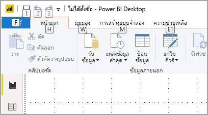
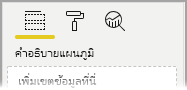
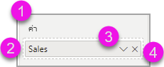
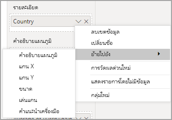
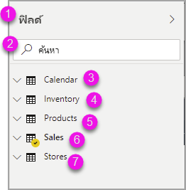
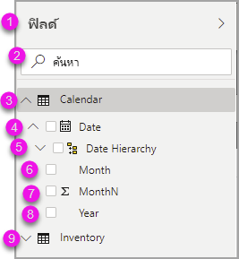
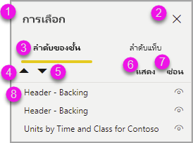

# สร้างรายงานใน Power BI โดยใช้เครื่องมือช่วยสำหรับการเข้าถึง

สำหรับผู้สร้างรายงานที่ใช้เครื่องมือช่วยสำหรับการเข้าถึงในการสร้างรายงาน Power BI มีความสามารถที่มีอยู่ภายในหลายอย่างที่สามารถช่วยในกระบวนการได้

บทความนี้อธิบายถึงเครื่องมือช่วยสำหรับการเข้าถึงหลายประเภทที่มีอยู่สำหรับผู้สร้างรายงานใน Power BI Desktop

## การนำทางระดับแอป
เมื่อมีการนำทางใน Power BI Desktop คุณสามารถย้ายโฟกัสไปยังพื้นที่หลักของแอปโดยการกด **Ctrl + F6** การเลื่อนโฟกัสในพื้นที่หลักของ Power BI Desktop จะดำเนินไปตามลำดับต่อไปนี้:

1. ออบเจ็กต์บนพื้นที่ทำงาน
2. แท็บหน้า
3. บานหน้าต่าง (แต่ละรายการแยกต่างหาก จากซ้ายไปขวาสำหรับบานหน้าต่างใดก็ตามที่เปิดอยู่)
4. ดูตัวนำทาง
5. ส่วนท้าย
6. ลงชื่อเข้าใช้
7. แถบเตือนสีเหลือง / ข้อผิดพลาด / การอัปเดต

ในกรณีส่วนใหญ่ การใช้ **Enter** เพื่อเลือก หรือป้อนพื้นที่ และจากนั้นใช้ **Esc** เพื่อออก เป็นกระบวนการทั่วไปใน Power BI

## การนำทางด้วยริบบอน

กด **Alt** เพื่อดูกล่องขนาดเล็กที่เรียกว่า *KeyTips* เหนือแต่ละคำสั่งที่มีอยู่ในมุมมองปัจจุบันของริบบอน จากนั้นคุณสามารถกดตัวอักษรที่แสดงใน *KeyTip* ที่วางเมาส์ค้างเหนือคำสั่งที่คุณต้องการที่จะใช้ 

ตัวอย่างเช่น ในรูปต่อไปนี้มีการกดคีย์ **Alt** เพื่อแสดง KeyTips ซึ่งประกอบด้วยตัวอักษรสำหรับคำสั่งที่สามารถเข้าถึงได้ จากนั้นกด **M** จะเปิดแท็บ **การสร้างแบบจำลอง** บนริบบอน

คุณอาจเห็น KeyTips เพิ่มเติม ทั้งนี้ขึ้นอยู่กับตัวอักษรที่คุณกด ตัวอย่างเช่น ถ้าแท็บ **หน้าหลัก** มีการใช้งานอยู่ และคุณกด **W** จากนั้นแท็บ **มุมมอง** จะปรากฏขึ้นพร้อมกับ KeyTips สำหรับกลุ่มในแท็บริบบอน **มุมมอง** ดังกล่าว คุณสามารถกดตัวอักษรที่แสดงใน KeyTips ได้ต่อไปจนกว่าคุณจะกดตัวอักษรของคำสั่งเฉพาะที่คุณต้องการใช้ หากต้องการย้ายไปยัง KeyTips ชุดก่อนหน้า ให้กด **Esc** หากต้องการยกเลิกการดำเนินการที่คุณกำลังทำและซ่อน KeyTips ให้กดคีย์ **Alt**

## การนำทางของบานหน้าต่างวิชวล

เมื่อต้องการนำทางบานหน้า**การแสดงข้อมูลด้วยภาพ** ก่อนอื่นคุณต้องแน่ใจว่าการโฟกัสของคุณอยู่ที่บานหน้าต่างโดยกด **Ctrl + F6** จนกว่าจะถึงบานหน้าต่างนั้น เมื่อผู้ใช้นำทางผ่านบานหน้าต่างการแสดงข้อมูลด้วยภาพ โฟกัสแรกจะอยู่ที่ส่วนหัว เริ่มต้นจากด้านบนสุด ลำดับแท็บเป็นดังต่อไปนี้ และจะแสดงในรูปภาพต่อไปนี้:

1. ชื่อส่วนหัว
2. กะรัตแบบขยาย/ยุบ
3. ไอคอนวิชวลแรก

เมื่อคุณไปยังวิชวลแล้ว คุณสามารถใช้ปุ่มลูกศรเพื่อนำทางไปยังวิชวลใดวิชวลหนึ่ง และกด **Enter** เพื่อเลือก หากคุณใช้โปรแกรมอ่านหน้าจอ ระบบจะอ่านออกเสียงหากคุณได้สร้างแผนภูมิใหม่ และบอกให้คุณทราบว่าเป็นแผนภูมิชนิดใด หรือจะแจ้งให้คุณทราบว่าคุณได้เปลี่ยนแผนภูมิชนิดใดชนิดหนึ่งเป็นแผนภูมิชนิดอื่น 

หลังจากส่วนวิชวลของบานหน้าต่างแล้ว ลำดับโฟกัสจะเลื่อนไปยังบานหน้าต่าง pivots ดังที่แสดงในรูปต่อไปนี้

เมื่อโฟกัสอยู่บนบานหน้าต่าง pivots การกดแท็บจะอยู่บนไอคอนสำหรับบานหน้าต่างที่เลือกเท่านั้น เมื่อต้องการสลับไปยังบานหน้าต่างอื่น ให้ใช้แป้นลูกศร

## พื้นที่เขตข้อมูล

เมื่อโฟกัสอยู่ในบานหน้าต่าง pivots ตามที่อธิบายไว้ในส่วนก่อนหน้า การกดแท็บอีกครั้งจะเลื่อนโฟกัสไปยัง **พื้นที่เขตข้อมูล** 

ใน **พื้นที่เขตข้อมูล** ลำดับโฟกัสจะเลื่อนไปที่:

* ชื่อของแต่ละพื้นที่ (ลำดับแรก)
* ตามด้วยเขตข้อมูลที่ระบุในแต่ละพื้นที่ (ถัดไป)
* ปุ่มดรอปดาวน์เพื่อเปิดเมนูเขตข้อมูล (หลังจากนั้น)
* จากนั้นปุ่มลบ (สุดท้าย)

รูปภาพต่อไปนี้แสดงการจัดลำดับความคืบหน้าของโฟกัสนี้

โปรแกรมอ่านหน้าจอจะอ่านชื่อของพื้นที่และคำแนะนำเครื่องมือ สำหรับเขตข้อมูลแต่ละอันที่อยู่ในพื้นที่ โปรแกรมอ่านหน้าจอจะอ่านชื่อเขตข้อมูลและคำแนะนำเครื่องมือ ถ้าพื้นที่ว่างเปล่า โฟกัสควรเลื่อนไปยังพื้นที่ว่างทั้งหมด โปรแกรมอ่านหน้าจอควรอ่านชื่อพื้นที่ คำแนะนำเครื่องมือ และบอกว่าว่างเปล่าด้วย

เมื่อเมนูเขตข้อมูลเปิดอยู่ คุณสามารถเลื่อนดูได้โดยใช้ **แท็บ** หรือ **Shift + แท็บ** หรือปุ่มลูกศร **ขึ้น** / **ลง** โปรแกรมอ่านหน้าจอจะเรียกขานชื่อตัวเลือก

หากคุณต้องการย้ายเขตข้อมูลจากบักเก็ตหนึ่งในพื้นที่เขตข้อมูลไปยังอีกบักเก็ตหนึ่ง คุณสามารถใช้แป้นพิมพ์ของคุณ และใช้ **ย้าย** ไปยังตัวเลือกในเมนูพื้นที่เขตข้อมูล ดังที่แสดงในรูปต่อไปนี้

## พื้นที่การจัดรูปแบบ

ลำดับโฟกัสสำหรับบานหน้าต่าง **การจัดรูปแบบ** จะเลื่อนจากด้านบนลงมาด้านล่างตามลำดับของการ์ด โฟกัสเลื่อนไปรอบชื่อการ์ด ตามด้วยปุ่มสลับ **เปิด/ปิด** หากมีอยู่ เมื่อโฟกัสอยู่ที่ชื่อการ์ด โปรแกรมอ่านหน้าจอจะอ่านชื่อของการ์ด และบอกว่าการ์ดขยายหรือยุบอยู่ คุณสามารถกด **Enter** เพื่อขยายหรือยุบการ์ด คีย์ **Enter** ยังสามารถใช้สลับ **เปิด** หรือ **ปิด** ปุ่มสลับได้

หากการ์ดเปิดอยู่ **แท็บ** จะเลื่อนผ่านตัวควบคุมในการ์ดก่อนที่จะไปยังการ์ดใบถัดไป สำหรับตัวควบคุมในการ์ด โปรแกรมอ่านหน้าจอจะเรียกขานชื่อ ค่าปัจจุบัน และชนิดตัวควบคุม  

## การนำทางรายการเขตข้อมูล

คุณสามารถกด**แท็บ**เพื่อนำทางไปยังรายการ**เขตข้อมูล**ได้ คล้ายกับบานหน้าต่างการจัดรูปแบบ ถ้าตารางถูกยุบ ลำดับโฟกัสจะวนไปตามลำดับต่อไปนี้:

1. ส่วนหัวของรายการ**เขตข้อมูล**
2. แถบค้นหา
3. ชื่อของแต่ละตาราง

หากต้องการขยายตารางทั้งหมดในพื้นที่**เขตข้อมูล** ให้กด **Alt + Shift + 9** หากต้องการยุบตารางทั้งหมด ให้กด **Alt + Shift + 1** หากต้องการขยายตารางเดียว ให้กดปุ่ม**ลูกศรขวา** หากต้องการยุบตารางเดียว ให้กดปุ่ม**ลูกศรซ้าย** คล้ายกับบานหน้าต่างการจัดรูปแบบ ถ้ามีการขยายตารางแล้ว จากนั้นการกดแท็บและการนำทางผ่านรายการเขตข้อมูลจะประกอบด้วยเขตข้อมูลที่แสดงอยู่ โปรแกรมอ่านหน้าจอจะเรียกขานว่าคุณมีการขยายหรือการยุบตาราง

คุณสามารถทำเครื่องหมายถูกบนเขตข้อมูลได้ด้วยการนำทางไปยังเขตข้อมูลที่ต้องการและกด **Enter**   โปรแกรมอ่านหน้าจอจะเรียกขานเขตข้อมูลที่โฟกัสอยู่ และเรียกขานว่ามีการเลือกหรือไม่เลือกเขตข้อมูล

โดยทั่วไปผู้ใช้เมาส์จะลากและวางเขตข้อมูลไปยังพื้นที่ทำงาน หรือไปยังบักเก็ตของตัวกรองที่เกี่ยวข้องที่พวกเขาต้องการ ถ้าคุณต้องการใช้แป้นพิมพ์ของคุณ คุณสามารถเพิ่มเขตข้อมูลลงในบักเก็ตของตัวกรองได้ด้วยการเข้าไปยังเมนูบริบทของเขตข้อมูลโดยการกด **Shift + F10** โดยการใช้แป้นลูกศรเพื่อนำทางไปยัง **เพิ่มไปยังตัวกรอง** จากนั้นกด **Enter** บนชนิดของตัวกรองที่คุณต้องการเพิ่มเขตข้อมูล

## การนำทางของบานหน้าต่างการเลือก
บานหน้าต่าง **การเลือก** มีความคืบหน้าของลำดับโฟกัสดังต่อไปนี้:

1. ชื่อส่วนหัว
2. ปุ่ม Exit (ออก)
3. ตัวสลับลำดับเลเยอร์/แท็บ
4. ปุ่มเลื่อนไปยังเลเยอร์ด้านบน
5. ปุ่มเลื่อนไปยังเลเยอร์ด้านล่าง
6. ปุ่มแสดง
7. ปุ่มซ่อน
8. ออบเจ็กต์

คุณสามารถกดแท็บตามลำดับโฟกัสแล้วกด **Enter** เพื่อเลือกองค์ประกอบที่คุณสนใจ  

เมื่อคุณอยู่ที่ตัวสลับลำดับเลเยอร์/แท็บ ให้ใช้ปุ่มลูกศรซ้ายและขวาเพื่อสลับระหว่างลำดับเลเยอร์และลำดับแท็บ

เมื่อคุณอยู่ที่ออบเจ็กต์ในบานหน้าต่าง**การเลือก** ให้กด **F6** เพื่อเปิดใช้งานบานหน้าต่าง **การเลือก** หลังจากเปิดใช้งานบานหน้าต่าง **การเลือก** แล้ว คุณสามารถใช้แป้นลูกศรขึ้น/ลงเพื่อนำทางไปยังออบเจ็กต์ต่าง ๆ ในบานหน้าต่าง **การเลือก** ได้
เมื่อคุณถูกนำทางไปยังออบเจ็กต์ที่สนใจแล้ว คุณจะสามารถดำเนินการที่แตกต่างกันได้สองถึงสามวิธี:

* กด **Ctrl + Shift + S** เพื่อซ่อน/แสดงออบเจ็กต์
* กด **Ctrl + Shift + F** เพื่อย้ายออบเจ็กต์ไปยังลำดับเลเยอร์ด้านบน
* กด **Ctrl + Shift + B** เพื่อย้ายออบเจ็กต์ไปยังลำดับเลเยอร์ด้านล่าง
* กด **Ctrl + Space** เพื่อเลือกออบเจ็กต์หลายรายการ

## กล่องโต้ตอบ Power BI Desktop

คุณสามารถเข้าถึงกล่องโต้ตอบทั้งหมดใน Power BI Desktop ได้ผ่านการนำทางด้วยคีย์บอร์ด และทำงานร่วมกับโปรแกรมอ่านหน้าจอ

กล่องโต้ตอบใน Power BI Desktop มีดังต่อไปนี้:

* กล่องโต้ตอบการวัดผลด่วน
* กล่องโต้ตอบการจัดรูปแบบตามเงื่อนไข & แถบข้อมูล
* ถามตอบกล่องโต้ตอบ Explorer
* เริ่มต้นใช้งานการโต้ตอบ
* เมนูไฟล์และเกี่ยวกับการโต้ตอบ
* แถบคำเตือน
* กล่องโต้ตอบการคืนค่าแฟ้ม
* กล่องโต้ตอบ frowns

## รองรับโหมดความคมชัดสูง

เมื่อคุณใช้โหมดความคมชัดสูงใน Windows การตั้งค่าเหล่านั้นและชุดแบบสีที่คุณเลือกจะนำไปใช้กับรายงานใน Power BI Desktop ด้วย

Power BI Desktop ตรวจหาธีมความคมชัดสูงโดยอัตโนมัติที่ Windows กำลังใช้งาน และใช้การตั้งค่าเหล่านั้นในรายงานของคุณ สีความคมชัดสูงเหล่านั้น จะติดตามไปกับรายงาน เมื่อเผยแพร่ไปยังบริการของ Power BI หรือที่อื่น ๆ

## ขั้นตอนถัดไป

คอลเลกชันของบทความเกี่ยวกับการช่วยสำหรับการเข้าถึง Power BI มีดังต่อไปนี้:

* [ภาพรวมของการช่วยสำหรับการเข้าถึงใน Power BI](desktop-accessibility-overview.md) 
* [การสร้างรายงาน Power BI ที่สามารถเข้าถึงได้](desktop-accessibility-creating-reports.md) 
* [การใช้รายงานใน Power BI ด้วยเครื่องมือช่วยสำหรับการเข้าถึง](desktop-accessibility-consuming-tools.md)
* [แป้นพิมพ์ลัดการช่วยสำหรับการเข้าถึงสำหรับรายงาน Power BI](desktop-accessibility-keyboard-shortcuts.md)
* [รายการตรวจสอบการช่วยสำหรับการเข้าถึงรายงาน](desktop-accessibility-creating-reports.md#report-accessibility-checklist)

