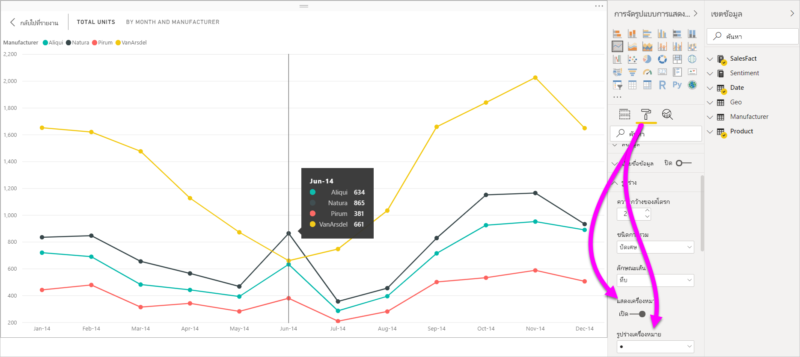
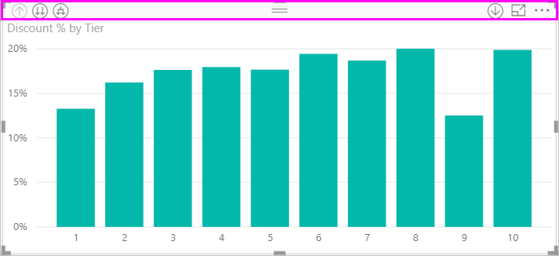
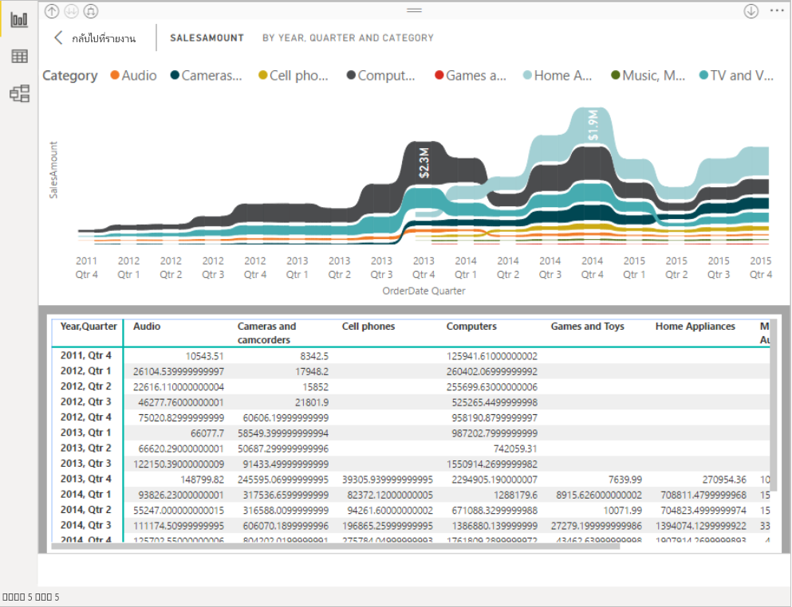
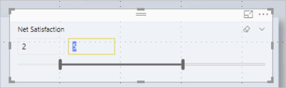
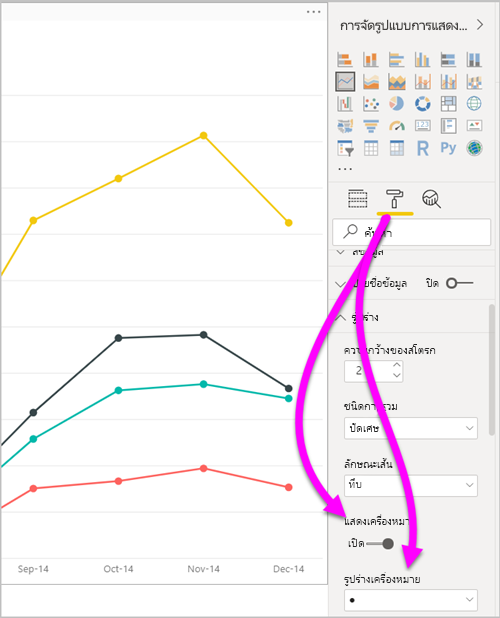
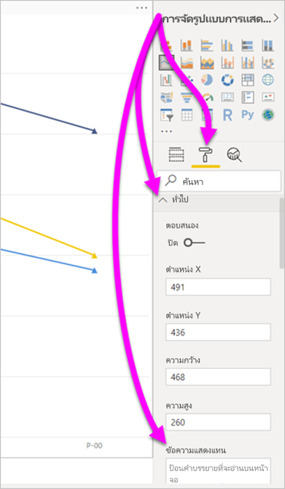
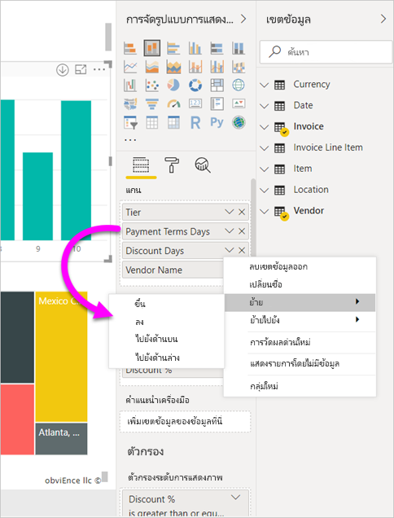
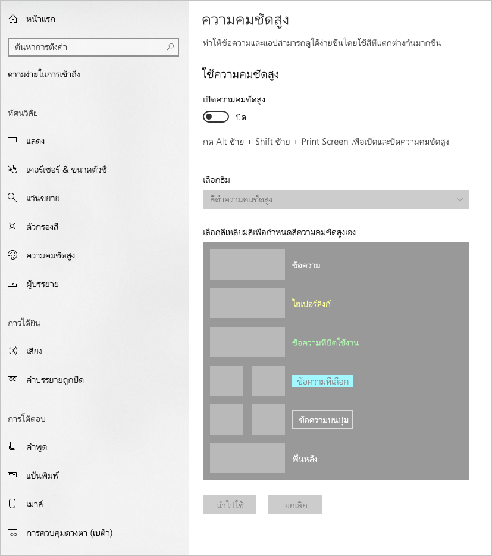
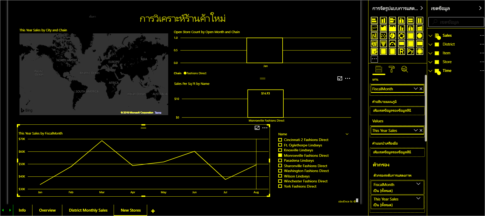
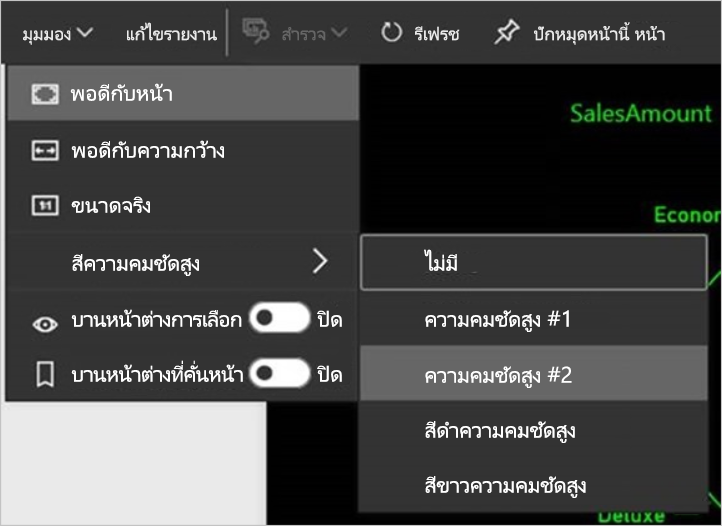

# การช่วยสำหรับการเข้าถึง ในรายงาน Power BI Desktop
Power BI มีคุณลักษณะที่ช่วยให้ผู้ทุพพลภาพสามารถใช้ และโต้ตอบกับรายงาน Power BI ได้อย่างง่ายขึ้น คุณลักษณะเหล่านี้รวมถึง ความสามารถในการใช้รายงานโดยใช้แป้นพิมพ์ หรือใช้โปรแกรมอ่านหน้าจอ แตะเพื่อโฟกัสบนวัตถุต่าง ๆ บนหน้า และใช้เครื่องหมายในการแสดงภาพที่ได้คิดถี่ถ่วนแล้ว

## การใช้รายงาน Power BI Desktop ด้วยแป้นพิมพ์ หรือโปรแกรมอ่านหน้าจอ
เริ่มตั้งแต่รุ่นเดือนกันยายน 2017 ของ **Power BI Desktop** คุณสามารถกดปุ่ม **Shift + ?** เพื่อแสดงหน้าต่างที่อธิบายเกี่ยวกับแป้นพิมพ์ลัดการช่วยสำหรับการเข้าถึงใน **Power BI Desktop**

ด้วยการปรับปรุงการช่วยสำหรับการเข้าถึง คุณสามารถใช้รายงาน Power BI โดยใช้แป้นพิมพ์หรือโปรแกรมอ่านหน้าจอ ด้วยเทคนิคต่างๆ ต่อไปนี้:

> [!NOTE]
> เมื่อดูรายงาน โดยทั่วไปคุณควรปิดโหมดสแกน

คุณสามารถสลับโฟกัสระหว่างแท็บหน้ารายงาน หรือวัตถุบนหน้ารายงานที่กำหนดไว้โดยใช้ **Ctrl+F6** ได้

* เมื่อโฟกัสอยู่บนแท็บหน้ารายงาน ใช้แป้น**แท็บ**หรือ**ลูกศร** เพื่อย้ายโฟกัสจากรายงานหน้าหนึ่งไปอีกหน้าหนึ่ง โปรแกรมอ่านหน้าจอจะอ่านออกเสียงชื่อของหน้ารายงาน และสถานะการเลือกในปัจจุบัน เพื่อโหลดหน้ารายงานที่กำลังโฟกัสในขณะนี้ ใช้แป้น **Enter**หรือ Spacebar
* เมื่อโฟกัสอยู่บนหน้ารายงานที่โหลด ใช้แป้น**แท็บ**เพื่อเลื่อนโฟกัสไปยังแต่ละวัตถุบนหน้า ซึ่งรวมถึงกล่องข้อความ รูปภาพ รูปร่าง และแผนภูมิทั้งหมด โปรแกรมอ่านหน้าจออ่านชนิดของวัตถุและชื่อเรื่องของวัตถุ (ถ้ามี) นอกจากนี้ตัวอ่านหน้าจอยังอ่านคำอธิบายของวัตถุนั้นถ้าผู้สร้างรายงานกำหนดไว้ 

ในขณะที่คุณนำทางไปมาระหว่างวิชวล คุณสามารถกด **Alt + Shift + F10** เพื่อย้ายโฟกัสไปยังส่วนหัวของวิชวลได้ ส่วนหัวของวิชวลประกอบด้วยตัวเลือกต่าง ๆ รวมถึงการเรียงลำดับ การส่งออกข้อมูลที่อยู่เบื้องหลังแผนภูมิและโหมดโฟกัส 

คุณสามารถกด **Alt+Shift+F11** เพื่อแสดงเวอร์ชันที่สามารถเข้าถึงได้ของหน้าต่าง **แสดงข้อมูล** หน้าต่างนี้ช่วยให้คุณสำรวจข้อมูลที่ใช้ในภาพในตาราง HTML โดยใช้แป้นพิมพ์ลัดเดียวกันกับที่คุณใช้กับโปรแกรมอ่านหน้าจอของคุณตามปกติ 

> [!NOTE]
> คุณลักษณะ**การแสดงข้อมูล**จะสามารถเข้าถึงโปรแกรมอ่านหน้าจอผ่านแป้นพิมพ์ลัดนี้เท่านั้น หากคุณเปิด**การแสดงข้อมูล**ผ่านตัวเลือกในส่วนหัวของวิชวล จะไม่สามารถเข้าถึงโปรแกรมอ่านหน้าจอได้ เมื่อใช้**การแสดงข้อมูล** ให้เปิดโหมดสแกนเพื่อใช้ประโยชน์จากคีย์ลัดทั้งหมดที่โปรแกรมอ่านหน้าจอของคุณมีให้

เริ่มตั้งแต่ **Power BI Desktop** รุ่นเดือนกรกฎาคมปี 2018 ตัวแบ่งส่วนข้อมูลจะมีคุณลักษณะการเข้าถึงพร้อมมาด้วย เมื่อเลือกตัวแบ่งส่วนข้อมูล หากต้องการปรับค่าของตัวแบ่งส่วนข้อมูล ให้ใช้ **CTRL+ลูกศรขวา** (control บวกปุ่มลูกศรขวา) เพื่อเลื่อนผ่านการควบคุมต่าง ๆ ภายในตัวแบ่งส่วนข้อมูล ตัวอย่างเช่น เมื่อคุณเริ่มต้นกด**Ctrl + ลูกศรขวา** โฟกัสจะอยู่ที่ยางลบ จากนั้นการกด Spacebar จะเทียบเท่ากับการคลิกปุ่มยางลบ ซึ่งจะลบค่าทั้งหมดบนตัวแบ่งส่วนข้อมูล 

คุณสามารถเลื่อนผ่านการควบคุมต่าง ๆ ในตัวแบ่งส่วนข้อมูลด้วยการกดปุ่ม **Tab** การกดปุ่ม **Tab** เมื่ออยู่ที่ปุ่มยางลบจะย้ายไปที่ปุ่มดรอปดาวน์ การกดปุ่ม **Tab** อีกครั้งจะย้ายไปที่ค่าตัวแบ่งส่วนข้อมูลแรก (หากมีค่าตัวแบ่งส่วนข้อมูลหลายค่า อย่างเช่น ช่วง) 

การช่วยสำหรับการเข้าถึงที่เพิ่มเติมเข้ามาช่วยให้ผู้ใช้สามารถใช้รายงาน Power BI ด้วยโปรแกรมอ่านหน้าจอและการนำทางของแป้นพิมพ์ได้

## เคล็ดลับการสร้างรายงานที่สามารถเข้าถึงได้
เคล็ดลับต่อไปนี้สามารถช่วยให้คุณสร้างรายงาน **Power BI Desktop** ที่สามารถเข้าถึงได้มากขึ้น

### เคล็ดลับทั่วไปในการสร้างรายงานที่สามารถเข้าถึงได้

* สำหรับแผนภูมิ**เส้น**, **แผนภูมิพื้นที่**และ**แผนภูมิผสม** เช่นเดียวกับ**แผนภูมิกระจาย**และ**แผนภูมิฟอง** เปิดการสลับ**แสดงตัวทำเครื่องหมาย** และใช้**รูปร่างเครื่องหมาย**ที่แตกต่างกันสำหรับแต่ละเส้น
  
  * เมื่อต้องการการสลับ**แสดงตัวทำเครื่องหมาย** เลือกส่วน**รูปแบบ**ในบานหน้าต่าง**การจัดรูปแบบการแสดงข้อมูล**และขยายส่วน**รูปร่าง** เลื่อนลงเพื่อค้นหาการสลับ**ตัวทำเครื่องหมายแสดง** และเปลี่ยนเป็น**เปิด**
  * หากต้องการกำหนดเส้นแต่ละบรรทัด ให้ค้นหาการสลับ **ชุดข้อมูลแบบกำหนดเอง** และเปลี่ยนเป็น **เปิด** จากนั้น เลือกชื่อของแต่ละเส้น (หรือ พื้นที่ ถ้าใช้แผนภูมิ**พื้นที่**) จากกล่องรายการดรอปดาวน์ในส่วน**รูปร่าง** ด้านล่างเมนูดรอปดาวน์ คุณสามารถปรับเปลี่ยนลักษณะต่าง ๆ ของเครื่องหมายที่ใช้สำหรับเส้นที่เลือก รวมไปถึงรูปร่าง สี และขนาด
  
    
  
  * ใช้**รูปร่างเครื่องหมาย**ที่แตกต่างกันสำหรับแต่ละเส้น ทำให้ง่ายสำหรับผู้บริโภครายงาน เพื่อแยกแยะเส้น (หรือพื้นที่) ออกจากกัน
* เพิ่มเติมจากหัวข้อที่แล้ว อย่าใช้สีเพื่อสื่อข้อมูล เมื่อใช้รูปร่างบนบรรทัดและแผนภูมิกระจาย ไม่ควรใช้การจัดรูปแบบตามเงื่อนไขเพื่อให้ข้อมูลเชิงลึกในตารางและเมทริกซ์ 
* เลือกลำดับการจัดเรียงที่ตั้งใจสำหรับแต่ละภาพบนรายงานของคุณ เมื่อผู้ใช้โปรแกรมอ่านหน้าจอนำทางข้อมูลเบื้องหลังแผนภูมิ แผนภูมิดังกล่าวจะเลือกลำดับการจัดเรียงเดียวกันเป็นภาพ
* เลือกธีมที่มีความคมชัด และเป็นมิตรกับคนตาบอดสีจากแกลเลอรีธีม นำเข้าโดยใช้[**คุณลักษณะการแสดงตัวอย่าง**การกำหนดธีม](desktop-report-themes.md)
* สำหรับทุก ๆ วัตถุบนรายงาน ใส่ข้อความแสดงแทน การดำเนินการดังกล่าวเพื่อให้แน่ใจว่าผู้ใช้รายงานของคุณสามารถเข้าใจสิ่งที่คุณกำลังพยายามสื่อสารด้วยวิชวล แม้ว่าพวกเขาจะไม่เห็นภาพ รูปร่าง หรือกล่องข้อความ คุณสามารถใส่ข้อความแสดงแทนสำหรับวัตถุใด ๆ บนรายงาน **Power BI Desktop**  โดยการเลือกวัตถุ (เช่น วิชวล รูปร่าง และอื่น ๆ) และในบานหน้าต่าง **การจัดรูปแบบการแสดงข้อมูล** เลือกส่วน **รูปแบบ** จากนั้นขยาย**ทั่วไป** เลื่อนไปด้านล่างและกรอกข้อมูลในกล่องข้อความ **ข้อความแสดงแทน**
  
  
  
  ข้อความ Alt ยังสามารถเปลี่ยนแบบไดนามิกได้ด้วยนิพจน์เช่น ตัวกรองการสะท้อนที่ใช้กับวิชวล คุณได้ตั้งค่านิพจน์เดียวกับที่คุณต้องการสำหรับชื่อเรื่องของวิชวล [การจัดรูปแบบตามเงื่อนไขสำหรับชื่อเรื่องของวิชวล](desktop-conditional-format-visual-titles.md)
  
* ตรวจสอบให้แน่ใจว่า รายงานของคุณมีความเปรียบต่างเพียงพอ ระหว่างข้อความและสีพื้นหลัง มีเครื่องมือมากมาย เช่น [การวิเคราะห์ความคมชัดของสี](https://developer.paciellogroup.com/resources/contrastanalyser/) ที่คุณสามารถใช้เพื่อตรวจสอบสีรายงานของคุณได้ 
* ใช้ขนาดข้อความและแบบอักษรที่อ่านง่าย ข้อความขนาดเล็ก หรือแบบอักษรที่ยากต่อการอ่าน ไม่ได้ช่วยสำหรับการเข้าถึง
* ใส่ชื่อให้กับ ป้ายชื่อแกน และป้ายชื่อข้อมูล ในทุกวิชวล
* ใช้ชื่อเรื่องที่สื่อความหมายสำหรับหน้ารายงานทั้งหมด
* หลีกเลี่ยงการตกแต่งรูปร่างและรูปภาพในรายงานของคุณถ้าเป็นไปได้ เนื่องจากมีอยู่ในลำดับแท็บของรายงานแล้ว ถ้าคุณจำเป็นต้องมีวัตถุตกแต่งในรายงานของคุณ ให้ปรับปรุงข้อความแสดงแทนของวัตถุเพื่อให้ผู้ใช้โปรแกรมอ่านหน้าจอทราบว่าไว้สำหรับตกแต่ง

### จัดเรียงรายการในกลุ่มเขตข้อมูล
เริ่มตั้งแต่ **Power BI Desktop** ที่เผยแพร่ในเดือนตุลาคม 2018 คุณสามารถนำทางช่องเก็บ**เขตข้อมูล**ด้วยแป้นพิมพ์และโต้ตอบกับโปรแกรมการอ่านหน้าจอ 

หากต้องการปรับปรุงกระบวนการสร้างรายงานด้วยโปรแกรมอ่านหน้าจอ เมนูบริบทจะพร้อมใช้งาน เมนูอนุญาตให้ย้ายเขตข้อมูลในช่องเก็บด้านบนหรือด้านล่างในรายการ**เขตข้อมูล** เมนูยังช่วยให้ย้ายเขตข้อมูลไปยังช่องเก็บอื่นๆ เช่น **คำอธิบายแผนภูมิ** หรือ**ค่า** หรืออื่น ๆ

## การสนับสนุนความคมชัดสูงสำหรับรายงาน

เมื่อคุณใช้โหมดความคมชัดสูงใน Windows การตั้งค่าเหล่านั้นและชุดแบบสีที่คุณเลือก จะนำไปใช้กับรายงานใน **Power BI Desktop** ด้วย 

**Power BI Desktop** ตรวจหาธีมความคมชัดสูงโดยอัตโนมัติที่ Windows กำลังใช้งาน และใช้การตั้งค่าเหล่านั้นในรายงานของคุณ สีความคมชัดสูงเหล่านั้น จะติดตามไปกับรายงาน เมื่อเผยแพร่ไปยังบริการของ Power BI หรือที่อื่น ๆ

บริการของ Power BI ยังพยายามตรวจหาการตั้งค่าความคมชัดสูงที่เลือกสำหรับ Windows ประสิทธิภาพและความถูกต้องของการตรวจหาดังกล่าวจะขึ้นอยู่กับเบราว์เซอร์ที่แสดงบริการของ Power BI ถ้าคุณต้องการตั้งค่าธีมด้วยตนเองในบริการของ Power BI คุณสามารถเลือก **มุมมอง**  > **สีความคมชัดสูง**แล้วเลือกธีมที่คุณต้องการนำไปใช้กับรายงานได้

## ข้อควรพิจารณาและข้อจำกัด
มีปัญหาที่ทราบแล้วและข้อจำกัดบางประการ ของคุณลักษณะการช่วยสำหรับการเข้าถึง คำอธิบายของปัญหาและข้อจำกัดเหล่านั้นมีอยู่ในรายการต่อไปนี้:

* เมื่อใช้โปรแกรมอ่านหน้าจอด้วย **Power BI Desktop**คุณจะมีประสบการณ์การใช้งานที่ดีที่สุดถ้าคุณเปิดโปรแกรมอ่านหน้าจอก่อนที่จะเปิดไฟล์ใดๆ ใน **Power BI Desktop**
* ถ้าคุณกำลังใช้โปรแกรมผู้บรรยาย จะมีข้อจำกัดบางอย่างรอบๆ การนำทาง**แสดงข้อมูล** เป็นตาราง HTML

## แป้นพิมพ์ลัด
แป้นพิมพ์ลัดจะมีประโยชน์สำหรับการย้ายไปรอบๆ ในรายงาน Power BI โดยใช้คีย์บอร์ด ตารางต่อไปนี้อธิบายแป้นพิมพ์ลัดที่พร้อมใช้งานในรายงาน Power BI นอกจากการใช้แป้นพิมพ์ลัดเหล่านี้ใน **Power BI Desktop** ชุดทางลัดเหล่านี้ทำงานในการใช้งานต่อไปนี้ได้เช่นกัน:

* กล่องโต้ตอบ **ถามตอบ Explorer**
* กล่องโต้ตอบ **การเริ่มต้นใช้งาน**
* กล่องโต้ตอบ **ไฟล์** เมนู และ **เกี่ยวกับ**
* แถบ**คำเตือน**
* กล่องโต้ตอบ**การคืนค่าไฟล์**
* กล่องโต้ตอบ **Frowns**

ในความพยายามของเราอย่างต่อเนื่องเพื่อปรับปรุงการเข้าถึง รายการก่อนหน้านี้ของการใช้งานซึ่งยังคงสนับสนุนโปรแกรมอ่านหน้าจอและการตั้งค่าความคมชัดสูง

### แป้นพิมพ์ลัดที่ใช้บ่อย
| ในการดำเนินการนี้           | กดปุ่ม                |
| :------------------- | :------------------- |
| ย้ายโฟกัสระหว่างส่วนงาน  | **Ctrl + F6** |
| ย้ายโฟกัสไปด้านหน้าในส่วนงาน | **Tab**         |
| ย้ายโฟกัสไปด้านหลังในส่วนงาน | **Shift + Tab** |
| เลือกหรือล้างการเลือกวัตถุ | **Enter** หรือ **spacebar** |
| เลือกหลายวัตถุ | **Ctrl + spacebar** |

### เมื่อใช้งานภาพ
| ในการดำเนินการนี้           | กดปุ่ม                |
| :------------------- | :------------------- |
| ย้ายโฟกัสไปยังเมนูภาพ | **Alt + Shift + F10** |
| แสดงข้อมูล | **Alt + Shift + F11**  |
| ป้อนการแสดงผลด้วยภาพ | **Ctrl + ลูกศรขวา** |
| ป้อนเลเยอร์ | **Enter** |
| ออกจากเลเยอร์หรือการแสดงผลด้วยภาพ | **Esc** |
| เลือกหรือล้างการเลือกจุดข้อมูล | **Enter** หรือ **spacebar** |
| เลือกหลายรายการ | **Ctrl + Enter** หรือ **Ctrl + spacebar** |
| คลิกขวา | <ul><li>คีย์บอร์ด Windows: **คีย์บริบท Windows + F10** ปุ่มเปิดเมน Windows อยู่ระหว่างแป้น Alt ซ้ายและแป้นลูกศรซ้าย</li><li>คีย์บอร์ดอื่น ๆ: **Shift + F10**</li></ul> |
| ล้างการเลือก | **Ctrl + Shift + C** |

### ตาราง & การนำทางเมทริกซ์
| ในการดำเนินการนี้          | กดปุ่ม                |
| :------------------- | :------------------- |
| ย้ายโฟกัสขึ้น/ลงหนึ่งเซลล์ (ทุกเซลล์ในทุกพื้นที่)  | **แป้นลูกศรขึ้น** / **แป้นลูกศรลง** |
| ย้ายโฟกัสไปทางซ้าย/ขวาหนึ่งเซลล์ (ทุกเซลล์ในทุกพื้นที่)  | **แป้นลูกศรซ้าย** / **แป้นลูกศรขวา** |

### การนำทางของบานหน้าต่าง
| ในการดำเนินการนี้           | กดปุ่ม                |
| :------------------- | :------------------- |
| เลือกหลายรายการ | **Ctrl + spacebar** |
| ยุบตารางเดียว | **แป้นลูกศรซ้าย** |
| ขยายตารางเดียว | **แป้นลูกศรขวา** |
| ยุบตารางทั้งหมด | **Alt + Shift + 1** |
| ขยายตารางทั้งหมด | **Alt + Shift + 9** |
| เปิดเมนูบริบท | <ul><li>คีย์บอร์ด Windows: **คีย์บริบท Windows + F10**  ปุ่มเปิดเมน Windows อยู่ระหว่างแป้น Alt ซ้ายและแป้นลูกศรซ้าย</li><li>คีย์บอร์ดอื่น ๆ: **Shift + F10**</li></ul> |

### ตัวแบ่งส่วนข้อมูล
| ในการดำเนินการนี้         | กดปุ่ม                |
| :------------------- | :------------------- |
| โต้ตอบกับตัวแบ่งส่วนข้อมูล | **Ctrl + แป้นลูกศรขวา** |

### บานหน้าต่างการเลือก
| ในการดำเนินการนี้           | กดปุ่ม                |
| :------------------- | :------------------- |
| เปิดใช้งานบานหน้าต่างการเลือก | **F6** |
| ย้ายวัตถุขึ้นในเลเยอร์ | **Ctrl + Shift + F** |
| ย้ายวัตถุลงในเลเยอร์ | **Ctrl + Shift + B** |
| ซ่อน /แสดงวัตถุ (สลับ) | **Ctrl + Shift + S** |

### ตัวแก้ไข DAX
| ในการดำเนินการนี้          | กดปุ่ม                |
| :------------------- | :------------------- |
| คัดลอกบรรทัดขึ้น / ลง | **Alt + แป้นลูกศรขึ้น** / **แป้นลูกศรลง** |
| คัดลอกบรรทัดขึ้น / ลง | **Shift + Alt + แป้นลูกศรขึ้น** / **แป้นลูกศรลง** |
| แทรกบรรทัดด้านล่าง | **Ctrl + Enter** |
| แทรกบรรทัดด้านบน | **Ctrl + Shift + Enter** |
| ข้ามไปยังวงเล็บที่ตรงกัน | **Ctrl + Shift +**  \ |
| เยื้องบรรทัด/ขยายบรรทัดลงในระยะขอบ | **Ctrl + ]**  /  **[** |
| แทรกเคอร์เซอร์ | **Alt + คลิก** |
| เลือกบรรทัดปัจจุบัน | **Ctrl + I** |
| เลือกสิ่งที่ปรากฏทั้งหมดของสิ่งที่เลือกปัจจุบัน | **Ctrl + Shift + L** |
| เลือกสิ่งที่ปรากฏทั้งหมดของคำที่เลือกปัจจุบัน | **Ctrl + F2** |

### ป้อนข้อมูล
| ในการดำเนินการนี้           | กดปุ่ม                |
| :------------------- | :------------------- |
| ออกจากตารางที่สามารถแก้ไขได้ | **Ctrl + Tab** |

## ขั้นตอนถัดไป
* [ใช้ธีมรายงานใน Power BI Desktop (ตัวอย่าง)](desktop-report-themes.md)

