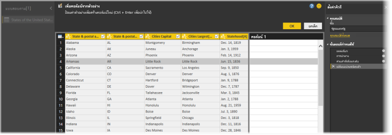
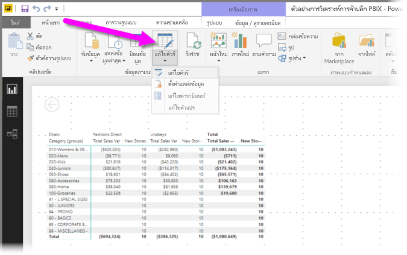
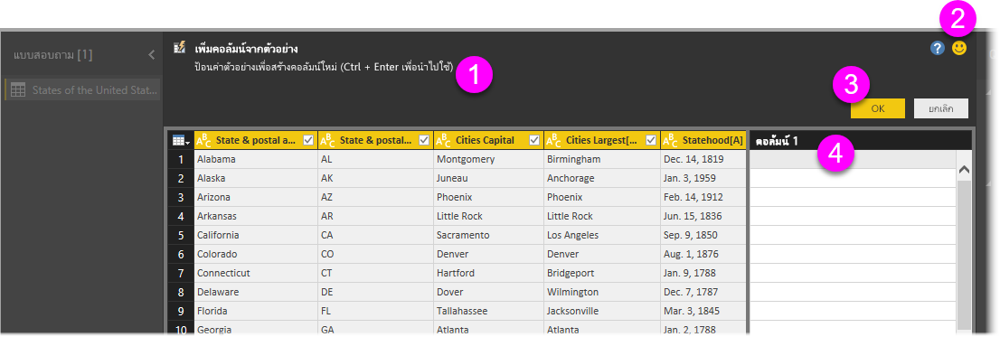
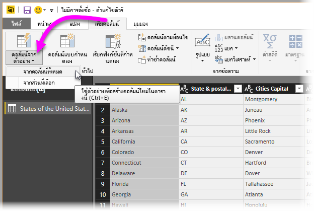
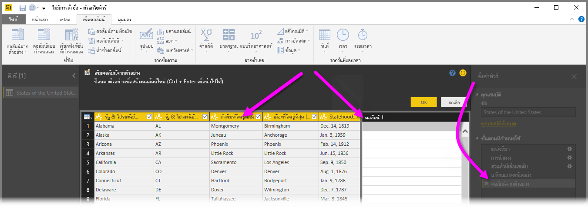
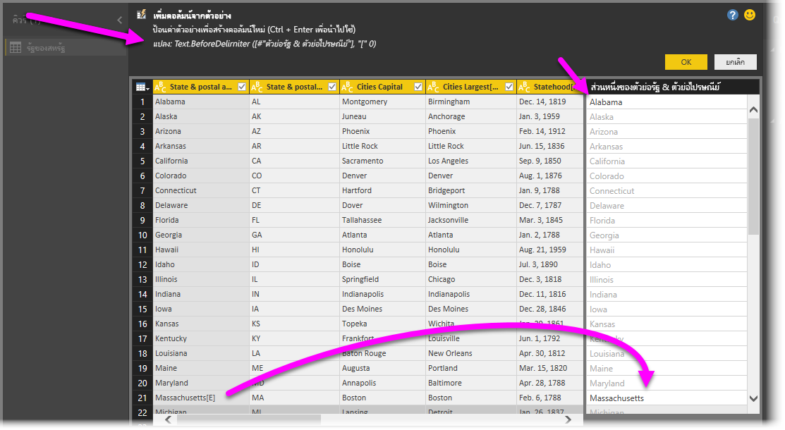

# เพิ่มคอลัมน์จากตัวอย่างใน Power BI Desktop
ด้วย *เพิ่มคอลัมน์จากตัวอย่าง* ในตัวแก้ไข Power Query คุณสามารถเพิ่มคอลัมน์ใหม่ลงในแบบจำลองข้อมูลของคุณได้ง่ายๆ โดยการให้ค่าตัวอย่างอย่างน้อยหนึ่งรายการสำหรับคอลัมน์ใหม่ คุณสามารถสร้างตัวอย่างคอลัมน์ใหม่จากส่วนที่เลือกหรือใส่ค่าที่ยึดตามคอลัมน์ที่มีอยู่ทั้งหมดในตารางได้

การใช้ *เพิ่มคอลัมน์จากตัวอย่าง*ช่วยให้คุณสร้างคอลัมน์ใหม่ได้อย่างรวดเร็วและง่ายดาย และเหมาะสำหรับสถานการณ์ต่อไปนี้:

- คุณทราบข้อมูลผลลัพธ์ที่คุณต้องการในคอลัมน์ใหม่ของคุณ แต่คุณไม่แน่ใจว่าการแปลง หรือคอลเลกชันของการแปลงไหน ที่จะช่วยคุณให้ได้ผลลัพธ์นั้น
- คุณทราบการแปลงที่จำเป็น แต่คุณไม่แน่ใจจะเลือกตำแหน่งไหน ในส่วนติดต่อผู้ใช้ เพื่อให้ได้ผลลัพธ์
- คุณทราบทั้งหมดเกี่ยวกับการแปลงที่คุณต้องใช้ ด้วยนิพจน์ *คอลัมน์แบบกำหนดเอง* ในภาษา*M* แต่หนึ่ง (หรือหลาย) นิพจน์เหล่านั้นไม่มีอยู่ใน UI

การเพิ่มคอลัมน์จากตัวอย่างนั้นเป็นเรื่องง่ายและตรงไปตรงมา ส่วนต่อไปจะแสดงให้เห็นว่า สามารถทำได้ง่ายเพียงใด

## เพิ่มคอลัมน์ใหม่จากตัวย่าง

หากต้องการรับข้อมูลตัวอย่างจากวิกิพีเดียเลือก **รับข้อมูล** > **เว็บ** จากแท็บ **หน้าแรก** ของ ribbon Power BI Desktop 

วาง URL ต่อไปนี้ลงในกล่องโต้ตอบที่ปรากฏขึ้นและเลือก **ตกลง**: 

*https:\//wikipedia.org/wiki/List_of_states_and_territories_of_the_United_States*

ในกล่องโต้ตอบ **ตัวนำทาง** เลือกตารางรัฐ **ของสหรัฐอเมริกา** และจากนั้นเลือก **แปลงข้อมูล** ตารางเปิดในตัวแก้ไข Power Query

หรือเมื่อต้องการเปิดข้อมูลที่โหลดแล้วจาก Power BI Desktop ให้เลือก **แก้ไขคิวรี** จากแท็บ **Home** ของ ribbon ข้อมูลจะเปิดในตัวแก้ไข Power Query 

เมื่อเปิดข้อมูลตัวอย่างในตัวแก้ไข Power Query แล้ว เลือกแท็บ **เพิ่มคอลัมน์** บน ribbon แล้้วเลือก **คอลัมน์จากตัวอย่าง** เลือกไอคอน **คอลัมน์จากตัวอย่าง** เพื่อสร้างคอลัมน์จากคอลัมน์ที่มีอยู่ หรือเลือกลูกศรแบบดรอปดาวน์เพื่อเลือกระหว่าง **จากคอลัมน์ทั้งหมด** หรือ **จากรายการเลือก** สำหรับการฝึกปฏิบัตินี ้ให้ใช้ **จากคอลัมน์ทั้งหมด**

## บานหน้าต่าง เพิ่มคอลัมน์จากตัวอย่าง
เมื่อคุณเลือก **เพิ่มคอลัมน์** > **จากตัวอย่าง** บานหน้าต่าง **เพิ่มคอลัมน์จากตัวอย่าง** จะเปิดขึ้นที่ด้านบนของตาราง **คอลัมน์่ 1** ใหม่จะปรากฏทางด้านขวาของคอลัมน์ที่มีอยู่ (คุณอาจต้องเลื่อนเพื่อดูทั้งหมด) เมื่อคุณใส่ค่าตัวอย่างของคุณในเซลล์ที่ว่างเปล่าของ **คอลัมน์ 1**Power BI จะสร้างกฎและการแปลงเพื่อให้ตรงกับตัวอย่างของคุณและใช้ข้อมูลเหล่านั้นเพื่อเติมส่วนที่เหลือของคอลัมน์

โปรดสังเกตว่า **คอลัมน์จากตัวอย่าง** จะปรากฏเป็น **ขั้นตอนที่ใช้** ในบานหน้าต่าง **การตั้งค่าคิวรี** ดังเช่นเคย ตัวแก้ไข Power Query จะบันทึกขั้นตอนการแปลงของคุณ และปรับใช้กับคิวรีตามลำดับ

ขณะที่คุณพิมพ์ตัวอย่างของคุณในคอลัมน์ใหม่ Power BI ให้คุณเห็นตัวอย่าง ว่าคอลัมน์ส่วนที่เหลือจะมีหน้าตาเป็นอย่างไรจากการแปลงที่ตรวจพบ ตัวอย่างเช่น ถ้าคุณพิมพ์ *Alabama* ในแถวแรก ที่สอดคล้องกับค่า **Alabama** ในคอลัมน์แรกของตาราง ทันทีที่คุณกด Enter Power BI จะเติมในส่วนที่เหลือของคอลัมน์ใหม่โดยยึดตามค่าคอลัมน์แรก และตั้งชื่อคอลัมน์ **ชื่อและตัวย่อไปรษณีย์ [12]-สำเนา**

ในตอนนี้ให้ไปที่แถว **แมสซาชูเซตส์ [E]** ของคอลัมน์ใหม่และลบส่วน **[E]** ของสตริง Power BI ตรวจพบการเปลี่ยนแปลง และใช้ตัวอย่างเพื่อสร้างการแปลง Power BI อธิบายการแปลงในบานหน้าต่าง **เพิ่มคอลัมน์จากตัวอย่าง** และเปลี่ยนชื่อคอลัมน์เป็น **ข้อความก่อนตัวคั่น** 

เมื่อคุณดำเนินการต่อกับตัวอย่าง ตัวแก้ไข Power Query ก็เพิ่มการแปลงที่เกี่ยวข้อง เมื่อคุณพอใจแล้ว เลือก**ตกลง**เพื่อบันทึกการเปลี่ยนแปลงของคุณ 

คุณสามารถเปลี่ยนชื่อคอลัมน์ใหม่ได้ตามที่คุณต้องการโดยการคลิกสองครั้งที่ส่วนหัวของคอลัมน ์หรือคลิกขวาและเลือก **เปลี่ยนชื่อ** 

ดูวิดีโอนี้เพื่อดู **เพิ่มคอลัมน์จากตัวอย่าง** ในการดำเนินการโดยใช้แหล่งข้อมูลตัวอย่าง: 

[Power BI Desktop: เพิ่มคอลัมน์จากตัวอย่าง](https://www.youtube.com/watch?v=-ykbVW9wQfw) 

## รายการการแปลงข้อมูลที่สนับสนุน
การเปลี่ยนแปลงจำนวนมากแต่ไม่สามารถใช้ได้เมื่อใช้ **เพิ่มคอลัมน์จากตัวอย่าง** รายการต่อไปนี้แสดงการแปลงข้อมูลที่สนับสนุน

**ทั่วไป**

- คอลัมน์แบบมีเงื่อนไข

**การอ้างอิง**
  
- การอ้างอิงถึงคอลัมน์ที่กำหนด ซึ่งรวมถึงตัดแต่ง ทำความสะอาด และการแปลงกรณี

**การแปลงข้อความ**

- การรวม (สนับสนุนการผสมกันระหว่าง สตริงที่เป็นสัญพจน์ และค่าของทั้งคอลัมน์)
- แทนที่
- ความยาว
- แยก   
  - อักษรหลายตัวแรก
  - อักษรหลายตัวสุดท้าย
  - ช่วง
  - ข้อความก่อนตัวคั่น
  - ข้อความหลังตัวคั่น
  - ข้อความระหว่างตัวคั่น
  - ความยาว
  - เอาตัวอักษรออก
  - เก็บตัวอักษรไว้

> [!NOTE]
> การแปลง*ข้อความ*ทั้งหมด โดยคำนึงถึงการแปลงค่าของคอลัมน์โดย การตัดแต่ง ทำความสะอาด หรือการตัวพิมพ์เล็ก/ใหญ่ ที่จำเป็นด้วย

**แปลงวันที่**

- วัน
- วันของสัปดาห์
- ชื่อวันของสัปดาห์
- วันของปี
- เดือน
- ชื่อเดือน
- ไตรมาสของปี
- สัปดาห์ของเดือน
- สัปดาห์ของปี
- ปี
- อายุ
- วันเริ่มต้นปี
- วันสิ้นปี
- วันเริ่มต้นเดือน
- วันสิ้นเดือน
- วันเริ่มต้นไตรมาส
- จำนวนวันในเดือน
- วันสิ้นไตรมาส
- วันเริ่มต้นสัปดาห์
- วันสิ้นสัปดาห์
- วันของเดือน
- เวลาเริ่มต้นของวัน
- เวลาสิ้นสุดของวัน

**การแปลงเวลา**

- Hour
- นาที
- วินาที  
- แปลงเป็นเวลาท้องถิ่น

> [!NOTE]
> การแปลง*วันที่*และ*เวลา*ทั้งหมด โดยคำนึงถึงการแปลงค่าของคอลัมน์ไปเป็น *วันที่* หรือ*เวลา* หรือ*วันที่เวลา* ที่จำเป็นด้วย

**การแปลงตัวเลข** 

- ค่าสัมบูรณ์
- อาร์กโคไซน์
- อาร์กไซน์
- อาร์กแทนเจนต์
- แปลงเป็นตัวเลข
- โคไซน์
- ยกกำลังสาม
- หาร
- เลขชี้กำลัง
- แฟกทอเรียล
- หารจำนวนเต็ม
- เป็นเลขคู่
- เป็นเลขคี่
- ลอการิทึมฐานธรรมชาติ
- ลอการิทึมฐาน 10
- มอดุโล
- คูณ
- ปัดเศษลง
- ปัดเศษขึ้น
- เครื่องหมาย
- ไซน์
- รากที่สอง
- ยกกำลังสอง
- ลบ
- ผลรวม
- แทนเจนต์
- บักเก็ต/ช่วง

