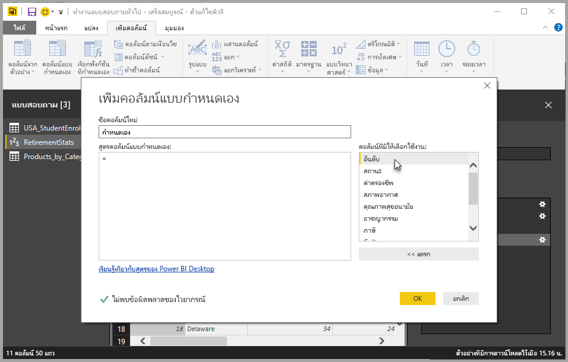
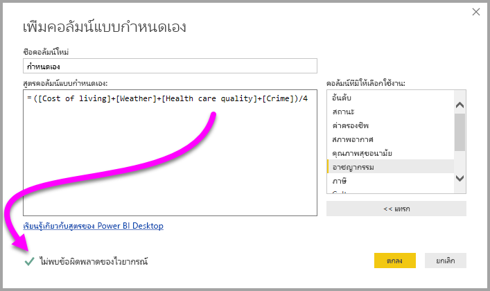

# เพิ่มคอลัมน์แบบกำหนดเองใน Power BI Desktop
คุณสามารถเพิ่มคอลัมน์แบบกำหนดเองใหม่ของข้อมูล ลงในรูปแบบของคุณด้วย**ตัวแก้ไขคิวรี**ใน **Power BI Desktop** ได้ คุณสามารถสร้าง และเปลี่ยนชื่อคอลัมน์แบบกำหนดเองของคุณ โดยใช้ปุ่มเพื่อสร้าง[สูตร M](https://msdn.microsoft.com/library/mt270235.aspx) ที่กำหนดคอลัมน์แบบกำหนดเองของคุณได้อย่างง่าย ๆ สูตร M มี[ชุดเนื้อหา การอ้างอิงฟังก์ชันที่ครอบคลุม](https://msdn.microsoft.com/library/mt779182.aspx) 

การสร้างคอลัมน์แบบกำหนดเอง เป็นอีก**ขั้นตอนที่กำหนดใช้**ในคิวรี ที่คุณสร้างใน**ตัวแก้ไขคิวรี** ซึ่งหมายความว่า สามารถเปลี่ยน ย้ายลำดับก่อนหรือหลัง หรือปรับเปลี่ยนเมื่อไรก็ได้

## ใช้ตัวแก้ไขคิวรีเพื่อเพิ่มคอลัมน์แบบกำหนดเองใหม่
เพื่อสร้างคอลัมน์ใหม่ที่กำหนดเอง เรียกใช้**ตัวแก้ไขคิวรี** คุณสามารถทำได้โดยการเลือก**แก้ไขคิวรี**จาก ribbon **หน้าแรก** ใน**Power BI Desktop**

เมื่อ**ตัวแก้ไขคิวรี**เริ่มทำงาน และคุณโหลดข้อมูลบางอย่างไว้แล้ว คุณสามารถเพิ่มคอลัมน์แบบกำหนดเอง โดยการเลือกแท็บ**เพิ่มคอลัมน์**บน ribbon จากนั้นเลือก**คอลัมน์แบบกำหนดเอง**

เมื่อคุณทำเช่นนั้น หน้าต่าง**เพิ่มคอลัมน์แบบกำหนดเอง**จะปรากฏขึ้น ซึ่งเราจะกล่าวถึงในส่วนต่อไปนี้

## หน้าต่างเพิ่มคอลัมน์แบบกำหนดเอง
ในหน้าต่าง**เพิ่มคอลัมน์แบบกำหนดเอง** คุณเห็นรายการเขตข้อมูลที่มีในบานหน้าต่างทางด้านขวา ชื่อคอลัมน์แบบกำหนดเองของคุณอยู่ด้านบน (คุณสามารถเปลี่ยนชื่อ โดยพิมพ์ชื่อใหม่ในกล่องข้อความ) และ[สูตร **M**](https://msdn.microsoft.com/library/mt779182.aspx) ที่คุณสร้าง (หรือเขียน) จากการแทรกเขตข้อมูลจากด้านขวา เพิ่มตัวดำเนินการ หรือสร้างสูตร ที่กำหนดคอลัมน์แบบกำหนดเองใหม่ของคุณ 

## สร้างสูตรสำหรับคอลัมน์แบบกำหนดเองของคุณ
คุณสามารถเลือกเขตข้อมูลจากรายการ**คอลัมน์ที่มีให้เลือกใช้งาน:** ทางด้านขวา และเลือก **<< แทรก** เพื่อเพิ่มลงในสูตรของคอลัมน์แบบกำหนดเอง คุณสามารถเพียงแค่ ดับเบิลคลิก บนคอลัมน์รายการเพื่อเพิ่มลงไป

เมื่อคุณพิมพ์สูตรและสร้างคอลัมน์ของคุณ ในด้านล่างของหน้าต่าง คุณจะเห็นตัวบ่งชี้ที่บอกคุณในแบบเรียลไทม์ (ตามที่คุณพิมพ์) ว่ามีการตรวจพบข้อผิดพลาดทางไวยากรณ์หรือไม่ ถ้าทุกอย่างถูกต้อง คุณจะเห็นเครื่องหมายถูกสีเขียว

แต่ถ้าคุณมีข้อผิดพลาดบางอย่างในไวยากรณ์ของคุณ คุณจะได้รับไอคอนเตือนสีเหลือง พร้อมกับข้อผิดพลาดที่ตรวจพบ และลิงก์ที่วางเคอร์เซอร์ (ในสูตรของคุณ) ตรงจุดที่พบข้อผิดพลาด

เมื่อคุณเลือก**ตกลง** คอลัมน์แบบกำหนดเองของคุณจะถูกเพิ่มลงในรูปแบบ และขั้นตอน**มีการเพิ่มคอลัมน์แบบกำหนดเองแล้ว** จะถูกเพิ่มลงใน**ขั้นตอนที่กำหนดใช้**ของคิวรีคุณ

ถ้าคุณดับเบิลคลิกขั้นตอน**มีการเพิ่มคอลัมน์แบบกำหนดเองแล้ว** ในบานหน้าต่าง**ขั้นตอนที่กำหนดใช้** หน้าต่าง**เพิ่มคอลัมน์แบบกำหนดเอง**จะปรากฏขึ้นอีกครั้ง และโหลดสูตรคอลัมน์แบบกำหนดเองที่คุณสร้าง พร้อมให้คุณแก้ไขถ้าจำเป็น

## การใช้เครื่องมือแก้ไขขั้นสูง สำหรับคอลัมน์แบบกำหนดเอง
คุณยังสามารถสร้างคอลัมน์แบบกำหนดเอง (และปรับเปลี่ยนคิวรีใด ๆ ของคุณ) โดยใช้**เครื่องมือแก้ไขขั้นสูง**ได้ ใน**ตัวแก้ไขคิวรี** เลือกแท็บ**มุมมอง** จากนั้นเลือก**เครื่องมือแก้ไขขั้นสูง**เพื่อแสดง**เครื่องมือแก้ไขขั้นสูง**

**เครื่องมือแก้ไขขั้นสูง**ให้คุณควบคุมทุกอย่างของคิวรีคุณ

## ขั้นตอนถัดไป
มีวิธีอื่น ๆ ในการสร้างคอลัมน์แบบกำหนดเอง รวมถึงการสร้างคอลัมน์จากตัวอย่างที่คุณให้กับ**ตัวแก้ไขคิวรี** ดูบทความต่อไปนี้สำหรับข้อมูลเพิ่มเติมเกี่ยวกับการสร้างคอลัมน์แบบกำหนดเองจากตัวอย่าง:

* [เพิ่มคอลัมน์จากตัวอย่างใน Power BI Desktop](desktop-add-column-from-example.md)
* [บทนำสู่ภาษาสูตร M](https://msdn.microsoft.com/library/mt270235.aspx)
* [การอ้างอิงฟังก์ชัน M](https://msdn.microsoft.com/library/mt779182.aspx)  

