# การรวมข้อมูลใน Power BI Desktop (ตัวอย่าง)

การใช้**การรวม**ใน Power BI ช่วยให้สามารถวิเคราะห์แบบโต้ตอบกับข้อมูลขนาดใหญ่ในรูปแบบที่ก่อนหน้านี้ไม่สามารถทำได้ **การรวม**สามารถลดค่าใช้จ่ายในการปลดล็อกชุดข้อมูลขนาดใหญ่เพื่อการตัดสินใจได้อย่างมาก

ประโยชน์ของการใช้**การรวม**มีดังนี้:

* **ประสิทธิภาพของคิวรีกับชุดข้อมูลขนาดใหญ่** – เมื่อผู้ใช้โต้ตอบกับภาพในรายงาน Power BI คิวรี DAX จะถูกส่งไปยังชุดข้อมูล เพิ่มความเร็วคิวรี โดยการแคชข้อมูลในระดับรวม โดยใช้ทรัพยากรบางส่วนที่จำเป็นในระดับรายละเอียด ปลดล็อกข้อมูลขนาดใหญ่ในรูปแบบที่อย่างอื่นไม่สามารถทำได้
* **การปรับการรีเฟรชข้อมูลให้เหมาะสม** - ลดขนาดแคชและเวลาการรีเฟรช โดยการแคชข้อมูลในระดับรวม เร่งเวลาเพื่อให้มีข้อมูลพร้อมสำหรับผู้ใช้
* **ให้สถาปัตยกรรมแบบสมดุล** - อนุญาตให้แคช Power BI ภายในหน่วยความจำ เพื่อจัดการกับคิวรีรวม ซึ่งทำงานอย่างมีประสิทธิภาพ จำกัดคิวรีที่ส่งไปยังแหล่งข้อมูลในโหมด DirectQuery ช่วยให้อยู่ภายในขีดจำกัดภาวะพร้อมกัน คิวรีที่มีแนวโน้มที่จะถูกกรอง คิวรีระดับทรานแซคชัน ซึ่งคลังข้อมูลและระบบข้อมูลขนาดใหญ่มักใช้งานได้ดี

### ที่เก็บข้อมูลระดับตาราง
ที่เก็บข้อมูลระดับตารางโดยปกติจะใช้กับคุณลักษณะการรวม ดูบทความ[โหมดพื้นที่เก็บข้อมูลใน Power BI Desktop (ตัวอย่าง)](desktop-storage-mode.md) สำหรับข้อมูลเพิ่มเติม

### ชนิดแหล่งข้อมูล
การรวมใช้กับแหล่งข้อมูลที่แสดงถึงแบบจำลองหลายมิติ เช่น คลังข้อมูลและ Data Mart ตลอดจนแหล่งข้อมูลขนาดใหญ่ที่ใช้ Hadoop บทความนี้จะอธิบายเกี่ยวกับความแตกต่างของแบบจำลองทั่วไปใน Power BI สำหรับแต่ละชนิดของแหล่งข้อมูล

การนำเข้า Power BI และแหล่งข้อมูล DirectQuery (ไม่ใช่แบบหลายมิติ) ทั้งหมดทำงานร่วมกับการรวม

## การเปิดใช้งานคุณลักษณะตัวอย่างการรวม

คุณลักษณะ**การรวม**อยู่ใน “แสดงตัวอย่าง” และต้องเปิดใช้งานใน **Power BI Desktop** หากต้องการเปิดใช้งาน **การรวม** ให้เลือก **ไฟล์ > ตัวเลือกและการตั้งค่า > ตัวเลือก > คุณลักษณะแสดงตัวอย่าง** จากนั้นเลือก **โมเดลแบบรวม** และกล่องเลือก **Manage aggregation**  

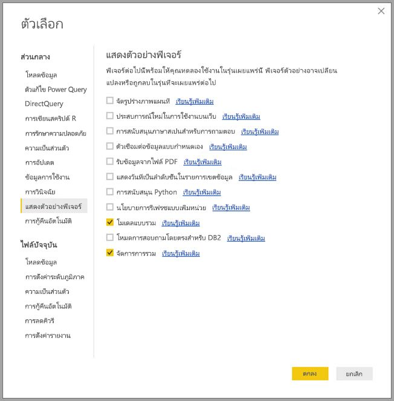

คุณจำเป็นต้องรีสตาร์ต **Power BI Desktop** เพื่อเปิดใช้งานคุณลักษณะ

## การรวมตัวอยู่บนพื้นฐานของความสัมพันธ์

โดยทั่วไป**การรวม**ที่อยู่บนพื้นฐานของความสัมพันธ์มักใช้กับแบบจำลองมิติ ชุดข้อมูล Power BI ที่มาจากคลังข้อมูลและข้อมูลมาร์ทคล้ายคลึงกับแผนผังแบบผลึกหิมะ/แบบดาวที่มีความสัมพันธ์ระหว่างตารางมิติและตารางหลัก

พิจารณาแบบจำลองต่อไปนี้ ซึ่งมาจากแหล่งข้อมูลเดียว สมมติว่าทุกตารางใช้ DirectQuery เพื่อเริ่มต้น ตารางหลัก **ยอดขาย** มีหลายพันล้านแถว การตั้งค่าโหมดพื้นที่เก็บข้อมูล **ยอดขาย** เป็น **การนำเข้า** สำหรับการทำแคชจะใช้หน่วยความจำและค่าใช้จ่ายในการจัดการที่มาก

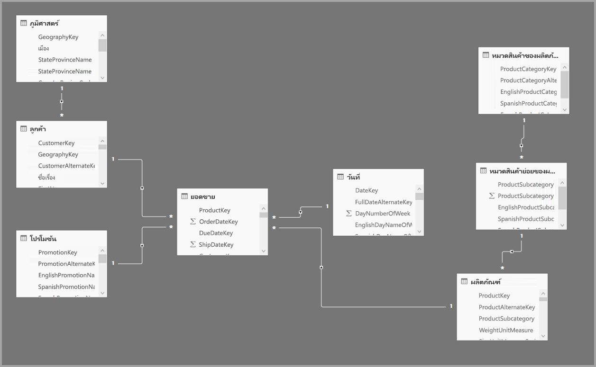

แต่เราจะสร้างตาราง **Sales Agg** เป็นตารางรวมข้อมูลแทน ซึ่งมีรายละเอียดสูงกว่า **ยอดขาย** และจะมีจำนวนแถวน้อยกว่า จำนวนแถวควรเท่ากับยอดรวม **SalesAmount (ปริมาณการขาย)** ที่จัดกลุ่มตาม **CustomerKey(คีย์ข้อมูลลูกค้า)**, **DateKey(คีย์ข้อมูลวันที่)** และ **ProductSubcategoryKey(คีย์ข้อมูลหมวดหมู่ย่อยของผลิตภัณฑ์)** แทนที่จะเป็นพันล้านแถวอาจเป็นแถวหลายล้านแถวซึ่งจัดการได้ง่ายกว่ามาก

สมมติว่าตารางมิติข้อมูลต่อไปนี้ใช้บ่อยที่สุดสำหรับคิวรี่ที่มีมูลค่าทางธุรกิจสูง ซึ่งเป็นตารางที่สามารถกรอง **Sales Agg** โดยใช้ความสัมพันธ์ *แบบหนึ่งต่อกลุ่ม* (หรือ *แบบกลุ่มไปหนึ่ง*)

* ภูมิศาสตร์
* ลูกค้า
* วันที่
* หมวดสินค้าย่อยของผลิตภัณฑ์
* หมวดสินค้าของผลิตภัณฑ์

รูปภาพต่อไปนี้แสดงแบบจำลองนี้

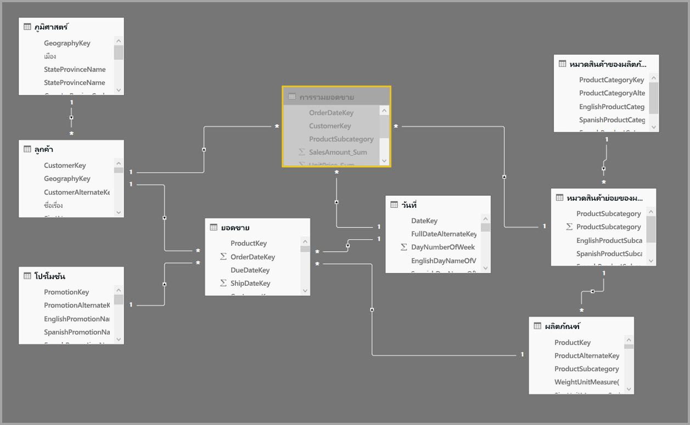

> [!NOTE]
> ตาราง **Sales Agg** เป็นเพียงตารางอีกตาราง ดังนั้นจึงมีความยืดหยุ่นในการโหลดด้วยวิธีการต่างๆ ตัวอย่างเช่น การรวมสามารถทำได้ในฐานข้อมูลต้นทางโดยใช้กระบวนการ ETL/ELT หรือโดย [นิพจน์ M](https://msdn.microsoft.com/query-bi/m/power-query-m-reference) สำหรับตาราง ซึ่งสามารถใช้โหมดพื้นที่เก็บข้อมูลการนำเข้าที่มีหรือไม่มี [การรีเฟรชแบบเพิ่มหน่วยในบริการ Power BI Premium](service-premium-incremental-refresh.md) หรืออาจเป็น DirectQuery และเพิ่มประสิทธิภาพสำหรับการคิวรี่อย่างรวดเร็วโดยใช้ [ดัชนี columnstore](https://docs.microsoft.com/sql/relational-databases/indexes/columnstore-indexes-overview) ความยืดหยุ่นนี้จะช่วยให้สถาปัตยกรรมที่สมดุลสามารถกระจายโหลดคิวรี่เพื่อหลีกเลี่ยงปัญหาคอขวดได้

### โหมดการจัดเก็บข้อมูล 
ลองดำเนินการต่อไปกับตัวอย่างที่เรากำลังใช้ เราตั้งค่าโหมดพื้นที่จัดเก็บข้อมูลของ **Sales Agg** เป็น **การนำเข้า** เพื่อเพิ่มความเร็วในการคิวรี่

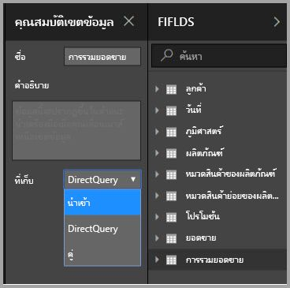

เมื่อเราทำเช่นนั้นแล้ว กล่องโต้ตอบต่อไปนี้จะปรากฏขึ้นเพื่อแจ้งให้เราทราบว่าตารางมิติข้อมูลที่เกี่ยวข้องจะถูกตั้งค่าเป็นโหมดพื้นที่เก็บข้อมูล **Dual** 

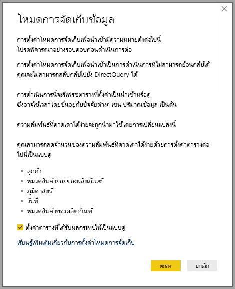

การตั้งค่าให้เป็น **Dual** ช่วยให้ตารางมิติข้อมูลที่เกี่ยวข้องสามารถทำหน้าที่เป็นการนำเข้าหรือ DirectQuery ขึ้นอยู่กับคิวรี่ย่อย

* คิวรี่ที่รวมเมตริกจากตาราง **Sales Agg** ซึ่งเป็นการนำเข้าและจัดกลุ่มตามแอตทริบิวต์จากตารางคู่ที่เกี่ยวข้องสามารถได้รับคืนจากแคชในหน่วยความจำ
* คิวรี่ที่รวมเมตริกจากตาราง **Sales Agg** ซึ่งเป็น DirectQuery และจัดกลุ่มตามแอตทริบิวต์จากตารางคู่ที่เกี่ยวข้องสามารถได้รับคืนจากโหมด DirectQuery ตรรกะการคิวรี่ที่ประกอบด้วยจัดกลุ่มโดยการดำเนินงานจะถูกส่งลงไปยังฐานข้อมูลต้นทาง

สำหรับข้อมูลเพิ่มเติมเกี่ยวกับ **โหมดพื้นที่เก็บข้อมูลแบบ Dual** โปรดดูบทความ [โหมดพื้นที่เก็บข้อมูล](desktop-storage-mode.md)

### การแนะนำความสัมพันธ์ที่คาดเดาได้ง่าย
รวมปริมาณที่ยึดตามความสัมพันธ์ที่จำเป็นต้องมีความสัมพันธ์ที่คาดเดาได้ยาก

ความสัมพันธ์ที่คาดเดาได้ยากมีรวมทั้งสองตารางอยู่จาก*แหล่งข้อมูลเดียว*

| ตารางที่มี *หลายด้าน | ตาราง *1* ด้าน |
| ------------- |----------------------| 
| คู่          | คู่                 | 
| นำเข้า        | นำเข้า หรือ คู่       | 
| DirectQuery   | DirectQuery หรือ คู่  | 

ในเคสเฉพาะที่ความสัมพันธ์เป็น*ข้ามแหล่ง*จะถือเป็นการคาดเดาได้ยากถ้าทั้งสองตารางมีการนำเข้า ความสัมพันธ์แบบกลุ่มต่อกลุ่มนั้นคาดเดาได้ง่าย

สำหรับการรวมแบบ*ข้ามแหล่ง*ที่ไม่ขึ้นอยู่กับความสัมพันธ์ ให้ดูส่วนด้านเกี่ยวกับการรวมที่มีกลุ่มตามคอลัมน์

### ตารางการรวมถูกซ่อนไว้
ตาราง **Sales Agg** ถูกซ่อนไว้ ควรซ่อนตารางรวมจากผู้บริโภคของชุดข้อมูล ผู้บริโภคและคิวรี่อ้างอิงถึงตารางรายละเอียดไม่ใช่ตารางรวม ซึ่งไม่จำเป็นต้องรู้ว่ามีตารางรวมอยู่

### กล่องโต้ตอบ  Manage aggregation
ถัดไปเราจะกำหนด การรวม เลือกเมนูบริบท **Manage aggregation** สำหรับตาราง **Sales Agg** โดยคลิกขวาที่ตาราง

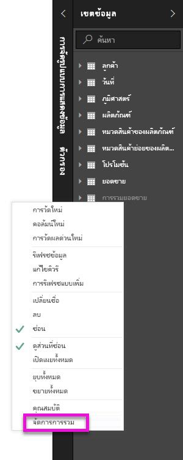

กล่องโต้ตอบ **Manage aggregation** จะปรากฏขึ้น ซึ่งแสดงแถวของแต่ละคอลัมน์ในตาราง **Sales Agg** ซึ่งเราสามารถระบุพฤติกรรมการรวมได้ คิวรี่ที่ส่งไปยังชุดข้อมูล Power BI ที่อ้างถึงตาราง **ยอดขาย** ถูกเปลี่ยนเส้นทางภายในไปที่ **Sales Agg** ผู้บริโภคของชุดข้อมูลไม่จำเป็นต้องรู้ว่ามีตาราง **Sales Agg**  อยู่

ตารางต่อไปนี้แสดงการรวมสำหรับตาราง **Sales Agg**

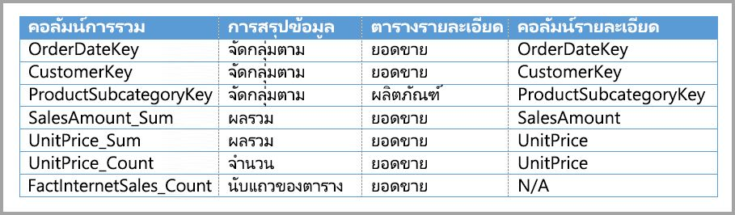

#### ฟังก์ชั่นการสรุป

เมนูแบบเลื่อนลง การสรุป มีค่าต่อไปนี้สำหรับการเลือก
* จำนวน
* GroupBy
* สูงสุด
* ต่ำสุด
* ผลรวม
* นับแถวของตาราง

#### การตรวจสอบความถูกต้อง

การตรวจสอบความถูกต้องที่โดดเด่นต่อไปนี้มีผลบังคับใช้โดยกล่องโต้ตอบ:

* คอลัมน์รายละเอียดที่เลือกจะต้องมีข้อมูลประเภทเดียวกันกับคอลัมน์รวมยกเว้นฟังก์ชั่นสรุปการนับแถวของตารางและการนับ การนับและการนับแถวในตารางจะนำเสนอเฉพาะสำหรับคอลัมน์การรวมจำนวนเต็มและไม่ต้องการประเภทข้อมูลที่ตรงกัน
* ไม่อนุญาตให้มีการรวมแบบสายโซ่ที่ครอบคลุมสามตารางขึ้นไป ตัวอย่างเช่น คุณไม่สามารถตั้งค่าการรวมใน **ตาราง A** ที่อ้างถึง **ตาราง B** ที่มีการรวมอ้างถึง **ตาราง C** ได้
* ไม่อนุญาตสำหรับการรวมซ้ำที่สองรายการใช้ฟังก์ชั่นสรุปข้อมูลเดียวกันและอ้างถึงตาราง/คอลัมน์รายละเอียดเดียวกัน

ในระหว่างการดูตัวอย่างสาธารณะนี้สำหรับ **การรวม** การตรวจสอบความถูกต้องต่อไปนี้จะมีผลบังคับใช้ด้วย เราตั้งใจที่จะลบการตรวจสอบความถูกต้องดังกล่าวออกสำหรับความพร้อมใช้งานทั่วไป

* ไม่สามารถใช้การรวมร่วมกับการรักษาความปลอดภัยระดับแถว (RLS) ได้ *ข้อจำกัดการดูตัวอย่างสาธารณะ*
* ตารางรายละเอียดต้องเป็น DirectQuery ไม่ใช่ การนำเข้า *ข้อจำกัดการดูตัวอย่างสาธารณะ*

การตรวจสอบความถูกต้องดังกล่าวส่วนใหญ่มีผลบังคับใช้โดยการปิดใช้งานค่าแบบเลื่อนลงและแสดงข้อความอธิบายในเคล็ดลับเครื่องมือ ดังแสดงในรูปต่อไปนี้

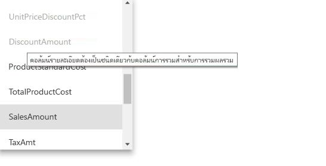

### จัดกลุ่มตามคอลัมน์

ในตัวอย่างนี้ GroupBy สามรายการเป็นตัวเลือก; แต่จะไม่มีผลต่อลักษณะของการรวม (ยกเว้นคิวรี่ตัวอย่าง DISTINCTCOUNT ที่แสดงในภาพที่กำลังจะเกิดขึ้น) โดยมีวัตถุประสงค์หลักเพื่อให้อ่านง่าย หากไม่มีรายการ GroupBy เหล่านี้ การรวมจะยังคงเกิดขึ้นตามความสัมพันธ์ นี่คือพฤติกรรมที่แตกต่างจากการใช้ การรวม โดยไม่มีความสัมพันธ์ซึ่งครอบคลุมโดยตัวอย่างข้อมูลขนาดใหญ่ที่มีเนื้อหาต่อไปนี้ในบทความนี้

### การตรวจจับว่ามีการรวมหรือไม่มีการรวมตามคิวรี่

สำหรับข้อมูลเพิ่มเติมเกี่ยวกับวิธีการตรวจจับว่าจะส่งคืนคิวรี่จากแคชในหน่วยความจำ (เครื่องมือเก็บข้อมูล) หรือ DirectQuery (ผลักดันไปยังแหล่งข้อมูล) โดยใช้ Profiler SQL โปรดดูที่บทความ [โหมดพื้นที่เก็บข้อมูล](desktop-storage-mode.md) กระบวนการนี้ยังสามารถใช้เพื่อตรวจสอบว่ามีการรวมเกิดขึ้นหรือไม่ อีกด้วย

นอกจากนี้เหตุการณ์ที่ขยายต่อไปนี้มีอยู่ใน Profiler SQL

    Query Processing\Aggregate Table Rewrite Query

JSON snippet ต่อไปนี้แสดงตัวอย่างของผลลัพธ์ของเหตุการณ์เมื่อใช้การรวม

* **matchingResult** แสดงว่ามีการใช้การรวมสำหรับคิวรี่ย่อย
* **dataRequest**  แสดงคอลัมน์ group-by และคอลัมน์รวมที่ใช้โดยคิวรี่ย่อย (subquery)
* **การแม็ปปิ้ง** แสดงคอลัมน์ในตารางรวมที่ถูกแมปไป

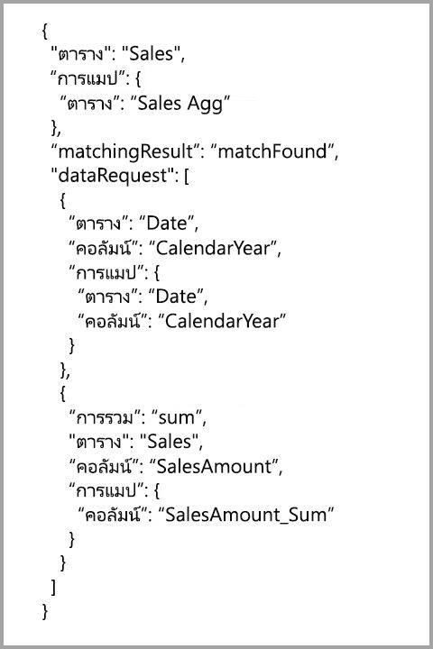

### ตัวอย่างของคิวรี่
คิวรี่ต่อไปนี้จะทำให้เกิดการรวม เนื่องจากคอลัมน์ในตาราง *วันที่* มีความละเอียดที่สามารถรวมได้ จะใช้การรวม **Sum(ผลรวม)** สำหรับ **SalesAmount**

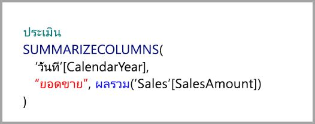

คิวรี่ต่อไปนี้จะไม่เกิดการรวม แม้จะร้องขอยอดรวมของ **SalesAmount** แต่ก็ดำเนินการจัดกลุ่มตามการดำเนินการบนคอลัมน์ในตาราง **ผลิตภัณฑ์** ซึ่งไม่มีความละเอียดที่สามารถรวบรวมได้ ถ้าคุณสังเกตความสัมพันธ์ในแบบจำลอง ประเภทย่อยของผลิตภัณฑ์จะมีแถวของ **ผลิตภัณฑ์** หลายแถว; คิวรี่จะไม่สามารถกำหนดว่าผลิตภัณฑ์ใดจะรวมกันได้ ในกรณีนี้คิวรี่จะย้อนกลับไปยัง DirectQuery และส่งคิวรี่ SQL ไปยังแหล่งข้อมูล

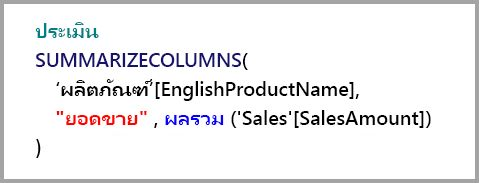

การรวมไม่ใช่แค่การคำนวณแบบง่ายที่สร้างผลรวมแบบตรงไปตรงมาเท่านั้น แต่ยังได้รับประโยชน์จากการคำนวณที่ซับซ้อนอีกด้วย ตามแนวคิดแล้ว การคำนวณที่ซับซ้อนจะแบ่งย่อยเป็นคิวรี่ย่อยสำหรับแต่ละ SUM, MIN, MAX และ COUNT และแต่ละคิวรี่ย่อยจะได้รับการประเมินเพื่อกำหนดว่าจะสามารถดำเนินการรวมได้หรือไม่ ตรรกะนี้ไม่ถือเป็นจริงในทุกกรณีเนื่องจากการเพิ่มประสิทธิภาพแผนคิวรี่ แต่โดยทั่วไปควรใช้ตรรกะนี้ ตัวอย่างต่อไปนี้จะทำให้เกิดการรวม:

ฟังก์ชั่น COUNTROWS จะได้ประโยชน์จากการรวม คิวรี่ต่อไปนี้จะทำให้เกิดการรวมเนื่องจากมีการรวมแถวของตาราง **Count** ที่กำหนดไว้สำหรับตาราง **ยอดขาย**

ฟังก์ชั่น AVERAGE จะได้ประโยชน์จากการรวมข้อมูล คิวรี่ต่อไปนี้จะทำให้เกิดการรวมเนื่องจาก AVERAGE จะถูกห่อหุ้มด้วย SUM ภายในซึ่งถูกหารด้วย COUNT เนื่องจากคอลัมน์ **UnitPrice** มีการรวมข้อมูลที่กำหนดไว้สำหรับทั้ง SUM และ COUNT ดังนั้นการรวมจึงเกิดขึ้น

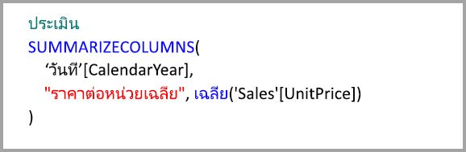

ในบางกรณี ฟังก์ชั่น DISTINCTCOUNT จะได้ประโยชน์จากการรวม คิวรี่ต่อไปนี้จะเกิดการรวมเนื่องจากมีรายการ GroupBy สำหรับ **CustomerKey** ซึ่งจะรักษาความแตกต่างของ **CustomerKey** ในตารางรวม เทคนิคนี้ยังอยู่ภายใต้เกณฑ์ประสิทธิภาพที่มีค่ามากกว่าสองถึงห้าล้านค่าที่ส่งผลต่อประสิทธิภาพการคิวรี่ อย่างไรก็ตามอาจเป็นประโยชน์ในสถานการณ์ที่มีตารางนับพันล้านแถวและมีค่าที่แตกต่างกันสองถึงห้าล้านค่าในคอลัมน์ ในกรณีนี้ การนับที่แตกต่างกันสามารถทำได้เร็วกว่าการสแกนตารางที่มีแถวหลายพันล้านแถวแม้ว่าจะถูกแคชไว้ในหน่วยความจำก็ตาม

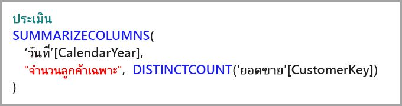

## การรวมที่อยู่บนพื้นฐานของคอลัมน์ group-by 

แบบจำลองข้อมูลขนาดใหญ่ที่ใช้ Hadoop มีลักษณะที่แตกต่างจากแบบจำลองมิติ เพื่อหลีกเลี่ยงการเชื่อมโยงระหว่างตารางขนาดใหญ่ แบบจำลองเหล่านั้นมักไม่ขึ้นอยู่กับความสัมพันธ์ แอตทริบิวต์มิติข้อมูลมักถูกดีนอร์มอลไลเซชั่นไปยังตารางหลัก โมเดลข้อมูลขนาดใหญ่ดังกล่าวสามารถปลดล็อกสำหรับการวิเคราะห์แบบโต้ตอบโดยใช้**การรวม**  ที่อยู่บนพื้นฐานของคอลัมน์ group-by

ตารางต่อไปนี้ประกอบด้วยคอลัมน์ตัวเลขที่ **การเคลื่อนไหว** ที่ถูกรวม คอลัมน์อื่น ๆ ทั้งหมดเป็นแอตทริบิวต์ในการจัดกลุ่มตาม (group by) ซึ่งประกอบด้วยข้อมูล IoT และแถวจำนวนมาก โหมดพื้นที่เก็บข้อมูลคือ DirectQuery คิวรี่ในแหล่งข้อมูลที่รวมทั่วทั้งชุดข้อมูลทั้งหมดทำงานช้าเนื่องจากมีปริมาณข้อมูลเต็มที่

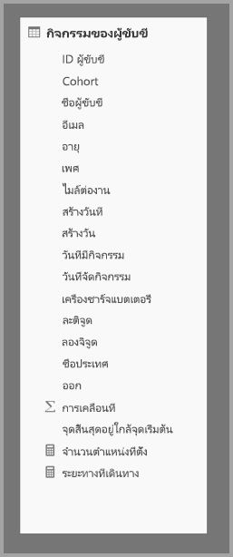

เพื่อเปิดใช้งานการวิเคราะห์แบบโต้ตอบเกี่ยวกับชุดข้อมูลนี้ เราจะเพิ่มตารางการรวมที่จัดกลุ่มตามแอตทริบิวต์ส่วนใหญ่ แต่ยกเว้นแอตทริบิวต์คาร์ดินอลลิตี้ (cardinality) ที่มีค่าสูง เช่น ลองจิจูดและละติจูด ซึ่งช่วยลดจำนวนแถวได้อย่างมากและมีขนาดเล็กพอที่จะพอดีกับแคชในหน่วยความจำได้อย่างสบาย โหมดพื้นที่เก็บข้อมูลของ **Driver Activity Agg** คือ Import

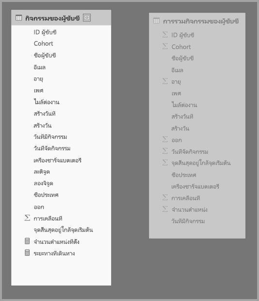

ถัดไป เรากำหนดการแม็ปปิ้งข้อมูลการรวมในกล่องโต้ตอบ **Manage aggregation** จะแสดงแถวของแต่ละคอลัมน์ในตาราง **Driver Activity Agg** ซึ่งเราสามารถระบุพฤติกรรมการรวมได้

ตารางต่อไปนี้จะแสดงการรวมตาราง **Driver Activity Agg**

### จัดกลุ่มตามคอลัมน์

ในตัวอย่างนี้รายการ **GroupBy** ไม่ใช่ **ตัวเลือก**; ซึ่งถ้าไม่มีรายการดังกล่าวก็จะไม่เกิดการรวม นี่เป็นพฤติกรรมที่แตกต่างไปจากการใช้การรวมที่อยู่บนพื้นฐานของความสัมพันธ์ ซึ่งครอบคลุมตัวอย่างแบบจำลองมิติที่ให้ไว้ก่อนหน้าในบทความนี้

### ตัวอย่างของคิวรี่

คิวรี่ต่อไปนี้จะเกิดการรวมข้อมูลเนื่องจากคอลัมน์ **Activity Date(วันกิจกรรม)** ที่ห่อหุ้มด้วยตารางการรวม มีการใช้การนับแถวในตารางโดยฟังก์ชั่น COUNTROWS

โดยเฉพาะอย่างยิ่งสำหรับแบบจำลองที่มีแอตทริบิวต์ตัวกรองในตารางหลัก คุณควรใช้การรวมแบบ Count table rows (การนับแถวในตาราง) Power BI สามารถส่งคิวรี่ไปยังชุดข้อมูลโดยใช้ COUNTROWS ในกรณีที่ผู้ใช้ไม่ได้ร้องขออย่างชัดแจ้ง ตัวอย่างเช่น กล่องโต้ตอบตัวกรองจะแสดงจำนวนแถวสำหรับแต่ละค่า

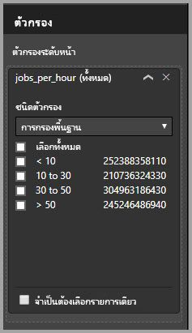

## ลำดับความสำคัญของการรวม

ลำดับความสำคัญของการรวมช่วยให้สามารถสรุปตารางการรวมหลายรายการโดยใช้คิวรี่ย่อยรายการเดียว

พิจารณาตัวอย่างต่อไปนี้ เป็น [แบบจำลองผสมผสาน](desktop-composite-models.md) ที่ประกอบด้วยแหล่ง DirectQuery หลายแห่ง

* ตารางนำเข้าข้อมูลของ **Driver Activity Agg2** มีความละเอียดสูงเนื่องจากแอตทริบิวต์ group-by มีจำนวนคาร์ดินอลลิตี้ (Cardinality) น้อยและต่ำ จำนวนแถวอาจต่ำถึงหนึ่งพันดังนั้นจึงสามารถใส่ลงในแคชในหน่วยความจำได้อย่างง่ายดาย แอตทริบิวต์เหล่านี้ถูกนำไปใช้กับแดชบอร์ดของผู้บริหารที่มีตำแหน่งสูง ดังนั้นคิวรี่ที่อ้างถึงแอตทริบิวต์ดังกล่าวควรเกิดขึ้นโดยเร็วที่สุด
* ตาราง **Driver Activity Agg** เป็นตารางรวมระดับกลางในโหมด DirectQuery มีแถวมากกว่าหนึ่งพันล้านแถวและได้รับการปรับให้เหมาะกับแหล่งที่มาโดยใช้ดัชนี columnstore
* ตาราง **Driver Activity** คือ DirectQuery และประกอบด้วยข้อมูล IoT มากกว่าหนึ่งพันล้านแถวที่มาจากระบบข้อมูลขนาดใหญ่ ใช้สำหรับการคิวรี่แบบเจาะลึกเพื่อดูการอ่าน IoT แต่ละตัวในบริบทของตัวกรองที่มีการควบคุม

ฟุตปริ้นท์ของหน่วยความจำของแบบจำลองนี้มีขนาดค่อนข้างเล็ก แต่จะปลดล็อกชุดข้อมูลขนาดใหญ่ แสดงถึงสถาปัตยกรรมที่สมดุลเนื่องจากกระจายโหลดคิวรี่ผ่านส่วนประกอบของสถาปัตยกรรมที่ใช้ประโยชน์จากจุดแข็งของพวกเขา

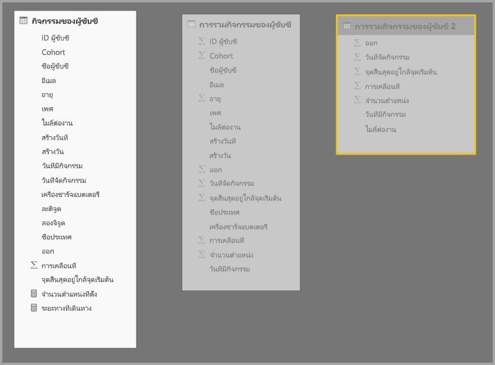

กล่องโต้ตอบ **Manage aggregation** สำหรับ **Driver Activity Agg2** แสดงฟิลด์ *ลำดับความสำคัญ* เท่ากับ 10 ซึ่งสูงกว่า **Driver Activity Agg** ซึ่งหมายความว่าจะพิจารณาคิวรี่โดยใช้การรวมก่อน  ซึ่งสามารถตอบคิวรี่ย่อยที่ไม่มีความละเอียดได้โดย **Driver Activity Agg2** will consider **Driver Activity Agg** แทน คิวรี่รายละเอียดที่ไม่สามารถตอบได้จากตารางรวมแต่ละตารางจะถูกนำไปที่ **Driver Activity**

ตารางที่ระบุไว้ในคอลัมน์ **ตารางรายละเอียด** คือ **Driver Activity** ไม่ใช่ **Driver Activity Agg** เนื่องจากไม่ได้รับอนุญาตให้ใช้การรวมแบบสายโซ่ (ดู [ การตรวจสอบความถูกต้อง ](#validations) ก่อนหน้านี้ ในบทความนี้)

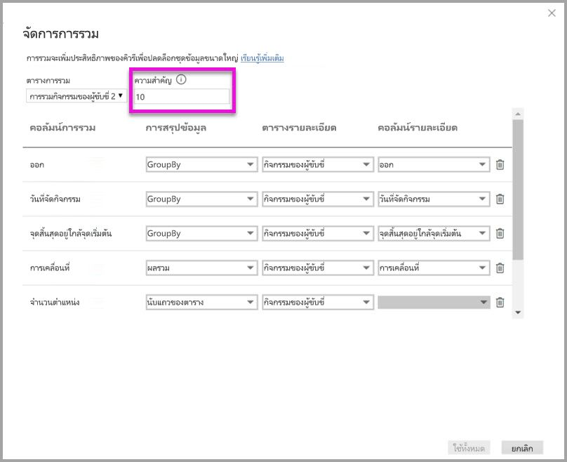

ตารางต่อไปนี้จะแสดงการรวมตาราง **Driver Activity Agg2**

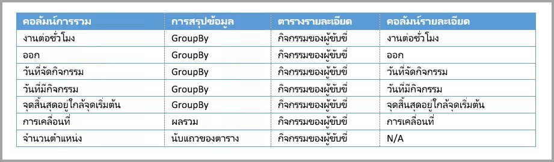

## การรวมที่อยู่บนพื้นฐานของคอลัมน์ group-by จะรวมกับความสัมพันธ์

คุณสามารถผสานรวมทั้งสองเทคนิคสำหรับ การรวม ที่อธิบายไว้ก่อนหน้าในบทความนี้ได้อีกด้วย **การรวม**ที่อยู่บนพื้นฐานของความสัมพันธ์อาจต้องมีการแบ่งแยกตารางมิติข้อมูลที่ผ่านการดีนอร์มอลไลเซชั่นไปเป็นตารางหลายรายการ หากเป็นค่าใช้จ่ายหรือไม่เป็นประโยชน์สำหรับตารางมิติข้อมูลบางตาราง คุณสามารถทำซ้ำแอตทริบิวต์ที่จำเป็นในตารางรวมสำหรับมิติข้อมูลบางมิติและความสัมพันธ์บางอย่างที่ใช้สำหรับอันอื่นได้

โมเดลต่อไปนี้จำลอง  *Month(เดือน)*, *Quarter(ไตรมาส)*, *Semester(เทอม)* และ *Year(ปี)* ในตาราง **Sales Agg** ไม่มีความสัมพันธ์ระหว่างตาราง **Sales Agg** และ **Date** มีความสัมพันธ์กับ **Customer(ลูกค้า)** และ **หมวดหมู่ย่อยของสินค้า(Product Subcategory)** โหมดพื้นที่เก็บข้อมูลของ **Sales Agg** คือ Import(การส่งออก)

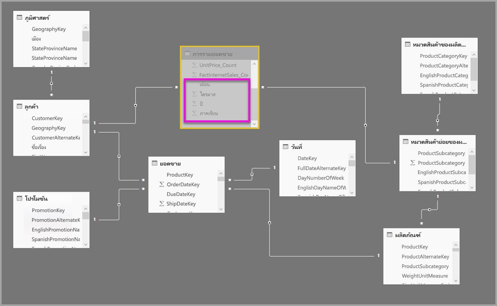

ตารางต่อไปนี้แสดงรายการที่ตั้งค่าไว้ในกล่องโต้ตอบ **Manage aggregations** สำหรับตาราง **Sales Agg{** รายการ GroupBy ที่ **Date** เป็นตารางรายละเอียดมีผลบังคับให้เกิดการรวมสำหรับคิวรี่ที่จัดกลุ่มตามแอตทริบิวต์ Date เช่นเดียวกับในตัวอย่างก่อนหน้า รายการ GroupBy สำหรับ CustomerKey และ ProductSubcategoryKey จะไม่มีผลทำให้เกิดการรวมเนื่องจากการมีความสัมพันธ์อยู่ (อีกครั้งยกเว้น DISTINCTCOUNT)

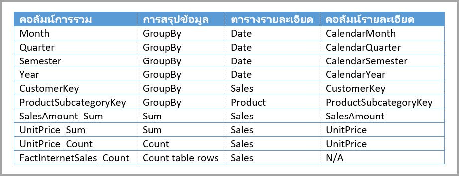

> หมายเหตุ: แบบจำลองนี้ต้องการให้ตาราง **Date** อยู่ในโหมด DirectQuery เพื่อกรอกข้อมูลในกล่องโต้ตอบ manage aggregation(จัดการการรวม) เนื่องจากเป็นตารางรายละเอียด นี่เป็นข้อจำกัดในการแสดงตัวอย่างที่เราต้องการกำจัดออกสำหรับความพร้อมใช้งานทั่วไป

### ตัวอย่างของคิวรี่

คิวรี่ต่อไปนี้ทำให้เกิดการรวมเนื่องจาก CalendarMonth ครอบคลุมอยู่ในตารางรวมและสามารถเข้าถึง CategoryName ได้ผ่านทางความสัมพันธ์แบบหนึ่งต่อกลุ่ม ใช้การรวมยอดสำหรับ **SalesAmount**

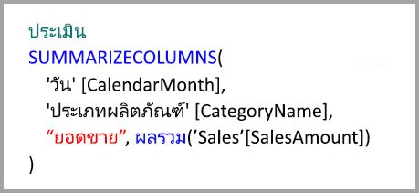

คิวรี่ต่อไปนี้จะไม่เกิดการรวมเนื่องจาก CalendarDay ไม่ครอบคลุมโดยตารางรวม

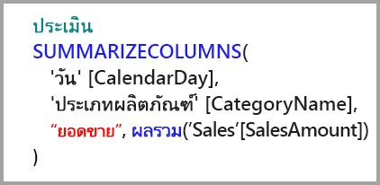

คิวรี่เวลาอัจฉริยะต่อไปนี้จะไม่เกิดการรวมเนื่องจากฟังก์ชั่น DATESYTD สร้างตารางค่า CalendarDay ซึ่งไม่ได้ครอบคลุมอยู่ในตารางรวม

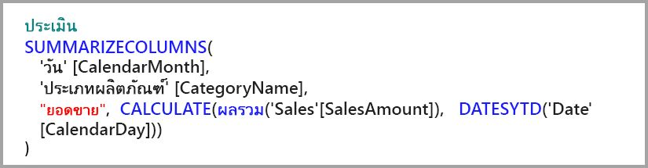

## แคชควรจะซิงค์อยู่เสมอ

**การรวม** ที่รวมโหมด DirectQuery และ การส่งออก และ/หรือ พื้นที่จัดเก็บแบบคู่ อาจส่งคืนข้อมูลที่แตกต่างกันหากแคชในหน่วยความจำไม่ได้ถูกซิงค์กับข้อมูลต้นทาง การดำเนินการคิวรีจะไม่ซ่อนปัญหาของข้อมูลโดยวิธีอย่างเช่นการกรองผลลัพธ์ DirectQuery ให้ตรงกับค่าที่ถูกแคช คุณลักษณะเหล่านี้คือการเพิ่มประสิทธิภาพให้เหมาะสมและควรใช้เฉพาะในรูปแบบที่ไม่กระทบต่อความสามารถในการตอบสนองความต้องการทางธุรกิจของคุณ เป็นความรับผิดชอบของคุณในการทราบกระแสข้อมูลของคุณ ดังนั้นโปรดออกแบบมาให้เหมาะสม มีการกำหนดเทคนิคเพื่อจัดการปัญหาดังกล่าว ณ แหล่งที่มา หากจำเป็น

## ขั้นตอนถัดไป

บทความต่อไปนี้อธิบายเพิ่มเติมเกี่ยวกับโมเดลแบบรวม และยังอธิบาย DirectQuery โดยละเอียด

* [โมเดลแบบรวมใน Power BI Desktop (ตัวอย่าง)](desktop-composite-models.md)
* [ความสัมพันธ์แบบกลุ่ม-ต่อ-กลุ่มใน Power BI Desktop (ตัวอย่าง)](desktop-many-to-many-relationships.md)
* [โหมดที่เก็บข้อมูล ใน Power BI Desktop (ตัวอย่าง)](desktop-storage-mode.md)

บทความ DirectQuery:

* [การใช้ DirectQuery ใน Power BI](desktop-directquery-about.md)
* [แหล่งข้อมูลที่ได้รับการรองรับโดย DirectQuery ใน Power BI](desktop-directquery-data-sources.md)
