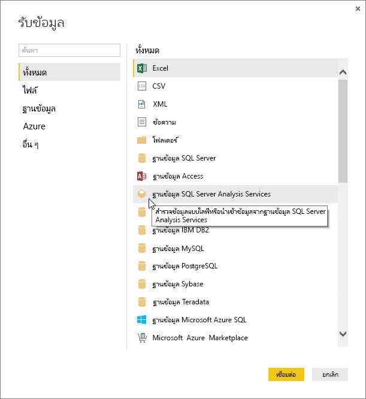
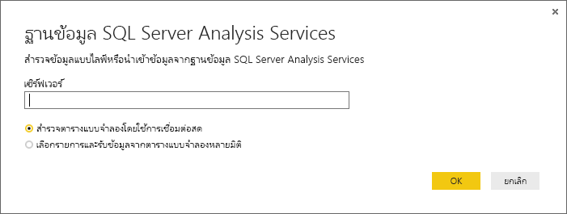
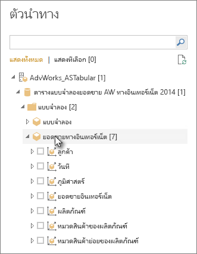
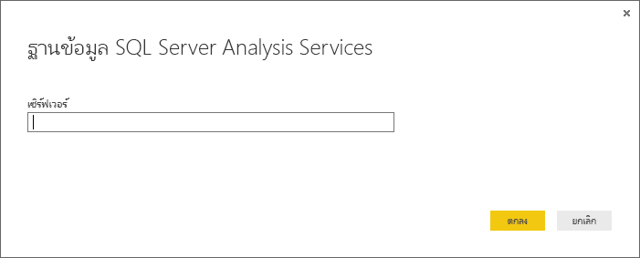

# ใช้ข้อมูล Analysis Services Tabular ใน Power BI Desktop
ด้วย Power BI Desktop คุณมีสองวิธีที่สามารถเชื่อมต่อ และรับข้อมูลจากแบบจำลอง SQL Server Analysis Services Tabular คือ: สำรวจโดยใช้การเชื่อมต่อกันโดยตรงหรือรายการที่เลือกและนำเข้าลงใน Power BI Desktop

ลองมาดูรายละเอียดกัน

**สำรวจโดยการใช้การเชื่อมต่อกันโดยตรง** เมื่อใช้การเชื่อมต่อกันโดยตรง รายการในแบบจำลอง Tabular หรือมุมมองของคุณ เช่น ตาราง คอลัมน์ และหน่วยวัดที่ปรากฏในรายการเขตข้อมูล Power BI Desktop ของคุณ คุณสามารถใช้เครื่องมือรายงานและการแสดงวิชวลขั้นสูง Power BI Desktop เพื่อสำรวจแบบจำลอง Tabular ของคุณ ด้วยวิธีใหม่ที่สามารถโต้ตอบได้สูง

เมื่อเชื่อมต่อโดยตรงจะไม่มีการนำเข้าข้อมูลจากแบบจำลอง Tabular ลงใน Power BI Desktop ในแต่ละครั้งที่คุณโต้ตอบกับการแสดงวิชวล Power BI Desktop จะคิวรีแบบจำลอง Tabular และคำนวณผลลัพธ์ที่คุณเห็น คุณจะเห็นข้อมูลล่าสุดที่พร้อมใช้งานในรูปแบบตาราง จากประมวลผลครั้งล่าสุด หรือ จากตารางคิวรีโดยตรงที่พร้อมใช้งานในรูปแบบตาราง 

โปรดทราบว่า รูปแบบตารางสูงมีความปลอดภัยสูง รายการที่ปรากฏใน Power BI Desktop ขึ้นอยู่กับสิทธิ์ของคุณสำหรับแบบจำลอง Tabular ที่คุณกำลังเชื่อมต่อ

เมื่อคุณสร้างรายงานแบบไดนามิกใน Power BI Desktop คุณสามารถแบ่งปันเอกสารโดยการเผยแพร่ไปยังไซต์ Power BI ของคุณ เมื่อคุณเผยแพร่ไฟล์ Power BI Desktop ด้วยการเชื่อมต่อโดยตรงไปยังแบบจำลอง Tabular ไปยังไซต์ Power BI ของคุณ เกตเวย์ข้อมูลภายในองค์กรต้องได้รับการติดตั้ง และกำหนดค่าโดยผู้ดูแลระบบ ดูที่ [เกตเวย์ข้อมูลภายในองค์กร](service-gateway-onprem.md) เพื่อเรียนรู้เพิ่มเติม

**เลือกรายการ และนำเข้าลงใน Power BI Desktop** เมื่อคุณเชื่อมต่อกับตัวเลือกนี้ คุณสามารถเลือกรายการ เช่น ตาราง คอลัมน์ และหน่วยวัดในแบบจำลอง Tabular หรือเปอร์สเปคทีฟของคุณ และโหลดรายการเหล่านั้นลงในแบบจำลอง Power BI Desktop คุณสามารถใช้ตัวแก้ไขคิวรีขั้นสูงของ Power BI Desktop เพื่อจัดรูปแบบสิ่งที่คุณต้องการเพิ่มเติม คุณสามารถใช้คุณสมบัติลักษณะการจำลองแบบของ Power BI Desktop เพื่อจำลองข้อมูลเพิ่มเติม การเชื่อมต่อโดยตรงระหว่าง Power BI Desktop และแบบจำลอง Tabular ไม่ได้รับการเก็บไว้ คุณสามารถสำรวจแบบจำลอง Power BI Desktop ของคุณแบบออฟไลน์ หรือเผยแพร่ไปยังไซต์ Power BI ของคุณ

## เพื่อเชื่อมต่อกับแบบจำลอง Tabular
1. ใน Power BI Desktop บนแท็บ **หน้าแรก**คลิก**รับข้อมูล**
   
   
2. คลิก**ฐานข้อมูล SQL Server Analysis Services**และคลิก**เชื่อมต่อ**
   
   
3. ป้อนชื่อเซิร์ฟเวอร์ แล้วเลือกโหมดการเชื่อมต่อ 
   
   
4. ขั้นตอนนี้ขึ้นอยู่กับโหมดการเชื่อมต่อที่คุณเลือก:

* ถ้าคุณกำลังเชื่อมต่อแบบโดยตรง ใน “ตัวนำทาง” ให้เลือกแบบจำลอง Tabular หรือเปอร์สเปคทีฟ
  
  
* ถ้าคุณเลือก “เลือกรายการ” และรับข้อมูล ใน “ตัวนำทาง” ให้เลือกแบบจำลอง Tabular หรือเปอร์สเปคทีฟ คุณสามารถเลือกตารางหรือคอลัมน์เฉพาะเพื่อโหลดเพิ่มเติมได้ คลิก “แก้ไข” เพื่อเปิด “ตัวแก้ไขคิวรี” เพื่อจัดรูปแบบข้อมูลของคุณก่อนทำการโหลด เมื่อคุณพร้อมแล้วให้คลิก “โหลด” เพื่อนำเข้าข้อมูลลงใน Power BI Desktop

  

## คำถามที่ถามบ่อย
**คำถาม:** ฉันจำเป็นต้องมีเกตเวย์ข้อมูลภายในองค์กรหรือไม่

**คำตอบ:** ขึ้นอยู่กับปัจจัยหลายๆ อย่าง คุณไม่จำเป็นต้องมีเกตเวย์ ถ้าคุณใช้ Power BI Desktop เพื่อเชื่อมต่อกันโดยตรงกับแบบจำลอง Tabular แต่ไม่ต้องการเผยแพร่ไปยังไซต์ Power BI ของคุณ ในทางกลับกัน ถ้าคุณต้องการเผยแพร่ไปยังไซต์ Power BI ของคุณ คุณจำเป็นต้องมีเกตเวย์ข้อมูลเพื่อให้แน่ใจว่าการสื่อสารจะปลอดภัยระหว่างบริการ Power BI และเซิร์ฟเวอร์ Analysis Services ภายในองค์กรของคุณ อย่าลืมพูดกับผู้ดูแลเซิร์ฟเวอร์ Analysis Services ของคุณก่อนติดตั้งเกตเวย์ข้อมูล

คุณไม่จำเป็นต้องมีเกตเวย์ ถ้าคุณเลือก เลือกรายการ และรับข้อมูล จากนั้นแบบจำลอง Tabular จะได้รับการนำเข้าไปยังไฟล์ Power BI Desktop ของคุณทันที

**คำถาม:** การเชื่อมต่อกันโดยตรงกับแบบจำลอง Tabular จากบริการ Power BI และการเชื่อมต่อโดยตรงจาก Power BI Desktop แตกต่างกันอย่างไร

**คำตอบ:** เมื่อเชื่อมต่อโดยตรงไปยังแบบจำลอง Tabular จากไซต์ของคุณในบริการ Power BI ไปยังฐานข้อมูล Analysis Services ภายในองค์กรของคุณ เกตเวย์ข้อมูลภายในองค์กรต้องมีการติดต่อสื่อสารที่ปลอดภัยระหว่างกัน คุณไม่จำเป็นต้องใช้เกตเวย์ เมื่อเชื่อมต่อโดยตรงไปยังแบบจำลอง Tabular จาก Power BI Desktop เนื่องจากทั้ง Power BI Desktop และเซิร์ฟเวอร์ Analysis Services ที่คุณกำลังเชื่อมต่อนั้นกำลังทำงานอยู่ภายในองค์กรของคุณ อย่างไรก็ตามคุณจำเป็นต้องมีเกตเวย์ ถ้าคุณเผยแพร่ไฟล์ Power BI Desktop ของคุณไปยังไซต์ Power BI ของคุณ

**คำถาม:** ถ้าฉันได้สร้างการเชื่อมต่อโดยตรง ฉันสามารถเชื่อมต่อกับแหล่งข้อมูลอื่น ๆ ในไฟล์ Power BI Desktop เดียวกันได้หรือไม่

**คำตอบ:** หมายเลข คุณไม่สามารถสำรวจข้อมูลไลฟ์ และเชื่อมต่อกับแหล่งข้อมูลชนิดอื่นในไฟล์เดียวกัน ถ้าคุณนำเข้าข้อมูล หรือเชื่อมต่อกับแหล่งข้อมูลอื่นในไฟล์ Power BI Desktop แล้ว คุณจะต้องสร้างไฟล์ใหม่เพื่อสำรวจแบบไลฟ์

**คำถาม:** ถ้าฉันสร้างการเชื่อมต่อโดยตรง ฉันสามารถแก้ไขแบบจำลองหรือคิวรีใน Power BI Desktop ได้หรือไม่

**คำตอบ:** คุณสามารถสร้างหน่วยวัดระดับรายงานใน Power BI Desktop แต่คิวรีอื่นทั้งหมดและคุณลักษณะการสร้างแบบจำลองจะปิดใช้งานเมื่อมีการสำรวจข้อมูลแบบไลฟ์

**คำถาม:** ถ้าฉันสร้างการเชื่อมต่อกันโดยตรง การเชื่อมต่อนั้นจะปลอดภัยหรือไม่

**คำตอบ:** ใช่ ข้อมูลประจำตัว Windows ปัจจุบันของคุณใช้เพื่อเชื่อมต่อไปยังเซิร์ฟเวอร์ Analysis Services คุณไม่สามารถใช้ Basic หรือข้อมูลประจำตัวที่เก็บไว้ในบริการ Power BI หรือ Power BI Desktop เมื่อมีการสำรวจแบบไลฟ์

**คำถาม:** ใน “ตัวนำทาง” ฉันเห็นทั้งแบบจำลองและเปอร์สเปคทีฟ อะไรคือความแตกต่าง?

**คำตอบ:** เปอร์สเปคทีฟเป็นมุมมองเฉพาะของแบบจำลอง Tabular ซึ่งอาจรวมถึงตาราง คอลัมน์ หรือหน่วยวัดบางอย่าง โดยขึ้นอยู่กับความต้องการวิเคราะห์ข้อมูลที่ไม่ซ้ำกัน แบบจำลอง Tabular จะประกอบด้วยอย่างน้อยหนึ่งเปอร์สเปคทีฟเสมอ ซึ่งอาจรวมถึงทุกสิ่งในแบบจำลอง ตรวจสอบกับผู้ดูแลระบบของคุณหากคุณไม่แน่ใจว่าควรเลือกอะไร

## เพื่อเปลี่ยนชื่อของเซิร์ฟเวอร์หลังจากการเชื่อมต่อเริ่มต้น
เมื่อคุณสร้างไฟล์ Power BI Desktop พร้อมกับการเชื่อมต่อโดยตรงแบบสำรวจ อาจมีบางกรณีที่คุณต้องการสลับการเชื่อมต่อไปยังเซิร์ฟเวอร์อื่น ตัวอย่างเช่น ถ้าคุณสร้างไฟล์ Power BI Desktop ของคุณ เมื่อเชื่อมต่อไปยังเซิร์ฟเวอร์พัฒนา และก่อนเผยแพร่ไปยังบริการ Power BI คุณต้องการสลับการเชื่อมต่อไปยังเซิร์ฟเวอร์การผลิต

1. เลือก**แก้ไขคิวรี**จากแถบ Ribbon
   
   
2. ป้อนชื่อเซิร์ฟเวอร์ใหม่
   
   
   
   
## การแก้ไขปัญหา 
รายการต่อไปนี้อธิบายปัญหาที่ทราบแล้วทั้งหมด เมื่อเชื่อมต่อกับ SQL Server Analysis Services (SSAS) หรือ Azure Analysis Services 

* **ข้อผิดพลาด : ไม่สามารถโหลด Schema สำหรับโมเดล** - ข้อผิดพลาดนี้มักจะเกิดขึ้นเมื่อผู้ใช้ที่เชื่อมต่อกับ Analysis Services ไม่สามารถเข้าถึงฐานข้อมูล/รูปแบบได้

