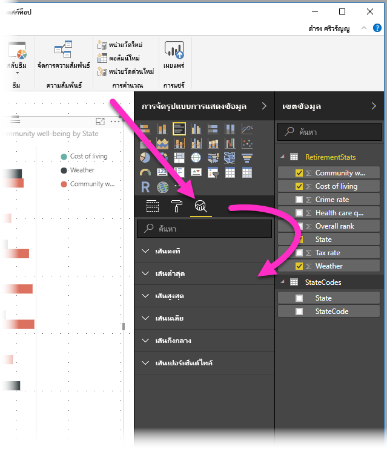
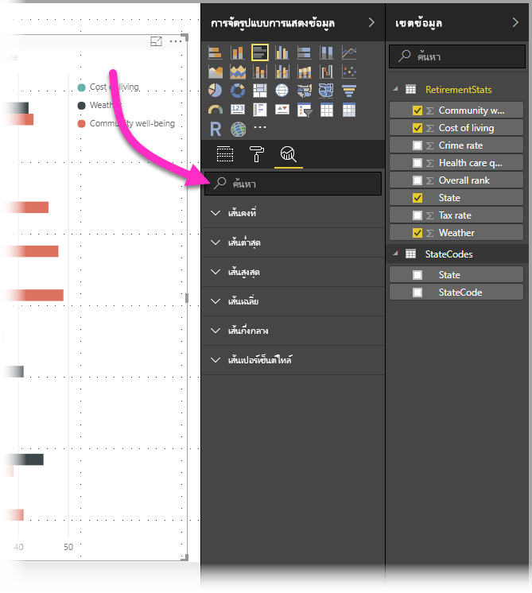
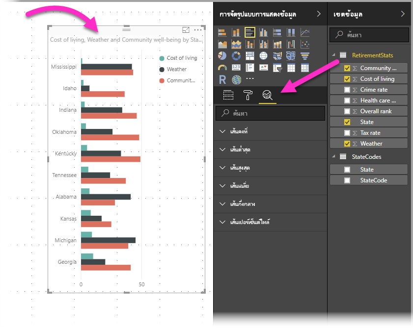
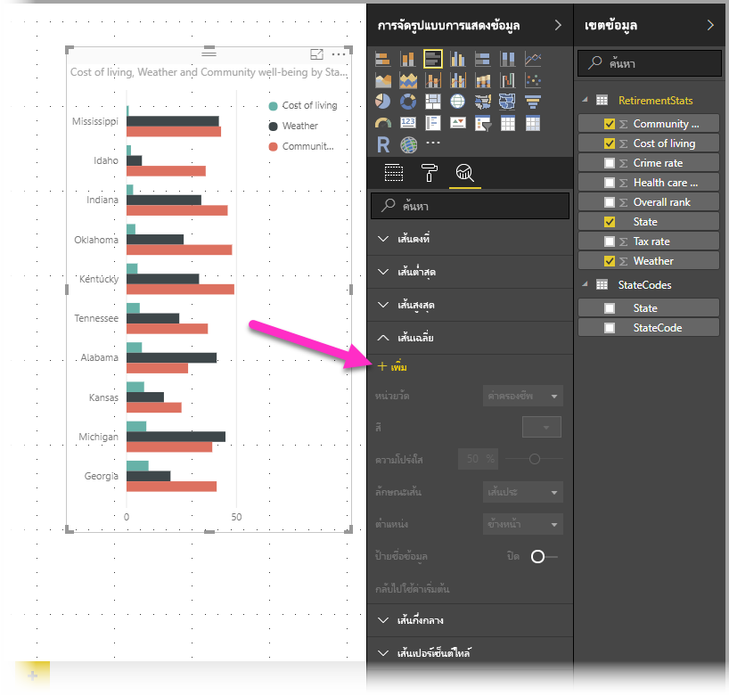

# การใช้บานหน้าต่างการวิเคราะห์ใน Power BI Desktop
ด้วยบานหน้าต่าง**การวิเคราะห์**ใน **Power BI Desktop** คุณสามารถเพิ่ม*สายการอ้างอิง*แบบไดนามิกกับวิชวล และเน้นให้เห็นแนวโน้มที่สำคัญหรือข้อมูลเชิงลึกได้ บานหน้าต่าง**การวิเคราะห์** จะอยู่ในบริเวณ**การจัดรูปแบบการแสดงข้อมูล**ของ Power BI Desktop

> [!NOTE]
> บานหน้าต่าง**การวิเคราะห์** จะปรากฏเฉพาะเมื่อคุณเลือกวิชวลบนพื้นที่ทำงานของ Power BI Desktop

## ค้นหาภายในบานหน้าต่างการวิเคราะห์
เริ่มตั้งแต่การเผยแพร่เดือนกุมภาพันธ์ 2018 ของ **Power BI Desktop** (รุ่น 2.55.5010.201 หรือใหม่กว่า) คุณสามารถค้นหาภายในบานหน้าต่าง**การวิเคราะห์** ซึ่งเป็นส่วนย่อยของบานหน้าต่าง**การจัดรูปแบบการแสดงข้อมูล** ดังที่แสดงในรูปด้านล่าง กล่องค้นหาปรากฏขึ้นเมื่อบานหน้าต่าง**การวิเคราะห์**ถูกเลือก

## การใช้บานหน้าต่างการวิเคราะห์
ด้วยบานหน้าต่าง**การวิเคราะห์** คุณสามารถสร้างสายการอ้างอิงแบบไดนามิกชนิดต่าง ๆ ต่อไปนี้ (สายการอ้างอิงที่มีให้เลือก ขึ้นอยู่กับชนิดของวิชวล):

* เส้นคงที่แกน X
* เส้นคงที่แกน Y
* เส้นต่ำสุด
* เส้นสูงสุด
* เส้นเฉลี่ย
* เส้นกึ่งกลาง
* เส้นเปอร์เซ็นต์ไทล์

ส่วนต่อไปนี้แสดงให้เห็นว่า คุณสามารถใช้บานหน้าต่าง**การวิเคราะห์** และสายการอ้างอิงแบบไดนามิกในการแสดงภาพของคุณได้อย่างไร

เพื่อดูรายการ สายการอ้างอิงแบบไดนามิก ที่มีสำหรับแต่ละวิชาล ทำตามขั้นตอนต่อไปนี้:

1. เลือกหรือสร้างวิชวล จากนั้นเลือกไอคอน**การวิเคราะห์** จากส่วน**การจัดรูปแบบการแสดงข้อมูล**
   
   
2. เลือกลูกศรลงสำหรับชนิดของเส้นที่คุณต้องการสร้าง เพื่อขยายตัวเลือก ในกรณีนี้ เราจะเลือก**เส้นเฉลี่ย**
   
   
3. เมื่อต้องการสร้างเส้นใหม่ เลือก **+ เพิ่ม** จากนั้นคุณสามารถระบุชื่อของเส้น โดยการคลิกสองครั้งที่กล่องข้อความ จาก นั้นพิมพ์ชื่อของคุณ
   
   คุณมีตัวเลือกมากมายสำหรับเส้นของคุณ เช่นการเลือก*สี*, *ความโปร่งใส*, *ลักษณะ* และ*ตำแหน่ง* (เทียบกับองค์ประกอบของวิชวล) และเลือกว่าจะมีป้ายชื่อหรือไม่ และที่สำคัญคือ คุณสามารถเลือกว่า เส้นที่คุณต้องการ สร้างจาก**หน่วยวัด**ไหนในวิชวล โดยการเลือกรายการดรอปดาวน์**หน่วยวัด** ซึ่งถูกเติมด้วยองค์ประกอบของข้อมูลจากวิชวลโดยอัตโนมัติ ในกรณีนี้ เราจะเลือก*สภาพอากาศ*เป็นหน่วยวัด และตั้งชื่อว่า*สภาพอากาศเฉลี่ย* และกำหนดตัวเลือกอื่น ๆ สองสามตัวตามที่แสดงด้านล่างนี้
   
   
4. ถ้าคุณต้องการให้ป้ายชื่อข้อมูลปรากฏ เลื่อนแถบเลื่อน**ป้ายชื่อข้อมูล**ไปเป็นเปิด เมื่อคุณทำเช่นนั้น คุณจะมีตัวเลือกสำหรับป้ายชื่อข้อมูลเพิ่มขึ้นอีก ดังที่แสดงในรูปต่อไปนี้
   
   
5. สังเกตว่ามีตัวเลขปรากฏถัดจากรายการ**เส้นเฉลี่ย**ในบานหน้าต่าง**การวิเคราะห์** ซึ่งบอกคุณว่ามีเส้นแบบไดนามิกแล้วกี่เส้นในวิชวลของคุณ และเป็นชนิดใดบ้าง ถ้าเราเพิ่ม**เส้นสูงสุด**สำหรับ*ค่าใช้จ่ายการดำรงชีพ* คุณสามารถเห็นที่บานหน้าต่าง**การวิเคราะห์**ว่า ตอนนี้เรายังมี**เส้นสูงสุด**แบบไดนามิกอีกหนึ่งเส้น ที่ใช้ในวิชวลนี้
   
   

ถ้าวิชวลที่คุณเลือกไม่สามารถมีสายการการอ้างอิงแบบไดนามิก (ในกรณีนี้ วิชวล**แผนที่**) คุณจะเห็นต่อไปนี้เมื่อคุณเลือกบานหน้าต่าง**การวิเคราะห์**

มีข้อมูลเชิงลึกหลากหลายที่น่าสนใจ ที่คุณสามารถเน้นได้โดยการสร้างสายการอ้างอิงแบบไดนามิก ด้วยบานหน้าต่าง**การวิเคราะห์**

เรากำลังวางแผนคุณลักษณะและความสามารถเพิ่มเติม รวมถึงขยายวิชวลที่สามารถมีสายการการอ้างอิงแบบไดนามิกได้ ดังนั้นโปรดกลับมาดูบ่อย ๆ ว่ามีอะไรใหม่

## การใช้พยากรณ์
คุณสามารถใช้คุณลักษณะ**พยากรณ์** โดยการเลือกวิชวลแบบ จากนั้นขยายส่วน**พยากรณ์**ของบานหน้าต่าง**การวิเคราะห์**ได้ คุณสามารถระบุค่ามากมายเพื่อปรับเปลี่ยนการพยากรณ์ เช่น *คาดการณ์ความยาว*, *ช่วงความเชื่อมั่น* ฯลฯ รูปต่อไปนี้แสดงวิชวลแผนภูมิเส้นพื้นฐานที่ใช้การพยากรณ์ แต่คุณสามารถใช้จินตนาการของคุณ (และเล่นกับคุณลักษณะ*พยากรณ์*) เพื่อดูว่าสามารถนำไปใช้กับรูปแบบข้อมูลของคุณอย่างไร

## ข้อจำกัด
ความสามารถในการใช้สายการอ้างอิงแบบไดนามิก จะขึ้นกับชนิดของวิชวลที่ใช้ รายการต่อไปนี้แสดงว่า สายการอ้างอิงแบบไดนามิกแบบไหนที่มีสำหรับวิชวลชนิดใด:

สายการอ้างอิงแบบไดนามิก สามารถใช้กับวิชวลต่อไปนี้ได้เต็มรูปแบบ:

* แผนภูมิพื้นที่
* แผนภูมิเส้น
* แผนภูมิกระจาย
* แผนภูมิกลุ่มคอลัมน์
* แผนภูมิแท่งแบบกลุ่ม

วิชวลต่อไปนี้สามารถใช้เฉพาะ*เส้นคงที่*จากบานหน้าต่าง**การวิเคราะห์**:

* แผนภูมิพื้นที่แบบเรียงซ้อน
* แผนภูมิแท่งแบบเรียงซ้อน
* แผนภูมิคอลัมน์แบบเรียงซ้อน
* แผนภูมิแท่งแบบเรียงซ้อน 100%
* แผนภูมิคอลัมน์แบบเรียงซ้อน 100%

สำหรับวิชวลต่อไปนี้ *เส้นแนวโน้ม*เป็นตัวเลือกเดียวในขณะนี้:

* แผนภูมิเส้นแบบไม่เรียงซ้อน
* แผนภูมิกลุ่มคอลัมน์

สุดท้าย วิชวลที่ไม่ใช่คาร์ทีเซียน ไม่สามารถใช้เส้นแบบไดนามิกจากในบานหน้าต่าง**การวิเคราะห์**ในขณะนี้ เช่น:

* เมทริกซ์
* แผนภูมิวงกลม
* แผนภูมิโดนัท
* ตาราง

เส้นเปอร์เซ็นต์ไทล์ มีใช้งานเฉพาะเมื่อใช้ข้อมูลที่นำเข้าใน **Power BI Desktop** หรือเมื่อเชื่อมต่อสดไปยังรูปแบบเซิร์ฟเวอร์ที่ติดตั้ง **Analysis Service 2016** หรือใหม่กว่า, **Azure Analysis Services** หรือชุดข้อมูลบนบริการของ Power BI 

## ขั้นตอนถัดไป
มีมากมายหลากหลายสิ่งที่คุณสามารถทำได้ด้วย Power BI Desktop สำหรับข้อมูลเพิ่มเติมเกี่ยวกับความความสามารถของกรุณาตรวจดูทรัพยากรต่อไปนี้

* [มีอะไรใหม่ใน Power BI Desktop](desktop-latest-update.md)
* [ดาวน์โหลด Power BI Desktop](desktop-get-the-desktop.md)
* [Power BI Desktop คืออะไร](desktop-what-is-desktop.md)
* [ภาพรวมคิวรี่กับ Power BI Desktop](desktop-query-overview.md)
* [ชนิดข้อมูลใน Power BI Desktop](desktop-data-types.md)
* [จัดรูปทรง และรวมข้อมูลด้วย Power BI Desktop](desktop-shape-and-combine-data.md)
* [งานคิวรี่ที่ใช้บ่อยใน Power BI Desktop](desktop-common-query-tasks.md)    

