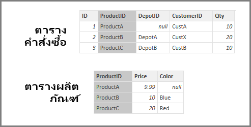
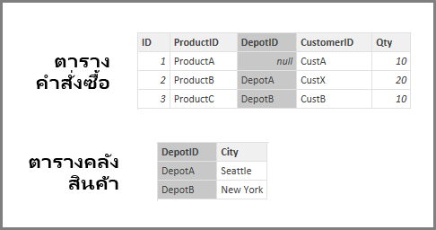
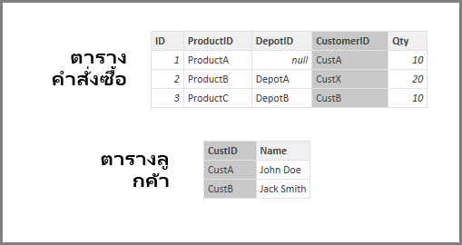

# ประมาณการตั้งค่า referential integrity ใน Power BI Desktop
เมื่อเชื่อมต่อกับแหล่งข้อมูลโดยใช้ **DirectQuery** คุณสามารถใช้การเลือก **ประมาณ Referential Integrity** เพื่อเปิดใช้งานการเรียกใช้แบบสอบถามที่มีปะสิทธิภาพมากยิ่งขึ้นกับแหล่งข้อมูลของคุณได้ คุณลักษณะนี้มีข้อกำหนดบางอย่างเกี่ยวกับข้อมูลต้นแบบ และจะพร้อมใช้งานเมื่อใช้ **DirectQuery**

การตั้งค่า **ประมาณ referential integrity** จะเปิดใช้งานแบบสอบถามบนแหล่งข้อมูลเพื่อใช้คำสั่ง **INNER JOIN**่ แทน **OUTER JOIN** ซึ่งช่วยปรับปรุงประสิทธิภาพแบบสอบถาม

## ข้อกำหนดสำหรับการใช้การประมาณ referential integrity
เป็นการตั้งค่าขั้นสูงและจะเปิดใช้งานเมื่อเชื่อมต่อกับข้อมูลโดยใช้ **DirectQuery** เท่านั้น ข้อกำหนดดังต่อไปนี้เป็นสิ่งจำเป็นสำหรับ **ประมาณ referential integrity** เพื่อให้ทำงานอย่างถูกต้อง:

* ข้อมูลในคอลัมน์ **From** ในความสัมพันธ์ไม่เป็น *Null*หรือ*ว่างเปล่า*
* สำหรับแต่ละค่าในคอลัมน์ **From** ไม่มีค่าที่สอดคล้องกันในคอลัมน์ **To**

ในบริบทนี้ คอลัมน์ **From** จะเป็นแบบ *กลุ่ม* ในความสัมพันธ์แบบ *หนึ่งต่อกลุ่ม* หรือเป็นคอลัมน์ในตารางแรกในความสัมพันธ์แบบ *หนึ่งต่อหนึ่ง*

## ข้อกำหนดสำหรับการใช้การประมาณ referential integrity
ตัวอย่างต่อไปนี้จะสาธิตลักษณะการทำงาน **ประมาณ referential integrity** เมื่อใช้ในการเชื่อมต่อข้อมูล ตัวอย่างการเชื่อมต่อกับแหล่งข้อมูลรวมถึงตาราง **Orders** ตาราง **Products** และตาราง **Depots**

1. ในรูปต่อไปนี้ที่แสดงในตาราง **Orders** และตาราง **Products** โปรดสังเกตว่า referential integrity จะเกิดขึ้นระหว่าง **Orders[ProductID]** กับ **Products[ProductID]** คอลัมน์ **[ProductID]** ในตาราง **Orders** จะไม่เป็น *Null* และทุกค่ายังปรากฏในตาราง **Products** ด้วย ดังนั้น **ประมาณ Referential Integrity** จึงควรถูกตั้งค่าเพื่อรับแบบสอบถามมีประสิทธิภาพมากขึ้น (การใช้การตั้งค่านี้จะไม่เปลี่ยนแปลงค่าที่แสดงในการแสดงผลด้วยภาพ)
   
   
2. ในภาพถัดไป จะสังเกตเห็นได้ว่า ไม่มี referential integrity เกิดขึ้นระหว่าง **Orders[DepotID]** กับ **Depots[DepotID]** เพราะ **DepotID** เป็น *Null* สำหรับบาง *Orders* ดังนั้น **ประมาณ Referential Integrity** จึงไม่ควร*ถูก*ตั้งค่า
   
   
3. ในตอนท้าย ไม่มีของ referential integrity เกิดขึ้นระหว่าง **Orders[CustomerID]** กับ **Customers[CustID]** ในตารางดังต่อไปนี้ กล่าวคือ **CustomerID** จะมีบางค่า (ในกรณีนี้ ได้แก่ *CustX*) ซึ่งไม่เกิดขึ้นในตาราง *Customers* ดังนั้น **ประมาณ Referential Integrity** จึงไม่ควร*ถูก*ตั้งค่า
   
   

## การตั้งค่าการประมาณ Referential Integrity
เมื่อต้องการเปิดใช้งานคุณลักษณะนี้ เลือกกล่องกาเครื่องหมายถัดจาก **ประมาณ Referential Integrity**ดังที่แสดงในภาพต่อไปนี้

เมื่อเลือกแล้ว การตั้งค่าก็จะถูกตรวจสอบกับข้อมูลเพื่อให้แน่ใจว่า ไม่มี *Null* หรือแถวที่ไม่ตรงกัน *อย่างไรก็ตาม* สำหรับกรณีที่มีจำนวนค่ามาก การตรวจสอบจะไม่สามารถรับประกันได้ว่า ไม่มีปัญหาใด ๆ เกี่ยวกับ referential integrity

นอกจากนี้ การตรวจสอบจะเกิดขึ้นในเวลาที่มีการแก้ไขความสัมพันธ์ และจะ*ไม่*แสดงการเปลี่ยนแปลงใด ๆ กับข้อมูลในภายหลัง

## จะเกิดอะไรขึ้นถ้าคุณตั้งค่าการประมาณ referential integrity ไม่ถูกต้อง
ถ้าคุณตั้งค่า **ประมาณ Referential Integrity** เมื่อไม่มีปัญหา referential integrity ในข้อมูล สิ่งนี้จะไม่ส่งผลให้เกิดข้อผิดพลาด อย่างไรก็ตาม จะส่งผลให้เกิดความไม่สอดคล้องกันของข้อมูล ตัวอย่างเช่น ในกรณีของความสัมพันธ์กับตาราง **Depots** ที่อธิบายไว้ข้างต้น อาจส่งผลดังต่อไปนี้:

* การแสดงผลด้วยภาพซึ่งแสดง *Order Qty* รวมจะแสดงค่า 40
* การแสดงผลด้วยภาพซึ่งแสดง *Order Qty by Depot City* รวมจะแสดงค่าผลรวมเฉพาะ *30* เนื่องจากนั้นไม่รวม Order ID 1 ซึ่ง **DepotID** เป็น *Null*

## ขั้นตอนถัดไป
เรียนรู้เพิ่มเติมเกี่ยวกับ [DirectQuery](desktop-use-directquery.md)

รับข้อมูลเพิ่มเติมเกี่ยวกับ [ความสัมพันธ์ใน Power BI](desktop-create-and-manage-relationships.md)

เมื่อต้องการเรียนรู้เพิ่มเติม ดู [มุมมองความสัมพันธ์ใน Power BI Desktop](desktop-relationship-view.md)

