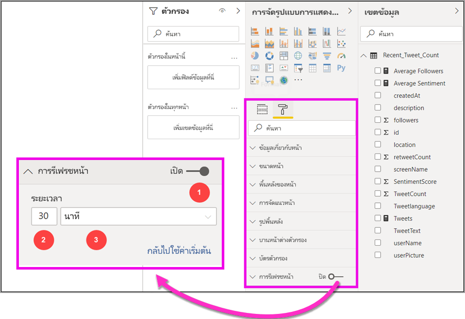
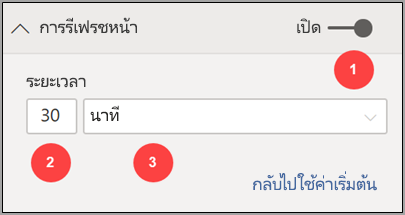
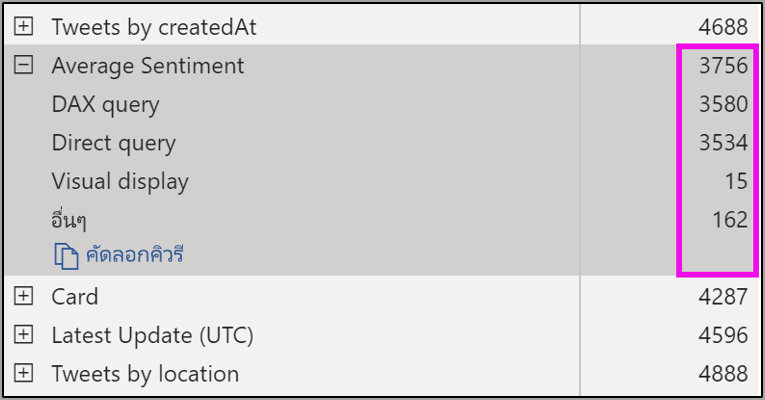
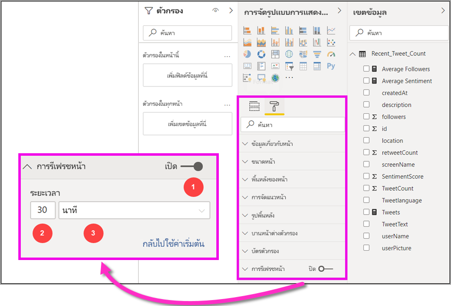

# การรีเฟรชหน้าอัตโนมัติใน Power BI Desktop (ตัวอย่าง)

เมื่อตรวจสอบเหตุการณ์ที่สำคัญ การรีเฟรชข้อมูลทันทีที่แหล่งข้อมูลได้รับการอัปเดตเป็นสิ่งสำคัญ ตัวอย่างเช่นในอุตสาหกรรมการผลิตเป็นสิ่งสำคัญที่ต้องทราบเมื่อเครื่องชำรุดหรือใกล้ถึงเวลาสำหรับซ่อมบำรุง

ฟีเจอร์การรีเฟรชหน้าอัตโนมัติ (APR) ใน Power BI จะช่วยให้สามารถสอบถามหน้ารายงานที่ใช้งานอยู่ของคุณสำหรับข้อมูลใหม่ได้โดยมีการดำเนินการที่กำหนดไว้ล่วงหน้าสำหรับ [แหล่งที่มาของ DirectQuery](https://docs.microsoft.com/power-bi/desktop-directquery-about)

## การรีเฟรชเพจอัตโนมัติ

สำหรับรุ่นตัวอย่างนี้คุณต้องเปิดใช้งานคุณลักษณะการรีเฟรชหน้าอัตโนมัติใน Power BI Desktop ไปยัง**ไฟล์ > ตัวเลือกและการตั้งค่า** จากนั้นเลือก **ตัวเลือก** แล้ว เลือก**แสดงตัวอย่างคุณลักษณะ**ในบานหน้าต่างด้านซ้าย เปิดใช้งานคุณลักษณะโดยการเลือกกล่องกาเครื่องหมายด้านข้าง *การรีเฟรชหน้าอัตโนมัติ* การรีเฟรชหน้าอัตโนมัติสามารถใช้ได้เฉพาะแหล่งข้อมูล DirectQuery เท่านั้น

หากต้องการใช้การรีเฟรชหน้าอัตโนมัติให้เลือกหน้ารายงานที่คุณต้องการเปิดใช้งานการรีเฟรช ในบานหน้าต่าง **Visualizations**  เลือกไอคอน **Formatting** (ลูกกลิ้งทาสี) และค้นหา **หน้าที่ต้องการรีเฟรช**  ใกล้กับด้านล่างของบานหน้าต่าง 

รูปภาพต่อไปนี้แสดงการ์ด**การรีเฟรชหน้า** คำอธิบายสำหรับองค์ประกอบที่มีลำดับเลขที่ได้อธิบายไว้ในสองสามย่อหน้าถัดไป:

1.    ตัวเลื่อนการรีเฟรชหน้าอัตโนมัติ-เปิดหรือปิดการรีเฟรชหน้า
2.    ค่าตัวเลขการรีเฟรชหน้าสำหรับช่วงเวลาการรีเฟรช
3.    หน่วยช่วงเวลาการรีเฟรชหน้าสำหรับการรีเฟรชหน้า

ตรงนี้คุณสามารถเปิดการรีเฟรชหน้าและเลือกระยะเวลาการรีเฟรช ค่าเริ่มต้นคือ 30 นาทีและช่วงการรีเฟรชต่ำสุดคือหนึ่งวินาที) รายงานของคุณจะเริ่มต้นการรีเฟรชตามช่วงเวลาที่คุณตั้งค่า 

## การกำหนดช่วงการรีเฟรชหน้า

เมื่อเปิดใช้งานการรีเฟรชหน้าอัตโนมัติ Power BI Desktop จะมีการส่งคิวรีไปยังแหล่งข้อมูล DirectQuery อย่างต่อเนื่อง จะมีการหน่วงเวลาระหว่างคิวรีที่ถูกส่งและรับข้อมูลที่ส่งกลับดังนั้นสำหรับช่วงเวลาการรีเฟรชสั้นๆ คุณควรยืนยันว่าคิวรีจะส่งกลับข้อมูลที่ถูกถามภายในช่วงเวลาที่กำหนดเรียบร้อยแล้ว ถ้าข้อมูลไม่ได้ถูกส่งกลับภายในช่วงเวลาที่คุณกำหนด หมายความว่าคุณสร้างสถานการณ์ที่วิชวลมีการอัปเดตน้อยกว่าที่กำหนดค่าไว้

แนวทางปฏิบัติที่ดีที่สุดคือควรตั้งค่าช่วงเวลาการรีเฟรชให้ตรงกับอัตราการเข้าถึงข้อมูลใหม่ของคุณที่คาดไว้:

* ถ้าข้อมูลใหม่มาถึงแหล่งข้อมูลที่มาทุก 20 นาทีช่วงเวลาการรีเฟรชของคุณต้องไม่น้อยกว่า 20 นาที 

* ถ้าข้อมูลใหม่มาถึงทุกวินาทีแล้วช่วงเวลาควรตั้งค่าเป็นหนึ่งวินาที 

สำหรับช่วงเวลาการรีเฟรช เช่น หนึ่งวินาที คุณควรพิจารณาประเภทแหล่งข้อมูลการสอบถามโดยตรง การโหลดการสอบถามของคุณที่สร้างขึ้นสำหรับช่วงดังกล่าว ระยะห่างของผู้ชมรายงานของคุณจากศูนย์ข้อมูลความจุและอื่น ๆ 

คุณสามารถประมาณค่านี้โดยใช้ตัววิเคราะห์ประสิทธิภาพใน Power BI Desktop ซึ่งช่วยให้คุณยืนยันว่าแต่ละแบบสอบถามภาพมีเวลาเพียงพอที่จะส่งกลับมาพร้อมกับผลลัพธ์จากแหล่งที่มาและเวลาที่ใช้ คุณสามารถปรับปรุงและทำการเปลี่ยนแปลงไปยังแหล่งข้อมูลหรือคุณสามารถทดลองใช้วิชวลและหน่วยวัดอื่นๆในรายงานของคุณได้ขึ้นอยู่กับผลลัพธ์ของตัววิเคราะห์ประสิทธิภาพ

รูปภาพต่อไปนี้แสดงผลลัพธ์ของ DirectQuery ในตัววิเคราะห์ประสิทธิภาพ:

มาพิจารณาคุณลักษณะอื่น ๆ เกี่ยวกับแหล่งข้อมูลนี้กัน 

1.    ข้อมูลมาถึงในอัตราสองวินาที 
2.    ตัววิเคราะห์ประสิทธิภาพแสดงแบบสอบถามสูงสุด + เวลาการแสดงผลประมาณ 4.9 วินาที (4688 มิลลิวินาที) 
3.    แหล่งข้อมูลได้รับการกำหนดค่าเพื่อจัดการการสอบถามที่เกิดขึ้นพร้อมกันโดยประมาณ 1000 ต่อวินาที 
4.    คุณหวังว่าให้ผู้ใช้ประมาณ 10 คนสามารถดูรายงานที่พร้อมกันได้

เพื่อให้ได้ผลลัพธ์ดังต่อไปนี้:

* **5 วิชวล x 10 ผู้ใช้ = 50 คิวรีโดยประมาณ**

การคำนวณนี้จะส่งผลให้มีการโหลดมากขึ้นกว่าแหล่งข้อมูลที่สามารถรองรับได้ ข้อมูลมาถึงในอัตราสองวินาทีดังนั้นควรเป็นอัตราการรีเฟรชของคุณ อย่างไรก็ตามเนื่องจากคิวรีใช้เวลาประมาณห้าวินาทีในการดำเนินการให้เสร็จสมบูรณ์ เราควรตั้งค่าให้มากกว่าห้าวินาที 

โปรดทราบไว้ด้วยว่าผลลัพธ์นี้อาจแตกต่างจากที่คุณเผยแพร่รายงานไปยังบริการเนื่องจากรายงานจะใช้อินสแตนซ์ Analysis Services ที่โฮสต์อยู่ในระบบคลาวด์ คุณอาจต้องการปรับอัตราการรีเฟรชของคุณตามลำดับ 

ไปยังบัญชีสำหรับแบบสอบถามและระยะเวลาการรีเฟรช Power BI จะเรียกใช้คิวรีรีเฟรชถัดไปเมื่อคิวรีรีเฟรชที่เหลือทั้งหมดเสร็จสมบูรณ์ ดังนั้นแม้ว่าช่วงการรีเฟรชของคุณจะสั้นกว่าเวลาคิวรีของคุณที่ใช้ในการประมวลผล Power BI จะรีเฟรชอีกครั้งเมื่อคิวรีที่เหลือเสร็จสมบูรณ์ 

ลองดูที่วิธีที่คุณสามารถตรวจสอบและวิเคราะห์ปัญหาด้านประสิทธิภาพการทำงานในฐานะแอดมินผู้ดูแลความจุ นอกจากนี้คุณยังสามารถตรวจสอบ **คำถามที่พบบ่อยเกี่ยวกับการรีเฟรชหน้าอัตโนมัติ**  ในบทความนี้สำหรับคำถามเพิ่มเติมและคำตอบเกี่ยวกับประสิทธิภาพการทำงานและการแก้ไขปัญหา

## การรีเฟรชหน้าอัตโนมัติใน Power BI Desktop (ตัวอย่าง)

คุณยังสามารถตั้งค่าช่วงการรีเฟรชหน้าอัตโนมัติสำหรับรายงานที่ถูกสร้างขึ้นใน Power BI Desktop และเผยแพร่ไปยังบริการของ Power BI 

การรีเฟรชหน้าอัตโนมัติสำหรับรายงานในบริการของ Power BI ได้รับการกำหนดค่าด้วยขั้นตอนที่คล้ายกับการกำหนดค่าใน Power BI Desktop เมื่อกำหนดค่าในบริการของ Power BI การรีเฟรชหน้าโดยอัตโนมัติยังสนับสนุนเนื้อหา [Power BI แบบฝังตัว](developer/embedded/embedding.md) รูปภาพต่อไปนี้แสดงการกำหนดค่า **การรีเฟรชหน้า**  สำหรับบริการของ Power BI:

1.    ตัวเลื่อนการรีเฟรชหน้าอัตโนมัติ-เปิดหรือปิดการรีเฟรชหน้า
2.    ค่าตัวเลขการรีเฟรชหน้าสำหรับช่วงเวลาการรีเฟรชต้องเป็นตัวเลขจำนวนเต็ม
3.    หน่วยช่วงเวลาการรีเฟรชหน้าสำหรับการรีเฟรชหน้า

### ช่วงเวลาของการรีเฟรชหน้า

ช่วงเวลาการรีเฟรชหน้าสามารถทำให้บริการของ Power BI ได้รับผลกระทบจากชนิดพื้นที่ทำงานของรายงาน ซึ่งจะนำไปใช้กับรายงานต่อไปนี้ทั้งหมด:

* การเผยแพร่รายงานลงในพื้นที่ทำงานที่มีการเปิดใช้งานการรีเฟรชหน้าอัตโนมัติ
* การแก้ไขช่วงเวลาการรีเฟรชหน้าในพื้นที่ทำงานแล้ว
* การสร้างรายงานโดยตรงในบริการ

Power BI Desktop ไม่มีข้อจำกัดสำหรับช่วงเวลาการรีเฟรช ช่วงการรีเฟรชอาจเป็นแบบที่ใช้บ่อยเป็นประจำทุกวินาที อย่างไรก็ตามเมื่อมีการเผยแพร่รายงานไปยังบริการของ Power BI ข้อจำกัดบางอย่างจะถูกนำไปใช้และอธิบายไว้ในส่วนต่อไปนี้

### ข้อจำกัดเกี่ยวกับช่วงเวลาการรีเฟรช

ในการบริการของ Power BI ข้อจำกัดการรีเฟรชหน้าโดยอัตโนมัติจะใช้ตามปัจจัยเช่นพื้นที่ทำงานและไม่ว่าจะใช้บริการแบบพรีเมียมหรือไม่

หากต้องการชี้แจงวิธีการทำงาน เริ่มต้นด้วยความรู้พื้นฐานบางอย่างเกี่ยวกับความจุและพื้นที่ทำงาน:

**ความจุ**คือรากฐานของ Power BI หลักที่แสดงถึงชุดของทรัพยากร (ที่เก็บข้อมูล ตัวประมวลผล และหน่วยความจำ) ที่ใช้เพื่อโฮสต์ และนำเสนอเนื้อหาของ Power BI ความจุเป็นได้ทั้งความจุที่ใช้ร่วมกันหรือความจุเฉพาะ **ความจุที่ใช้ร่วมกัน**คือความจุที่ใช้ร่วมกับลูกค้าคนอื่น ๆ ของ Microsoft ขณะที่**ความจุเฉพาะ**เป็นความจุที่ใช้กับลูกค้าคนเดียว ความจุเฉพาะจะนำเสนออยู่ในบทความ[การจัดการความจุแบบพรีเมียม](service-premium-capacity-manage.md)

ในความจุที่ใช้ร่วมกัน ปริมาณงานจะทำงานบนแหล่งทรัพยากรเชิงคำนวณที่ใช้ร่วมกับลูกค้าคนอื่น ๆ เมื่อความจุต้องใช้ทรัพยากรร่วมกัน ขีดจำกัดจะถูกกำหนดไว้เพื่อให้แน่ใจว่า*fair play* เช่น การตั้งค่าขนาดแบบจำลองสูงสุด (1 GB) และความถี่ในการรีเฟรชรายวันสูงสุด (แปดครั้งต่อวัน)

**พื้นที่ทำงาน** Power BI อยู่ภายในความจุ และแสดงถึงความปลอดภัย การทำงานร่วมกัน และการปรับใช้คอนเทนเนอร์ ผู้ใช้ Power BI แต่ละคนมีพื้นที่ทำงานส่วนบุคคลเรียกว่า**พื้นที่ทำงานของฉัน** สามารถสร้างพื้นที่ทำงานเพิ่มเติมเพื่อช่วยในการทำงานร่วมกันและการปรับใช้ และพื้นที่เหล่านี้เรียกว่า**พื้นที่ทำงาน** ตามค่าเริ่มต้นพื้นที่ทำงาน รวมถึงพื้นที่ทำงานส่วนบุคคลจะถูกสร้างขึ้นใน**ความจุที่ใช้ร่วมกัน**

ต่อไปนี้คือรายละเอียดสำหรับสถานการณ์พื้นที่ทำงานสองตัว:

**พื้นที่ทำงานที่ใช้ร่วมกัน** -สำหรับพื้นที่ทำงานปกติ (พื้นที่ทำงานที่ไม่ได้เป็นส่วนหนึ่งของความจุพรีเมียม) การรีเฟรชหน้าอัตโนมัติใช้ช่วงเวลาอย่างน้อย 30 นาที (ช่วงเวลาต่ำสุดที่สามารถอนุญาตได้)

**พื้นที่ทำงานแบบพรีเมียม** -การรีเฟรชหน้าอัตโนมัติที่มีอยู่ในพื้นที่ทำการแบบพรีเมียม จะขึ้นอยู่กับการตั้งค่าปริมาณข้อมูลผู้ดูแลพรีเมียมของคุณได้รับการตั้งค่าสำหรับความจุ Power BI พรีเมียม มีสองตัวแปรที่อาจส่งผลกระทบต่อความสามารถของคุณในการตั้งค่าการรีเฟรชหน้าอัตโนมัติ:

 1. *ฟีเจอร์การเปิด/ปิด* : ถ้าผู้ดูแลระบบความจุของคุณได้ตัดสินใจที่จะปิดใช้งานคุณลักษณะนี้คุณจะไม่สามารถตั้งค่าการรีเฟรชหน้าชนิดใดก็ได้ในรายงานที่เผยแพร่แล้วของคุณ

 2. *ช่วงการรีเฟรชต่ำสุด* : เมื่อเปิดใช้งานคุณลักษณะผู้ดูแลระบบความจุของคุณต้องตั้งค่าช่วงเวลาการรีเฟรชต่ำสุด ถ้าช่วงเวลาของคุณต่ำกว่าค่าต่ำสุดบริการของ Power BI ระบบจะแทนที่การตั้งค่าช่วงเวลาของคุณเพื่อให้เป็นไปตามช่วงเวลาต่ำสุดที่กำหนดโดยผู้ดูแลระบบความจุของคุณ

ตารางด้านล่างจะอธิบายรายละเอียดเพิ่มเติมที่คุณลักษณะนี้พร้อมใช้งานและขีดจำกัดสำหรับแต่ละชนิดความจุและ [โหมดการจัดเก็บข้อมูล](service-dataset-modes-understand.md)

| โหมดการจัดเก็บข้อมูล | ความจุเฉพาะ | ความจุที่ใช้ร่วมกัน |
| --- | --- | --- |
| คิวรีโดยตรง | **รองรับ** - ใช่  **ช่วงเวลาการรีเฟรชต่ำสุด** - 1 วินาที  **การแทนที่ผู้ดูแลกำลังการผลิต**  –ใช่ | **รองรับ** - ใช่  **ช่วงเวลาการรีเฟรชต่ำสุด** - 30 นาที  **การแทนที่ผู้ดูแลกำลังการผลิต**  –ไม่ |
| นำเข้า | **รองรับ** - ไม่  **ช่วงเวลาการรีเฟรชต่ำสุด** - ไม่มี  **การแทนที่ผู้ดูแลกำลังการผลิต**  –ไม่มี | **รองรับ** - ไม่  **ช่วงเวลาการรีเฟรชต่ำสุด** - ไม่มี  **การแทนที่ผู้ดูแลกำลังการผลิต**  –ไม่มี |
| โหมดผสม (DQ + อื่นๆ) | **รองรับ** - ใช่  **ช่วงเวลาการรีเฟรชต่ำสุด** - 1 วินาที  **การแทนที่ผู้ดูแลกำลังการผลิต**  –ใช่ | **รองรับ** - ใช่  **ช่วงเวลาการรีเฟรชต่ำสุด** - 30 นาที  **การแทนที่ผู้ดูแลกำลังการผลิต**  –ไม่ |
| เชื่อมต่อแบบไลฟ์สด AS | **รองรับ** - ไม่  **ช่วงเวลาการรีเฟรชต่ำสุด** - ไม่มี  **การแทนที่ผู้ดูแลกำลังการผลิต**  –ไม่มี | **รองรับ** - ไม่  **ช่วงเวลาการรีเฟรชต่ำสุด** - ไม่มี  **การแทนที่ผู้ดูแลกำลังการผลิต**  –ไม่มี |
| เชื่อมต่อแบบไลฟ์สด PBI | **รองรับ** - ไม่  **ช่วงเวลาการรีเฟรชต่ำสุด** - ไม่มี  **การแทนที่ผู้ดูแลกำลังการผลิต**  –ไม่มี | **รองรับ** - ไม่  **ช่วงเวลาการรีเฟรชต่ำสุด** - ไม่มี  **การแทนที่ผู้ดูแลกำลังการผลิต**  –ไม่มี |

> [!NOTE]
> เมื่อเผยแพร่รายงานที่เปิดใช้งานการรีเฟรชหน้าอัตโนมัติของคุณจาก Power BI Desktop ไปยังบริการคุณจะต้องใส่ข้อมูลประจำตัวสำหรับแหล่งข้อมูล DirectQuery ในเมนูการตั้งค่าชุดข้อมูล

## ข้อควรพิจารณาและข้อจำกัด

มีบางสิ่งที่ควรทราบเมื่อใช้การรีเฟรชหน้าอัตโนมัติใน Power BI Desktop หรือในบริการของ Power BI

* การนำเข้าโหมดที่เก็บข้อมูล LiveConnect และ Push ไม่รองรับการรีเฟรชหน้าอัตโนมัติ  
* โมเดลแบบรวมที่มีแหล่งข้อมูล DirectQuery อย่างน้อยหนึ่งรายการมีการรองรับ
* Power BI Desktop ไม่มีข้อจำกัดสำหรับช่วงเวลาการรีเฟรชซึ่งสามารถทำได้บ่อยเป็นประจำทุกวินาที เมื่อมีการเผยแพร่รายงานไปยังบริการของ Power BI ข้อจำกัดบางอย่างจะถูกนำไปใช้ตามอธิบายไว้ในเอกสารก่อนหน้านี้

### การวินิจฉัยประสิทธิภาพ

การรีเฟรชหน้าอัตโนมัติมีประโยชน์สำหรับการตรวจสอบสถานการณ์สมมติและสำรวจข้อมูลที่มีการเปลี่ยนแปลงอย่างรวดเร็ว อย่างไรก็ตามในบางครั้งการดำเนินการนี้สามารถโหลดสิ่งที่ไม่ควรมีในแหล่งความจุหรือข้อมูล

หากต้องการป้องกันไม่ให้โหลดในแหล่งข้อมูล Power BI มีการป้องกันดังต่อไปนี้:

1. คิวรีการรีเฟรชหน้าอัตโนมัติทั้งหมดทำงานที่ระดับความสำคัญ **ต่ำกว่า** เพื่อให้แน่ใจว่าคิวรี่แบบโต้ตอบ (เช่นการโหลดเพจและการกรองข้ามการแสดงผลด้วยภาพ) จะทำให้เกิดความสำคัญ
2. ถ้าคิวรีของคุณไม่เสร็จสิ้นก่อนรอบการรีเฟรชครั้งถัดไป Power BI จะไม่ดำเนินการคิวรีรีเฟรชใหม่จนกว่าคิวรีก่อนหน้าจะเสร็จสมบูรณ์ ตัวอย่างเช่นถ้าคุณมีช่วงเวลาการรีเฟรชของหนึ่งวินาทีและคิวรีของคุณโดยเฉลี่ยใช้เวลาสี่วินาที Power BI จะรันคิวรีอย่างมีประสิทธิภาพในทุกๆ สี่วินาที

มีสองพื้นที่ที่คุณยังคงพบปัญหาคอขวดประสิทธิภาพการทำงาน:

1. **กำลังการผลิต:** คิวรีแรกที่เข้ามาในความจุพรีเมียมซึ่งจะพับและประเมินคิวรี DAX ที่สร้างขึ้นจากการแสดงภาพรายงานลงในคิวรีต้นทาง
2. **แหล่งข้อมูลคิวรีโดยตรง:** คิวรีที่มีการแปลในขั้นตอนก่อนหน้านี้จะเรียกใช้กับแหล่งที่มา นี่จะเป็นเซิร์ฟเวอร์ SQL ของคุณแหล่งข้อมูล SAP Hana และอื่นๆ

การใช้[แอปการวัดพรีเมียม](service-admin-premium-monitor-capacity.md) พร้อมใช้สำหรับผู้ดูแลระบบคุณสามารถแสดงภาพความจุของการใช้คิวรีที่มีความสำคัญต่ำได้เท่านั้น

คิวรีที่มีลำดับความสำคัญต่ำประกอบด้วยคิวรีรีเฟรชหน้าอัตโนมัติและการรีเฟรชคิวรี ในขณะนี้ยังไม่มีวิธีการแยกความแตกต่างระหว่างการโหลดจากการรีเฟรชหน้าอัตโนมัติและการรีเฟรชคิวรี

ถ้าคุณสังเกตเห็นว่าความจุของคุณจะมีการโอเวอร์โหลดคิวรีที่มีลำดับความสำคัญต่ำ คุณสามารถดำเนินการบางอย่างได้:

1. การขอ SKU พรีเมียมที่มีขนาดใหญ่ขึ้น
2. ติดต่อเจ้าของรายงานและขอให้ลดช่วงเวลาการรีเฟรช
3. ในพอร์ทัลผู้ดูแลกำลังการผลิตคุณสามารถ:
  1. ปิดการรีเฟรชหน้าอัตโนมัติสำหรับความจุนั้น
  2. เพิ่มช่วงเวลาการรีเฟรชต่ำสุดซึ่งจะส่งผลกระทบต่อรายงานทั้งหมดบนความจุนั้น

### คำถามที่ถามบ่อย

ส่วนนี้แสดงคำถามทั่วไปและคำตอบสำหรับ 

1. ฉันเป็นผู้สร้างรายงาน ฉันได้กำหนดช่วงการรีเฟรชรายงานของฉันไปเป็น 1 วินาที บนเดสก์ท็อปแต่หลังจากที่เผยแพร่รายงานของฉันไม่ได้รับการรีเฟรชในบริการ

    * ตรวจสอบว่ารีเฟรชหน้าอัตโนมัติถูกเปิดใช้งานสำหรับหน้าเพจ เนื่องจากการตั้งค่านี้เป็นไปตามหน้าเพจ คุณจำเป็นต้องตรวจสอบให้แน่ใจว่ามีการเปิดใช้งานสำหรับแต่ละหน้าในรายงานที่คุณจะต้องการรีเฟรช
    * ตรวจสอบว่าคุณอัปโหลดไปยังพื้นที่ทำงานด้วยความจุพรีเมียมที่แนบมา หากไม่ใช่แล้วช่วงการรีเฟรชของคุณจะถูกล็อกที่ 30 นาที
    * ถ้ารายงานของคุณอยู่ในพื้นที่ทำงานพรีเมียมให้ตรวจสอบกับผู้ดูแลระบบของคุณว่าพวกเขาได้เปิดใช้งานคุณลักษณะนี้สำหรับความจุที่แนบมาหรือไม่ นอกจากนี้ตรวจสอบให้แน่ใจว่าช่วงเวลาการรีเฟรชต่ำสุดสำหรับความจุต่ำกว่าหรือเหมือนกับรายงานของคุณ

2. ฉันคือผู้ดูแลความจุ ฉันเปลี่ยนการตั้งค่าช่วงการรีเฟรชหน้าอัตโนมัติของฉันแต่ยังไม่มีการโต้ตอบกลับแต่อย่างใด ในอีกทางหนึ่ง รายงานยังคงรีเฟรชในอัตราที่ระบบไม่ควรทำหรือไม่มีการรีเฟรชแม้ว่าฉันจะเปิดใช้งาน

    * การเปลี่ยนแปลงการตั้งค่าการรีเฟรชหน้าอัตโนมัติที่ทำใน UI ผู้ดูแลระบบความจุใช้เวลาถึง 5 นาทีในการเผยแพร่ไปยังรายงาน
    * นอกเหนือจากการเปิดการรีเฟรชหน้าอัตโนมัติสำหรับความจุคุณยังจำเป็นต้องเปิดใช้งานสำหรับหน้าของรายงานที่คุณต้องการดู

3. รายงานของฉันมีการดำเนินการในโหมดผสม (DQ + อิมพอร์ต) ภาพทั้งหมดไม่ได้รับการรีเฟรช

    * ถ้ามีการนำเข้าการอ้างอิงวิชวลตารางนั่นแปลว่าเป็นไปตามที่คาดหวังไว้ การรีเฟรชหน้าอัตโนมัติไม่ได้รับการรองรับสำหรับการนำเข้า
    * ดูคำถามที่ 1 ในส่วนนี้

4. รายงานของฉันได้รับการรีเฟรชอย่างละเอียดในบริการแล้วหยุดทำงานอย่างกะทันหัน

    * ลองรีเฟรชหน้าเพื่อดูว่าปัญหาสามารถแก้ไขได้หรือไม่
    * ตรวจสอบกับผู้ดูแลระบบความจุของคุณเนื่องจากอาจปิดใช้งานคุณลักษณะหรือยกช่วงการรีเฟรชต่ำสุด (ดูคำถามที่ 2)

5. ฉันเป็นผู้สร้างรายงาน วิชวลของฉันไม่ได้รับการรีเฟรชในจังหวะที่ฉันระบุ ระบบจะมีการรีเฟรชในอัตราที่ช้าลง

    * ถ้าคิวรีของคุณใช้เวลานานในการดำเนินการช่วงการฟื้นตัวของคุณจะล่าช้า การรีเฟรชหน้าอัตโนมัติจะรอให้การเรียกใช้ทั้งหมดสิ้นสุดลงก่อนที่จะเรียกใช้งานใหม่
    * ผู้ดูแลระบบความจุของคุณอาจตั้งค่าช่วงการรีเฟรชต่ำสุดที่สูงกว่าที่คุณกำหนดรายงานของคุณ ติดต่อผู้ดูแลระบบความจุของคุณและขอให้ลดลง

6. แบบสอบถามรีเฟรชหน้าอัตโนมัติทำหน้าที่จากแคชหรือไม่?

    * ไม่มีแบบสอบถามรีเฟรชหน้าอัตโนมัติทั้งหมดโดยส่งข้อมูลที่แคชไว้ใดๆ

## ขั้นตอนถัดไป

สำหรับข้อมูลเพิ่มเติม ให้ดูบทความต่อไปนี้:

* [การใช้ DirectQuery ใน Power BI](desktop-directquery-about.md)
* [ใช้ตัววิเคราะห์ประสิทธิภาพในการตรวจสอบประสิทธิภาพขององค์ประกอบรายงาน](desktop-performance-analyzer.md)
* [การปรับใช้งานและการจัดการความจุของ Power BI Premium](guidance/whitepaper-powerbi-premium-deployment.md)
* [แหล่งข้อมูลใน Power BI Desktop](desktop-data-sources.md)
* [จัดรูปทรงและรวมข้อมูลด้วย Power BI Desktop](desktop-shape-and-combine-data.md)
* [เชื่อมต่อกับเวิร์กบุ๊ก Excel ใน Power BI Desktop](desktop-connect-excel.md)   
* [ป้อนข้อมูลลงใน Power BI Desktop โดยตรง](desktop-enter-data-directly-into-desktop.md)   
