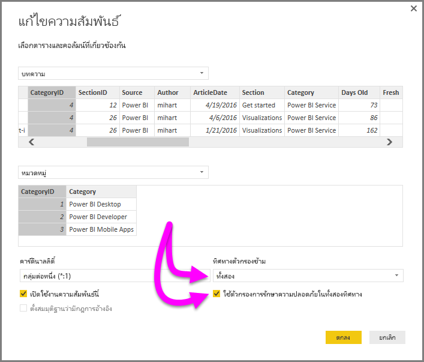

# การกรองข้ามแบบสองทิศทางในด้วย DirectQuery ใน Power BI Desktop

เมื่อต้องการกรองตารางเพื่อสร้างมุมมองที่เหมาะสมของข้อมูล ผู้สร้างรายงาน (และผู้จัดรูปแบบข้อมูล) เผชิญความท้าทายเมื่อกำหนดว่าจะทำการกรองรายงานอย่างไร บริบทตัวกรองของตารางถูกกำหนดบนด้านหนึ่งของความสัมพันธ์ แต่ไม่ใช้กับอีกด้าน ซึ่งมักต้องใช้สูตร DAX ที่ซับซ้อนเพื่อให้ได้ผลลัพธ์ที่ต้องการ

ด้วยการกรองข้ามแบบสองทิศทาง ผู้สร้างรายงาน (และผู้จัดรูปแบบข้อมูล) สามารถควบคุมการใช้ตัวกรองเมื่อทำงานกับตารางที่เกี่ยวข้อง ช่วยให้สามารถใช้งานตัวกรองเหล่านั้นกับ*ทั้งสองด้าน*ของความสัมพันธ์ของตาราง ซึ่งสามารถทำโดยให้บริบทตัวกรอง เผยแพร่ต่อไปยังตารางที่เกี่ยวข้องบนอีกด้านหนึ่งของความสัมพันธ์ของตาราง

มี[เอกสารทางเทคนิคโดยละเอียด](http://download.microsoft.com/download/2/7/8/2782DF95-3E0D-40CD-BFC8-749A2882E109/Bidirectional%20cross-filtering%20in%20Analysis%20Services%202016%20and%20Power%20BI.docx)ที่อธิบายการกรองข้ามแบบสองทิศทางใน Power BI Desktop (เอกสารทางเทคนิคยังครอบคลุมถึง SQL Server Analysis Services 2016 ด้วย โปรแกรมทั้งสองมีทำงานแบบเดียวกัน)

* ดาวน์โหลดเอกสารทางเทคนิคเรื่อง[การกรองข้ามแบบสองทิศทางสำหรับ Power BI Desktop](http://download.microsoft.com/download/2/7/8/2782DF95-3E0D-40CD-BFC8-749A2882E109/Bidirectional%20cross-filtering%20in%20Analysis%20Services%202016%20and%20Power%20BI.docx)

### การเปิดใช้งานการกรองข้ามแบบสองทิศทางในสำหรับ DirectQuery

เพื่อเปิดใช้งานการกรองข้าม ในกล่องโต้ตอบ**แก้ไขความสัมพันธ์**สำหรับความสัมพันธ์ จะต้องเลือกดังต่อไปนี้:

* **ทิศทางตัวกรองข้าม**ต้องตั้งค่าเป็น**ทั้งคู่**
* **ใช้ตัวกรองข้อมูลความปลอดภัยในทั้งสองทิศทาง**ต้องถูกเลือก
  
  

> [!NOTE]
> เมื่อสร้างสูตรการกรองข้าม DAX ใน Power BI Desktop ใช้ *UserPrincipalName* (ซึ่งมักเหมือนกับการเข้าสู่ระบบของผู้ใช้ เช่น *joe@contoso.com*) แทนที่จะเป็น *UserName* คุณอาจจำเป็นต้องสร้างตารางที่เกี่ยวข้อง ที่แมป *UserName* (หรือค่าอื่นเช่น EmployeeID) ไปยัง *UserPrincipleName*
> 
> 

สำหรับข้อมูลเพิ่มเติม และตัวอย่างการทำงานของการกรองข้ามแบบสองทิศทาง อ่าน[เอกสารทางเทคนิค](http://download.microsoft.com/download/2/7/8/2782DF95-3E0D-40CD-BFC8-749A2882E109/Bidirectional%20cross-filtering%20in%20Analysis%20Services%202016%20and%20Power%20BI.docx)ที่ได้กล่าวถึงก่อนหน้าในบทความนี้

