# สร้างบุ๊กมาร์ก Power BI Desktop เพื่อแชร์ข้อมูลเชิงลึก และสร้างเรื่องราว
ด้วย*บุ๊กมาร์ก*ใน Power BI Desktop คุณสามารถจับภาพมุมมองที่กำหนดค่าไว้ในปัจจุบันของหน้ารายงาน รวมถึงการกรองและสถานะของวิชวล หลังจากนั้น คุณสามารถกลับไปยังสถานะดังกล่าวโดยการเลือกบุ๊กมาร์กที่บันทึกไว้ 

นอกจากนี้คุณยังสามารถสร้างคอลเลกชันของบุ๊กมาร์ก จัดเรียงรายการต่าง ๆ ในลำดับที่คุณต้องการ และหลังจากนั้น คุณสามารถไปยังทีละบุ๊กมาร์กในงานนำเสนอเพื่อไฮไลต์ชุดข้อมูลเชิงลึก หรือเรื่องราวที่คุณต้องการบอกด้วยวิชวลและรายงานของคุณได้ 

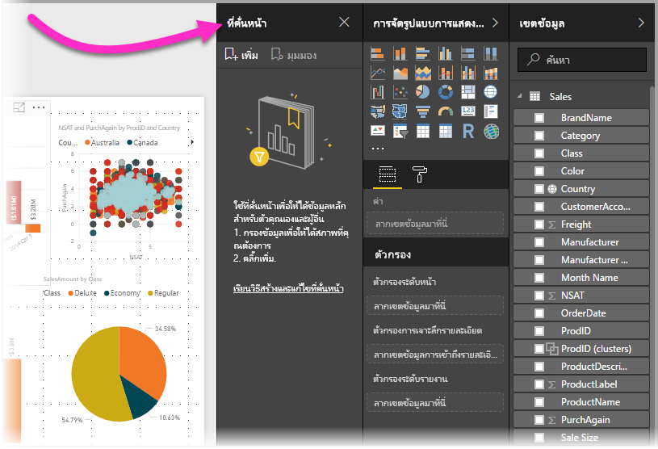

บุ๊กมาร์กสามารถใช้งานได้หลายทาง ตัวอย่างเช่น คุณสามารถใช้บุ๊กมาร์กเพื่อติดตามความคืบหน้าของคุณเองในการสร้างรายงาน (บุ๊กมาร์ก เพิ่ม ลบ และเปลี่ยนชื่อง่าย) และคุณสามารถสร้างบุ๊กมาร์กเพื่อสร้างงานนำเสนอที่คล้ายกับ PowerPoint โดยการไปยังบุ๊กมาร์กต่าง ๆ ตามลำดับ เพื่อบอกเล่าเรื่องราวรายงานของคุณ 

> [!TIP]
> สำหรับข้อมูลเกี่ยวกับการใช้บุ๊กมาร์กส่วนบุคคลในบริการของ Power BI โปรดดู[การประกาศเกี่ยวกับบุ๊กมาร์กส่วนบุคคลในบริการของ Power BI](https://powerbi.microsoft.com/blog/announcing-personal-bookmarks-in-the-power-bi-service/) 

## การใช้บุ๊กมาร์ก
เพื่อใช้บุ๊กมาร์ก เลือกแท็บ**มุมมอง** จากริบบอน Power BI Desktop จากนั้นเลือก **บานหน้าต่างบุ๊กมาร์ก** 

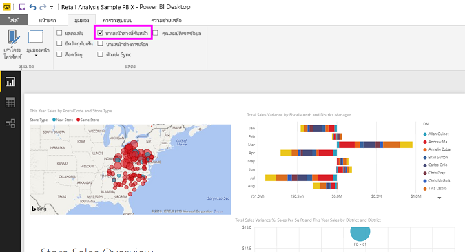

เมื่อคุณสร้างบุ๊กมาร์ก องค์ประกอบต่อไปนี้จะถูกบันทึกพร้อมบุ๊กมาร์ก:

* หน้าปัจจุบัน
* ตัวกรอง
* ตัวแบ่งส่วนข้อมูล รวมถึงชนิดตัวแบ่งส่วนข้อมูล (เช่น รายการดรอปดาวน์หรือรายการ) และสถานะของตัวแบ่งส่วนข้อมูล
* สถานะการเลือกการแสดงผลด้วยภาพ (เช่น ตัวกรองการไฮไลต์เชื่อมโยง)
* ลำดับการจัดเรียง
* ตำแหน่งที่ดูรายละเอียด
* การแสดงผลวัตถุ (โดยใช้บานหน้าต่าง**การเลือก**)
* โหมดโฟกัส หรือ**สปอตไลต์**ของวัตถุใด ๆ ที่มองเห็นได้

กำหนดค่าหน้ารายงานตามที่คุณต้องการให้ปรากฏในบุ๊กมาร์ก หลังจากนั้น หน้ารายงานของคุณและวิชวลถูกจัดเรียงในแบบที่คุณต้องการแล้ว เลือก**เพิ่ม**จากบานหน้าต่าง**บุ๊กมาร์ก**เพื่อเพิ่มบุ๊กมาร์ก 

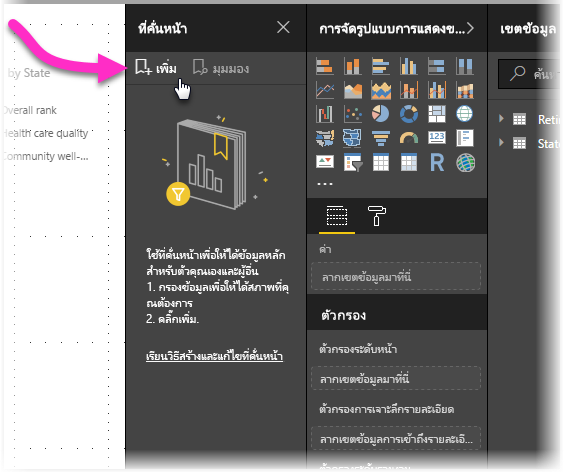

Power BI Desktop สร้างบุ๊กมาร์ก และให้ตั้งชื่อทั่วไป คุณสามารถ**เปลี่ยนชื่อ** **ลบ** หรือ**อัปเดด**บุ๊กมาร์ก ได้อย่างง่ายดายโดยการเลือกจุดไข่ปลาที่อยู่ถัดจากชื่อบุ๊กมาร์ก จากนั้นเลือกการดำเนินการจากเมนูที่ปรากฏขึ้น

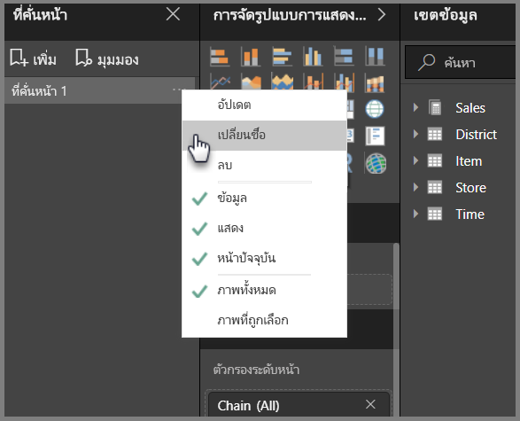

หลังจากที่คุณได้สร้างบุ๊กมาร์กแล้ว ให้แสดงโดยการเลือกในบานหน้าต่าง **บุ๊กมาร์ก** 

นอกจากนี้ คุณยังสามารถเลือกบุ๊กมาร์กแต่ละรายการที่จะใช้กับคุณสมบัติ**ข้อมูล** เช่น ตัวกรอง และตัวแบ่งส่วนข้อมูล, คุณสมบัติ**แสดงผล** เช่น สปอตไลต์ และการแสดงผล รวมถึงการเปลี่ยนแปลง**หน้าปัจจุบัน** ซึ่งแสดงหน้าที่มองเห็นเมื่อเพิ่มบุ๊กมาร์ก ความสามารถนี้มีประโยชน์ เมื่อคุณใช้บุ๊กมาร์กเพื่อสลับระหว่างมุมมองรายงานหรือการเลือกวิชวล ซึ่งในกรณีนี้คุณจะต้องการปิดคุณสมบัติของข้อมูล เพื่อให้ตัวกรองไม่ถูกตั้งค่าใหม่เมื่อผู้ใช้งานเปลี่ยนมุมมองโดยการเลือกบุ๊กมาร์ก 

เพื่อเปลี่ยนแปลงดังกล่าว เลือกที่จุดไข่ปลาที่อยู่ถัดจากชื่อบุ๊กมาร์ก จากนั้นเลือกหรือยกเลิกการเลือกเครื่องหมายที่อยู่ถัดจาก**ข้อมูล**, **การแสดงผล** และตัวควบคุมอื่น ๆ 

## การจัดเรียงบุ๊กมาร์ก
เมื่อคุณสร้างบุ๊กมาร์ก คุณอาจพบว่าลำดับที่คุณสร้างขึ้นแตกต่างจากลำดับที่คุณต้องการนำเสนอให้กับผู้ชมของคุณ ไม่เป็นไร คุณสามารถเรียงลำดับบุ๊กมาร์กใหม่ได้อย่างง่ายดาย

- ในบานหน้าต่าง **บุ๊กมาร์ก** ลากแล้วปล่อยบุ๊กมาร์กเพื่อเปลี่ยนลำดับ 

   แถบสีเหลืองระหว่างบุ๊กมาร์ก แสดงตำแหน่งที่บุ๊กมาร์กที่กำลังลากจะถูกวาง

   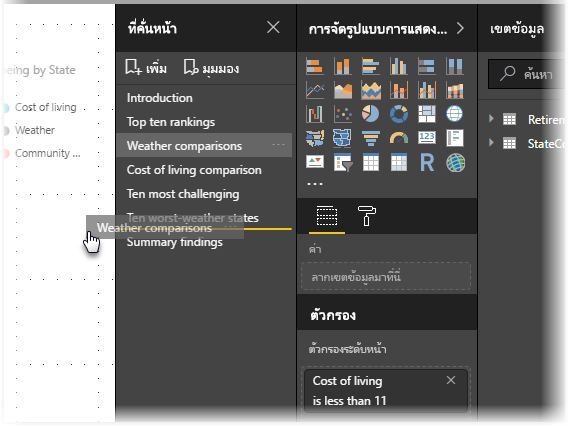

ลำดับของบุ๊กมาร์กเป็นเรื่องสำคัญ เมื่อคุณใช้คุณลักษณะ**มุมมอง**ของบุ๊กมาร์ก ตามที่จะอธิบายในส่วนถัดไปได้

## ใช้บุ๊กมาร์กนำเสนอภาพนิ่ง
เมื่อคุณมีคอลเลกชันบุ๊กมาร์ก ที่คุณต้องการนำเสนอตามลำดับ คุณสามารถเลือก**มุมมอง**จากบานหน้าต่าง**บุ๊กมาร์ก** เพื่อเริ่มการนำเสนอภาพนิ่ง

เมื่ออยู่ในโหมด**มุมมอง** มีบางคุณสมบัติที่สังเกตได้

   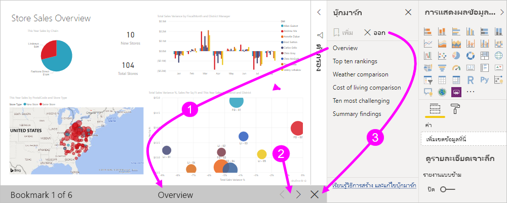

1. ชื่อบุ๊กมาร์กปรากฏในแถบชื่อเรื่องบุ๊กมาร์ก ซึ่งอยู่ด้านล่างของพื้นที่ทำงาน

2. แถบชื่อเรื่องบุ๊กมาร์ก มีลูกศรที่ช่วยให้คุณสามารถไปยังบุ๊กมาร์กถัดไป หรือก่อนหน้าได้

3. คุณสามารถออกจากโหมด**มุมมอง** โดยการเลือก**ออกจาก**จากบานหน้าต่าง**บุ๊กมาร์ก** หรือโดยการเลือก **X** ในแถบชื่อเรื่องบุ๊กมาร์กได้ 

เมื่อคุณอยู่ในโหมด**มุมมอง** คุณสามารถปิดบานหน้าต่าง**บุ๊กมาร์ก** โดยการคลิก **X** บนบานหน้าต่างนั้นเพื่อให้มีพื้นที่เพิ่มเติมสำหรับงานนำเสนอของคุณได้ วิชวลทั้งหมดเป็นแบบโต้ตอบเมื่ออยู่ในโหมด**มุมมอง** และพร้อมสำหรับการไฮไลต์แบบเชื่อมโยง เช่นเดียวกับทีโต้ตอบกับวิชวลเหล่านั้นโดยตรง 

## การมองเห็น: การใช้งานบานหน้าต่างการเลือก
เกี่ยวกับบานหน้าต่าง**บุ๊กมาร์ก** บานหน้าต่าง**การเลือก**แสดงรายการของวัตถุทั้งหมดบนหน้าปัจจุบัน และช่วยให้คุณสามารถเลือกวัตถุ และระบุว่าสามารถมองเห็นวัตถุได้หรือไม่ 

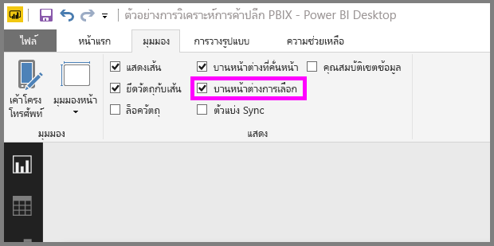

ในบานหน้าต่าง**การเลือก** คุณเลือกวัตถุและสลับว่าวัตถุสามารถมองเห็นได้หรือไม่ โดยการเลือกไอคอนรูปตาทางด้านขวาของวัตถุ 

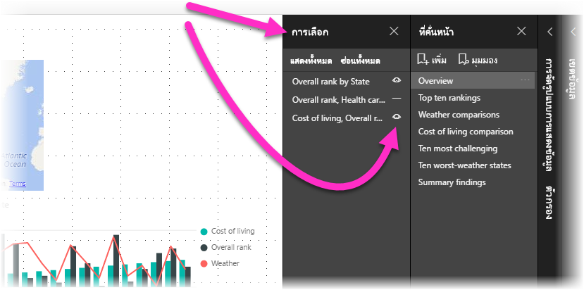

เมื่อคุณเพิ่มบุ๊กมาร์ก สถานะการมองเห็นของแต่ละวัตถุจะถูกบันทึกโดยยึดตามการตั้งค่าในบานหน้าต่าง**การเลือก** 

สิ่งสำคัญที่ต้องทราบคือตัวแบ่งส่วนข้อมูลยังคงกรองหน้ารายงาน โดยไม่คำนึงถึงว่าตัวแบ่งส่วนข้อมูลจะมองเห็นได้หรือไม่ ด้วยเหตุนี้ คุณสามารถสร้างบุ๊กมาร์กจำนวนมาก โดยมีการตั้งค่าตัวแบ่งส่วนข้อมูลที่แตกต่างกัน และทำให้หน้ารายงานดูแตกต่างกันได้ (และไฮไลต์ข้อมูลเชิงลึกที่แตกต่างกัน) ในแต่ละบุ๊กมาร์ก

## บุ๊กมาร์กสำหรับรูปร่างและรูปภาพ
คุณยังสามารถเชื่อมโยงรูปร่างและรูปภาพไปยังบุ๊กมาร์ก ด้วยคุณลักษณะนี้ เมื่อคุณเลือกที่วัตถุ จะแสดงบุ๊กมาร์กที่เชื่อมโยงกับวัตถุนั้น คุณลักษณะนี้จะมีประโยชน์โดยเฉพาะอย่างยิ่งเมื่อคุณทำงานกับปุ่ม สำหรับข้อมูลเพิ่มเติม ให้ดู [การใช้ปุ่มใน Power BI](desktop-buttons.md) 

วิธีการกำหนดบุ๊กมาร์กสำหรับวัตถุ: 

1. เลือกวัตถุในพื้นที่รายงาน แล้วจากบานหน้าต่าง**จัดรูปแบบรูปร่าง** ที่ปรากฏขึ้น ให้เปลี่ยนแถบเลื่อน**การดำเนินการ** เป็น**เปิด**

2. ขยายส่วน**การดำเนินการ** ภายใต้ **ชนิด** เลือก**บุ๊กมาร์ก**

3. ภายใต้ **บุ๊กมาร์ก** เลือกบุ๊กมาร์ก

   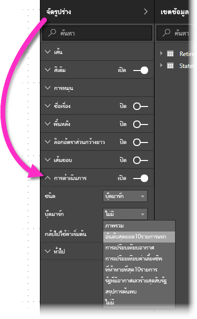

มีหลายสิ่งที่น่าสนใจ ที่คุณสามารถทำได้ ด้วยการเชื่อมโยงจากวัตถุไปเป็นบุ๊กมาร์กได้ คุณสามารถสร้างสารบัญวิชวลบนหน้ารายงานของคุณ หรือคุณสามารถกำหนดมุมมองต่าง ๆ (เช่น ชนิดของวิชวล) ของข้อมูลเดียวกันได้

เมื่อคุณอยู่ในโหมดการแก้ไข ให้กด **Ctrl** และเลือกลิงก์เพื่อติดตาม เมื่อคุณไม่ได้อยู่ในโหมดการแก้ไข ให้เลือกวัตถุที่จะทำตามการเชื่อมโยง 

## กลุ่มบุ๊คมาร์ก

เริ่มด้วย Power BI Desktop รุ่นเดือนสิงหาคม 2018 คุณจะสามารถสร้างและใช้กลุ่มบุ๊กมาร์กได้ กลุ่มบุ๊คมาร์กเป็นคอลเลกชันของบุ๊กมาร์กที่คุณระบุ ซึ่งสามารถแสดง และจัดระเบียบเป็นกลุ่ม 

วิธีการสร้างกลุ่มบุ๊กมาร์ก: 
1. กด **Ctrl** และเลือกบุ๊กมาร์กที่คุณต้องการรวมไว้ในกลุ่ม 

2. เลือกจุดไข่ปลาถัดจากบุ๊กมาร์กที่คุณเลือก จากนั้นเลือก**กลุ่ม**จากเมนูที่ปรากฏขึ้น

   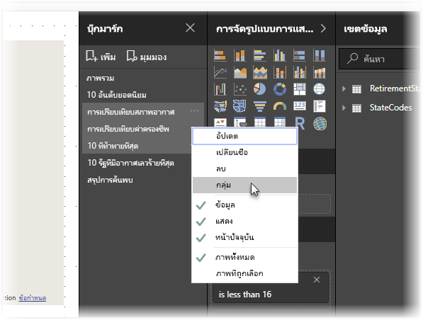

Power BI Desktop จะตั้งชื่อกลุ่ม *กลุ่ม 1* โดยอัตโนมัติ คุณสามารถเลือกจุดไข่ปลาที่อยู่ถัดจากชื่อนี้ได้ เลือก**เปลี่ยนชื่อ**และเปลี่ยนชื่อเป็นสิ่งที่คุณต้องการ

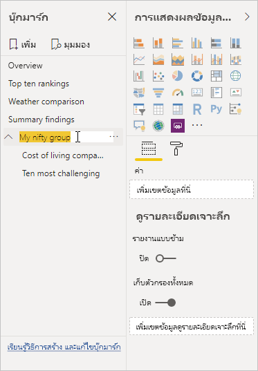

ด้วยกลุ่มบุ๊กมาร์กใด ๆ การขยายชื่อของกลุ่มบุ๊กมาร์กจะขยาย หรือยุบกลุ่มของบุ๊กมาร์กเท่านั้น และไม่แสดงบุ๊กมาร์กด้วยตัวเอง 

เมื่อคุณใช้คุณลักษณะ**มุมมอง**ของบุ๊กมาร์ก รายละเอียดต่อไปนี้จะนำไปใช้:

* ถ้าบุ๊กมาร์กที่เลือกอยู่ในกลุ่มเมื่อคุณเลือก**มุมมอง**จากบุ๊กมาร์ก เฉพาะบุ๊กมาร์ก*ในกลุ่มนั้น*จะแสดงในเซสชันการดู 

* ถ้าบุ๊กมาร์กที่เลือกไม่ได้อยู่ในกลุ่ม หรืออยู่ในระดับบนสุด (เช่น ชื่อกลุ่มบุ๊กมาร์ก) จากนั้นบุ๊กมาร์กทั้งหมดสำหรับทั้งรายงานจะแสดงขึ้นมา รวมถึงบุ๊กมาร์กในทุกกลุ่ม 

วิธีการยกเลิกการจัดกลุ่มบุ๊กมาร์ก: 
1. เลือกบุ๊กมาร์กใด ๆ ในกลุ่มและเลือกจุดไข่ปลา 

2. เลือก**ยกเลิกการจัดกลุ่ม**จากเมนูที่ปรากฏขึ้น

   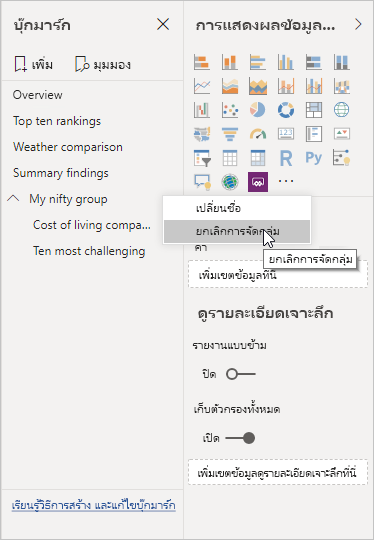

   การเลือก**ยกเลิกการจัดกลุ่ม**สำหรับบุ๊กมาร์กใด ๆ จากกลุ่มจะลบบุ๊กมาร์กทั้งหมดออกจากกลุ่ม ซึ่งจะลบกลุ่ม แต่ไม่ใช่ตัวบุ๊กมาร์ก 

วิธีการลบบุ๊กมาร์กเดี่ยวออกจากกลุ่ม: 
1. **ยกเลิกการจัดกลุ่ม** สมาชิกใดก็ตามจากกลุ่มดังกล่าว ซึ่งจะลบกลุ่มทั้งหมด 

2. เลือกสมาชิกที่คุณต้องการในกลุ่มใหม่โดยการกด **Ctrl** และเลือกแต่ละบุ๊กมาร์กแล้วเลือก **จัดกลุ่ม** อีกครั้ง 

## การใช้สปอตไลต์
อีกคุณลักษณะที่เผยแพร่พร้อมกับบุ๊กมาร์กคือ *สปอตไลต์* ด้วยสปอตไลต์ คุณสามารถดึงดูดความสนใจลงในเฉพาะแผนภูมิ เช่น เมื่อนำเสนอบุ๊กมาร์กของคุณในโหมด**มุมมอง**ได้

เรามาเปรียบเทียบโหมดสปอตไลต์กับโหมดโฟกัส เพื่อดูความแตกต่างของทั้งสองโหมด

1. ด้วยโหมดโฟกัส คุณเลือกไอคอน **โหมดโฟกัส** ของวิชวล ซึ่งทำให้วิชวลเติมพื้นที่ทั้งหมด

2. ด้วยสปอตไลต์ คุณเลือก **สปอตไลต์** จากจุดไข่ปลาของวิชวลเพื่อเน้นหนึ่งวิชวลในขนาดเดิม ซึ่งทำให้เกิดวิชวลอื่น ๆ ทั้งหมดบนหน้าเพื่อให้ใกล้เคียงกับความโปร่งใส 

เมื่อคุณเลือกไอคอน **โหมดโฟกัส** ของวิชวลในรูปก่อนหน้านี้ หน้าจะปรากฏเป็นดังนี้:

ในทางตรงข้าม เมื่อ**สปอตไลต์**ถูกเลือกจากเมนูจุดไข่ปลาของวิชวล หน้าจะปรากฎเป็นดังนี้:

ถ้าเลือกโหมดโฟกัสหรือสปอตไลต์เมื่อคุณเพิ่มบุ๊กมาร์ก โหมดดังกล่าวจะถูกเก็บไว้ในบุ๊กมาร์ก

## บุ๊กมาร์กในบริการของ Power BI
เมื่อคุณเผยแพร่รายงานไปยังบริการของ Power BI ที่มีอย่างน้อยหนึ่งบุ๊กมาร์ก คุณสามารถดูและโต้ตอบกับบุ๊กมาร์กเหล่านั้นในบริการของ Power BI ได้ เมื่อบุ๊กมาร์กพร้อมใช้งานในรายงาน คุณจะแสดงบานหน้าต่าง**การเลือก**และ**บุ๊กมาร์ก** โดยการเลือก**มุมมอง** > **บานหน้าต่างการเลือก** หรือ**มุมมอง** > **บานหน้าต่างบุ๊กมาร์ก** 

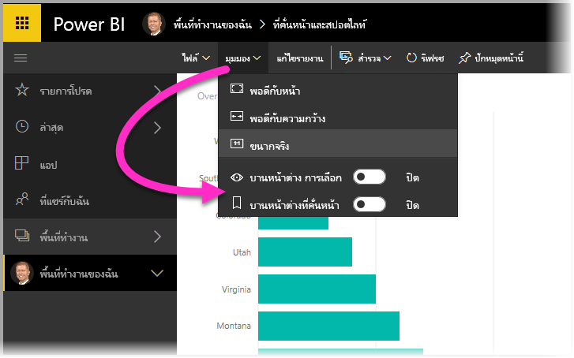

ในบริการของ Power BI บานหน้าต่าง**บุ๊กมาร์ก**จะทำงานเหมือนกับที่ทำงานใน Power BI Desktop รวมไปถึงความสามารถในการเลือก**มุมมอง** เพื่อแสดงบุ๊กมาร์กของคุณตามลำดับ เหมือนกับการนำเสนอภาพนิ่ง

ใช้แถบชื่อเรื่องบุ๊กมาร์กสีเทาแทนลูกศรสีดำเพื่อนำทางผ่านบุ๊กมาร์ก (ลูกศรสีดำย้ายคุณผ่านหน้ารายงาน ไม่ใช่บุ๊กมาร์ก)

## เปิดใช้งานตัวอย่าง บุ๊กมาร์ก (เวอร์ชันก่อนเดือนมีนาคม 2018)
เริ่มตั้งแต่เวอร์ชัน มีนาคม 2018 ของ Power BI Desktop บุ๊กมาร์กมีให้ใช้งานโดยทั่วไปแล้ว 

เราแนะนำให้คุณอัปเกรดเป็นการเผยแพร่ล่าสุดเสมอ แต่ถ้าเวอร์ชัน Power BI Desktop ของคุณเป็นรุ่นก่อนหน้านั้น คุณยังสามารถลองคุณลักษณะบุ๊กมาร์ก เริ่มตั้งแต่รุ่นเดือนตุลาคม 2017 ของ Power BI Desktop และสำหรับรายงานที่เปิดใช้งานบุ๊กมาร์กใน บริการของ Power BI เช่นเดียวกัน 

วิธีการเปิดใช้งานคุณลักษณะบุ๊กมาร์กแสดงตัวอย่าง: 

1. เลือก**ไฟล์** > **ตัวเลือกและการตั้งค่า** > **ตัวเลือก** > **คุณลักษณะตัวอย่าง** แล้วเลือก**บุ๊กมาร์ก** 

   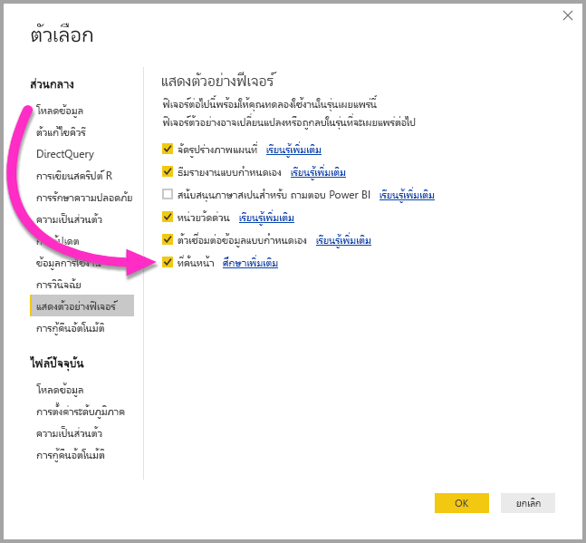

2. รีสตาร์ท Power BI Desktop เพื่อเปิดใช้งานเวอร์ชันตัวอย่างของบุ๊กมาร์ก

## ข้อจำกัดและข้อควรพิจารณา
ในบุ๊กมาร์กรุ่นนี้ มีข้อจำกัดและข้อควรพิจารณาบางอย่าง

* วิชวล Power BI ส่วนใหญ่ควรทำงานได้ดีกับการบุ๊กมาร์ก อย่างไรก็ตาม ถ้าคุณพบปัญหาเกี่ยวกับการบุ๊กมาร์กและวิชวลแบบกำหนดเอง ให้ติดต่อผู้สร้างวิชวลนั้น และขอให้พวกเขาจะเพิ่มการสนับสนุนบุ๊กมาร์กในวิชวลของตน 
* ถ้าคุณเพิ่มวิชวลบนหน้ารายงานหลังจากการสร้างบุ๊กมาร์ก วิชวลจะแสดงในสถานะเริ่มต้น นั่นคือถ้าคุณเพิ่มตัวแบ่งส่วนข้อมูลลงในหน้าที่คุณเคยสร้างบุ๊กมาร์กไว้ก่อน ตัวแบ่งส่วนข้อมูลจะทำงานในสถานะเริ่มต้น
* การย้ายวิชวลหลังจากการสร้างบุ๊กมาร์กแล้วจะมีผลในบุ๊กมาร์กโดยอัตโนมัติ 

## ขั้นตอนถัดไป
สำหรับข้อมูลเพิ่มเติมเกี่ยวกับคุณลักษณะที่คล้ายกัน หรือการโต้ตอบกับบุ๊กมาร์ก โปรดดูที่บทความต่อไปนี้:

* [ใช้ตัวเจาะเข้าถึงรายละเอียดใน Power BI Desktop](desktop-drillthrough.md)
* [แสดงไทล์แดชบอร์ดหรือวิชวลรายงานในโหมดโฟกัส](consumer/end-user-focus.md)

