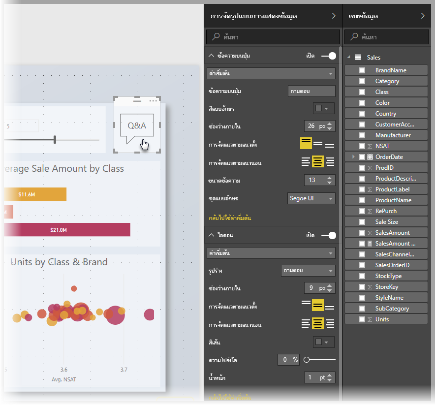
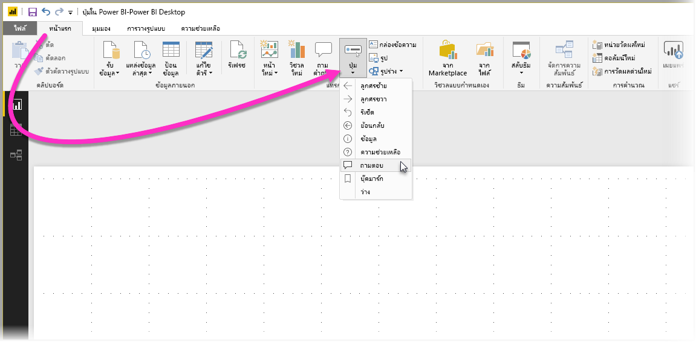
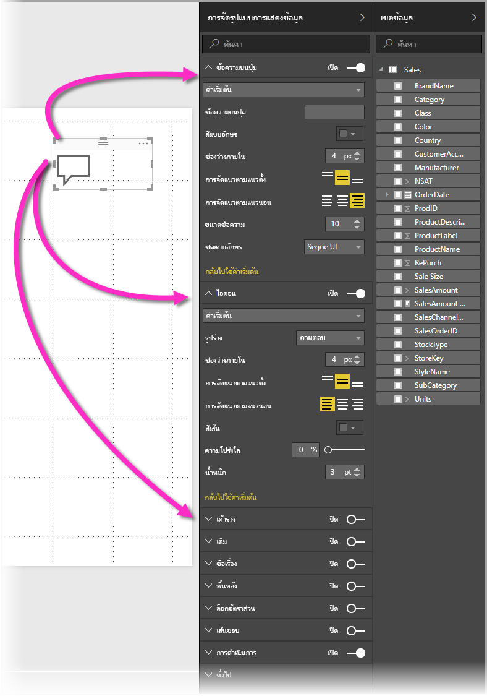
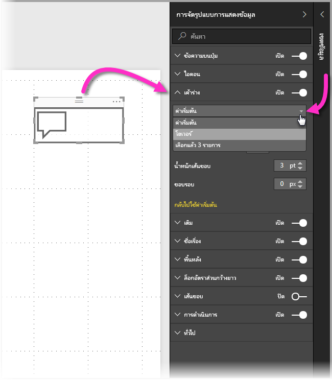
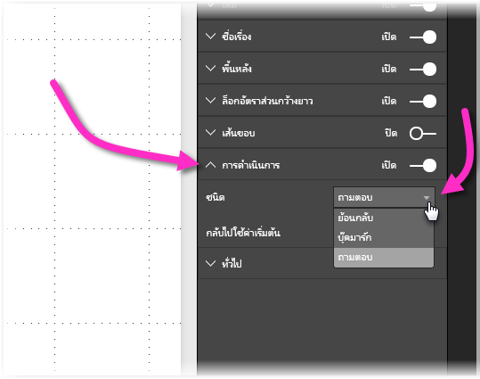

# การใช้ปุ่มใน Power BI
การใช้**ปุ่ม**ใน Power BI ช่วยให้คุณสร้างรายงานและแดชบอร์ดที่ทำงานคล้ายกับแอป สร้างสภาพแวดล้อมที่น่าสนใจแก่ผู้ใช้ ให้ผู้ใช้สามารถโฮเวอร์ คลิก และโต้ตอบกับเนื้อหา Power BI คุณสามารถเพิ่มปุ่มในรายงานของ **Power BI Desktop** และแชร์ หรือเผยแพร่รายงานเหล่านั้นไปยังบริการของ Power BI เพื่อสร้างแดชบอร์ดที่ทำงานคล้ายกับแอปสำหรับผู้ใช้ได้

ปุ่มที่คุณสร้างใน **Power BI Desktop** สามารถนำไปใช้ในรายงานหรือแดชบอร์ดที่เผยแพร่ใน**บริการของ Power BI**

## การสร้างปุ่มในรายงาน
วิธีสร้างปุ่มในรายงานของ **Power BI Desktop** ไปที่ ribbon **หน้าแรก** แล้วเลือก**ปุ่ม** เมนูดรอปดาวน์จะปรากฏ ซึ่งคุณสามารถเลือกปุ่มที่คุณต้องการ จากตัวเลือกต่าง ๆ ดังแสดงในรูปต่อไปนี้ 

เมื่อคุณสร้างปุ่ม และเลือกลงบนพื้นที่รายงาน บานหน้าต่าง**การจัดรูปแบบการแสดงข้อมูล** จะแสดงหลายวิธีที่คุณสามารถปรับแต่งปุ่มให้เป็นไปตามความต้องการ ตัวอย่างเช่น คุณสามารถเปิดหรือปิด **ข้อความบนปุ่ม** โดยการสลับแถบเลื่อนที่ตรงกับการ์ดนั้น ในบานหน้าต่าง**การจัดรูปแบบการแสดงข้อมูล** คุณยังสามารถเปลี่ยนไอคอนของปุ่ม สีพื้นของปุ่ม ชื่อปุ่ม และการกระทำเมื่อผู้ใช้คลิกที่ปุ่มนั้นในรายงานหรือแดชบอร์ด รวมไปถึงคุณสมบัติอื่น ๆ ได้

## ตั้งค่าคุณสมบัติของปุ่มเมื่ออยู่เฉย ๆ เมื่อโฮเวอร์เหนือ หรือถูกเลือก

ปุ่มใน Power BI มีสามสถานะ: สถานะเริ่มต้น (ลักษณะที่ปรากฏเมื่อไม่ตัวชี้โฮเวอร์เหนือปุ่ม หรือถูกเลือก), เมื่อตัวชี้มาโฮเวอร์เหนือปุ่ม หรือเมื่อปุ่มถูกเลือก (มักจะเรียกว่าถูก*คลิก*) การ์ดจำนวนมากในบานหน้าต่าง**การจัดรูปแบบการแสดงข้อมูล** สามารถแก้ไขแยกตามสถานะทั้งสามนี้ ช่วยให้มีความยืดหยุ่นในการกำหนดปุ่มของคุณได้

การ์ดต่อไปนี้ในบานหน้าต่าง**การจัดรูปแบบการแสดงข้อมูล** ให้คุณปรับรูปแบบหรือลักษณะการทำงานของปุ่มที่ตามสถานะทั้งสามของมัน:

* ข้อความบนปุ่ม
* ไอคอน
* เค้าร่าง
* สีเติม

วิธีเลือกว่าจะแสดงปุ่มในแต่ละสถานะอย่างไร ให้ขยายการ์ดหนึ่งในนั้น แล้วเลือกรายการแบบหล่นลงที่ปรากฏด้านบนของการ์ด ในรูปต่อไปนี้ คุณเห็นการ์ด**เค้าร่าง**ขยายออกมาให้เห็นเมนูดรอปดาวน์ที่ถูกเลือกเพื่อแสดงสถานะทั้งสาม:

## เลือกการกระทำสำหรับปุ่ม

คุณสามารถเลือกว่าจะดำเนินการอย่างไร เมื่อผู้ใช้เลือกปุ่มใน Power BI คุณสามารถเข้าถึงตัวเลือกสำหรับการกระทำของปุ่ม จากการ์ด**การกระทำ** ในบานหน้าต่าง**การจัดรูปแบบการแสดงข้อมูล**ได้

ตัวเลือกสำหรับการกระทำของปุ่มได้แก่:

* กลับ
* บุ๊คมาร์ก
* ถามตอบ

การเลือก**กลับ** จะส่งผู้ใช้กลับไปยังรายงานหน้าที่แล้ว ซึ่งเป็นประโยชน์สำหรับหน้าที่สามารถเจาะลึกลงไปดูรายละเอียดได้

การเลือก**บุ๊กมาร์ก** จะแสดงหน้ารายงานที่เชื่อมโยงกับบุ๊กมาร์กที่ถูกกำหนดไว้ในรายงาน คุณสามารถ[เรียนรู้เพิ่มเติมเกี่ยวกับบุ๊กมาร์กใน Power BI](desktop-bookmarks.md) ได้ 

การเลือก**ถามตอบ**จากรายการดรอปดาวน์ จะแสดงหน้าต่าง **Q&A Explorer** 

ปุ่มบางอย่างจะมี ค่าเริ่มต้นของการกระทำให้โดยอัตโนมัติ ตัวอย่างเช่น ปุ่มชนิด**ถามตอบ** จะเลือก**ถามตอบ**เป็นค่าเริ่มต้นของการกระทำ คุณสามารถเรียนรู้เพิ่มเติมเกี่ยวกับ **Q&A Explorer** ได้โดยศึกษาจาก[บล็อกโพสต์นี้](https://powerbi.microsoft.com/blog/power-bi-desktop-april-2018-feature-summary/#Q&AExplorer)

คุณสามารถลองหรือทดสอบปุ่มที่คุณสร้างในรายงาน โดย *CTRL + คลิก* บนปุ่มคุณต้องการใช้ 

## ขั้นตอนถัดไป
สำหรับข้อมูลเพิ่มเติมเกี่ยวกับ คุณลักษณะที่คล้ายกัน หรือการโต้ตอบกับปุ่ม โปรดดูที่บทความต่อไปนี้:

* [ใช้ drillthrough ใน Power BI Desktop](desktop-drillthrough.md)
* [แสดงไทล์แดชบอร์ด หรือรายงานแบบเป็นภาพในโหมดโฟกัส](consumer/end-user-focus.md)
* [ใช้บุ๊กมาร์กเพื่อแชร์ข้อมูลเชิงลึก และสร้างเรื่องราวใน Power BI](desktop-bookmarks.md)

