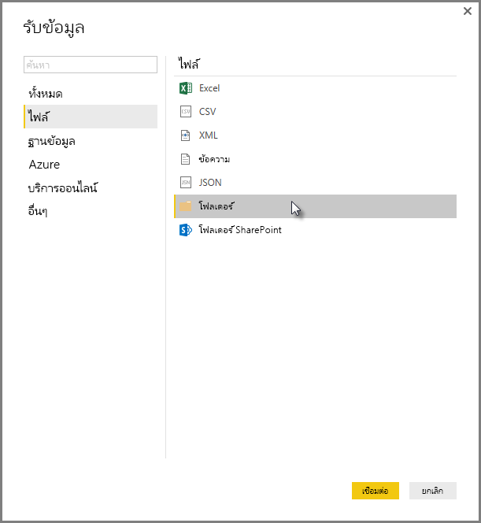
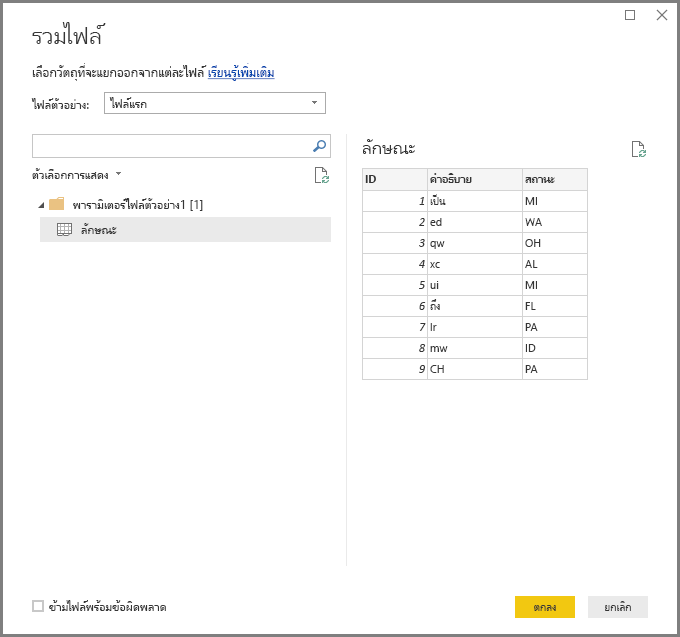
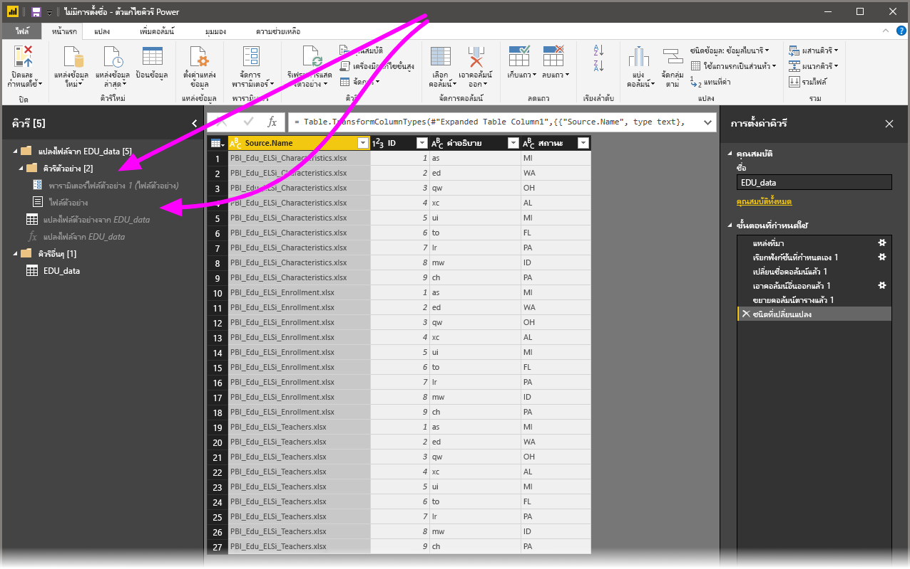

# รวมไฟล์ (ไบนารี) ใน Power BI Desktop
วิธีการหนึ่งที่มีประสิทธิภาพเพื่อนำเข้าข้อมูลลงใน **Power BI Desktop** คือการรวมหลาย ๆ ไฟล์ ซึ่งมีรูปแบบเดียวกัน เข้าเป็นตารางเดียว ด้วยการเผยแพร่เดือนพฤศจิกายน 2016 ของ **Power BI Desktop** (และรุ่นต่อ ๆ มา) วิธีที่สะดวกและได้รับความนิยมวิธีนี้ ได้พัฒนาให้สะดวกมากขึ้นและความสามารถมากขึ้น ตามที่จะอธิบายในบทความนี้

เพื่อเริ่มกระบวนการของการรวมไฟล์จากโฟลเดอร์เดียวกัน เลือก**รับข้อมูล > ไฟล์ > โฟลเดอร์**

## ลักษณะการรวมไฟล์ (ไบนารี) ก่อนหน้านี้
ก่อนรุ่นเผยแพร่เดือนพฤศจิกายน 2016 ของ **Power BI Desktop** ความสามารถนี้เรียกว่า**รวมไบนารี** และคุณสามารถรวมไฟล์บางชนิดด้วยการ**รวมไบนารี** แต่ก็มีข้อจำกัด:

* การแปลงจะยังไม่ถูกพิจารณาสำหรับแต่ละไฟล์ จนกว่าไฟล์ทั้งหมดจะถูกรวมกันเป็นตารางเดียวก่อน ด้วยเหตุนี้ คุณมักต้องมีการรวมไฟล์ แล้วกรองเอา*ค่าส่วนหัว*ออก โดยการกรองแถวซึ่งเป็นส่วนหนึ่งของกระบวนการแก้ไข
* การแปลงใน**รวมไบนารี** ทำงานกับเฉพาะไฟล์*ข้อความ*หรือ *CSV* และทำงานกับไฟล์รูปแบบที่ได้รับการสนับสนุนอื่น ๆ เช่นเวิร์กบุ๊ก Excel, ไฟล์ JSON ฯลฯ ไม่ได้

ลูกค้าร้องขอให้การดำเนินการการใน**รวมไบนารี**เข้าใจได้ง่ายขึ้น ดังนั้นการแปลงจึงได้รับการปรับปรุง และเปลี่ยนชื่อใหม่เป็น**รวมไฟล์**

## ลักษณะการรวมไฟล์ ในปัจจุบัน
**Power BI Desktop** ตอนนี้จัดการ**รวมไฟล์ (ไบนารี)** อย่างมีประสิทธิภาพมากขึ้น คุณเริ่มต้น โดยการเลือก**รวมไฟล์** จากตัวแท็บ ribbon **หน้าแรก**ใน**ตัวแก้ไขคิวรี** หรือจากตัวคอลัมน์เอง

การแปลงใน**รวมไฟล์** ตอนนี้มีลักษณะการทำงานดังนี้:

* การแปลงตอน**รวมไฟล์** วิเคราะห์แต่ละแฟ้มที่นำเข้าและพิจารณารูปแบบไฟล์ที่ถูกต้อง เช่น *ข้อความ* หรือ*เวิร์กบุ๊ก Excel* หรือไฟล์ *JSON*
* การแปลงให้คุณเลือกวัตถุที่ระบุจากไฟล์แรก เช่น *เวิร์กบุ๊ก Excel* ที่จะดึงข้อมูล
  
  
* การ**รวมไฟล์** จากนั้นจะดำเนินการคิวรีต่อไปนี้โดยอัตโนมัติ:
  
  * สร้างคิวรีต้นแบบที่ดำเนินการกับข้อมูลทุกขั้นตอนกับไฟล์เดียว
  * สร้างการ*การสอบถามฟังก์ชัน* ที่มีไฟล์ไบนารีเป็นพารามิเตอร์ไปยัง *คิวรีต้นแบบ* คิวรีต้นแบบและการสอบถามฟังก์ชัน มีการเชื่อมโยงกัน เพื่อให้เปลี่ยนแปลงในคิวรีต้นแบบ สะท้อนมาในแบบสอบถามฟังก์ชัน
  * ใช้*การสอบถามฟังก์ชัน*กับในคิวรีเดิม ด้วยข้อมูลไบนารี (ตัวอย่างเช่น คิวรี*โฟลเดอร์*) เพื่อนำแบบสอบถามฟังก์ชันไปใช้กับข้อมูลไบนารีแต่ละแถว จากนั้นขยายข้อมูลผลลัพธ์ให้เป็นคอลัมน์ระดับบนสุด
    
    

ด้วยการทำงานใหม่ของการ**รวมไฟล์** คุณสามารถรวมไฟล์ทั้งหมดภายในโฟลเดอร์ที่ระบุได้อย่างง่ายดาย ตราบใดที่พวกเขามีชนิดไฟล์และโครงสร้าง (เช่นมีคอลัมน์เดียวกัน) เดียวกัน

นอกจากนี้ คุณสามารถใช้ขั้นตอนการแปลงหรือดึงข้อมูลเพิ่มเติม โดยการปรับเปลี่ยน*คิวรีต้นแบบ* ที่สร้างขึ้นโดยอัตโนมัติ โดยไม่ต้องกังวลเกี่ยวกับการแก้ไขหรือสร้าง*การสอบถามฟังก์ชัน*ในขั้นตอนเพิ่มเติม การเปลี่ยนแปลงใด ๆ กับ*คิวรีต้นแบบ* จะไปเปลี่ยนแปลง*แบบสอบถามฟังก์ชัน*ที่เชื่อมโยงกัน

## ขั้นตอนถัดไป
มีข้อมูลหลากหลายประเภทที่คุณสามารถเชื่อมต่อโดยใช้ Power BI Desktop สำหรับข้อมูลเพิ่มเติมเกี่ยวกับแหล่งข้อมูล โปรดดูทรัพยากรต่อไปนี้:

* [เริ่มต้นใช้งาน Power BI Desktop](desktop-getting-started.md)
* [แหล่งข้อมูลใน Power BI Desktop](desktop-data-sources.md)
* [จัดรูปทรง และรวมข้อมูลด้วย Power BI Desktop](desktop-shape-and-combine-data.md)
* [เชื่อมต่อกับไฟล์ CSV ใน Power BI Desktop](desktop-connect-csv.md)   
* [ใส่ข้อมูลลงใน Power BI Desktop โดยตรง](desktop-enter-data-directly-into-desktop.md)   

