# ใช้งานคิวรีที่ใช้บ่อยใน Power BI Desktop

ในหน้าต่างตัวแก้ไข  Power Query ของ Power BI Desktop มีงานที่ใช้บ่อยอยู่จำนวนหนึ่ง บทความนี้จะสาธิตงานที่ใช้บ่อยเหล่านั้น และให้ลิงก์สำหรับข้อมูลเพิ่มเติม

งานคิวรีที่ใช้บ่อยซึ่งจะสาธิตที่นี่ คือ:

* เชื่อมต่อกับข้อมูล
* จัดรูปร่างและรวมข้อมูล
* จัดกลุ่มแถว
* Pivot คอลัมน์
* สร้างคอลัมน์แบบกำหนดเอง
* คิวรีสูตร

เราจะใช้การเชื่อมต่อข้อมูลบางตัวเพื่อทำงานเหล่านี้ให้สำเร็จ เรามีข้อมูลให้คุณดาวน์โหลดหรือการเชื่อมต่อ กรณีที่คุณต้องการลองขั้นตอนเหล่านี้ด้วยตนเอง

การเชื่อมต่อข้อมูลแรก คือ [เวิร์กบุ๊ก Excel](https://download.microsoft.com/download/5/7/0/5701F78F-C3C2-450C-BCCE-AAB60C31051D/PBI_Edu_ELSi_Enrollment_v2.xlsx) ซึ่งสามารถดาวน์โหลดและบันทึกลงในเครื่องของคุณได้ นอกจากนี้ยังมีแหล่งข้อมูลเว็บที่ใช้ในบทความ Power BI Desktop อื่นๆ:

<https://www.bankrate.com/retirement/best-and-worst-states-for-retirement/>

งานคิวรีที่ใช้บ่อยเริ่มต้นที่ขั้นตอนที่จำเป็นสำหรับการเชื่อมต่อแหล่งข้อมูลทั้งสองนั้น

## เชื่อมต่อกับข้อมูล

เพื่อเชื่อมต่อกับข้อมูลใน Power BI Desktop ให้เลือก **หน้าหลัก** จากนั้น **รับข้อมูล** Power BI Desktop จะแสดงเมนูให้เห็นแหล่งข้อมูลที่ใช้บ่อยที่สุด สำหรับรายการทั้งหมดของแหล่งข้อมูลซึ่ง Power BI Desktopสามารถเชื่อมต่อได้  เลือก **เพิ่มเติม** ที่ท้ายสุดของเมนู สำหรับข้อมูลเพิ่มเติม ดู [แหล่งข้อมูลใน Power BI Desktop](desktop-data-sources.md)

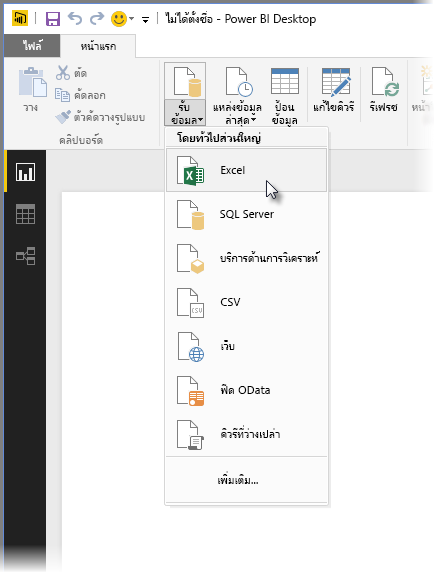

เพื่อเริ่มต้น เลือก **Excel** จากนั้นระบุเวิร์กบุ๊ก Excel ที่กล่าวถึงไปก่อนหน้า แล้วจึงเลือก **เปิด** คิวรีจะตรวจสอบเวิร์กบุ๊ก แล้วแสดงข้อมูลที่พบในกล่องโต้ตอบ **ตัวนำทาง** หลังจากที่คุณเลือกตาราง

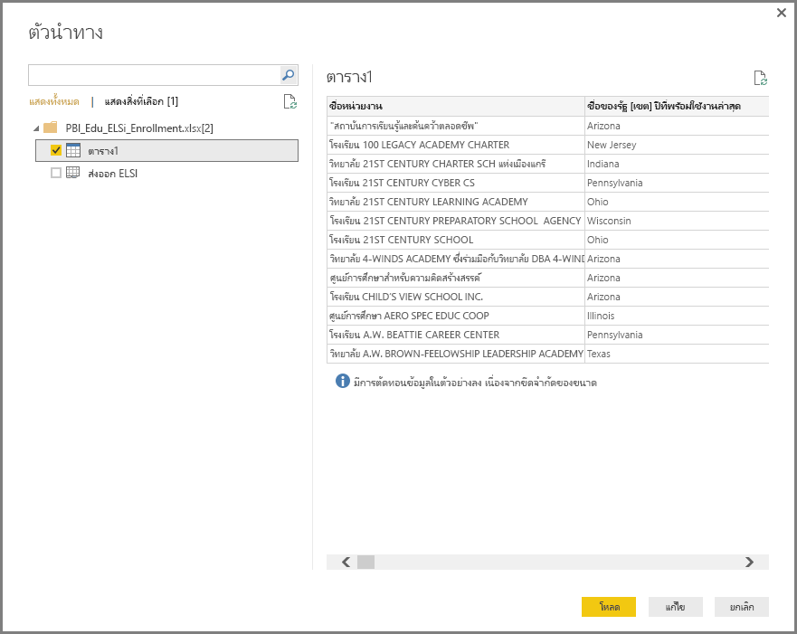

คุณสามารถเลือก **แปลงข้อมูล** เพื่อแก้ไข ปรับเปลี่ยน  หรือ *จัดรูปร่าง* ข้อมูลก่อนที่จะโหลดลงใน Power BI Desktop ได้ การแก้ไขจะมีประโยชน์โดยเฉพาะอย่างยิ่งเมื่อคุณทำงานกับชุดข้อมูลขนาดใหญ่ที่คุณต้องการตัดออกก่อนการโหลด

การเชื่อมต่อกับข้อมูลชนิดอื่นๆ เป็นเรื่องง่ายพอกัน คุณยังต้องการเชื่อมต่อไปยังแหล่งข้อมูลเว็บ เลือก **รับข้อมูล** > **เพิ่มเติม** จากนั้นเลือก **อื่นๆ** > **เว็บ** > **เชื่อมต่อ**

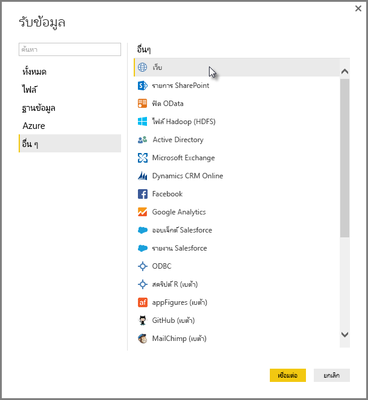

กล่องโต้ตอบ **จากเว็บ** จะปรากฏขึ้น ซึ่งคุณสามารถกรอก URL ของหน้าเว็บลงไปได้

เลือก**ตกลง** เช่นเดียวกัน Power BI Desktop จะตรวจสอบข้อมูลหน้าเว็บและแสดงตัวเลือกการแสดงตัวอย่างในกล่องโต้ตอบ **ตัวนำทาง** เมื่อคุณเลือกตาราง จะแสดงตัวอย่างของข้อมูล

การเชื่อมต่อข้อมูลอื่น ๆ ก็ทำงานคล้ายกัน ถ้าจำเป็นต้องรับรองความถูกต้องเพื่อทำการเชื่อมต่อข้อมูล Power BI Desktop จะถามให้คุณใส่ข้อมูลประจำตัว

สำหรับการสาธิตแต่ละขั้นตอนของการเชื่อมต่อข้อมูลใน Power BI Desktop ดู [เชื่อมต่อข้อมูลใน Power BI Desktop](desktop-connect-to-data.md)

## จัดรูปร่างและรวมข้อมูล

คุณสามารถจัดรูปร่างและรวมข้อมูลได้อย่างง่ายดายด้วยตัวแก้ไข Power Query ส่วนนี้จะให้ตัวอย่างสองสามตัวว่าคุณจะจัดรูปร่างข้อมูลได้อย่างไร สำหรับการสาธิตแบบครบถ้วนเพิ่มเติมของการจัดรูปร่างและรวมข้อมูล ดู [จัดรูปร่างและรวมข้อมูลด้วย Power BI Desktop](desktop-shape-and-combine-data.md)

ในส่วนก่อนหน้านี้ คุณได้เชื่อมต่อชุดข้อมูลสองชุด: เวิร์กบุ๊ก Excel และแหล่งข้อมูลเว็บ หลังจากที่มีการโหลดข้อมูลไปในตัวแก้ไข Power Query แล้ว ให้เลือกคิวรีหน้าเว็บจากคิวรีที่พร้อมใช้งานในบานหน้าต่าง**คิวรี** ดังแสดงไว้ที่นี่:

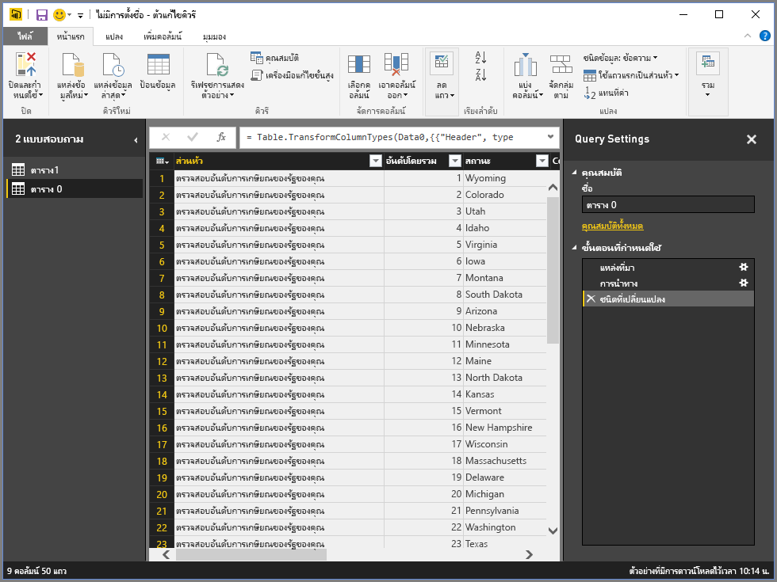

การจัดรูปร่างข้อมูล หมายถึงการแปลงแหล่งข้อมูลให้อยู่ในฟอร์มและรูปแบบที่ตรงตามความต้องการของคุณ

ในตัวแก้ไข Power Query สามารถพบหลายคำสั่ง ribbon และในเมนูบริบท ตัวอย่างเช่น เมื่อคุณคลิกขวาที่คอลัมน์ เมนูบริบทจะให้คุณลบคอลัมน์ออกได้ คุณยังสามารถเลือกคอลัมน์ จากนั้นเลือกปุ่ม**ลบคอลัมน์ออก** จาก ribbon ได้

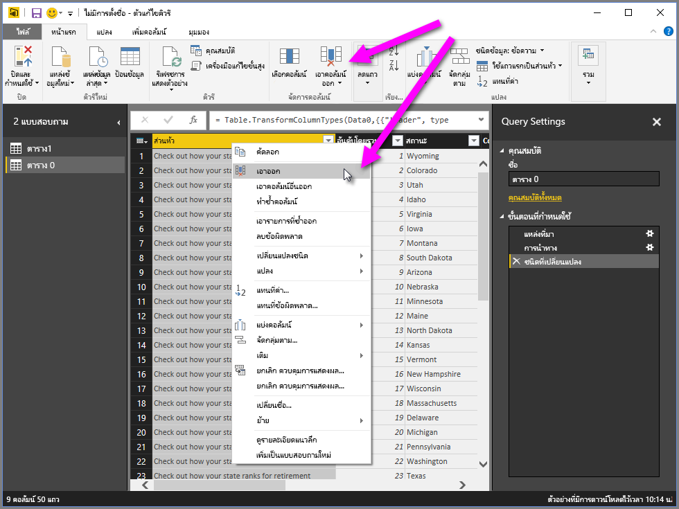

คุณสามารถจัดรูปร่างข้อมูลในหลากหลายวิธีในคิวรีนี้ได้ คุณอาจลบจำนวนแถวจากด้านบนหรือด้านล่าง หรือคุณอาจเพิ่มคอลัมน์ แยกคอลัมน์ แทนที่ค่า และการจัดรูปร่างอื่นๆ ได้ ด้วยคุณลักษณะเหล่านี้ คุณสามารถจัดการตัวแก้ไข Power Query เพื่อรับข้อมูลในแบบคุณต้องการ

## จัดกลุ่มแถว

ในตัวแก้ไข Power Query คุณสามารถจัดกลุ่มค่าจากแถวจำนวนมากรวมเป็นค่าเดียวได้ คุณลักษณะนี้จะเป็นประโยชน์เมื่อทำการสรุปจำนวนผลิตภัณฑ์ที่เสนอ ยอดขายทั้งหมด หรือการนับจำนวนนักเรียน

ในตัวอย่างนี้ คุณจะจัดกลุ่มในชุดข้อมูลการลงทะเบียนการศึกษา ข้อมูลมาจากเวิร์กบุ๊ก Excel มีการจัดรูปร่างในตัวแก้ไข Power Query เพื่อให้ได้เฉพาะคอลัมน์ที่คุณต้องการ เปลี่ยนชื่อตาราง และทำการแปลงอื่นๆ

มาหาคำตอบกันว่าแต่ละรัฐมีหน่วยงานมากเท่าใด (หน่วยงานสามารถรวมถึงเขตโรงเรียน หน่วยงานการศึกษาอื่นๆ เช่น เขตพื้นที่บริการภูมิภาค และอีกมากมาย) เลือกคอลัมน์ **ID ของหน่วยงาน - NCES ที่ได้รับมอบหมาย \[เขต\]ปีล่าสุดที่มี** จากนั้นเลือกปุ่ม **จัดกลุ่มตาม** ในแท็บ **การแปลง** หรือแท็บ **หน้าแรก** ของ ribbon (**จัดกลุ่มตาม** พร้อมใช้งานในทั้งสองแท็บ)

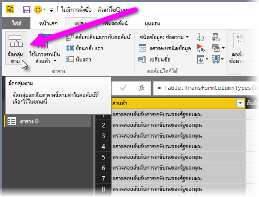

กล่องโต้ตอบ **จัดกลุ่มตาม** จะปรากฏขึ้น เมื่อตัวแก้ไข Power Query จัดกลุ่มแถว จะมีการสร้างคอลัมน์ใหม่เพื่อวางผลลัพธ์จากการ **จัดกลุ่มตาม** คุณสามารถปรับเปลี่ยนการดำเนินการของ **จัดกลุ่มตาม** ดังต่อไปนี้:

1. รายการแบบดรอปดาวน์ที่ไม่มีป้ายชื่อจะระบุคอลัมน์ที่จะจัดกลุ่ม ตัวแก้ไข Power Query ตั้งค่าเริ่มต้นนี้ไปยังคอลัมน์ที่เลือกไว้ แต่คุณสามารถเปลี่ยนเป็นคอลัมน์ใดก็ได้ในตาราง
2. **ชื่อคอลัมน์ใหม่**: ตัวแก้ไข Power Query จะแนะนำชื่อสำหรับคอลัมน์ใหม่ ตามการดำเนินการที่จะใช้จัดกลุ่มคอลัมน์ แต่คุณก็สามารถตั้งชื่อคอลัมน์ใหม่เป็นอะไรก็ได้ตามที่คุณต้องการ
3. **การดำเนินการ**: คุณอาจเลือกการดำเนินการที่ตัวแก้ไข Power Query เช่น **ผลรวม** **ค่าเฉลี่ย** หรือ **นับจำนวนแถวที่แตกต่างกัน** ค่าเริ่มต้นคือ **นับจำนวนแถว**
4. **เพิ่มการจัดกลุ่ม** และ **เพิ่มการรวมกลุ่ม**: ปุ่มเหล่านี้จะพร้อมใช้งานเฉพาะเมื่อคุณเลือกตัวเลือก **ขั้นสูง** ในการดำเนินการเดียว คุณสามารถสร้างการดำเนินการจัดกลุ่ม (การดำเนินการ **จัดกลุ่มตาม**) ในหลายคอลัมน์และสร้างการรวมหลายรายการโดยใช้ปุ่มเหล่านี้ ตัวแก้ไข Power Query จะสร้างคอลัมน์ใหม่ที่ดำเนินการบนหลายๆ คอลัมน์ โดยอิงตามที่คุณได้เลือกไว้ในกล่องโต้ตอบนี้

เลือก **เพิ่มการจัดกลุ่ม** หรือ **เพิ่มการรวมกลุ่ม** เพื่อเพิ่มการจัดกลุ่มหรือการรวมกลุ่มไปยังการดำเนินการใน **จัดกลุ่มตาม** ในการลบการจัดกลุ่มหรือการรวมกลุ่มออก ให้เลือกไอคอนจุดไข่ปลา ( **...** ) ทางด้านขวาของแถว จากนั้น **ลบ** เอาเลย ลองใช้การดำเนินการ **จัดกลุ่มตาม** โดยใช้ค่าเริ่มต้นเพื่อดูว่าจะเกิดอะไรขึ้น

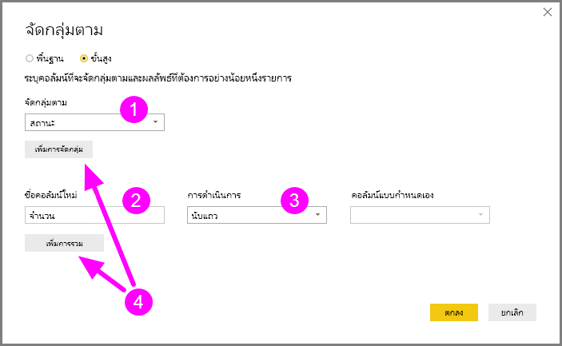

เมื่อคุณเลือก**ตกลง** คิวรีจะดำเนินการ**จัดกลุ่มตาม** และส่งผลลัพธ์กลับมา ว้าว ดูนั่นสิ – รัฐ โอไฮโอ เท็กซัส อิลลินอยส์ และแคลิฟอร์เนีย ตอนนี้แต่ละรัฐมีหน่วยงานมากกว่าหนึ่งพันหน่วยงาน

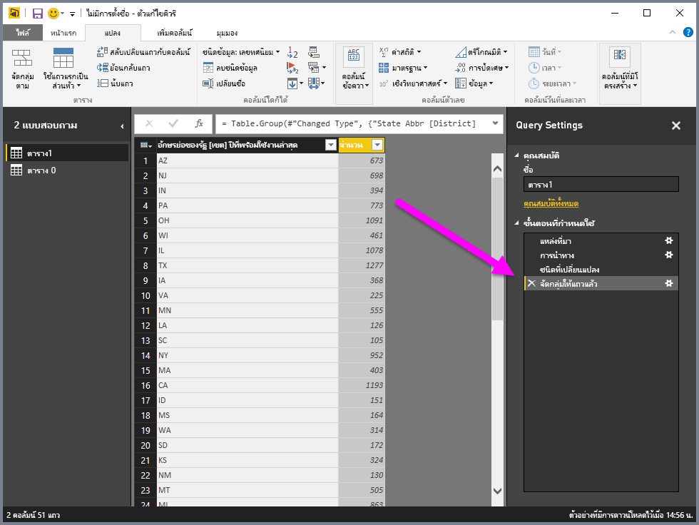

และด้วยตัวแก้ไข Power Query คุณสามารถลบการดำเนินการปรับแต่งครั้งล่าสุดได้เสมอ ในบานหน้าต่าง **การตั้งค่าคิวรี** ภายใต้ขั้นตอน **ที่ใช้** เพียงแค่เลือก **X** ถัดจากขั้นตอนล่าสุดที่เสร็จสิ้นไป เอาเลย ลองทำดู ถ้าคุณยังไม่ถูกใจกับผลลัพธ์ ให้ทำซ้ำขั้นตอน จนกว่าตัวแก้ไข Power Query จะจัดรูปร่างข้อมูลในแบบที่คุณต้องการ

## Pivot คอลัมน์

คุณสามารถ pivot คอลัมน์และสร้างตารางที่มีค่าที่รวมกลุ่มแล้ว สำหรับค่าเฉพาะแต่ละค่าในคอลัมน์ ตัวอย่างเช่น เพื่อหาว่ามีจำนวนสินค้าที่แตกต่างกันเท่าใดในแต่ละประเภทของสินค้า คุณสามารถสร้างตารางเพื่อหาคำตอบได้อย่างรวดเร็ว

มาลองดูตัวอย่างกัน ตาราง **Products_by_Categories** ต่อไปนี้ ได้รับการจัดรูปร่าง เพื่อแสดงเฉพาะผลิตภัณฑ์ที่มีเอกลักษณ์แต่ละผลิตภัณฑ์ (ตามชื่อ) และประเภทที่ผลิตภัณฑ์ถูกจัดเอาไว้ เพื่อสร้างตารางใหม่ที่แสดงการนับจำนวนผลิตภัณฑ์ในแต่ละประเภท (ตามคอลัมน์ **CategoryName**) เลือกคอลัมน์นั้น แล้วเลือก **แปลง** > **คอลัมน์ Pivot**

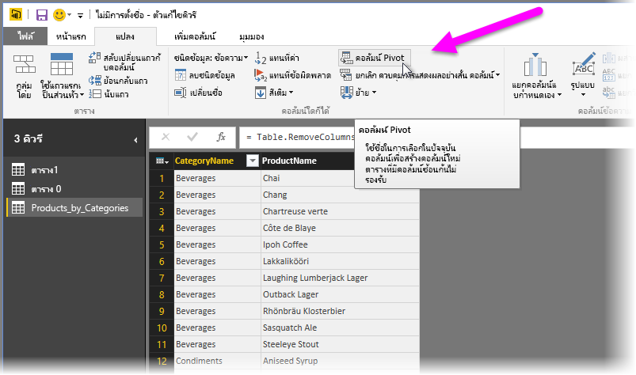

กล่องโต้ตอบ **Pivot คอลัมน์** จะปรากฏขึ้น เพื่อให้คุณทราบว่าค่าของคอลัมน์ใดที่จะนำไปใช้สร้างคอลัมน์ใหม่ (1) (หากชื่อคอลัมน์ **CategoryName** ที่คุณต้องการไม่ปรากฏขึ้น ให้เลือกจากรายการดรอปดาวน์ เมื่อคุณขยาย **ตัวเลือกขั้นสูง** (2) คุณสามารถเลือกฟังก์ชันที่จะนำไปใช้กับค่าที่รวมกลุ่มได้ (3)

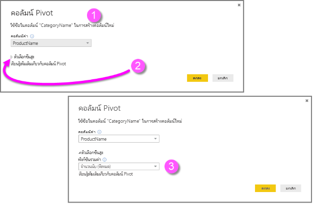

เมื่อคุณเลือก **ตกลง** คิวรีจะแสดงตารางตามคำสั่งการแปลงที่ให้ไว้ในกล่องโต้ตอบ **คอลัมน์ Pivot**

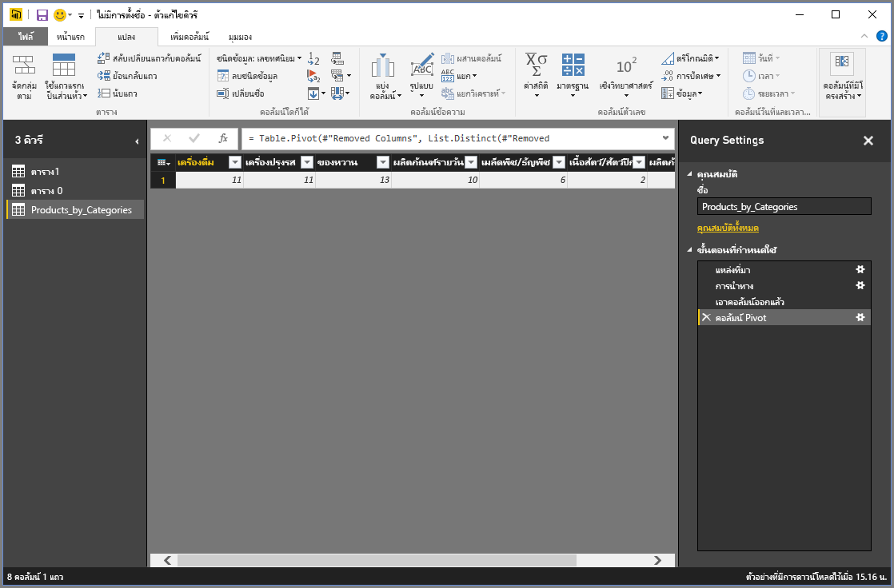

## สร้างคอลัมน์แบบกำหนดเอง

ในตัวแก้ไข Power Query คุณสามารถสร้างสูตรแบบกำหนดเองที่ทำงานได้ในหลายคอลัมน์ในตารางของคุณ จากนั้นคุณจึงวางผลลัพธ์จากสูตรเหล่านั้นลงในคอลัมน์ (แบบกำหนดเอง) ใหม่ ตัวแก้ไข Power Query ทำให้การสร้างคอลัมน์แบบกำหนดเองเป็นไปได้ง่ายขึ้น

ด้วยข้อมูลในเวิร์กบุ๊ก Excel ในตัวแก้ไข Power Query ไปที่แท็บ **เพิ่มคอลัมน์**บน ribbon แล้วเลือก **คอลัมน์แบบกำหนดเอง**

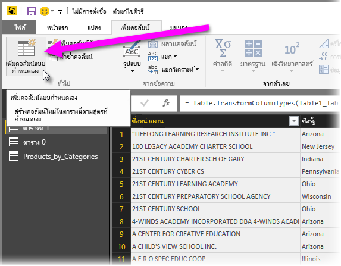

กล่องโต้ตอบต่อไปนี้จะปรากฏขึ้น: ในตัวอย่างนี้ เราจะสร้างคอลัมน์แบบกำหนดเองชื่อว่า *Percent ELL* ที่คำนวณเปอร์เซ็นต์ของนักเรียนทั้งหมดที่เป็นผู้เรียนภาษาอังกฤษ (English Language Learners, ELL)

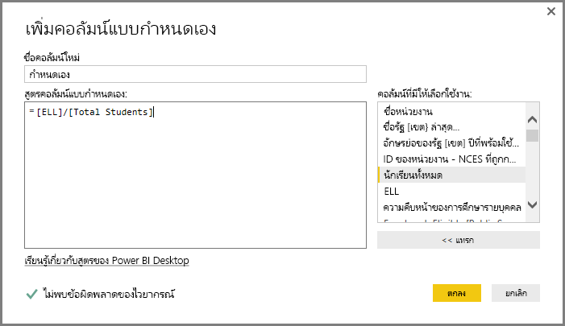

เช่นเดียวกับขั้นตอนอื่นๆ ที่ใช้ในตัวแก้ไข Power Query ถ้าคอลัมน์แบบกำหนดเองใหม่นั้นไม่ได้ให้ข้อมูลที่คุณกำลังค้นหา คุณสามารถลบขั้นตอนออกได้ ในบานหน้าต่าง **การตั้งค่าคิวรี** ภายใต้ **ขั้นตอนที่ใช้** เพียงแค่เลือก **X** ถัดจากขั้นตอน **แบบกำหนดเองที่เพิ่ม**

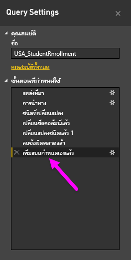

## คิวรีสูตร

คุณสามารถแก้ไขขั้นตอนที่ตัวแก้ไข Power Query สร้างขึ้นได้ คุณยังสามารถสร้างสูตรแบบกำหนดเองซึ่งช่วยให้คุณเชื่อมต่อและจัดรูปร่างข้อมูลของคุณได้แม่นยำยิ่งขึ้น เมื่อใดก็ตามที่ตัวแก้ไข Power Query มีการดำเนินการกับข้อมูล สูตรที่เกี่ยวข้องกับการดำเนินการนั้นจะแสดงอยู่ในแถบสูตร เมื่อต้องการดูแถบสูตร ไปที่แท็บ **มุมมอง** ของ ribbon จากนั้นเลือก **แถบสูตร**

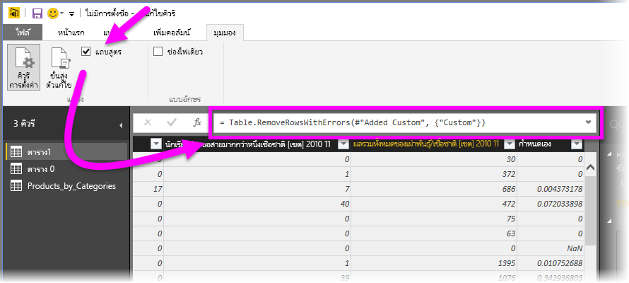

ตัวแก้ไข Power Query จะเก็บขั้นตอนที่นำไปใช้แล้ว ในแต่ละคิวรีให้อยู่ในรูปข้อความที่คุณสามารถดูหรือแก้ไขได้ คุณสามารถดูหรือแก้ไขข้อความสำหรับคิวรีใดๆ ได้โดยใช้ **เครื่องมือแก้ไขขั้นสูง** เพียงเลือก **มุมมอง** จากนั้น **เครื่องมือแก้ไขขั้นสูง**

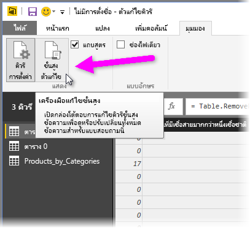

นี่คือตัวอย่างของ**ตัวแก้ไขขั้นสูง** ที่แสดงขั้นตอนคิวรีที่ใช้กับ **USA\_StudentEnrollment** ขั้นตอนเหล่านี้จะถูกสร้างขึ้นในภาษา Power Query Formula Language ซึ่งมักเรียกว่า *M* สำหรับข้อมูล ดูที่ [เรียนรู้เกี่ยวกับสูตร Power Query](https://support.office.com/article/learn-about-power-query-formulas-6bc50988-022b-4799-a709-f8aafdee2b2f) เมื่อต้องการดูข้อมูลจำเพาะของภาษาเอง ดูที่ [ข้อมูลจำเพาะของภาษา Power Query M](/powerquery-m/power-query-m-language-specification)

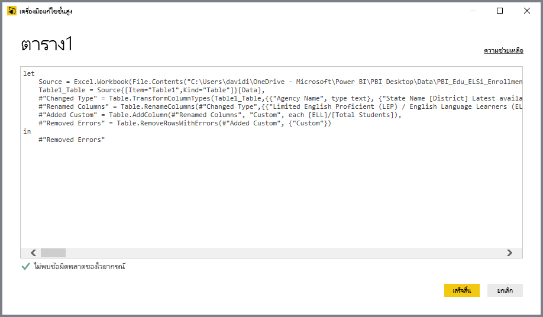

Power BI Desktop มีสูตรคำนวนครอบคลุมหลากหลายประเภท สำหรับข้อมูลเพิ่มเติม และแหล่งอ้างอิงแบบสมบูรณ์ของสูตรในตัวแก้ไข Power Query ทั้งหมด ดูที่ [การอ้างอิงฟังก์ชัน Power Query M](/powerquery-m/power-query-m-function-reference)

## ขั้นตอนถัดไป

คุณสามารถทำสิ่งต่างๆ ได้มากมายด้วย Power BI Desktop สำหรับข้อมูลเพิ่มเติมเกี่ยวกับขีดความสามารถ โปรดดูแหล่งข้อมูลต่อไปนี้:

* [Power BI Desktop คืออะไร](desktop-what-is-desktop.md)
* [ภาพรวมคิวรีกับ Power BI Desktop](desktop-query-overview.md)
* [แหล่งข้อมูลใน Power BI Desktop](desktop-data-sources.md)
* [เชื่อมต่อกับข้อมูลใน Power BI Desktop](desktop-connect-to-data.md)
* [จัดรูปร่างและรวมข้อมูลด้วย Power BI Desktop](desktop-shape-and-combine-data.md)
