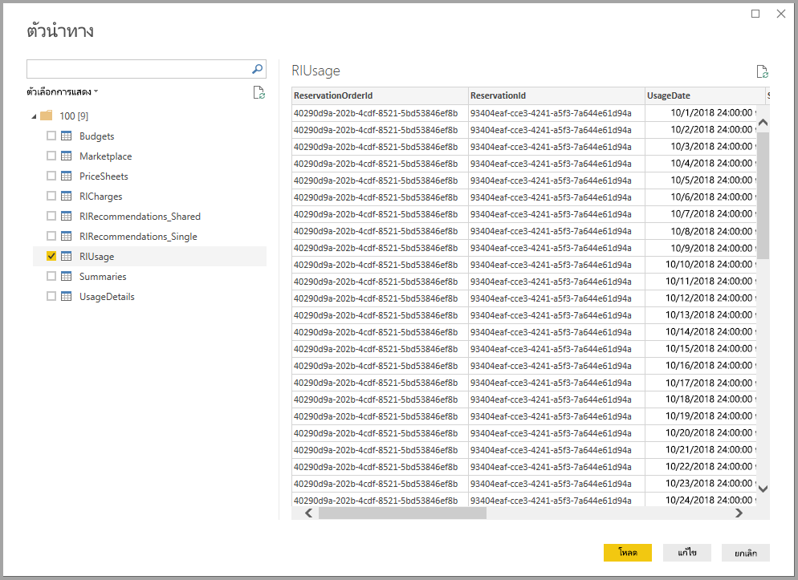

# เชื่อมต่อกับ Microsoft Azure Consumption Insights ใน Power BI desktop

คุณสามารถใช้ Power BI Desktop เพื่อเชื่อมต่อกับ Azure และรับข้อมูลเชิงลึกเกี่ยวกับการใช้บริการ Azure ขององค์กรของคุณ ด้วยสิ่งนี้ คุณสามารถสร้างรายงานแบบกำหนดเองและหน่วยวัดที่ทำให้เข้าใจมากขึ้นและวิเคราะห์การใช้จ่ายของ Azure ของคุณ

> [!NOTE]
> มีการจำกัดการสนับสนุนสำหรับข้อมูลรายจ่ายเชิงลึกของ Microsoft Azure (รุ่นเบต้า) ในฟังก์ชั่นใหม่ ให้ใช้[การจัดการค่าใช้จ่ายของ Azure สำหรับ Power BI](desktop-connect-azure-cost-management.md)

## เชื่อมต่อกับ Azure Consumption Insights

Azure Consumption Insights ช่วยให้คุณสามารถเชื่อมต่อกับt บัญชีการเรียกเก็บเงินของ Azure Enterprise Agreement

ในส่วนนี้ คุณจะได้เรียนรู้วิธีการรับข้อมูลที่คุณต้องการให้ถ่ายโอนโดยใช้ตัวเชื่อมต่อ Azure Enterprise คุณยังจะได้พบการแมป *คอลัมน์รายละเอียดการใช้งาน* ที่พร้อมใช้งานใน **ACI** API (ข้อมูลรายจ่ายเชิงลึกของ Azure)

เพื่อใช้ตัวเชื่อมต่อ**ข้อมูลรายจ่ายเชิงลึกของ Azure** ให้ประสบความสำเร็จ คุณจำเป็นต้องมีสิทธิเข้าถึงคุณลักษณะ Azure Portal Enterprise

ในการใช้ตัวเชื่อมต่อ**ข้อมูลรายจ่ายเชิงลึกของ Azure**ใน **Power BI Desktop**: 

1. จากริบบอน **หน้าแรก** เลือก **รับข้อมูล**

1. จากหมวดหมู่ทางด้านซ้าย เลือก **บริการออนไลน์**  

1. เลือก**ข้อมูลรายจ่ายเชิงลึกของ Microsoft Azure (เบต้า)** 

1. เลือก **เชื่อมต่อ**

   

   ในกล่องโต้ตอบที่ปรากฏขึ้น .shxhvo**หมายเลขการลงทะเบียน Azure**ของคุณ

   

   * คุณสามารถรับหมายเลขการลงทะเบียนของคุณจาก[Azure Enterprise Portal](https://ea.azure.com) ในตำแหน่งที่ตั้งที่แสดงในรูปต่อไปนี้

  

   เวอร์ชันนี้ของตัวเชื่อมต่อนี้รองรับเฉพาะการลงทะเบียนแบบองค์กรจาก https://ea.azure.com การลงทะเบียนในประเทศจีนยังใช้ไม่ได้ในขณะนี้

   ถัดไป แสดง*Access key*เพื่อเชื่อมต่อของคุณ

   

   * Access key สำหรับการลงทะเบียนของคุณ สามารถพบได้ใน[Azure Enterprise Portal](https://ea.azure.com)

  

เมื่อคุณใส*คีย์การเข้าถึง* ของคุณและเลือก **เชื่อมต่อ** บานหน้าต่าง **ตัวนำทาง** จะปรากฏขึ้นและแสดงตารางเก้าตารางที่พร้อมใช้งานสำหรับคุณ:

| ตาราง        | คำอธิบาย |
|------------- | -------------------------------------------------------------|
| **งบประมาณ** | รายละเอียดงบประมาณเพื่อดูค่าใช้จ่ายจริงหรือการใช้งานกับเป้าหมายงบประมาณที่มีอยู่ |
| **MarketPlace** | ค่าธรรมเนียม Azure Marketplace ยึดตามการใช้งานจริง |
| **PriceSheets** | อัตราการใช้โดยตัววัดสำหรับการลงทะเบียน |
| **RICharges** | ค่าใช้จ่ายที่เชื่อมโยงกับอินสแตนซ์ที่สงวนไว้ของคุณมากกว่า 24 เดือนที่ผ่านมา |
| **RIRecommendations_Single** | คำแนะนำในการซื้อมีอินสแตนซ์ที่สงวนไว้ยึดตามแนวโน้มการใช้งานของคุณในการสมัครใช้งานครั้งเดียวในช่วง 7, 30 หรือ 60 วัน |
| **RIRecommendations_Single** | คำแนะนำในการซื้อมีอินสแตนซ์ที่สงวนไว้ตามแนวโน้มการใช้งานของคุณในการสมัครใช้งานทั้งหมดของคุณในช่วง 7, 30 หรือ 60 วัน |
| **RIUsage** | รายละเอียดของปริมาณการใช้สำหรับอินสแตนซ์ที่สงวนไว้ของคุณที่มีอยู่ในช่วงเดือนที่ผ่านมา |
| **สรุป** | ข้อมูลสรุปรายเดือนผ่านยอดดุล การซื้อใหม่ ค่าธรรมเนียมการใช้บริการ Azure Marketplace ค่าบริการปรับปรุง และค่าใช้จ่ายเกิน |
| **UsageDetails**: | การแบ่งย่อยปริมาณที่ใช้และค่าธรรมเนียมการลงทะเบียนโดยประมาณ |

คุณสามารถเลือกกล่องกาเครื่องหมายข้างตารางใดๆ เพื่อดูตัวอย่าง คุณสามารถเลือกโดยการติ๊กกล่องด้านข้างชื่อของพวกเขาอย่างน้อยหนึ่งตาราง จาก นั้นเลือก**การโหลด**

> [!NOTE]
> ตาราง*Summary*และ*PriceSheet*มีเฉพาะ API Key ในระดับลงทะเบียน นอกจากนี้ ตามค่าเริ่มต้นข้อมูลในตารางเหล่านี้มีข้อมูลของเดือนปัจจุบันสำหรับ*การใช้งาน*และ*PriceSheet* ตาราง*Summary*และ*MarketPlace*จะไม่จำกัดเฉพาะเดือนปัจจุบัน
>
>

เมื่อคุณเลือก**โหลด**ข้อมูลจะถูกโหลดลงใน **Power BI Desktop**

เมื่อข้อมูลที่คุณเลือกถูกโหลด ตารางและเขตข้อมูลที่คุณเลือก สามารถเห็นได้ในบานหน้าต่าง**เขตข้อมูล**

## ใช้ Azure Consumption Insights
เพื่อใช้ตัวเชื่อมต่อ**ข้อมูลรายจ่ายเชิงลึกของ Azure** คุณจำเป็นต้องมีสิทธิเข้าถึงคุณลักษณะของ Azure Portal Enterprise

เมื่อคุณโหลดข้อมูลโดยใช้ตัวเชื่อมต่อ **ข้อมูลรายจ่ายเชิงลึกของ Azure** ประสบความสำเร็จ คุณสามารถสร้างหน่วยวัดและคอลัมน์แบบกำหนดเองของคุณเองโดยใช้**ตัวแก้ไขคิวรี** คุณยังสามารถสร้างวิชวล รายงาน และแดชบอร์ดที่คุณสามารถใช้ร่วมกันใน **บริการ Power BI**

กับคิวรีที่ว่างเปล่า คุณสามารถค้นคืนคอลเลกชันคิวรีแบบกำหนดเองของ Azure ตัวอย่างได้ มีอยู่สองวิธีที่คุณสามารถทำการค้นคืนนี้ได้: 

ใน **Power BI Desktop**: 

1. เลือกริบบอน **หน้าแรก** 
2. เลือก **รับข้อมูล** > **คิวรีว่างเปล่า** 

หรือใน **ตัวแก้ไขคิวรี**: 

1. คลิกขวาในบานหน้าต่าง**คิวรี** ด้านซ้าย 
2. เลือก**คิวรีใหม่ > คิวรีว่างเปล่า** จากเมนูที่ปรากฏขึ้น

ใน **แถบสูตร** ให้พิมพ์:

    = MicrosoftAzureConsumptionInsights.Contents

รูปภาพต่อไปนี้แสดงตัวอย่างคอลเลกชันที่ปรากฏขึ้น

เมื่อทำงานกับรายงานและสร้างคิวรี คุณสามารถ:

* เมื่อต้องกำหนดจำนวนเดือนที่เริ่มต้นจากวันที่ปัจจุบัน ให้ใช้*numberOfMonth*
  * ใช้ค่าระหว่างหนึ่งและ 36 แสดงจำนวนเดือนที่คุณต้องการนำเข้าจากวันปัจจุบัน เราขอแนะนำให้ทำการรับข้อมูลเป็นระยะเวลามากกว่า 12 เดือน ระยะเวลาที่จำกัดนี้ช่วยหลีกเลี่ยงข้อจำกัดของการนำเข้าคิวรีของ Power BI และค่าเกณฑ์ปริมาณข้อมูล
* เพ่อกำหนดระยะเวลาของเดือนในหน้าต่างเวลาในอดีต ให้ใช้*startBillingDataWindow*และ*endBillingDataWindow*
* อย่าใช้ *numberOfMonth*ร่วมกับ*startBillingDataWindow* หรือ *endBillingDataWindow*

## โอนย้ายมาจากตัวเชื่อมต่อ Azure Enterprise

ลูกค้าบางรายสร้างวิชวลโดยใช้*ตัวเชื่อมต่อ Azure Enterprise (รุ่นเบต้า)* ในท้ายที่สุดจะถูกแทนที่ด้วยตัวเชื่อมต่อ**ข้อมูลรายจ่ายเชิงลึกของ Azure** ตัวเชื่อมต่อใหม่มีคุณลักษณะและการปรับปรุงที่รวมถึง:

* แหล่งข้อมูลเพิ่มเติมที่พร้อมใช้งานสำหรับ*สรุปยอดดุล*และ*การซื้อของ Marketplace*
* พารามิเตอร์ใหม่และขั้นสูง เช่น*startBillingDataWindow*และ*endBillingDataWindow*
* ประสิทธิภาพการทำงานและตอบสนองได้ดียิ่งขึ้น

ขั้นตอนถัดไปแสดงถึงวิธีการเปลี่ยนไปยังตัวเชื่อมต่อ **ข้อมูลรายจ่ายเชิงลึกของ Azure** ขั้นตอนเหล่านี้จะสงวนการทำงานที่คุณได้ทำเรียบร้อยแล้วในการสร้างแดชบอร์ดหรือรายงานแบบกำหนดเอง

### ขั้นตอนที่ 1: เชื่อมต่อกับ Azure โดยใช้ตัวเชื่อมต่อใหม่
ขั้นตอนแรกคือ การใช้ตัวเชื่อมต่อ**ข้อมูลรายจ่ายเชิงลึกของ Azure** ซึ่งได้มีการอธิบายไว้ก่อนหน้าในบทความนี้โดยละเอียดแล้ว ในขั้นตอนนี้ เลือก**รับข้อมูล > คิวรีว่าง**จากริบบอน**หน้าแรก** ใน**Power BI Desktop**

### ขั้นตอนที่ 2: สร้างคิวรีในตัวแก้ไขขั้นสูง
ใน **ตัวแก้ไขคิวรี** เลือก **ตัวแก้ไขขั้นสูง** จากส่วน **คิวรี** ของริบบอน **หน้าแรก** ในหน้าต่าง **ตัวแก้ไขขั้นสูง** ที่ปรากฎขึ้น ให้ป้อนคิวรีนี้:

    let    
        enrollmentNumber = "100",
        optionalParameters = [ numberOfMonth = 6, dataType="DetailCharges" ],
        data = MicrosoftAzureConsumptionInsights.Contents(enrollmentNumber, optionalParameters)   
    in     
        data

คุณจะต้องแทนที่ค่า *enrollmentNumber*ด้วยหมายเลขการลงทะเบียนของคุณ คุณสามารถรับหมายเลขของคุณจาก [Azure Enterprise Portal](https://ea.azure.com) ได้ พารามิเตอร์ *numberOfMonth* คือ จำนวนเดือนของข้อมูลที่คุณต้องการย้อนกลับจากวันที่ปัจจุบัน ให้ใช้ศูนย์ (0) สำหรับเดือนปัจจุบัน

เมื่อคุณเลือก **เสร็จสิ้น** ในหน้าต่าง **ตัวแก้ไขขั้นสูง** การแสดงตัวอย่างจะรีเฟรชและข้อมูลจากช่วงเดือนที่ระบุจะปรากฎขึ้นในตาราง เลือก**ปิดและใช้**และย้อนกลับ

### ขั้นตอนที่ 3: ย้ายหน่วยวัดและคอลัมน์แบบกำหนดเองลงในรายงานใหม่
ถัดไป คุณจะต้องย้ายคอลัมน์แบบกำหนดเองหรือหน่วยวัดที่คุณสร้างลงในตารางรายละเอียดใหม่ นี้เป็นขั้นตอน

1. เปิด Notepad (หรือตัวแก้ไขข้อความอื่น)
2. เลือกการวัดที่คุณต้องการย้าย คัดลอกข้อความจากฟิลด์ *สูตร* และวางใน Notepad

   
3. เปลี่ยนชื่อ*Query1*เป็นชื่อตารางรายละเอียดต้นฉบับ
4. หากต้องการสร้างหน่วยวัดตารางใหม่และคอลัมน์แบบกำหนดเอง ให้คลิกขวาบนตารางของคุณแล้วเลือก **หน่วยวัดใหม่** จากนั้น ให้ตัดและวางหน่วยวัดและคอลัมน์ที่จัดเก็บไว้ของคุณจนกว่าจะเสร็จสิ้นทั้งหมด

### ขั้นตอนที่ 4: เชื่อมโยงตารางที่มีความสัมพันธ์ใหม่
แดชบอร์ดหลายตัวมีตารางเพิ่มเติมที่ถูกใชเพื่อการค้นหาหรือการกรอง เช่นตารางวันหรือตารางที่ใช้สำหรับโครงการแบบกำหนดเอง เมื่อมีการปรับความสัมพันธ์ดังกล่าว จะช่วยแก้ปัญหาส่วนใหญ่ นี่คือวิธีการทำ

- ในการแท็บ**การสร้างแบบจำลอง**ใน**Power BI Desktop**ให้เลือก**จัดการความสัมพันธ์**เพื่อแสดงหน้าต่างที่ช่วยให้คุณจัดการความสัมพันธ์ภายในแบบจำลอง เชื่อมโยงตารางของคุณใหม่ ตามที่คุณต้องการ

    

### ขั้นตอนที่ 5: ตรวจสอบรูปภาพของคุณ และการปรับเปลี่ยนเขตข้อมูลการจัดรูปแบบตามที่ต้องการ
ณ จุดนี้ วิชวล ตาราง และการค้นหาความหมายที่ลึกดั้งเดิมของคุณควรทำงานตามที่คาดไว้ อย่างไรก็ตาม การปรับแต่งเล็กน้อยบางประการอาจจำเป็น เพื่อจัดรูปแบบลักษณะและความรู้สึกได้อย่างแม่นยำ ใช้เวลาของเวลาในการดูแต่ละแดชบอร์ดและวิชวลของคุณเพื่อให้แน่ใจว่าเป็นไปตามลักษณะที่คุณต้องการให้เป็น

## โดยใช้ Azure Consumption and Insights (ACI) API เพื่อรับข้อมูลปริมาณการใช้
Azure ยังบริการ[**Azure Consumption and Insights (ACI) API**](https://azure.microsoft.com/blog/announcing-general-availability-of-consumption-and-charge-apis-for-enterprise-azure-customers/) คุณสามารถสร้างโซลูชันแบบกำหนดเองของคุณเองเพื่อรวบรวม รายงาน และแสดงข้อมูลปริมาณการใช้ Azure โดยใช้ ACI API

### การแมปชื่อและรายละเอียดการใช้งานระหว่างพอร์ทัล ตัวเชื่อมต่อ และ API
คอลัมน์และชื่อของรายละเอียดในพอร์ทัล Azure จะคล้ายกันใน API และตัวเชื่อมต่อ แต่อาจไม่เหมือนกันเสมอไป เพื่อช่วยให้เข้าใจง่ายยิ่งขึ้น ตารางต่อไปนี้จะเสนอการแมป นอกจากนี้ยัง มีระบุเป็นว่าคอลัมนที่เก่า สำหรับข้อมูลเพิ่มเติม และนิยามคำศัพท์เหล่านี้ ให้ดู[พจนานุกรมข้อมูลการเรียกเก็บเงินของ Azure](https://docs.microsoft.com/azure/billing/billing-enterprise-api-usage-detail)

| ACI Connector / ContentPack ColumnName | ชื่อคอลัมน์ API ACI | ชื่อคอลัมน์ EA | ล้าสมัย / ปัจจุบันสำหรับความเข้ากันได้กับรุ่นก่อนหน้า |
| --- | --- | --- | --- |
| AccountName |accountName |ชื่อบัญชี |ไม่ใช่ |
| AccountId |accountId | |ใช่ |
| AcccountOwnerId |accountOwnerEmail |AccountOwnerId |ไม่ใช่ |
| AdditionalInfo |additionalInfo |AdditionalInfo |ไม่ใช่ |
| AdditionalInfold | | |ใช่ |
| ปริมาณการใช้ |consumedQuantity |ปริมาณการใช้ |ไม่ใช่ |
| บริการที่ใช้ไป |consumedService |บริการที่ใช้ไป |ไม่ใช่ |
| ConsumedServiceId |ConsumedServiceId | |ใช่ |
| ค่าใช้จ่าย |ค่าใช้จ่าย |ExtendedCost |ไม่ใช่ |
| ศูนย์ต้นทุน |costCenter |ศูนย์ต้นทุน |ไม่ใช่ |
| วันที่ |วันที่ |วันที่ |ไม่ใช่ |
| วัน | |วัน |ไม่ใช่ |
| DepartmentName |departmentName |ชื่อแผนก |ไม่ใช่ |
| DepartmentID |departmentId | |ใช่ |
| ID อินสแตนซ์ | | |ใช่ |
| InstanceId |instanceId |ID อินสแตนซ์ |ไม่ใช่ |
| ตำแหน่งที่ตั้ง | | |ใช่ |
| ประเภทตัววัด |meterCategory |ประเภทตัววัด |ไม่ใช่ |
| ID ตัววัด | | |ใช่ |
| ชื่อตัววัด |meterName |ชื่อตัววัด |ไม่ใช่ |
| ขอบเขตตัววัด |meterRegion |ขอบเขตตัววัด |ไม่ใช่ |
| ประเภทย่อยของตัววัด |meterSubCategory |ประเภทย่อยของตัววัด |ไม่ใช่ |
| MeterId |MeterId |ID ตัววัด |ไม่ใช่ |
| เดือน | |เดือน |ไม่ใช่ |
| ผลิตภัณฑ์ |ผลิตภัณฑ์ |ผลิตภัณฑ์ |ไม่ใช่ |
| ProductID |ProductID | |ใช่ |
| กลุ่มทรัพยากร |resourceGroup |กลุ่มทรัพยากร |ไม่ใช่ |
| ตำแหน่งที่ตั้งของทรัพยากร |resourceLocation |ตำแหน่งที่ตั้งของทรัพยากร |ไม่ใช่ |
| ResourceGroupId | | |ใช่ |
| ResourceLocationId |ResourceLocationId | |ใช่ |
| ResourceRate |ResourceRate |ResourceRate |ไม่ใช่ |
| ServiceAdministratorId |ServiceAdministratorId |ServiceAdministratorId |ไม่ใช่ |
| ServiceInfo1 |ServiceInfo1 |ServiceInfo1 |ไม่ใช่ |
| ServiceInfo1Id | | |ใช่ |
| ServiceInfo2 |ServiceInfo2 |ServiceInfo2 |ไม่ใช่ |
| ServiceInfo2Id | | |ใช่ |
| ตัวระบุบริการของร้านค้า |storeServiceIdentifier |ตัวระบุบริการของร้านค้า |ไม่ใช่ |
| StoreServiceIdentifierId | | |ใช่ |
| ชื่อการสมัครใช้งาน |subscriptionName |ชื่อการสมัครใช้งาน |ไม่ใช่ |
| แท็ก |แท็ก |แท็ก |ไม่ใช่ |
| TagsId | | |ใช่ |
| หน่วยวัด |unitOfMeasure |หน่วยวัด |ไม่ใช่ |
| ปี | |ปี |ไม่ใช่ |
| SubscriptionId |SubscriptionId |SubscriptionId |ใช่ |
| SubscriptionGuid |SubscriptionGuid |SubscriptionGuid |ไม่ใช่ |

## ขั้นตอนถัดไป

คุณสามารถเชื่อมต่อไปยังแหล่งข้อมูลต่าง ๆ มากมายโดยใช้ Power BI Desktop สำหรับข้อมูลเพิ่มเติม ให้ดูบทความต่อไปนี้:

* [เชื่อมต่อไปยังข้อมูล Azure Cost Management ใน Power BI Desktop](desktop-connect-azure-cost-management.md)
* [Power BI Desktop คืออะไร](desktop-what-is-desktop.md)
* [แหล่งข้อมูลใน Power BI Desktop](desktop-data-sources.md)
* [จัดรูปทรงและรวมข้อมูลด้วย Power BI Desktop](desktop-shape-and-combine-data.md)
* [เชื่อมต่อกับเวิร์กบุ๊ก Excel ใน Power BI Desktop](desktop-connect-excel.md)   
* [ป้อนข้อมูลลงใน Power BI Desktop โดยตรง](desktop-enter-data-directly-into-desktop.md)   
