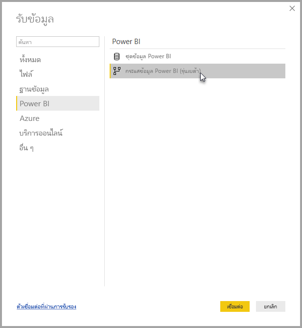
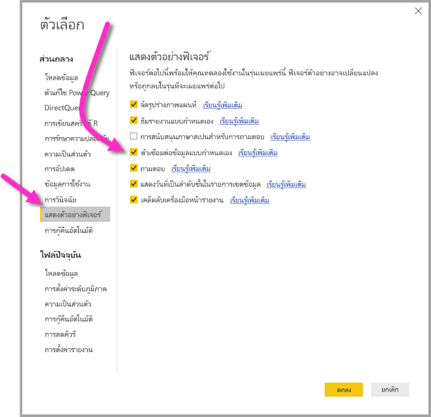

# เชื่อมต่อกับข้อมูลที่สร้างขึ้นโดยกระแสข้อมูล Power BI ใน Power BI Desktop (ตัวอย่าง)
ใน **Power BI Desktop** คุณสามารถเชื่อมต่อกับ **กระแสข้อมูล Power BI** เช่นเดียวกับแหล่งข้อมูลอื่นใน Power BI Desktop ได้

ตัวเชื่อมต่อ**กระแสข้อมูล Power BI (ตัวอย่าง)** ช่วยให้คุณเชื่อมต่อกับเอนทิตีที่สร้างขึ้นโดยกระแสข้อมูลในบริการของ Power BI เนื่องจากกระแสข้อมูลอยู่ในตัวอย่าง มีสองสามขั้นตอนที่คุณต้องทำเพื่อให้ตัวเชื่อมต่อกระแสข้อมูลพร้อมใช้งานบนระบบของคุณ 

## ดาวน์โหลดและเปิดใช้งานตัวเชื่อมต่อกระแสข้อมูล Power BI (ตัวอย่าง)

คุณต้องดาวน์โหลดสำเนาตัวเชื่อมต่อ**กระแสข้อมูล Power BI** แล้วคัดลอกไปยังตำแหน่งที่เฉพาะเจาะจงบนคอมพิวเตอร์ของคุณ ในการอัปเดตรายเดือนของ Power BI Desktop ที่จะถึงนี้ ตัวเชื่อมต่อจะถูกรวมไว้ในรายการของตัวเชื่อมต่อข้อมูลโดยอัตโนมัติ ซึ่งในเวลานั้น ขั้นตอนเหล่านี้จะไม่จำเป็น

คุณสามารถดาวน์โหลด**ตัวเชื่อมต่อกระแสข้อมูล Power BI** ที่ตำแหน่งที่ตั้งนี้: [ตัวเชื่อมต่อกระแสข้อมูล Power BI](https://visuals.azureedge.net/cds-analytics/PublicPreview/CDSA.mez)

ทำตามขั้นตอนต่อไปนี้เพื่อทำให้ตัวเชื่อมต่อ**กระแสข้อมูล Power BI** (ตัวอย่าง) พร้อมใช้งานบนคอมพิวเตอร์ของคุณ:

1. ดาวน์โหลดสำเนาของไฟล์ .MEZ (ไฟล์ตัวเชื่อมต่อข้อมูล) ลูกค้าตัวอย่างส่วนตัวจะได้รับข้อมูลดาวน์โหลดสำหรับไฟล์ .MEZ โดยตรงจาก Microsoft

2. วางไฟล์ตัวเชื่อมต่อข้อมูลที่ดาวน์โหลดไว้ในโฟลเดอร์ต่อไปนี้บนคอมพิวเตอร์ของคุณ:  **เอกสาร > Power BI Desktop > โฟลเดอร์ตัวเชื่อมต่อแบบกำหนดเอง**

3. ใน Power BI Desktop ให้เลือก**ไฟล์ > ตัวเลือกและการตั้งค่า > ตัวเลือก** แล้ว เลือก**แสดงตัวอย่างคุณลักษณะ**ในบานหน้าต่างด้านซ้าย

    

4. เลือกกล่อง**ตัวเชื่อมต่อข้อมูลแบบกำหนดเอง** หากยังไม่ได้เลือกอยู่ 

5. รีสตาร์ต **Power BI Desktop** เพื่อให้ตัวเชื่อมต่อปรากฏขึ้น

## ใช้ตัวเชื่อมต่อกระแสข้อมูล Power BI (ตัวอย่าง)
เมื่อรีสตาร์ต **Power BI Desktop** แล้ว ตัวเชื่อมต่อจะแสดงเป็นแหล่งข้อมูลที่พร้อมใช้งาน เมื่อต้องการเชื่อมต่อกับศูนย์รวมข้อมูล (Datapool) ให้เลือก**รับข้อมูล > บริการออนไลน์ > กระแสข้อมูล Power BI (รุ่นเบต้า)** ดังที่แสดงในรูปต่อไปนี้:

## ข้อควรพิจารณาและข้อจำกัด

ในการใช้รุ่นตัวอย่างของ**ตัวเชื่อมต่อกระแสข้อมูล Power BI** คุณต้องเรียกใช้ **Power BI Desktop** รุ่นล่าสุด คุณสามารถ[ดาวน์โหลด Power BI Desktop](desktop-get-the-desktop.md) ได้ทุกเมื่อ และติดตั้งบนคอมพิวเตอร์ของคุณ เพื่อให้แน่ใจว่าคุณมีรุ่นล่าสุด  

หมายเหตุ: เมื่อตัวเชื่อมต่อกระแสข้อมูล Power BI ปรากฏขึ้นในการปรับปรุงรายเดือนที่จะกำลังจะมาถึงของ **Power BI Desktop** คุณ*ต้อง*ลบไฟล์ .MEZ ที่ดาวน์โหลดมานี้ออกจากโฟลเดอร์**เอกสาร > Power BI Desktop > ตัวเชื่อมต่อแบบกำหนดเอง**ของคุณ เพื่อหลีกเลี่ยงข้อขัดแย้ง 

## ขั้นตอนถัดไป
มีหลากหลายสิ่งที่น่าสนใจที่คุณสามารถทำได้ด้วยการเชื่อมต่อข้อมูล Power BI ตลอดจนบทความเกี่ยวกับ **Power BI Desktop** ที่คุณอาจพบว่ามีประโยชน์:

* [แหล่งข้อมูลใน Power BI Desktop](desktop-data-sources.md)
* [จัดรูปร่างและรวมข้อมูลด้วย Power BI Desktop](desktop-shape-and-combine-data.md)
* [ป้อนข้อมูลลงใน Power BI Desktop โดยตรง](desktop-enter-data-directly-into-desktop.md)   

