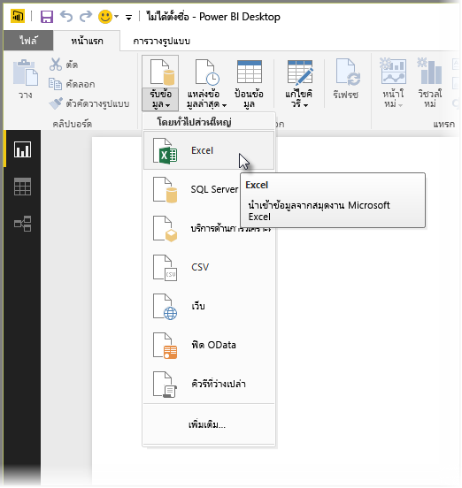
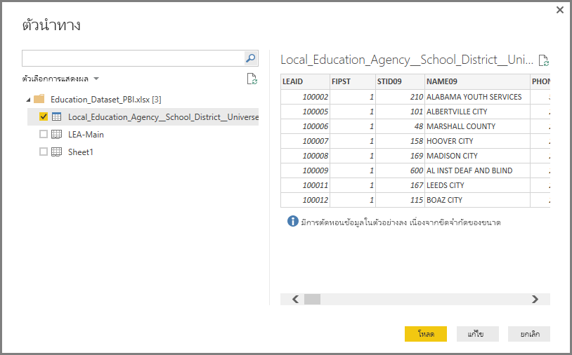
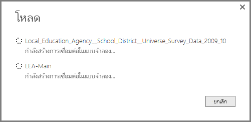

# เชื่อมต่อไปยัง Excel ใน Power BI Desktop
การเชื่อมต่อกับเวิร์กบุ๊ก Excel จาก Power BI Desktop เป็นเรื่องตรงไปตรงมา และบทความนี้จะแนะนำทีละขั้นตอนให้กับคุณ

ใน Power BI Desktop เลือก**รับข้อมูล > Excel** จาก ribbon **หน้าแรก**

เลือกเวิร์กบุ๊กของคุณในกล่องโต้ตอบ**เปิด**ที่ปรากฏขึ้น

Power BI Desktop แสดงตารางของข้อมูลอื่น ๆ จากเวิร์กบุ๊กในหน้าต่าง**ตัวนำทาง** เมื่อคุณเลือกตารางในบานหน้าต่างด้านซ้าย ตัวอย่างของข้อมูลจะปรากฏในบานหน้าต่างด้านขวา

คุณสามารถเลือกปุ่มโหลดเพื่อนำเข้าข้อมูล หรือ ถ้าคุณต้องการแก้ไขข้อมูลโดยใช้**ตัวแก้ไขคิวรี**ก่อนที่นำเข้าไปใน Power BI Desktop เลือกปุ่ม**แก้ไข**

เมื่อคุณโหลดข้อมูล Power BI Desktop แสดงหน้าต่าง**โหลด**และกิจกรรมที่เกี่ยวข้องกับการโหลดข้อมูล  

เมื่อโหลดเสร็จ Power BI Desktop จะแสดงตารางและเขตข้อมูลที่ได้นำเข้าจากเวิร์กบุ๊ก Excel ของคุณในบานหน้าต่าง**เขตข้อมูล** ทางด้านขวาของเดสก์ท็อป

เท่านี้ก็เรียบร้อย!

ตอนนี้คุณพร้อมที่จะใช้ข้อมูลนำเข้าจากเวิร์กบุ๊ก Excel ของคุณใน Power BI Desktop เพื่อสร้างวิชวล รายงาน หรือโต้ตอบกับข้อมูลอื่น ๆ ที่คุณอาจต้องการเชื่อมต่อ และนำเข้า เช่นเวิร์กบุ๊ก Excel อื่นๆ ฐานข้อมูล หรือแหล่งข้อมูลอื่น ๆ

## ขั้นตอนถัดไป
มีข้อมูลหลากหลายประเภทที่คุณสามารถเชื่อมต่อโดยใช้ Power BI Desktop สำหรับข้อมูลเพิ่มเติมเกี่ยวกับแหล่งข้อมูล โปรดดูทรัพยากรต่อไปนี้:

* [Power BI Desktop คืออะไร](desktop-what-is-desktop.md)
* [แหล่งข้อมูลใน Power BI Desktop](desktop-data-sources.md)
* [จัดรูปทรง และรวมข้อมูลด้วย Power BI Desktop](desktop-shape-and-combine-data.md)
* [เชื่อมต่อกับไฟล์ CSV ใน Power BI Desktop](desktop-connect-csv.md)   
* [ใส่ข้อมูลลงใน Power BI Desktop โดยตรง](desktop-enter-data-directly-into-desktop.md)   

