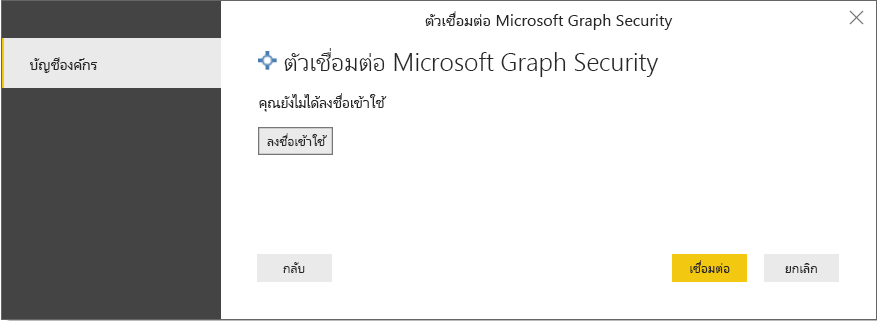
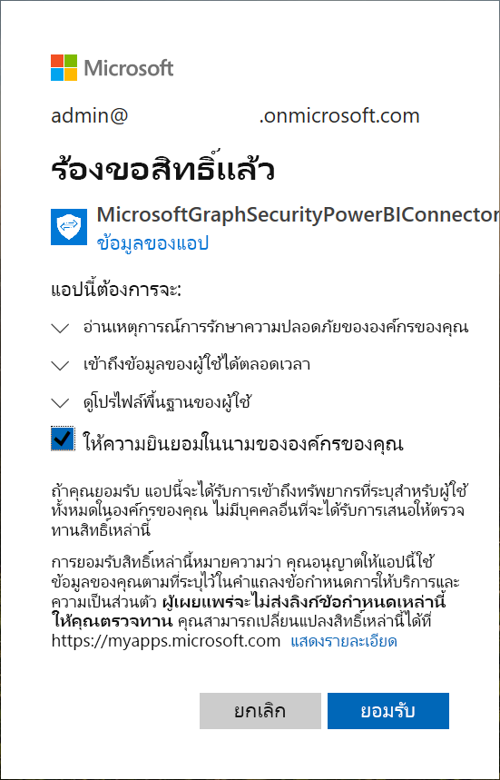
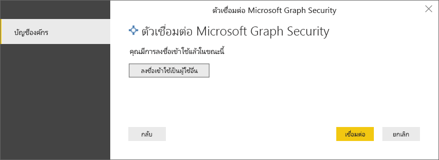
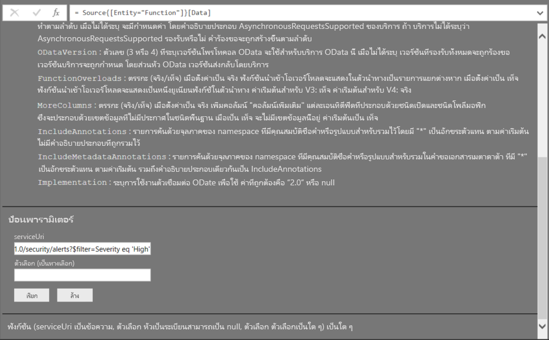
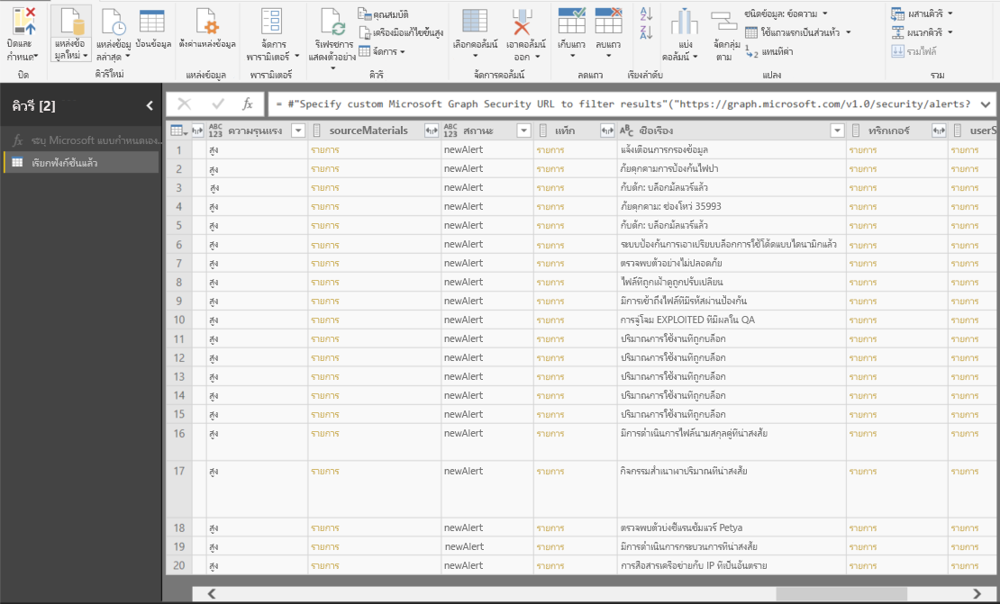

# เชื่อมต่อกับ Microsoft Graph Security API ใน Power BI Desktop

ใช้ตัวเชื่อมต่อ Microsoft Graph Security ของ Power BI Desktop เพื่อเชื่อมต่อกับ [Microsoft Graph Security API](https://aka.ms/graphsecuritydocs) หลังจากนั้นคุณสามารถสร้างแดชบอร์ดและรายงานที่ช่วยให้คุณสามารถรับข้อมูลเชิงลึกให้กับการรักษาความปลอดภัยของคุณที่เกี่ยวข้อง [การแจ้งเตือน](https://docs.microsoft.com/graph/api/resources/alert?view=graph-rest-1.0) และ [Secure Score](https://docs.microsoft.com/graph/api/resources/securescores?view=graph-rest-beta)

Microsoft Graph Security API เชื่อมต่อ [โซลูชันความปลอดภัยหลายรายการ](https://aka.ms/graphsecurityalerts) จาก Microsoft และคู่ค้าด้านระบบนิเวศเพื่อให้การแจ้งเตือนสัมพันธ์กันง่ายขึ้น การผสานรวมนี้ให้การเข้าถึงข้อมูลบริบทที่หลากหลายและทำให้การทำงานอัตโนมัติเป็นเรื่องง่ายขึ้น ซึ่งช่วยให้องค์กรต่างๆ สามารถรับข้อมูลเชิงลึกและดำเนินการกับผลิตภัณฑ์รักษาความปลอดภัยหลายรายการได้อย่างรวดเร็วในขณะที่ลดต้นทุนและความซับซ้อน

## ข้อกำหนดเบื้องต้นเพื่อใช้งานตัวเชื่อมต่อ Microsoft Graph Security

หากต้องการใช้งานตัวเชื่อมต่อ Microsoft Graph Security คุณต้องได้รับความยินยอมจากผู้ดูแลระบบผู้เช่า Azure Active Directory (Azure AD) *อย่างชัดเจน* โปรดดู [ข้อกำหนดการยืนยันตัวตนของ Microsoft Graph](https://aka.ms/graphsecurityauth)
การยินยอมต้องการรหัสแอปพลิเคชันและชื่อของตัวเชื่อมต่อซึ่งอ้างถึงที่นี่และพร้อมใช้งานใน [พอร์ทัล Azure](https://portal.azure.com):

| คุณสมบัติ | ค่า |
|----------|-------|
| **ชื่อแอปพลิเคชัน** | `MicrosoftGraphSecurityPowerBIConnector` |
| **รหัสแอปพลิเคชัน** | `cab163b7-247d-4cb9-be32-39b6056d4189` |
|||

ในการให้ความยินยอมสำหรับตัวเชื่อมต่อ ผู้ดูแลระบบผู้เช่า Azure AD ของคุณสามารถใช้วิธีใดวิธีหนึ่งต่อไปนี้:

* [ให้ความยินยอมสำหรับแอปพลิเคชัน Azure AD](https://docs.microsoft.com/azure/active-directory/develop/v2-permissions-and-consent)

* ตอบสนองต่อการร้องขอที่แอปลอจิกของคุณส่งในระหว่างการเรียกใช้ครั้งแรกผ่าน [ประสบการณ์ความยินยอมของแอปพลิเคชัน](https://docs.microsoft.com/azure/active-directory/develop/application-consent-experience)
   
บัญชีผู้ใช้ที่ลงชื่อเข้าใช้ตัวเชื่อมต่อ Microsoft Graph Security ต้องเป็นสมาชิกของบทบาทผู้ดูแลระบบตัวอ่านระบบความปลอดภัยแบบจำกัดใน Azure AD *ตัวอ่านระบบความปลอดภัย* หรือ *ผู้ดูแลระบบความปลอดภัย* โปรดดู [กำหนดบทบาท Azure AD ให้ผู้ใช้](https://docs.microsoft.com/graph/security-authorization#assign-azure-ad-roles-to-users)

## ใช้ตัวเชื่อมต่อ Microsoft Graph Security

ทำตามขั้นตอนเหล่านี้เพื่อใช้ตัวเชื่อมต่อ:

1. เลือก **รับข้อมูล** > **เพิ่มเติม** จากริบบอน **หน้าแรก** ใน Power BI Desktop
2. เลือก **บริการออนไลน์** จากรายการหมวดหมู่ทางด้านซ้ายของหน้าต่าง
3. โปรดเลือก **การรักษาความปลอดภัยของ Microsoft Graph**

    
    
4. ในหน้าต่าง**Microsoft Graph Security** ให้เลือกเวอร์ชันของ Microsoft Graph API เพื่อทำการคิวรี : **v1.0** หรือ **beta**

    
    
5. ลงชื่อเข้าใช้บัญชี Azure Active Directory เมื่อคุณได้รับพร้อมต์แจ้ง บัญชีนี้ต้องมีบทบาท *ตัวอ่านระบบความปลอดภัย* หรือ *ผู้ดูแลระบบความปลอดภัย* ดังที่กล่าวไว้ในส่วนก่อนหน้า

     
    
6. ถ้าคุณเป็นผู้ดูแลระบบผู้เช่า *และ* คุณยังไม่ได้ให้ความยินยอมกับตัวเชื่อมต่อ Microsoft Graph Security Power BI (แอปพลิเคชัน) คุณจะเห็นกล่องโต้ตอบต่อไปนี้ โปรดเลือก **ให้ความยินยอมในนามขององค์กรของคุณ**

    
    
7. เมื่อคุณลงชื่อเข้าใช้แล้ว คุณจะเห็นกล่องโต้ตอบต่อไปนี้ที่ระบุว่าคุณได้รับการตรวจสอบสิทธิ์แล้ว เลือก **เชื่อมต่อ**

    
    
8. หลังจากคุณเชื่อมต่อแล้ว หน้าต่าง **ตัวนำทาง** จะแสดงการแจ้งเตือน คะแนนความปลอดภัย และเอนทิตีอื่น ๆ ที่มีอยู่ใน [Microsoft Graph Security API](https://aka.ms/graphsecuritydocs) สำหรับเวอร์ชันที่คุณเลือกในขั้นตอนที่ 4 เลือกเอนทิตี้ตั้งแต่หนึ่งรายการขึ่นไปเพื่อนำเข้า และใช้ใน Power BI Desktop จาดนั้น เลือก **โหลด** เพื่อดูผลลัพธ์ที่แสดงหลังจากขั้นตอนที่ 9

    
    
9. ถ้าคุณต้องการใช้งานคิวรีขั้นสูงกับ Microsoft Graph Security API ให้เลือก**ระบุ URL ของ Microsoft Graph Security แบบกำหนดเองเพื่อกรองผลลัพธ์** ใช้ฟังก์ชันนี้เพื่อส่งคิวรี [OData.Feed](https://docs.microsoft.com/power-bi/desktop-connect-odata) ไปยัง Microsoft Graph Security API ด้วยสิทธิ์ที่จำเป็น

   ตัวอย่างต่อไปนี้ใช้ `https://graph.microsoft.com/v1.0/security/alerts?$filter=Severity eq 'High'`*serviceUri* เมื่อต้องการดูวิธีสร้างคิวรีเพื่อกรอง เรียงลำดับ หรือดึงผลลัพธ์ล่าสุดให้ดูที่ [ตัวเลือกคิวรีระบบ OData](https://docs.microsoft.com/graph/query-parameters)

   
    
   เมื่อคุณเลือกฟังก์ชัน **Invoke**, **OData.Feed** ทำให้เรียกใช้ API ซึ่งเปิดตัวแก้ไขคิวรี คุณกรองและปรับแต่งชุดข้อมูลที่คุณต้องการใช้ จากนั้นคุณโหลดข้อมูลนั้นลงใน Power BI Desktop

นี่คือหน้าต่างผลลัพธ์สำหรับเอนทิตี Microsoft Graph Security ที่เราคิวรีไป:

   
    

ตอนนี้คุณพร้อมที่จะใช้ข้อมูลที่นำเข้าจากตัวเชื่อมต่อ Microsoft Graph Security ใน Power BI Desktop แล้ว คุณสามารถสร้างกราฟิกหรือรายงานได้ หรือคุณสามารถโต้ตอบกับข้อมูลอื่นที่คุณนำเข้าจากเวิร์กบุ๊ก Excel ฐานข้อมูล หรือแหล่งข้อมูลอื่นได้

## ขั้นตอนถัดไป
* ดูตัวอย่างและเทมเพลต Power BI ที่ใช้ตัวเชื่อมต่อนี้ที่ [ตัวอย่าง Microsoft Graph Security GitHub Power BI](https://aka.ms/graphsecuritypowerbiconnectorsamples)

* สำหรับสถานการณ์ผู้ใช้และข้อมูลเพิ่มเติม โปรดดู [โพสต์บล็อกตัวเชื่อมต่อของ Microsoft Graph Security Power BI นี้](https://aka.ms/graphsecuritypowerbiconnectorblogpost)

* คุณสามารถเชื่อมต่อกับข้อมูลทุกประเภทได้โดยใช้ Power BI Desktop สำหรับข้อมูลเพิ่มเติม โปรดดูทรัพยากรต่อไปนี้:

    * [Power BI Desktop คืออะไร](desktop-what-is-desktop.md)
    * [แหล่งข้อมูลใน Power BI Desktop](desktop-data-sources.md)
    * [จัดรูปร่างและรวมข้อมูลด้วย Power BI Desktop](desktop-shape-and-combine-data.md)
    * [เชื่อมต่อกับเวิร์กบุ๊ก Excel ใน Power BI Desktop](desktop-connect-excel.md)
    * [ป้อนข้อมูลลงใน Power BI Desktop โดยตรง](desktop-enter-data-directly-into-desktop.md)
