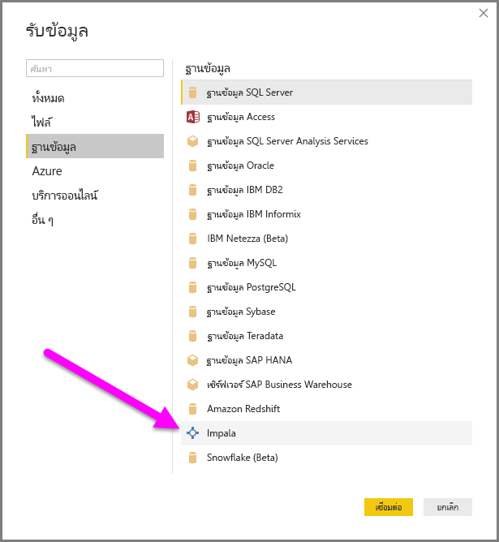

# เชื่อมต่อกับฐานข้อมูล Impala ใน Power BI Desktop
ใน Power BI Desktop คุณสามารถเชื่อมต่อกับฐานข้อมูล **Impala** และใช้ข้อมูลเบื้องต้นเช่นเดียวกับแหล่งข้อมูลอื่นใน Power BI Desktop ได้

## เชื่อมต่อกับฐานข้อมูล Impala
ในการเชื่อมต่อกับฐานข้อมูล **Impala** เลือก**รับข้อมูล**จาก Ribbon **หน้าแรก** ใน Power BI Desktop เลือก**ฐานข้อมูล**จากประเภททางด้านซ้าย จากนั้นคุณจะเห็น **Impala**

ในหน้าต่าง **Impala** ที่ปรากฏขึ้น ให้พิมพ์หรือวางชื่อเซิร์ฟเวอร์ Impala ลงในกล่องแล้วเลือก**ตกลง** โปรดทราบว่าคุณสามารถเลือก**นำเข้า**ข้อมูลได้โดยตรงใน Power BI หรือจะใช้ **DirectQuery** ก็ได้ เรียนรู้เพิ่มเติมเกี่ยวกับ[การใช้ DirectQuery](desktop-use-directquery.md)

เมื่อได้รับพร้อมท์ ใส่ข้อมูลประจำตัวของคุณ หรือเชื่อมต่อแบบไม่ระบุชื่อ ตัวเชื่อมต่อ Impala สนับสนุนการรับรองความถูกต้องแบบไม่ระบุชื่อ, แบบพื้นฐาน (ชื่อผู้ใช้ + รหัสผ่าน) และ แบบ Windows

> [!NOTE]
> เมื่อคุณใส่ชื่อผู้ใช้และรหัสผ่านสำหรับเซิร์ฟเวอร์ **Impala** ที่เฉพาะเจาะจงแล้ว Power BI Desktop จะใช้ข้อมูลประจำตัวเดียวกันนั้นเพื่อพยายามเชื่อมต่ออีกครั้ง คุณสามารถปรับเปลี่ยนข้อมูลประจำตัวเหล่านั้นได้โดยไปที่ **ไฟล์ > ตัวเลือกและการตั้งค่า > การตั้งค่าแหล่งข้อมูล**
> 
> 

เมื่อเชื่อมต่อเสร็จเรียบร้อยแล้ว หน้าต่าง**ตัวนำทาง**จะปรากฏขึ้น และแสดงข้อมูลที่พร้อมใช้งานบนเซิร์ฟเวอร์ ซึ่งคุณสามารถเลือกองค์ประกอบหนึ่งรายการหรือหลายรายการเพื่อนำเข้าและใช้ใน**Power BI Desktop** ได้

## ข้อควรพิจารณาและข้อจำกัด
มีบางข้อจำกัดและข้อควรพิจารณาที่ควรระลึกถึงสำหรับตัวเชื่อมต่อ**Impala**:

* ตัวเชื่อมต่อ Impala สนับสนุนเกตเวย์ข้อมูลภายในองค์กร โดยใช้กลไกการรับรองความถูกต้องที่สนับสนุนสามแบบ

## ขั้นตอนถัดไป
มีข้อมูลหลากหลายประเภทที่คุณสามารถเชื่อมต่อโดยใช้ Power BI Desktop สำหรับข้อมูลเพิ่มเติมเกี่ยวกับแหล่งข้อมูล โปรดดูทรัพยากรต่อไปนี้:

* [Power BI Desktop คืออะไร](desktop-what-is-desktop.md)
* [แหล่งข้อมูลใน Power BI Desktop](desktop-data-sources.md)
* [จัดรูปทรงและรวมข้อมูลด้วย Power BI Desktop](desktop-shape-and-combine-data.md)
* [เชื่อมต่อกับเวิร์กบุ๊ก Excel ใน Power BI Desktop](desktop-connect-excel.md)   
* [ป้อนข้อมูลลงใน Power BI Desktop โดยตรง](desktop-enter-data-directly-into-desktop.md)   

