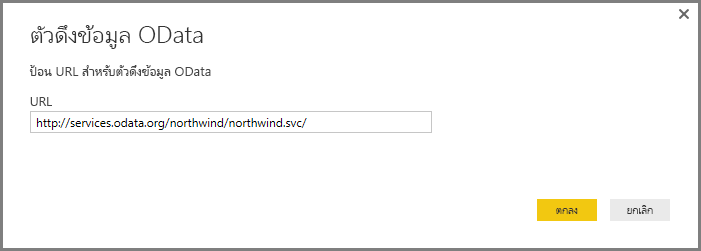
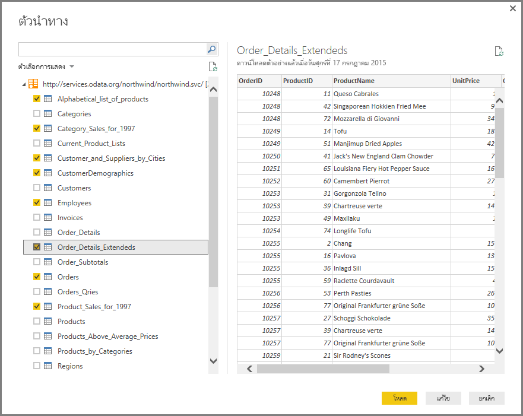
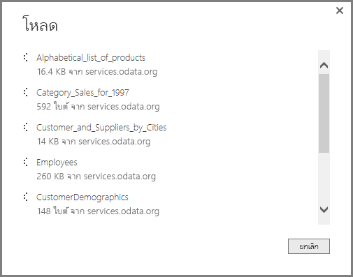
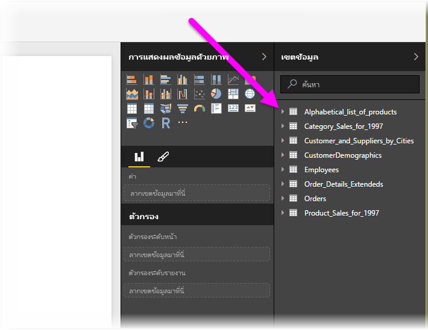

# เชื่อมต่อกับตัวดึงข้อมูล OData ใน Power BI Desktop
ใน Power BI Desktop คุณสามารถเชื่อมต่อกับ **ตัวดึงข้อมูล OData** และใช้ข้อมูลเบื้องต้นเช่นเดียวกับแหล่งข้อมูลอื่นใน Power BI Desktop ได้

เมื่อต้องการเชื่อมต่อกับตัวดึงข้อมูล OData เลือก**รับข้อมูล > ตัวดึงข้อมูล OData**จาก Ribbon **หน้าหลัก** ใน Power BI Desktop

ในหน้าต่าง**ตัวดึงข้อมูล OData**ที่ปรากฎขึ้น พิมพ์ หรือวาง URL ของตัวดึงข้อมูล OData ของคุณลงในกล่อง และเลือก**ตกลง**

Power BI Desktop เชื่อมต่อกับตัวดึงข้อมูล OData และแสดงตารางที่พร้อมใช้งานและองค์ประกอบข้อมูลอื่น ๆ ในหน้าต่าง**ตัวนำทาง** เมื่อคุณเลือกหนึ่งองค์ประกอบ พื้นที่ด้านขวาของหน้าต่าง**ตัวนำทาง**จะแสดงตัวอย่างของข้อมูล คุณสามารถเลือกตารางต่าง ๆ ได้มากเท่าที่คุณต้องการนำเข้า หน้าต่าง**ตัวนำทาง**จะแสดงตัวอย่างของตารางที่เลือกในปัจจุบัน

คุณสามารถเลือกปุ่ม**แก้ไข** ซึ่งจะเปิด**ตัวแก้ไขแบบสอบถาม**ขึ้นมา ในหน้าต่างนี้คุณจะสามารถจัดการรูปร่างและเปลี่ยนแปลงข้อมูลจากตัวดึงข้อมูล OData ได้ ก่อนที่จะนำเข้าข้อมูลไปยัง Power BI Desktop หรือคุณสามารถเลือกปุ่ม**โหลด** และนำเข้าองค์ประกอบข้อมูลทั้งหมดที่คุณได้เลือกในช่องแสดงข้อมูลด้านซ้าย

เมื่อเราเลือก**การโหลด** Power BI Desktop จะนำเข้ารายการที่เลือกไว้และแสดงหน้าต่าง**การโหลด**ของความคืบหน้าการนำเข้า

เมื่อเสร็จสมบูรณ์ Power BI Desktop จะทำตารางที่เลือกและองค์ประกอบข้อมูลอื่น ๆ ที่พร้อมใช้งานในพื้นที่**ช่องข้อมูล** ที่พบบนด้านขวาของตัวมุมมอง*รายงาน*ใน Power BI Desktop

เท่านี้ก็เรียบร้อย!

ตอนนี้คุณพร้อมที่จะใช้ข้อมูลที่นำเข้าจากตัวดึงข้อมูล OData ใน Power BI Desktop เพื่อสร้างภาพ รายงาน หรือโต้ตอบกับข้อมูลอื่น ๆ ที่คุณอาจต้องการเชื่อมโยงและต้องการนำเข้า เช่น สมุดงาน Excel อื่น ๆ ฐานข้อมูล หรือแหล่งข้อมูลอื่น ๆ

### ขั้นตอนถัดไป
มีข้อมูลหลากหลายประเภทที่คุณสามารถเชื่อมต่อโดยใช้ Power BI Desktop สำหรับข้อมูลเพิ่มเติมเกี่ยวกับแหล่งข้อมูล โปรดดูทรัพยากรต่อไปนี้:

* [เริ่มต้นใช้งาน Power BI Desktop](desktop-getting-started.md)
* [แหล่งข้อมูลใน Power BI Desktop](desktop-data-sources.md)
* [จัดรูปร่างและรวมข้อมูลด้วย Power BI Desktop](desktop-shape-and-combine-data.md)
* [เชื่อมต่อกับสมุดงาน Excel ใน Power BI Desktop](desktop-connect-excel.md)   
* [ใส่ข้อมูลลงใน Power BI Desktop โดยตรง](desktop-enter-data-directly-into-desktop.md)   

