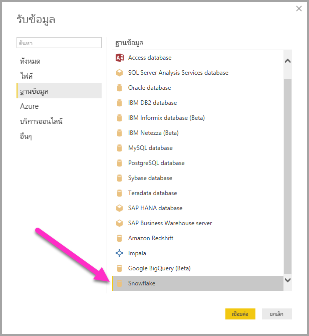
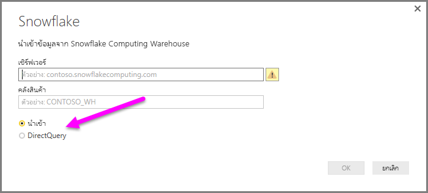
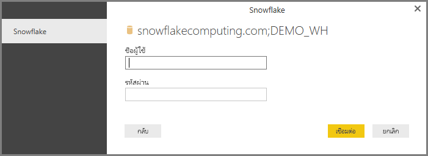
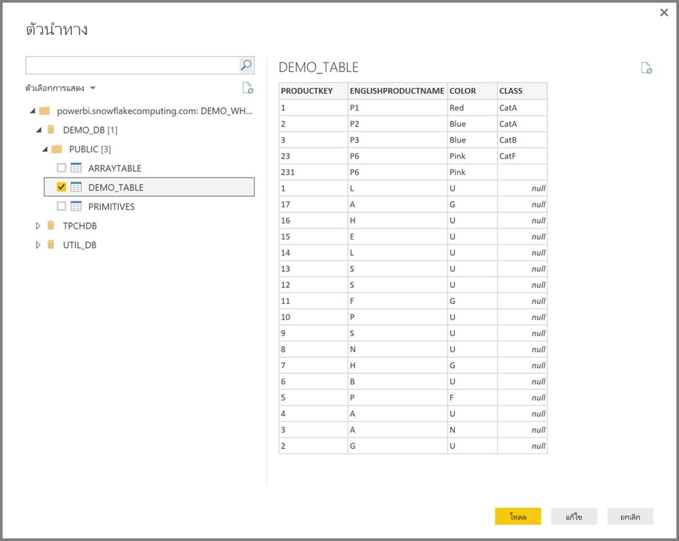

# เชื่อมต่อกับ Snowflake ใน Power BI Desktop
ใน Power BI Desktop คุณสามารถเชื่อมต่อไปยัง **Snowflake** Computing Warehouse และใช้ข้อมูลพื้นฐานได้เช่นเดียวกับแหล่งข้อมูลอื่นๆ ใน Power BI Desktop 

> [!NOTE]
> คุณยัง*ต้อง*ติดตั้ง**ไดรฟ์เวอร์ Snowflake ODBC** บนคอมพิวเตอร์ที่ใช้ตัวเชื่อมต่อ **Snowflake** โดยใช้สถาปัตยกรรมที่ตรงกับการติดตั้ง  **Power BI Desktop** 32 บิตหรือ 64 บิต ไปยังลิงก์ต่อไปนี้แล้ว[ดาวน์โหลดไดรฟ์เวอร์ Snowflake ODBC ที่เหมาะสม](http://go.microsoft.com/fwlink/?LinkID=823762)
> 
> 

## เชื่อมต่อกับ Snowflake Computing Warehouse
เมื่อต้องการเชื่อมต่อกับ **Snowflake** Computing Warehouse ให้เลือก**เรียกใช้ข้อมูล**จากแถบ**หน้าหลัก**ใน Power BI Desktop เลือก**ฐานข้อมูล**จากประเภททางด้านซ้าย จากนั้นคุณจะเห็น **Snowflake**

ในหน้าต่าง **Snowflake** ที่ปรากฏขึ้น ให้พิมพ์หรือวางชื่อ Snowflake Computing Warehouse ลงในกล่อง แล้วเลือก**ตกลง** โปรดทราบว่าคุณสามารถเลือก**นำเข้า**ข้อมูลได้โดยตรงใน Power BI หรือจะใช้ **DirectQuery** ก็ได้ เรียนรู้เพิ่มเติมเกี่ยวกับ[การใช้ DirectQuery](desktop-use-directquery.md)

เมื่อได้รับพร้อมท์ ให้ใส่ชื่อผู้ใช้และรหัสผ่านของคุณ

> [!NOTE]
> เมื่อคุณใส่ชื่อผู้ใช้และรหัสผ่านสำหรับเซิร์ฟเวอร์ **Snowflake** ที่เฉพาะเจาะจงแล้ว Power BI Desktop จะใช้ข้อมูลประจำตัวเดียวกันนั้นเพื่อพยายามเชื่อมต่ออีกครั้ง คุณสามารถปรับเปลี่ยนข้อมูลประจำตัวเหล่านั้นได้โดยไปที่ **ไฟล์ > ตัวเลือกและการตั้งค่า > การตั้งค่าแหล่งข้อมูล**
> 
> 

เมื่อเชื่อมต่อเสร็จเรียบร้อยแล้ว หน้าต่าง**ตัวนำทาง**จะปรากฏขึ้น และแสดงข้อมูลที่พร้อมใช้งานบนเซิร์ฟเวอร์ ซึ่งคุณสามารถเลือกองค์ประกอบหนึ่งรายการหรือหลายรายการเพื่อนำเข้าและใช้ใน**Power BI Desktop** ได้

คุณสามารถ**โหลด**ตารางที่เลือก ซึ่งจะรวมทั้งตารางลง ใน **Power BI Desktop** หรือคุณสามารถ**แก้ไข**คิวรี ซึ่งจะเปิด**ตัวแก้ไขคิวรี**เพื่อให้คุณสามารถกรองและปรับปรุงชุดข้อมูลที่ต้องการใช้ จากนั้นโหลดชุดข้อมูลที่ปรับปรุงแล้วลงใน **Power BI Desktop**

## ขั้นตอนถัดไป
มีข้อมูลหลากหลายประเภทที่คุณสามารถเชื่อมต่อโดยใช้ Power BI Desktop สำหรับข้อมูลเพิ่มเติมเกี่ยวกับแหล่งข้อมูล โปรดดูทรัพยากรต่อไปนี้:

* [Power BI Desktop คืออะไร](desktop-what-is-desktop.md)
* [แหล่งข้อมูลใน Power BI Desktop](desktop-data-sources.md)
* [จัดรูปทรงและรวมข้อมูลด้วย Power BI Desktop](desktop-shape-and-combine-data.md)
* [เชื่อมต่อกับเวิร์กบุ๊ก Excel ใน Power BI Desktop](desktop-connect-excel.md)   
* [ป้อนข้อมูลลงใน Power BI Desktop โดยตรง](desktop-enter-data-directly-into-desktop.md)   

