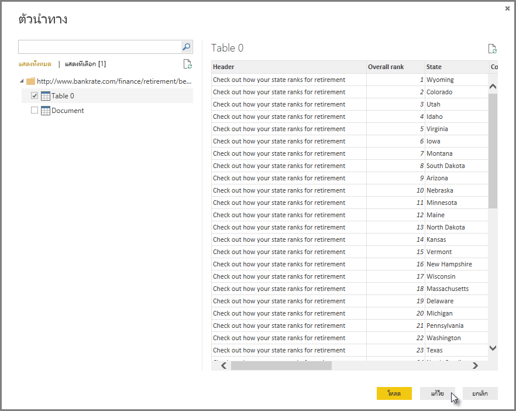
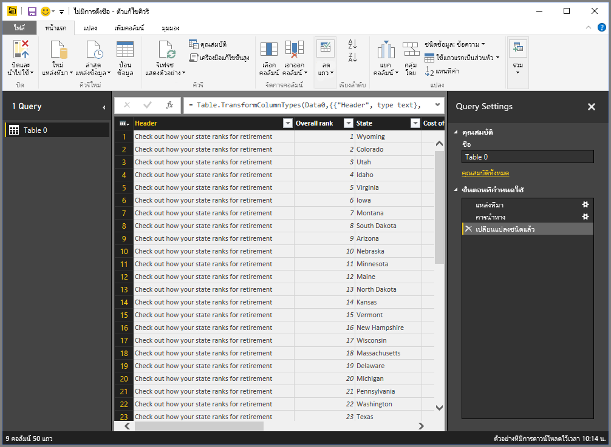
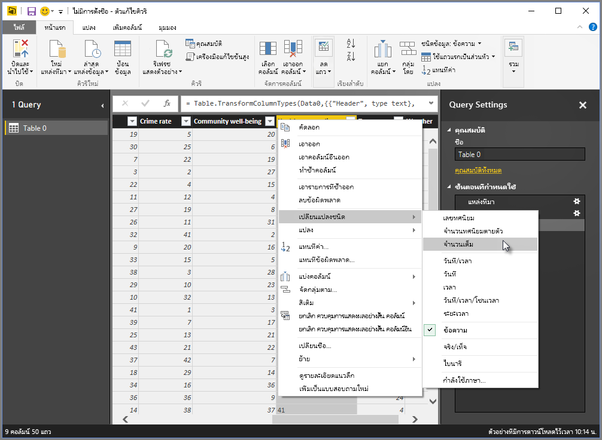
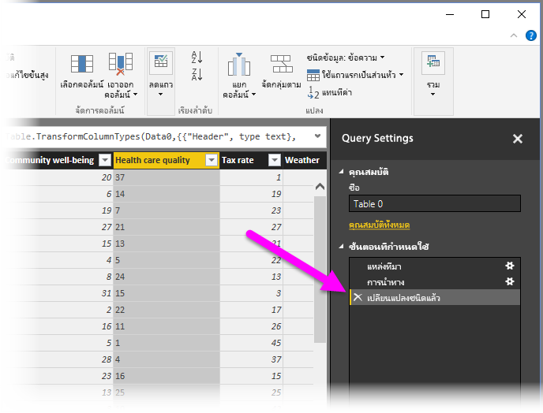
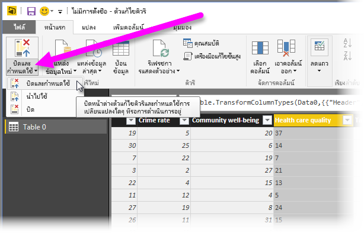
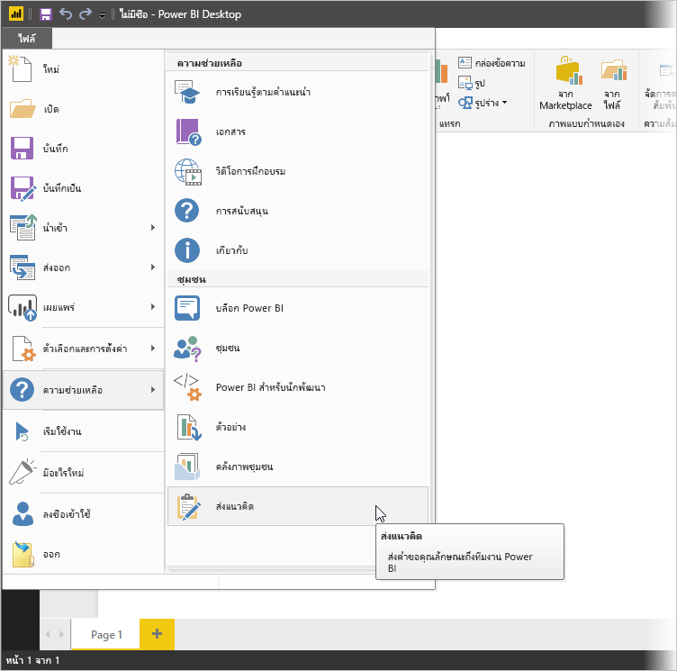

# เชื่อมต่อกับข้อมูลใน Power BI Desktop
ด้วย Power BI Desktop คุณสามารถเชื่อมต่อไปทั่วโลกแห่งข้อมูลที่กำลังขยายตัวได้อย่างง่ายดาย ถ้าคุณไม่มี Power BI Desktop คุณสามารถ[ดาวน์โหลด](http://go.microsoft.com/fwlink/?LinkID=521662)และติดตั้งได้

ใน Power BI Desktop จะมีแหล่งข้อมูลต่าง ๆ *ทุกประเภท*ที่พร้อมใช้งาน รูปต่อไปนี้แสดงวิธีการเชื่อมต่อกับข้อมูล โดยการเลือก**ไฟล์** แถบ ribbon จากนั้น**รับข้อมูล\>เพิ่มเติม**

## ตัวอย่างการเชื่อมต่อกับแหล่งข้อมูล
สำหรับตัวอย่างนี้ เราจะเชื่อมต่อไปยัง**Web**แหล่งข้อมูล

สมมติว่า คุณกำลังเกษียณ – คุณต้องการใช้ชีวิตในสถานที่ที่มีแสงแดดเยอะ ๆ มีการเก็บภาษีที่เหมาะสม และมีการดูแลสุขภาพที่ดี หรือ... คุณอาจจะเป็นนักวิเคราะห์ข้อมูล และคุณต้องการให้ข้อมูลเหล่านั้นเป็นประโยชน์ต่อลูกค้าของคุณ เช่น ช่วยลูกค้าผู้ผลิตเสื้อกันฝนในการตั้งเป้าหมายการขายในสถานที่ที่มีฝนตก*เยอะ*

ไม่ว่าวิธีใด คุณจะพบแหล่งข้อมูลบนเว็บที่มีข้อมูลที่น่าสนใจเกี่ยวกับหัวข้อเหล่านั้น และอื่น ๆ อีกมาก

[*http://www.bankrate.com/finance/retirement/best-places-retire-how-state-ranks.aspx*](http://www.bankrate.com/finance/retirement/best-places-retire-how-state-ranks.aspx)

คุณเลือก**รับข้อมูล\>เว็บ**และพิมพ์อยู่

เมื่อคุณเลือก**ตกลง** ฟังก์ชันการทำงานของ Power BI Desktop ของ **Query**จะทำงาน Power BI Desktop ติดต่อแหล่งข้อมูลเว็บ และหน้าต่าง**ตัวนำทาง**ส่งกลับผลลัพธ์ของสิ่งที่พบบนหน้าเว็บ ในกรณีนี้ ได้พบตาราง (ตาราง 0) และในเอกสารโดยรวม เราสนใจในตาราง ดังนั้นเราเลือกตารางจากรายการ หน้าต่าง**ตัวนำทาง**จะแสดงตัวอย่าง

ในตอนนี้ เราสามารถแก้ไขแบบสอบถามก่อนทำการโหลดตาราง โดยการเลือก**แก้ไข**จากด้านล่างของหน้าต่าง หรือเราสามารถโหลดตารางได้

ถ้าเราเลือก**แก้ไข**จะมีการโหลดตารางขึ้นมา และ Query Editor จะเริ่มทำงาน การ**ตั้งค่า Query**หน้าต่างจะแสดงขึ้น (ถ้าไม่แสดง คุณสามารถเลือก**มุมมอง**จาก ribbon แล้ว**แสดง\>ตั้งค่า Query**เพื่อแสดง**หน้าต่าง**ตั้งค่า Query) จะมีลักษณะเช่นนี้

คะแนนเหล่านั้นเป็นข้อความมากกว่าจะเป็นตัวเลข และเราต้องการให้มันเป็นตัวเลข ไม่มีปัญหา แค่เพียงคลิกขวาที่ส่วนหัวของคอลัมน์ และเลือก**เปลี่ยนชนิด\>จำนวนเต็ม**เพื่อทำการเปลี่ยนแปลง เมื่อต้องเลือกมากกว่าหนึ่งคอลัมน์ ก่อนอื่นให้เลือกคอลัมน์ แล้วกดค้างที่ปุ่ม**SHIFT**เลือกคอลัมน์ที่อยู่ติดกันเพิ่มเติม และจากนั้น คลิกขวาที่ส่วนหัวของคอลัมน์เมื่อต้องเปลี่ยนคอลัมน์ที่เลือกทั้งหมด ใช้**CTRL**เมื่อต้องเลือกคอลัมน์ที่ไม่ได้อยู่ติดกัน

ใน**ตั้งค่า Query**ขั้นตอน**ที่ประยุกต์ใช้แล้ว**จะแสดงการเปลี่ยนแปลงทุกอย่างที่เกิดขึ้น ขณะที่คุณทำการเปลี่ยนแปลงเพิ่มเติมไปยังข้อมูล Query Editor จะบันทึกการเปลี่ยนแปลงเหล่านั้นใน**ขั้นตอนที่ประยุกต์ใช้แล้ว**เป็นส่วนที่คุณสามารถ เข้ามาดูอีกครั้ง หรือลบได้หากจำเป็น

ยังคงสามารถทำการเปลี่ยนแปลงเพิ่มเติมไปยังตารางหลังจากที่ทำการโหลดแล้วได้ แต่ในตอนนี้ยังไม่จำเป็น เมื่อเราทำเสร็จแล้ว เราเลือก **ปิด & ใช้** จาก **หน้าหลัก** แถบ ribbon และ Power BI Desktop นำไปใช้ประยุกต์การเปลี่ยนแปลงของเรา และปิด Query Editor

ด้วยโมเดลข้อมูลที่โหลดใน**รายงาน**มุมมองใน Power BI Desktop เราสามารถเริ่มสร้างแสดงภาพ โดยการลากเขตข้อมูลลงบนพื้นที่รายงานได้

แน่นอนว่า นี่คือโมเดลอย่างง่ายด้วยการเชื่อมต่อข้อมูลเดียว รายงาน Power BI Desktop ส่วนใหญ่จะมีการเชื่อมต่อกับแหล่งข้อมูลอื่นที่แตกต่างกันไป สร้างรูปเพื่อให้ตรงกับความต้องการของของคุณด้วยความสัมพันธ์ที่สร้างโมเดลข้อมูลที่สมบูรณ์ 

## ขั้นตอนถัดไป
มีมากมายหลากหลายสิ่งที่คุณสามารถทำได้ด้วย Power BI Desktop สำหรับข้อมูลเพิ่มเติมเกี่ยวกับขีดความสามารถ กรุณาดูแหล่งทรัพยากรต่อไปนี้:

* [Power BI Desktop คืออะไร](desktop-what-is-desktop.md)
* [ภาพรวมคิวรี่กับ Power BI Desktop](desktop-query-overview.md)
* [แหล่งข้อมูลใน Power BI Desktop](desktop-data-sources.md)
* [ปรับข้อมูลให้เป็นรูปร่าง และรวมข้อมูลด้วย Power BI Desktop](desktop-shape-and-combine-data.md)
* [งานแบบสอบถามทั่วไปใน Power BI Desktop](desktop-common-query-tasks.md)   

ต้องการส่งคำติชมถึงเราหรือไม่ ยอดเยี่ยม – ใช้เมนู**ส่งความคิดเห็น**ใน Power BI Desktop หรือเยี่ยมชม[คำติชมชุมชน](http://community.powerbi.com/t5/Community-Feedback/bd-p/community-feedback) เราหวังว่าจะได้รับคำติชมจากคุณ!

