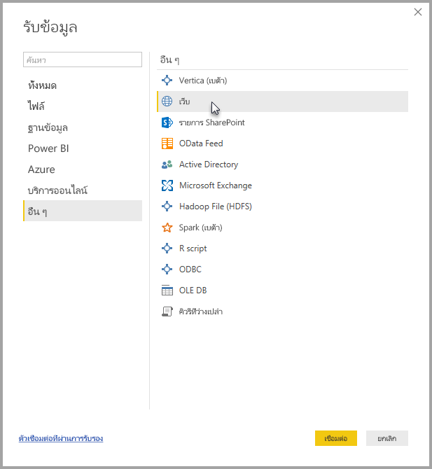
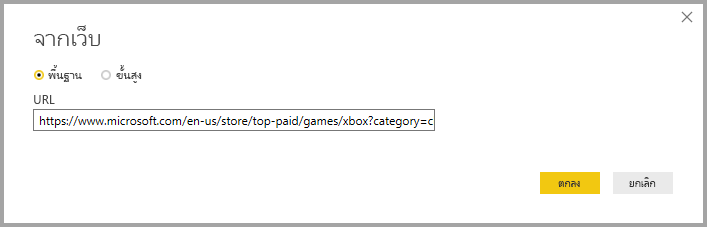
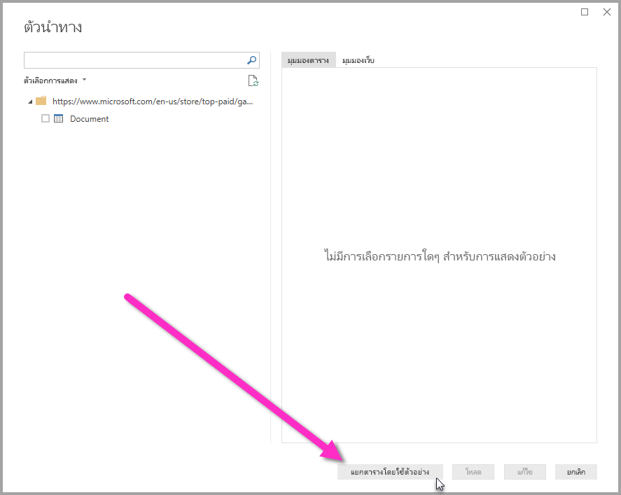
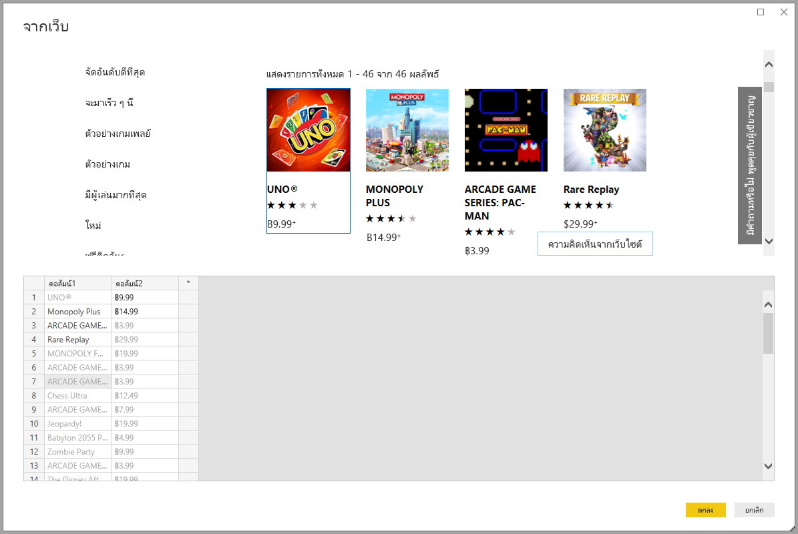
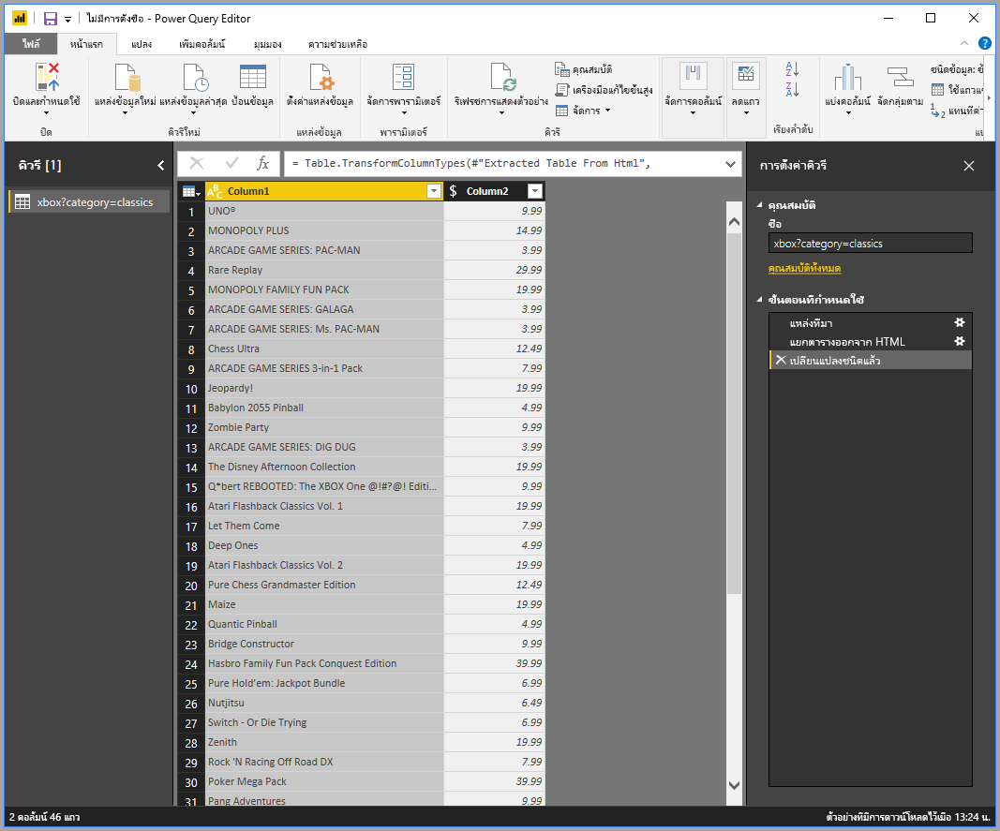

# รับข้อมูลจากหน้าเว็บโดยให้ตัวอย่าง

การรับข้อมูลจากเว็บเพจ ให้ผู้ใช้สามารถแยกข้อมูลจากเว็บเพจ และนำเข้าข้อมูลนั้นลงใน **Power BI Desktop** ได้อย่างง่ายดาย แต่ข้อมูลบนเว็บเพจมักจะไม่ได้อยู่ในตารางที่เรียบร้อย ง่ายต่อการแยก ดังนั้นการรับข้อมูลจากหน้าดังกล่าวอาจเป็นเรื่องท้าทาย แม้ว่าหน้ามีการจัดโครงสร้าง และมีความสอดคล้องกัน 

แต่เรามีคำตอบ ด้วยคุณลักษณะ**รับข้อมูลจากเว็บตามตัวอย่าง** คุณแสดงให้ **Power BI Desktop** เห็นว่าข้อมูลไหนที่คุณต้องการแยก โดยการให้หนึ่งหรือหลายตัวอย่าง ภายในกล่องโต้ตอบตัวเชื่อมต่อ ซึ่งจะรวบรวมข้อมูลอื่น ๆ บนหน้านั้นที่ตรงกับตัวอย่างของคุณ ด้วยโซลูชันนี้ คุณสามารถแยกข้อมูลต่าง ๆ ได้จากเว็บเพจ รวมถึงข้อมูลที่พบในตาราง*และ*ข้อมูลอื่น ๆ ที่ไม่ใช่ตารางได้ 

## รับข้อมูลจากเว็บโดยตัวอย่าง

เพื่อใช้**รับข้อมูลจากเว็บตามตัวอย่าง** เลือก**รับข้อมูล**จากเมนู ribbon **หน้าแรก** ในหน้าต่างที่ปรากฏขึ้น เลือก**อื่นๆ** จากประเภทในบานหน้าต่างด้านซ้าย แล้วเลือก**เว็บ**

จากที่นั่น ใส่ URL ของหน้าเว็บที่คุณต้องการแยกข้อมูล ในบทความนี้ เราจะใช้เว็บเพจ Microsoft Store เพื่อแสดงวิธีการทำงานของตัวเชื่อมต่อนี้ 

ถ้าคุณต้องการทำตาม คุณสามารถใช้ [URL ของ Microsoft Store](https://www.microsoft.com/store/top-paid/games/xbox?category=classics) ที่เราใช้ในบทความนี้:

    https://www.microsoft.com/store/top-paid/games/xbox?category=classics

เมื่อคุณเลือก**ตกลง** คุณจะถูกนำทางไปยังกล่องโต้ตอบ**ตัวนำทาง** ที่ซึ่งจะแสดงตารางที่ตรวจพบโดยอัตโนมัติจากเว็บเพจ ในกรณีที่แสดงในรูปด้านล่าง ไม่มีการพบตาราง แต่จะมีปุ่มที่ด้านล่างของหน้าที่เรียกว่า **แยกตารางโดยใช้ตัวอย่าง** ที่ให้คุณใส่ตัวอย่าง

การเลือก**แยกตารางโดยใช้ตัวอย่าง** จะแสดงหน้าต่างการโต้ตอบ ที่คุณสามารถดูตัวอย่างเนื้อหาของเว็บเพจ และป้อนค่าตัวอย่างของข้อมูลที่คุณต้องการจะแยก 

ในตัวอย่างนี้ เราจะแยก *ชื่อ* และ *ราคา* สำหรับแต่ละเกมบนหน้า เราสามารถทำได้ โดยการระบุสองตัวอย่างจากหน้าสำหรับแต่ละคอลัมน์ ดังที่แสดงในรูปต่อไปนี้ ขณะที่พิมพ์อยู่ตัวอย่างเหล่านั้นลงไป ใน **Power Query** (ซึ่งเป็นเทคโนโลยีพื้นฐานที่แยกข้อมูลจากเว็บเพจ) สามารถแยกข้อมูลที่ตรงกับรูปแบบของรายการตัวอย่าง โดยใช้อัลกอริทึมการแยกข้อมูลที่ฉลาด

> หมายเหตุ: ค่าแนะนำจะแสดงค่าที่มีความยาวน้อยกว่าหรือเท่ากับ 128 อักขระเท่านั้น

เมื่อเราพอใจกับข้อมูลที่แยกจากเว็บเพจแล้ว เราเลือก**ตกลง** เพื่อไปที่**ตัวแก้ไขคิวรี** ซึ่งเราสามารถทำการแปลงเพิ่มเติม หรือจัดรูปร่างข้อมูล เช่น การรวมข้อมูลนี้ กับข้อมูลอื่น ๆ ของ แหล่งข้อมูลของเรา

จากที่นั่น คุณสามารถสร้างวิชวล หรือใช้ข้อมูลเว็บเพจเพื่อสร้างรายงาน **Power BI Desktop** ของคุณได้

## ขั้นตอนถัดไป
มีข้อมูลหลากหลายประเภทที่คุณสามารถเชื่อมต่อโดยใช้ **Power BI Desktop** สำหรับข้อมูลเพิ่มเติมเกี่ยวกับแหล่งข้อมูล โปรดดูทรัพยากรต่อไปนี้:

* [เพิ่มคอลัมน์ตามตัวอย่าง](desktop-add-column-from-example.md)
* [เชื่อมต่อไปยังเว็บเพจ](desktop-connect-to-web.md)
* [แหล่งข้อมูลใน Power BI Desktop](desktop-data-sources.md)
* [จัดรูปทรงและรวมข้อมูลด้วย Power BI Desktop](desktop-shape-and-combine-data.md)
* [เชื่อมต่อกับเวิร์กบุ๊ก Excel ใน Power BI Desktop](desktop-connect-excel.md)   
* [เชื่อมต่อกับไฟล์ CSV ใน Power BI Desktop](desktop-connect-csv.md)   
* [ใส่ข้อมูลลงใน Power BI Desktop โดยตรง](desktop-enter-data-directly-into-desktop.md)   

