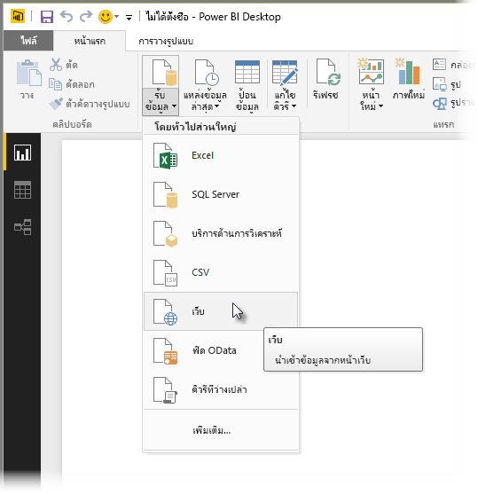
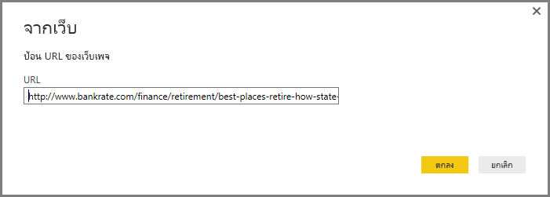
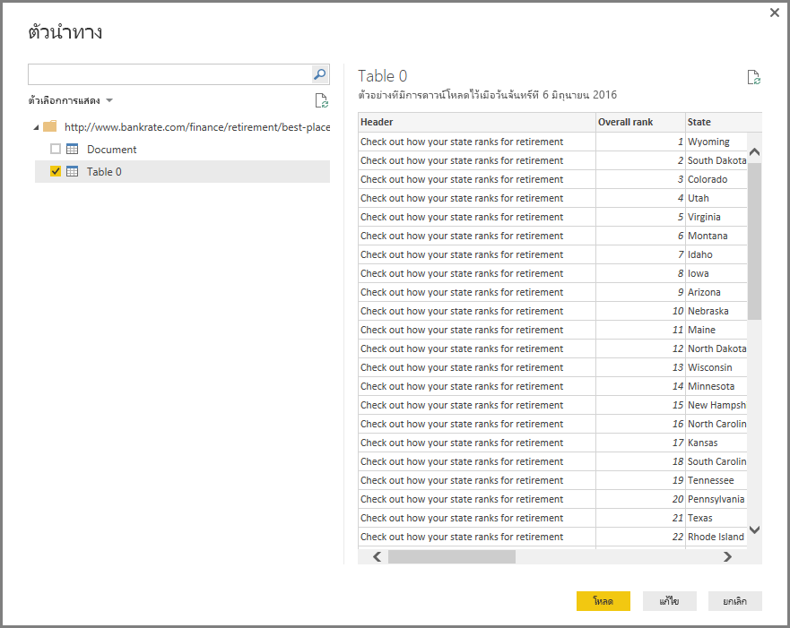
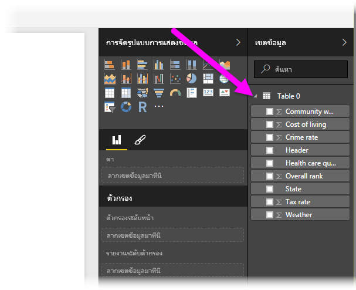

# เชื่อมต่อไปยังหน้าเว็บจาก Power BI Desktop
คุณสามารถเชื่อมต่อไปยังหน้าเว็บ และนำเข้าข้อมูลหน้าเว็บลงใน Power BI Desktop เพื่อนำไปใช้ในภาพ และโมเดลข้อมูลของคุณ

ใน Power BI Desktop เลือก**รับข้อมูล > เว็บ**จาก**หน้าหลัก** แถบข้อมูล ribbon

ข้อความจะปรากฏขึ้นมาเพื่อถามถึง URL ของหน้าเว็บที่คุณต้องการนำเข้าข้อมูล

เมื่อคุณพิมพ์ (หรือวาง) URL ลงไปแล้ว ให้เลือก**OK** Power BI Desktop จะเชื่อมต่อกับหน้านั้น จากนั้นจะแสดงข้อมูลที่มีอยู่ในหน้านั้นใน **หน้าต่าง** นำทาง เมื่อคุณเลือกหนึ่งในองค์ประกอบข้อมูลที่มีอยู่ เช่น ตารางของหน้านั้นทั้งหน้า **หน้าต่าง**นำทาง จะแสดงตัวอย่างของข้อมูลนั้น ๆ อยู่ทางด้านขวาของหน้าต่าง

คุณสามารถเลือก**ปุ่ม**แก้ไข ซึ่งจะเปิด**Query Editor**ออกมา ซึ่งในหน้าต่างนี้คุณจะสามารถจัดการรูปร่าง และเปลี่ยนแปลงข้อมูลบนหน้าเว็บได้ ก่อนที่จะนำเข้าข้อมูลไปยัง Power BI Desktop หรือคุณสามารถเลือก**ปุ่ม**โหลด และนำเข้าองค์ประกอบข้อมูลทั้งหมดที่คุณเลือกในช่องแสดงข้อมูลด้านซ้าย

เมื่อเราเลือก**โหลด** Power BI Desktop จะทำการนำเข้ารายการที่เลือก และทำให้ไฟล์นั้นพร้อมใช้งานใน**ช่อง**เขตข้อมูล ซึ่งอยู่ทางด้านขวาของมุมมองรายงานใน Power BI Desktop

การเชื่อมต่อเว็บเพจ และนำเข้าข้อมูลลงใน Power BI Desktop มีขั้นตอนเพียงเท่านี้

จากตรงนี้ คุณสามารถลากเขตข้อมูลเหล่านั้นลงในพื้นที่รายงาน และสร้างการแสดงภาพที่คุณต้องการทั้งหมดได้ คุณยังสามารถใช้ข้อมูลจากหน้าเว็บนั้นได้แบบเดียวที่คุณใช้กับข้อมูลอื่น ๆ กล่าวคือ คุณสามารถสร้างรูปร่าง สร้างความสัมพันธ์ระหว่างข้อมูลเหล่านั้นและแหล่งข้อมูลอื่น ๆ ในโมเดลของคุณ และอีกเรื่องคือคุณสามารถทำทุกอย่างที่คุณต้องการเพื่อสร้างรายงาน Power BI ตามแบบที่ต้องการได้

เมื่อต้องการดูการเชื่อมต่อหน้าเว็บในเชิงลึกและดูการเคลื่อนไหวเพิ่มขึ้น ให้ดูที่[คำแนะนำการเริ่มต้นใช้งาน Power BI Desktop](desktop-getting-started.md)

### ขั้นตอนถัดไป
มีข้อมูลหลากหลายประเภทที่คุณสามารถเชื่อมต่อโดยใช้ Power BI Desktop สำหรับข้อมูลเพิ่มเติมเกี่ยวกับแหล่งข้อมูล กรุณาตรวจดูแหล่งที่มาต่อไปนี้:

* [แหล่งข้อมูลใน Power BI Desktop](desktop-data-sources.md)
* [จัดรูปร่างและรวมข้อมูลด้วย Power BI Desktop](desktop-shape-and-combine-data.md)
* [เชื่อมต่อกับสมุดงาน Excel ใน Power BI Desktop](desktop-connect-excel.md)   
* [เชื่อมต่อกับไฟล์ CSV ใน Power BI Desktop](desktop-connect-csv.md)   
* [ใส่ข้อมูลลงใน Power BI Desktop โดยตรง](desktop-enter-data-directly-into-desktop.md)   

