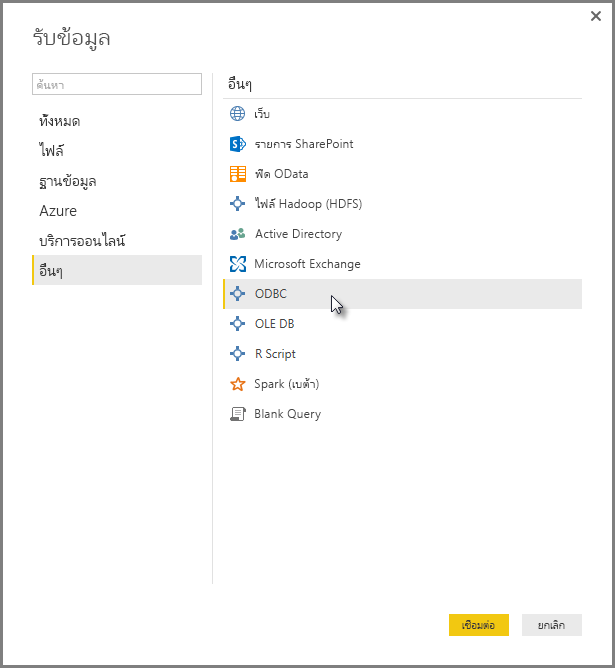
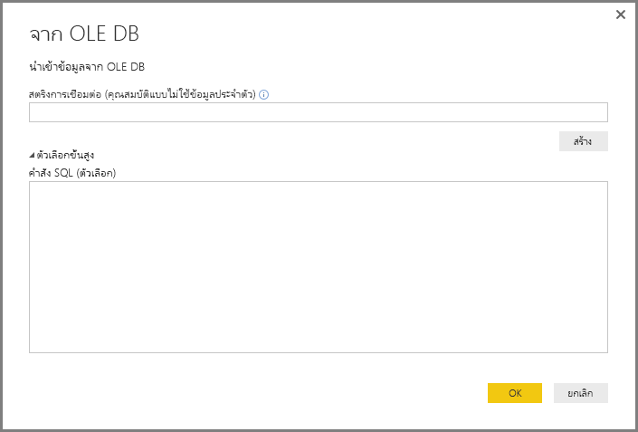
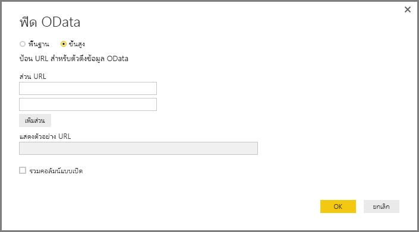
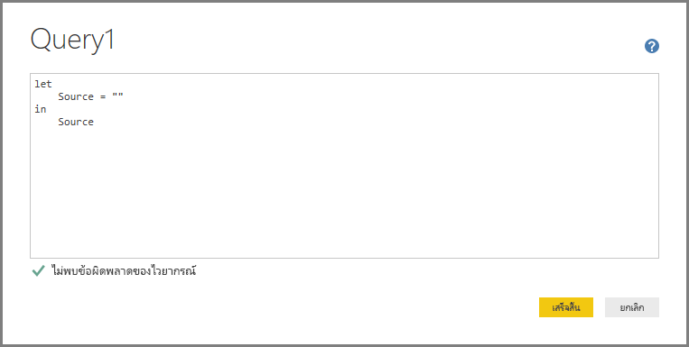

# เชื่อมต่อกับข้อมูลโดยใช้อินเตอร์เฟสทั่วไปของ Power BI Desktop 

คุณสามารถเชื่อมต่อกับแหล่งข้อมูลต่าง ๆ ใน **Power BI Desktop** ด้วยตัวเชื่อมต่อข้อมูลอยู่ภายใน ตั้งแต่**ฐานข้อมูล Access** จนถึงทรัพยากร **Zendesk** ตามที่แสดงในหน้าต่าง**รับข้อมูล** คุณยังสามารถเชื่อมต่อกับแหล่งข้อมูล*อื่น ๆ* เพื่อขยายตัวเลือกการเชื่อมต่อของคุณ โดยใช้อินเทอร์เฟสทั่วไป (เช่น **ODBC** หรือ **REST API**) ที่มีอยู่แล้วใน **Power BI Desktop**

## อินเทอร์เฟซข้อมูลของ Power BI Desktop
**Power BI Desktop** มีคอลเลกชันของตัวเชื่อมต่อข้อมูลที่มากขึ้นเรื่อย ๆ ที่ใช้การเชื่อมต่อกับแหล่งข้อมูลแต่ละชนิด ตัวอย่างเช่น ตัวเชื่อมต่อข้อมูล**รายการ SharePoint** มีเขตข้อมูลที่เฉพาะเจาะจงและการสนับสนุนลำดับการเชื่อมต่อที่ออกแบบสำหรับ**รายการ SharePoint** เช่นเดียวกับแหล่งข้อมูลอื่น ๆ ที่พบในหน้าต่างที่ปรากฏขึ้นเมื่อคุณเลือก**รับข้อมูล > เพิ่มเติม...**  (แสดงอยู่ในรูปภาพก่อนหน้า)

นอกจากนี้ **Power BI Desktop** ให้คุณเชื่อมต่อกับแหล่งข้อมูลที่ไม่ได้ระบุไว้ในรายการ**รับข้อมูล** โดยใช้อินเทอร์เฟซข้อมูลทั่วไปหนึ่งในนี้:

* **ODBC**
* **OLE DB**
* **OData**
* **REST API**
* **สคริปต์ R**

โดยการให้พารามิเตอร์ที่เหมาะสมสมในหน้าต่างการเชื่อมต่อของอินเทอร์เฟสทั่วไปเหล่านี้ แหล่งข้อมูลที่คุณสามารถเข้าถึง และใช้ใน **Power BI Desktop** เพื่อขึ้นอย่างมาก

ในส่วนต่อไปนี้ คุณสามารถค้นหารายการแหล่งข้อมูลที่สามารถเข้าถึงด้วยอินเทอร์เฟสทั่วไปเหล่านี้

ไม่พบแหล่งข้อมูลที่คุณต้องการใช้กับ **Power BI Desktop**? ส่งแนวคิดของคุณมาที่ [รายการของแนวคิดและการร้องขอ](https://ideas.powerbi.com/) ของทีมงาน Power BI

## แหล่งข้อมูลที่สามารถเข้าถึงผ่าน ODBC
ตัวเชื่อมต่อ **ODBC** ใน **Power BI Desktop** ให้คุณนำเข้าข้อมูลจากโปรแกรมควบคุม ODBC บุคคลที่สามใด ๆ โดยระบุแค่เพียง**ชื่อแหล่งข้อมูล (DSN)** หรือ *สตริงการเชื่อมต่อ* อีกทางเลือกคือ คุณยังสามารถระบุคำสั่ง SQL เพื่อดำเนินการกับโปรแกรมควบคุม ODBC

รายการต่อไปนี้แสดงบางตัวอย่างของแหล่งข้อมูลที่ **Power BI Desktop** สามารถเชื่อมต่อโดยใช้อินเตอร์เฟส **ODBC** ทั่วไปได้

| ตัวเชื่อมต่อทั่วไปของ Power BI Desktop | แหล่งข้อมูลภายนอก | ลิงก์สำหรับข้อมูลเพิ่มเติม |
| --- | --- | --- |
| ODBC |Cassandra |[โปรแกรมควบคุม Cassandra ODBC](https://www.simba.com/drivers/cassandra-odbc-jdbc/) |
| ODBC |Couchbase DB |[Couchbase และ Power BI](https://powerbi.microsoft.com/blog/visualizing-data-from-couchbase-server-v4-using-power-bi/) |
| ODBC |DynamoDB |[โปรแกรมควบคุม DynamoDB ODBC](https://www.simba.com/drivers/dynamodb-odbc-jdbc/) |
| ODBC |Google BigQuery |[โปรแกรมควบคุม BigQuery ODBC](https://www.simba.com/drivers/bigquery-odbc-jdbc/) |
| ODBC |HBase |[โปรแกรมควบคุม Hbase ODBC](https://www.simba.com/drivers/hbase-odbc-jdbc/) |
| ODBC |Hive |[โปรแกรมควบคุม Hive ODBC](https://www.simba.com/drivers/hive-odbc-jdbc/) |
| ODBC |IBM Netezza |[ข้อมูล IBM Netezza](https://www.ibm.com/support/knowledgecenter/SSULQD_7.2.1/com.ibm.nz.datacon.doc/c_datacon_plg_overview.html) |
| ODBC |Presto |[โปรแกรมควบคุม ODBC Presto](https://www.simba.com/drivers/presto-odbc-jdbc/) |
| ODBC |Project Online |[บทความ Project Online](desktop-project-online-connect-to-data.md) |
| ODBC |Progress OpenEdge |[บล็อกโพสต์โปรแกรมควบคุม Progress OpenEdge ODBC](https://www.progress.com/blogs/connect-microsoft-power-bi-to-openedge-via-odbc-driver) |

## แหล่งข้อมูลที่สามารถเข้าถึงผ่าน OLE DB
ตัวเชื่อมต่อ **OLE DB** ใน **Power BI Desktop** ให้คุณนำเข้าข้อมูลจากโปรแกรมควบคุม OLE DB บุคคลที่สามใด ๆ โดยการระบุเพียงแค่*สตริงการเชื่อมต่อ* อีกทางเลือกคือ คุณยังสามารถระบุคำสั่ง SQL เพื่อดำเนินการกับโปรแกรมควบคุม OLE DB

รายการต่อไปนี้แสดงบางตัวอย่างของแหล่งข้อมูลที่ **Power BI Desktop** สามารถเชื่อมต่อโดยใช้อินเตอร์เฟส **OLE DB** ทั่วไปได้

| ตัวเชื่อมต่อทั่วไปของ Power BI Desktop | แหล่งข้อมูลภายนอก | ลิงก์สำหรับข้อมูลเพิ่มเติม |
| --- | --- | --- |
| OLE DB |SAS OLE DB |[ผู้ให้บริการ SAS สำหรับ OLE DB](https://support.sas.com/downloads/package.htm?pid=648) |
| OLE DB |OLE DB Sybase |[ผู้ให้บริการ Sybase สำหรับ OLE DB](http://infocenter.sybase.com/help/index.jsp?topic=/com.sybase.infocenter.dc35888.1550/doc/html/jon1256941734395.html) |

## แหล่งข้อมูลที่สามารถเข้าถึงผ่าน OData
ตัวเชื่อมต่อ **OData** ใน **Power BI Desktop** ให้คุณนำเข้าข้อมูลจาก **OData** URL ใด ๆ ได้อย่างง่าย ๆ โดยการพิมพ์หรือวาง URL ของ **OData** คุณสามารถเพิ่ม URL หลายส่วน โดยการพิมพ์หรือวางลิงก์เหล่านั้นในกล่องข้อความที่มีอยู่ในหน้าต่าง**ตัวดึงข้อมูล OData** ได้

รายการต่อไปนี้แสดงบางตัวอย่างของแหล่งข้อมูลที่ **Power BI Desktop** สามารถเชื่อมต่อโดยใช้อินเตอร์เฟส **OData** ทั่วไปได้

| ตัวเชื่อมต่อทั่วไปของ Power BI Desktop | แหล่งข้อมูลภายนอก | ลิงก์สำหรับข้อมูลเพิ่มเติม |
| --- | --- | --- |
| OData |จะมาเร็ว ๆ นี้ |กลับมาดูใหม่เร็ว ๆ นี้สำหรับแหล่งข้อมูล OData |

## แหล่งข้อมูลที่สามารถเข้าถึงผ่าน REST API
คุณสามารถเชื่อมต่อกับแหล่งข้อมูลที่ใช้ **REST API** และข้อมูลจากแหล่งข้อมูลทั้งหลายที่สนับสนุน **REST** ได้

รายการต่อไปนี้แสดงบางตัวอย่างของแหล่งข้อมูลที่ **Power BI Desktop** สามารถเชื่อมต่อโดยใช้อินเตอร์เฟส **REST API** ทั่วไปได้

| ตัวเชื่อมต่อทั่วไปของ Power BI Desktop | แหล่งข้อมูลภายนอก | ลิงก์สำหรับข้อมูลเพิ่มเติม |
| --- | --- | --- |
| REST API |Couchbase DB |[ข้อมูล Couchbase REST API](https://powerbi.microsoft.com/blog/visualizing-data-from-couchbase-server-v4-using-power-bi/) |

## แหล่งข้อมูลที่สามารถเข้าถึงผ่านสคริปต์ R
คุณสามารถใช้**สคริปต์ R** เพื่อเข้าถึงแหล่งข้อมูล และใช้ข้อมูลนั้นใน **Power BI Desktop** ได้

รายการต่อไปนี้แสดงบางตัวอย่างของแหล่งข้อมูลที่ **Power BI Desktop** สามารถเชื่อมต่อโดยใช้อินเตอร์เฟส **สคริปต์ R** ทั่วไปได้

| ตัวเชื่อมต่อทั่วไปของ Power BI Desktop | แหล่งข้อมูลภายนอก | ลิงก์สำหรับข้อมูลเพิ่มเติม |
| --- | --- | --- |
| สคริปต์ R |ไฟล์ SAS |[คำแนะนำสคริปต์ R จาก CRAN](https://cran.r-project.org/doc/manuals/R-data.html) |
| สคริปต์ R |ไฟล์ SPSS |[คำแนะนำสคริปต์ R จาก CRAN](https://cran.r-project.org/doc/manuals/R-data.html) |
| สคริปต์ R |ไฟล์สถิติ R |[คำแนะนำสคริปต์ R จาก CRAN](https://cran.r-project.org/doc/manuals/R-data.html) |

## ขั้นตอนถัดไป
มีข้อมูลหลากหลายประเภทที่คุณสามารถเชื่อมต่อโดยใช้ **Power BI Desktop** สำหรับข้อมูลเพิ่มเติมเกี่ยวกับแหล่งข้อมูล โปรดดูทรัพยากรต่อไปนี้:

* [Power BI Desktop คืออะไร](desktop-what-is-desktop.md)
* [แหล่งข้อมูลใน Power BI Desktop](desktop-data-sources.md)
* [จัดรูปทรงและรวมข้อมูลด้วย Power BI Desktop](desktop-shape-and-combine-data.md)
* [เชื่อมต่อกับเวิร์กบุ๊ก Excel ใน Power BI Desktop](desktop-connect-excel.md)   
* [ป้อนข้อมูลลงใน Power BI Desktop โดยตรง](desktop-enter-data-directly-into-desktop.md)   

