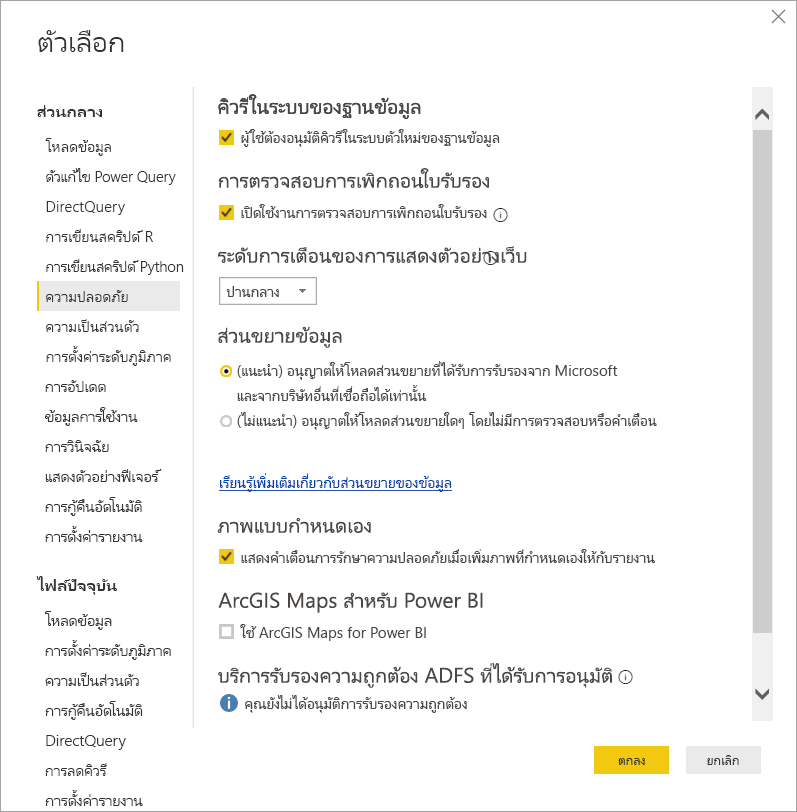

# การขยายของตัวเชื่อมต่อใน Power BI

ลูกค้าและนักพัฒนาซอฟต์แวร์สามารถขยายแหล่งข้อมูลที่สามารถเชื่อมต่อได้หลายวิธีใน Power BI ตัวอย่างเช่น การใช้ตัวเชื่อมต่อที่มีอยู่และแหล่งข้อมูลทั่วไป (เช่น ODBC, OData, Oledb, Web, CSV, XML, JSON) นอกเหนือจากแหล่งข้อมูลดังกล่าวแล้ว นักพัฒนาซอฟต์แวร์สามารถสร้างส่วนขยายข้อมูลที่เรียกว่า **ตัวเชื่อมต่อแบบกำหนดเอง** และรับรองตัวเชื่อมต่อเพื่อทำให้เป็น **ตัวเชื่อมต่อที่ผ่านการรับรอง**

ในปัจจุบัน สามารถจะเปิดใช้งาน**ตัวเชื่อมต่อแบบกำหนดเอง**โดยใช้การสลับฟีเจอร์ ก่อนที่เราจะเปลี่ยนฟีเจอร์นี้จากเบต้าเป็นการพร้อมใช้งานทั่วไป เราได้เพิ่มเมนูที่ช่วยให้คุณสามารถควบคุมระดับของโค้ดแบบกำหนดเองที่คุณต้องการให้ทำงานบนระบบของคุณอย่างปลอดภัย: ตัวเชื่อมต่อแบบกำหนดเองทั้งหมดหรือเฉพาะตัวเชื่อมต่อที่ได้รับการรับรองและเผยแพร่โดย Microsoft ในกล่องโต้ตอบ**รับข้อมูล**

## ตัวเชื่อมต่อแบบกำหนดเอง

**ตัวเชื่อมต่อแบบกำหนดเอง**สามารถรวมการใช้งานได้อย่างกว้างขวาง ตั้งแต่ API ขนาดเล็กที่มีความสำคัญต่อธุรกิจของคุณไปจนถึงบริการเฉพาะของอุตสาหกรรมขนาดใหญ่ที่ Microsoft ยังไม่ได้เผยแพร่ตัวเชื่อมต่อให้ ตัวเชื่อมต่อจำนวนมากมีให้บริการโดยผู้จัดจำหน่ายหลายบริษัท และถ้าคุณจำเป็นต้องใช้ตัวเชื่อมต่อข้อมูลที่เฉพาะเจาะจง คุณควรติดต่อผู้จำหน่าย

เมื่อต้องใช้เป็น**ตัวเชื่อมต่อแบบกำหนดเอง** ให้ใส่ตัวเชื่อมต่อดังกล่าวไว้ใน *\[เอกสาร] \\โฟลเดอร์ \\ตัวเชื่อมต่อแบบกำหนดเอง* ใน Power BI Desktop และปรับการตั้งค่าความปลอดภัยตามที่อธิบายไว้ในส่วนต่อไปนี้

คุณไม่จำเป็นต้องปรับการตั้งค่าความปลอดภัยเพื่อใช้**ตัวเชื่อมต่อที่ได้รับการรับรอง**

## การรักษาความปลอดภัยส่วนขยายข้อมูล

เมื่อต้องเปลี่ยนการตั้งค่าความปลอดภัยส่วนขยายข้อมูล ให้เลือก**ไฟล์ > ตัวเลือกและการตั้งค่า > ตัวเลือก > ความปลอดภัย**ใน **Power BI Desktop**

ภายใต้**ส่วนขยายข้อมูล**คุณสามารถเลือกระดับความปลอดภัยได้จากสองระดับ:

* (แนะนำ) อนุญาตให้โหลดเฉพาะส่วนขยายที่รับรองเท่านั้น
* (ไม่แนะนำ) อนุญาตให้โหลดส่วนขยายโหลดโดยไม่มีคำเตือน

ถ้าคุณวางแผนที่จะใช้**ตัวเชื่อมต่อแบบกำหนดเอง**หรือตัวเชื่อมต่อที่คุณหรือบุคคลที่สามได้พัฒนาและแจกจ่าย คุณต้องเลือก **"(ไม่แนะนำ) อนุญาตส่วนขยายให้โหลดโดยไม่ต้องเตือน"** เราไม่แนะนำการตั้งค่าความปลอดภัย เว้นแต่ว่าคุณเชื่อใจตัวเชื่อมต่อที่กำหนดเองของคุณอย่างแน่แท้เนื่องจากโค้ดในนั้นสามารถจัดการข้อมูลประจำตัว (รวมถึงส่งผ่าน HTTP) และละเว้นระดับความเป็นส่วนตัวได้

ที่การตั้งค่าความปลอดภัย **"(ที่แนะนำ)"** ถ้ามีตัวเชื่อมต่อแบบกำหนดเองบนระบบของคุณ ข้อผิดพลาดจะแสดงโดยอธิบายว่าตัวเชื่อมต่อไม่สามารถโหลดเนื่องจากปัญหาความปลอดภัย

หากต้องแก้ไขข้อผิดพลาดและใช้ตัวเชื่อมต่อเหล่านั้น คุณต้องเปลี่ยนการตั้งค่าความปลอดภัยเป็นการตั้งค่า **"(ที่ไม่แนะนำ)"** ตามที่อธิบายไว้ก่อนหน้านี้ และรีสตาร์ท **Power BI Desktop**

## ตัวเชื่อมต่อที่ผ่านการรับรอง

ส่วนขยายข้อมูลจำนวนหนึ่งเป็นแบบ**ได้รับการรับรอง**และตัวเชื่อมต่อดังกล่าวที่ได้รับการรับรองเหล่านั้นจะพร้อมใช้งานโดยใช้กล่องตอบโต้**รับข้อมูล** แต่บุคคลที่รับผิดชอบการบำรุงรักษาและการสนับสนุนจะยังคงเป็นนักพัฒนาที่เป็นบุคคลที่สามที่ได้สร้างตัวเชื่อมต่อ ในขณะที่ Microsoft เผยแพร่ตัวเชื่อมต่อเหล่านี้ เราไม่รับผิดชอบประสิทธิภาพการทำงานหรือการใช้งานได้อย่างต่อเนื่องของตัวเชื่อมต่อดังกล่าว

ถ้าคุณต้องการให้ตัวเชื่อมต่อแบบกำหนดเองได้รับการรับรอง ติดต่อผู้ขายของคุณdataconnectors@microsoft.com
