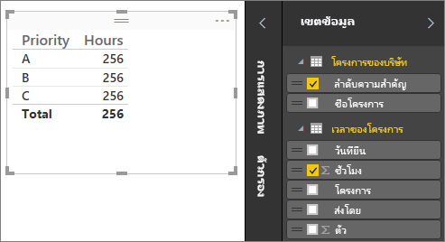
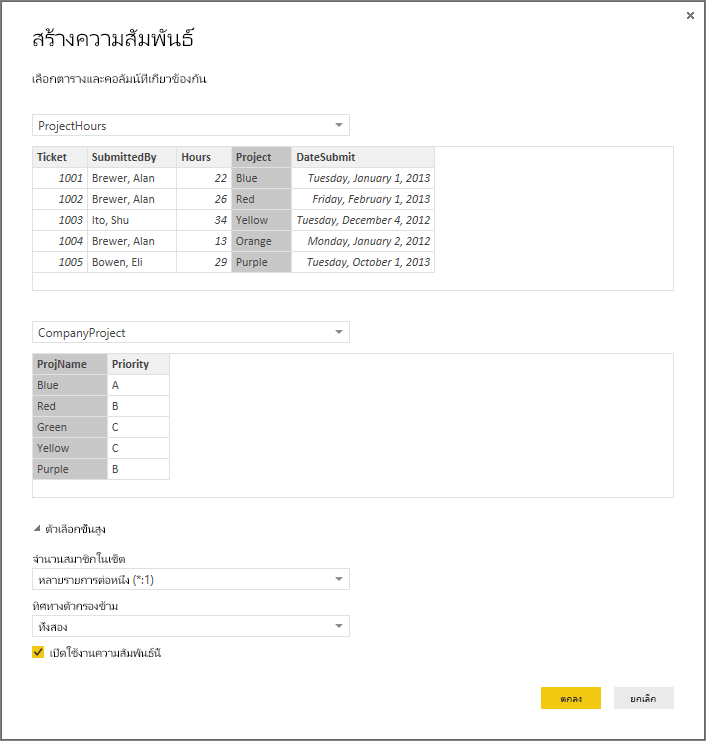
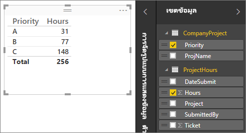
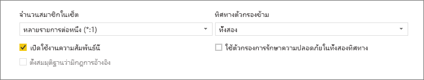
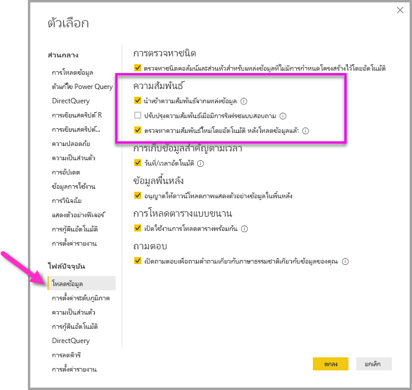
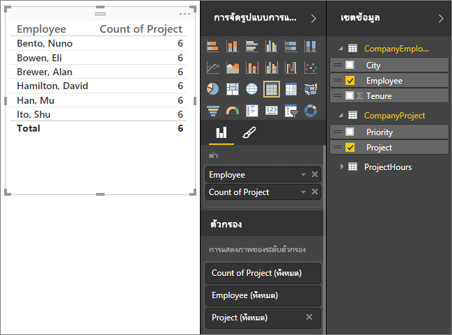
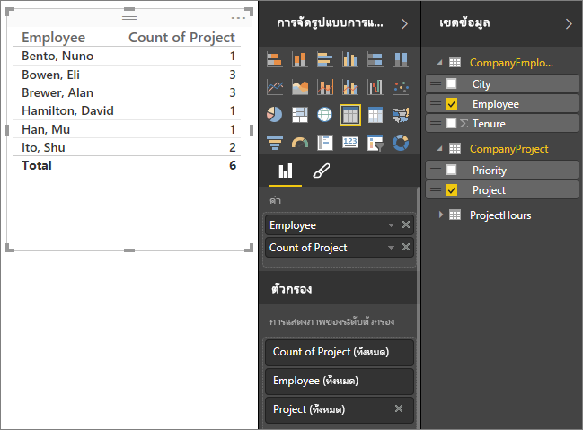
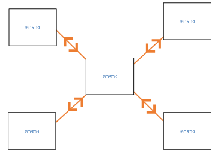
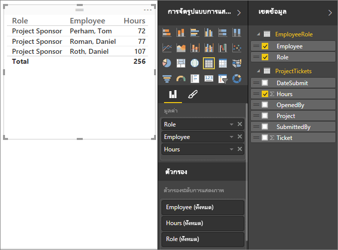
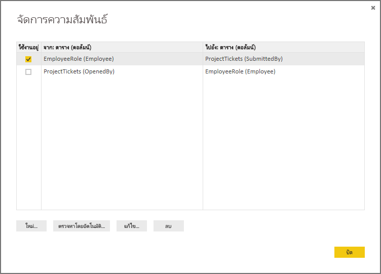

# สร้างและจัดการความสัมพันธ์ใน Power BI Desktop
เมื่อคุณนำเข้าหลายตาราง มีโอกาสที่คุณจะต้องทำการวิเคราะห์โดยใช้ข้อมูลจากตารางเหล่านั้นทั้งหมด ความสัมพันธ์ระหว่างตารางเหล่านั้นเป็นสิ่งจำเป็นสำหรับการคำนวณผลลัพธ์อย่างถูกต้อง และแสดงข้อมูลในรายงานของคุณอย่างถูกต้อง Power BI Desktop ทำให้สร้างความสัมพันธ์ดังกล่าวได้ง่ายขึ้น ในความเป็นจริง ในกรณีส่วนใหญ่คุณไม่จำเป็นต้องทำอะไร คุณลักษณะการตรวจหาอัตโนมัติทำได้สำหรับคุณ อย่างไรก็ตาม ในบางกรณีคุณอาจต้องสร้างความสัมพันธ์ด้วยตนเอง หรือคุจำเป็นต้องทำการเปลี่ยนแปลงบางอย่างสำหรับความสัมพันธ์นั้น ไม่ว่าด้วยใช้วิธีใด จำเป็นต้องทำความเข้าใจความสัมพันธ์ใน Power BI Desktop วิธีการสร้างและวิธีการแก้ไขใจความสัมพันธ์เหล่านี้

## ตรวจหาอัตโนมัติระหว่างการโหลด
ถ้าคุณสร้างแบบสอบถามสองตารางหรือมากกว่าในเวลาเดียวกัน เมื่อข้อมูลถูกโหลด Power BI Desktop พยายามทำการค้นหาและสร้างความสัมพันธ์สำหรับคุณ ตัวเลือกความสัมพันธ์ **คาร์ดินาลลิตี้** **ทิศทางตัวกรองข้าม** และ **ทำให้ความสัมพันธ์นี้ใช้งานได้** มีการตั้งค่าโดยอัตโนมัติ ลักษณะของ Power BI Desktop ที่ชื่อคอลัมน์ในตารางที่คุณกำลังสอบถามเพื่อดูว่ามีความสัมพันธ์ใดที่อาจเกิดขึ้นได้บ้าง ถ้าไม่มี ความสัมพันธ์ดังกล่าวจะถูกสร้างขึ้นโดยอัตโนมัติ ถ้า Power BI Desktop ไม่สามารถกำหนดได้ด้วยความน่าเชื่อมั่นในระดับสูงว่ามีค่าที่ตรงกัน Power BI Desktop ไม่สร้างความสัมพันธ์ขึ้น อย่างไรก็ตาม คุณยังคงสามารถใช้กล่องโต้ตอบ**การจัดการความสัมพันธ์**เพื่อสร้างหรือแก้ไขความสัมพันธ์ได้ด้วยตนเอง

## สร้างความสัมพันธ์ที่มีการตรวจหาอัตโนมัติ
ที่แท็บ **หน้าแรก** ให้เลือก **จัดการความสัมพันธ์** \> **ตรวจหาอัตโนมัติ**

## สร้างความสัมพันธ์ด้วยตนเอง
1. ที่แท็บ **หน้าแรก** ให้เลือก **จัดการความสัมพันธ์** \> **ใหม่**

2. ในกล่องโต้ตอบ **สร้างความสัมพันธ์** ในรายการดรอปดาวน์ของตารางแรก ให้เลือกตาราง เลือกคอลัมน์ที่คุณต้องการใช้ในความสัมพันธ์

3. ในรายการดรอปดาวน์ของตารางที่สอง ให้เลือกตารางอื่นๆ ที่คุณต้องการในความสัมพันธ์ เลือกคอลัมน์อื่นๆ ที่คุณต้องการใช้ แล้วแตะเลือก **ตกลง**

   

โดยค่าเริ่มต้น Power BI Desktop จะกำหนดค่าตัวเลือก **คาร์ดินาลลิตี้** (ทิศทาง) **ทิศทางการกรองข้าม** และ **ทำให้ความสัมพันธ์นี้ใช้งานได้** สำหรับความสัมพันธ์ใหม่ของคุณ อย่างไรก็ตาม คุณสามารถเปลี่ยนการตั้งค่าเหล่านี้ได้ถ้าจำเป็น สำหรับข้อมูลเพิ่มเติม โปรดดู [ทำความเข้าใจตัวเลือกเพิ่มเติม](#understanding-additional-options)

หากไม่มีตารางใดที่เลือกไว้สำหรับความสัมพันธ์มีค่าที่ไม่ซ้ำกัน คุณจะเห็นข้อผิดพลาดต่อไปนี้: *หนึ่งในคอลัมน์ต้องมีค่าที่ไม่ซ้ำกัน* อย่างน้อยหนึ่งตารางในความสัมพันธ์*ต้อง*มีรายการที่แตกต่างและไม่ซ้ำกันของค่าคีย์ ซึ่งเป็นข้อกำหนดทั่วไปสำหรับเทคโนโลยีฐานข้อมูลเชิงสัมพันธ์ทั้งหมด 

ถ้าคุณพบข้อผิดพลาดนั้น มีสองสามวิธีในการแก้ไขปัญหา:

* ใช้ **ลบรายการซ้ำ** เพื่อสร้างคอลัมน์ที่มีค่าไม่ซ้ำกัน ข้อด้อยของวิธีการนี้คือ คุณจะสูญเสียข้อมูลเมื่อแถวที่ซ้ำกันถูกลบออกไป; โดยมากแล้วคีย์ (แถว) ถูกทำซ้ำด้วยเหตุผลที่ดีเสมอ
* เพิ่มตารางที่มีตัวกลางประกอบด้วยรายการของค่าคีย์ที่แตกต่างกันไปยังแบบจำลอง ซึ่งจากนั้นจะถูกเชื่อมโยงไปยังทั้งสองคอลัมน์ต้นฉบับในความสัมพันธ์ดังกล่าว

สำหรับข้อมูลเพิ่มเติม โปรดดูที่[บล็อกโพสต์](https://blogs.technet.microsoft.com/cansql/2016/12/19/relationships-in-power-bi-fixing-one-of-the-columns-must-have-unique-values-error-message/)

## แก้ไขความสัมพันธ์
1. ที่แท็บ **หน้าแรก** ให้เลือก **จัดการความสัมพันธ์**

2. ที่กล่องโต้ตอบ**จัดการความสัมพันธ์** เลือกความสัมพันธ์ จากนั้นเลือก **แก้ไข**

## ตัวเลือกเพิ่มเติมสำหรับการกำหนดค่า
เมื่อคุณสร้างหรือแก้ไขความสัมพันธ์ คุณสามารถกำหนดค่าตัวเลือกเพิ่มเติมได้ ตามค่าเริ่มต้น Power BI Desktop กำหนดค่าตัวเลือกเพิ่มเติมโดยอัตโนมัติตามการคาดเดาที่ดีที่สุดซึ่งอาจแตกต่างกันสำหรับแต่ละความสัมพันธ์ที่ยึดตามข้อมูลในคอลัมน์

### คาร์ดินาลลิตี้
ตัวเลือก **คาร์ดินาลลิตี้** สามารถมีการตั้งค่าหนึ่งรายการต่อไปนี้:

**กลุ่มต่อหนึ่ง (\*:1)** : ความสัมพันธ์แบบหนึ่งต่อหนึ่งคือความสัมพันธ์ที่พบบ่อยและเป็นค่าเริ่มต้น ซึ่งหมายความว่าคอลัมน์ในตารางหนึ่งสามารถมีมากกว่าหนึ่งค่าตัวอย่าง และตารางอื่นที่เกี่ยวข้องที่รู้จักกันว่าเป็นตารางการค้นหา มักจะมีเพียงหนึ่งค่าตัวอย่าง

**หนึ่งต่อหนึ่ง (1: 1)** : ในความสัมพันธ์แบบหนึ่งต่อหนึ่ง คอลัมน์ในตารางหนึ่งมีเพียงหนึ่งค่าตัวอย่างของค่าใดค่าหนึ่ง และตารางอื่นที่เกี่ยวข้องมีเพียงหนึ่งค่าตัวอย่างของค่าใดค่าหนึ่ง

**หนึ่งต่อกลุ่ม (1:*)** : ในความสัมพันธ์แบบหนึ่งต่อกลุ่ม คอลัมน์ในตารางหนึ่งมีเพียงหนึ่งค่าตัวอย่างของค่าใดค่าหนึ่ง และตารางอื่นที่เกี่ยวข้องสามารถมีอินสแตนซ์ของค่าได้มากกว่าหนึ่ง

**กลุ่มต่อกลุ่ม (\*:\*)** : ด้วยโมเดลแบบรวมคุณสามารถสร้างความสัมพันธ์แบบกลุ่มต่อกลุ่มระหว่างตารางซึ่งจะลบข้อกำหนดสำหรับค่าที่ไม่ซ้ำกันในตาราง นอกจากนี้ยังลบการแก้ปัญหาชั่วคราวก่อนหน้า เช่น การเริ่มตารางใหม่เพื่อสร้างความสัมพันธ์เท่านั้น สำหรับข้อมูลเพิ่มเติม โปรดดู[ความสัมพันธแบบที่มีคาร์ดินาลลิตี้แบบกลุ่มกลุ่ม](https://docs.microsoft.com/power-bi/desktop-many-to-many-relationships) 

สำหรับข้อมูลเพิ่มเติมเกี่ยวกับเวลาที่จะเปลี่ยนแปลงคาร์ดินาลลิตี้ โปรดดู [ทำความเข้าใจตัวเลือกเพิ่มเติม](#understanding-additional-options)

### ทิศทางตัวกรองข้าม
ตัวเลือก **ทิศทางตัวกรองข้าม** สามารถมีการตั้งค่าหนึ่งรายการต่อไปนี้:

**ทั้งสอง**: สำหรับวัตถุประสงค์ในการกรอง จะมีการใช้งานทั้งสองตารางเหมือนกับว่าเป็นตารางเดียว การตั้งค่า **ทั้งสอง** ใช้งานได้ดีกับตารางเดียวที่มีหมายเลขของตารางการค้นหาที่ล้อมรอบอยู่ ตัวอย่างคือตารางขายจริงที่มีตารางการค้นหาสำหรับแผนก การกำหนดค่านี้จะเรียกว่าการกำหนดค่าโครงสร้างแบบดาว (จากตารางศูนย์กลางที่มีตารางการค้นหาหลายครั้ง) อย่างไรก็ตาม ถ้าคุณมีอย่างน้อยสองตารางที่มีตารางการค้นหาด้วย (มีบางตารางที่เหมือนกัน) คุณไม่ต้องใช้การตั้งค่าแบบ **ทั้งสอง** เมื่อต้องการใช้ตัวอย่างก่อนหน้าต่อไป ในกรณีนี้ คุณจะมีตารางงบประมาณการขายที่จะบันทึกงบประมาณเป้าหมายสำหรับแต่ละแผนกด้วย และตารางแผนกจะเชื่อมต่อกับทั้งตารางการขายและตารางงบประมาณ หลีกเลี่ยงการตั้งค่า **ทั้งสอง** สำหรับการกำหนดค่าชนิดนี้

**เดียว**: ทิศทางเริ่มต้นที่พบบ่อยที่สุด ซึ่งหมายถึงตัวเลือกในการกรองในตารางการที่เชื่อมต่อทำงานบนตารางที่จะมีการรวมค่า ถ้าคุณนำเข้า Power Pivot ใน Excel 2013 หรือแบบจำลองข้อมูลก่อนหน้า ความสัมพันธ์ทั้งหมดจะมีทิศทางเดียว 

สำหรับข้อมูลเพิ่มเติมเกี่ยวกับเวลาที่จะเปลี่ยนแปลงทิศทางตัวกรองข้าม โปรดดู [ทำความเข้าใจตัวเลือกเพิ่มเติม](#understanding-additional-options)

### เปิดใช้งานความสัมพันธ์นี้
เมื่อเลือกส่วนนี้ ความสัมพันธ์ทำหน้าที่เป็นการเปิดใช้งาน เป็นความสัมพันธ์เริ่มต้น ในกรณีไม่มีมากกว่าหนึ่งความสัมพันธ์ระหว่างตารางสองตาราง ความสัมพันธ์ที่ใช้งานอยู่มีวิธีสำหรับ Power BI Desktop เพื่อสร้างการแสดงภาพที่มีทั้งสองตารางโดยอัตโนมัติ

สำหรับข้อมูลเพิ่มเติมเกี่ยวกับเวลาเมื่อต้องเปิดใช้งานความสัมพันธ์ใดความสัมพันธ์หนึ่ง โปรดดู [ทำความเข้าใจตัวเลือกเพิ่มเติม](#understanding-additional-options)

## ทำความเข้าใจความสัมพันธ์
เมื่อคุณเชื่อมต่อสองตารางเข้ากับความสัมพันธ์ หนึ่ง คุณสามารถทำงานกับข้อมูลในทั้งสองตารางได้ในตารางเดียว ทำให้คุณไม่ต้องกังวลเกี่ยวกับรายละเอียดความสัมพันธ์หรือบีบตารางเหล่านั้นลงในตารางเดียวก่อนที่นำเข้า ในหลากหลายสถานการณ์ Power BI Desktop สามารถสร้างความสัมพันธ์สำหรับคุณได้โดยอัตโนมัติ อย่างไรก็ตาม ถ้า Power BI Desktop ไม่สามารถกำหนดได้ด้วยความแน่นอนระดับสูงว่าความสัมพันธ์ระหว่างตารางสองตารางนนั้นควรมีอยู่ Power BI Desktop ไม่สร้างความสัมพันธ์โดยอัตโนมัติ ในกรณีนี้ คุณต้องทำเช่นนั้น 

เรามาเรียนรู้ในบทช่วยสอนฉบับย่อเพื่อแสดงให้คุณเห็นว่าความสัมพันธ์ทำงานอย่างไรใน Power BI Desktop

>[!TIP]
>คุณสามารถเรียนรู้บทเรียนนี้ให้เสร็จสมบูรณ์ได้ด้วยตัวเอง 
>
> 1. คัดลอกตาราง **ProjectHours** ต่อไปนี้ลงในแผ่นงาน Excel (ไม่รวมชื่อคอลัมน์) เลือกเซลล์ทั้งหมดแล้วเลือก **แทรก** \> **ตาราง** 
> 2. ในกล่องโต้ตอบ**สร้างตาราง** ให้เลือก **ตกลง** 
> 3. เลือกเซลล์ของตารางใดก็ตาม เลือก **การออกแบบตาราง** \> **ชื่อตาราง** และจากนั้นป้อน *ProjectHours* 
> 4. ทำเหมือนกันสำหรับตาราง **CompanyProject** 
> 5. นำเข้าข้อมูลนั้น โดยใช้**รับข้อมูล**ใน Power BI Desktop ได้ เลือกสองตารางเป็นแหล่งข้อมูล จากนั้นเลือก **โหลด**

ตารางแรกนี้ คือ **ProjectHours** เป็นบันทึกของตั๋วงานที่บันทึกจำนวนชั่วโมงที่บุคคลหนึ่งทำงานในโครงการใดโครงการหนึ่ง 

**ProjectHours**

| **ตั๋ว** | **SubmittedBy** | **ชั่วโมง** | **โครงการ** | **DateSubmit** |
| ---:|:--- | ---:|:--- | ---:|
| 1001 |Brewer, Alan |22 |สีฟ้า |1/1/2013 |
| 1002 |Brewer, Alan |26 |สีแดง |2/1/2013 |
| 1003 |Ito, Shu |34 |เหลือง |12/4/2012 |
| 1004 |Brewer, Alan |13 |ส้ม |1/2/2012 |
| 1005 |Bowen, Eli |29 |ม่วง |10/1/2013 |
| 1006 |Bento, Nuno |35 |เขียว |2/1/2013 |
| 1007 |Hamilton, David |10 |เหลือง |10/1/2013 |
| 1008 |Han, Mu |28 |ส้ม |1/2/2012 |
| 1009 |Ito, Shu |22 |ม่วง |2/1/2013 |
| 1010 |Bowen, Eli |28 |เขียว |10/1/2013 |
| 1011 |Bowen, Eli |9 |สีฟ้า |10/15/2013 |

ตารางที่สองนี้ คือ **CompanyProject** เป็นรายการของโครงการที่มีการกำหนดลำดับความสำคัญเป็น: A, B หรือ C 

**CompanyProject**

| **ProjName** | **ลำดับความสำคัญ** |
| --- | --- |
| สีฟ้า |A |
| สีแดง |B |
| เขียว |C |
| เหลือง |C |
| ม่วง |B |
| ส้ม |C |

โปรดสังเกตว่าแต่ละตารางมีหนึ่งคอลัมน์โครงการ แต่ละรายการจะมีชื่อต่างกันเล็กน้อย แต่ดูเหมือนว่ามีค่าเดียวกัน ซึ่งนั่นเป็นสิ่งสำคัญ แล้วเราจะกลับมาดูอีกครั้งในอีกสักครู่

หลังจากที่เรามีสองตารางที่นำเข้ามาในหนึ่งแบบจำลอง เราลองสร้างรายงานกัน สิ่งแรกที่เราต้องการสร้างคือ จำนวนชั่วโมงที่ยื่นตามลำดับความสำคัญโครงการ ดังนั้นเราเลือก**ลำดับความสำคัญ**และ**ชั่วโมง**จากบานหน้าต่าง **เขตข้อมูล**

ถ้าเราดูที่ตารางของเราในพื้นที่รายงาน คุณจะเห็นจำนวนชั่วโมงเป็น 256 สำหรับแต่ละโครงการ ซึ่งเป็นผลรวมด้วย เห็นได้ชัดเจนว่าตัวเลขไม่ถูกต้อง ทำไม? เนื่องจากเราไม่สามารถคำนวณผลรวมของค่าจากหนึ่งตารางได้ (**Hours** ในตาราง **Project**) แบ่งส่วนโดยค่าในตารางอื่น (**ลำดับความสำคัญ** ในตาราง **CompanyProject**) โดยไม่มีความสัมพันธ์ระหว่างตารางสองตาราง

ดังนั้น เรามาลองสร้างความสัมพันธ์ระหว่างสองตารางเหล่านี้

คุณจำคอลัมน์ที่เราเห็นในทั้งสองตารางที่มีหนึ่งชื่อโครงการแต่มีค่าที่มีลักษณะเหมือนกันได้หรือไม่? เราจะใช้สองคอลัมน์เหล่านี้ในการสร้างความสัมพันธ์ระหว่างตารางของเรา

ทำไมใช้คอลัมน์เหล่านี้? ถ้าเราดูที่คอลัมน์ **Project** ในตาราง **ProjectHours** เราจะเห็นค่า เช่น สีฟ้า สีแดง สีเหลือง สีส้ม และอื่น ๆ ที่จริงแล้วเราเห็นแถวหลายแถวที่มีค่าเดียวกัน ผลคือ เรามีค่าสีมากมายสำหรับ **Project**

ถ้าเราดูที่คอลัมน์**ProjName** ในตาราง **CompanyProject** เราจะเห็นว่ามีเพียงหนึ่งค่าสีสำหรับแต่ละค่าสำหรับชื่อโครงการ แต่ละค่าสีในตารางนี้เป็นค่าเฉพาะและมีความสำคัญ เนื่องจากเราสามารถสร้างความสัมพันธ์ระหว่างตารางสองตารางนี้ได้ ในกรณีนี้เป็นความสัมพันธ์แบบกลุ่มต่อหนึ่ง ในความสัมพันธ์แบบกลุ่มต่อกลุ่ม-ต่อ-หนึ่ง อย่างน้อยหนึ่งคอลัมน์ในหนึ่งตารางต้องประกอบด้วยค่าที่ไม่ซ้ำ มีตัวเลือกเพิ่มเติมเล็กน้อยสำหรับความสัมพันธ์บางอย่างซึ่งเราจะดูในภายหลัง ในตอนนี้เรามาสร้างความสัมพันธ์ระหว่างคอลัมน์ project ในสองตารางของเรากันเถอะ

### การสร้างความสัมพันธ์ใหม่
1. ให้เลือก **จัดการความสัมพันธ์** จากแท็บ **หน้าแรก**
2. ใน**ตัวจัดการความสัมพันธ์** ให้เลือก **ใหม่** เพื่อเปิดกล่องโต้ตอบ **สร้างความสัมพันธ์** ที่เราสามารถเลือกตาราง คอลัมน์ และการตั้งค่าเพิ่มเติมที่เราต้องการสำหรับความสัมพันธ์ของเราได้
3. ในรายการดรอปดาวน์แรก ให้เลือก**ProjectHours** เป็นตารางแรก และจากนั้นคอลัมน์ **Project** ด้านนี้เป็นด้าน *กลุ่ม* ของความสัมพันธ์ของเรา
4. ในรายการดรอปดาวน์ที่สอง **CompanyProject** จะถูกเลือกไว้ล่วงหน้าเป็นตารางที่สอง เลือกคอลัมน์ **ProjName** ด้านนี้เป็นด้าน *หนึ่ง* ของความสัมพันธ์ของเรา 
5. ยอมรับค่าเริ่มต้นสำหรับตัวเลือกความสัมพันธ์ จากนั้นเลือก **ตกลง**

   

6. ในกล่องโต้ตอบ **จัดการความสัมพันธ์** เลือก **ปิด**

เพื่อให้สามารถเปิดเผยได้เต็มรูปแบบ คุณต้องสร้างความสัมพันธ์นี้ด้วยวิธีที่ยาก คุณสามารถเลือกได้เพียง **ตรวจหาอัตโนมัติ** ในกล่องโต้ตอบ **จัดการความสัมพันธ์** อันที่จริง การตรวจจับอัตโนมัติจะสร้างความสัมพันธ์สำหรับคุณโดยอัตโนมัติเมื่อคุณโหลดข้อมูลหากทั้งสองคอลัมน์ที่มีชื่อเดียวกัน แต่ความท้าทายในที่ีนี้คืออะไร?

ตอนนี้ เรามาดูที่ตารางในพื้นที่รายงานของเราอีกครั้ง

มันดูดีขึ้นเยอะเลย ใช่ไหม?

เมื่อเราหาผลรวมของค่าชั่วโมงตาม**ลำดับความสำคัญ** Power BI Desktop ค้นหาทุก ๆ ค่าสีตัวอย่างที่ไม่ซ้ำกันในตารางการค้นหา **CompanyProject** จากนั้นจะมองหาสำหรับทุก ๆ ตัวอย่างที่มีอยู่สำหรับแต่ละค่าในตาราง **ProjectHours** และคำนวณผลรวมทั้งหมดสำหรับแต่ละค่าที่ไม่ซ้ำกัน

นั่นเป็นเรื่องง่าย อันที่จริงแล้วด้วยการตรวจจับอัตโนมัติ คุณอาจไม่ต้องทำอะไรมากเลย

## การทำความเข้าใจตัวเลือกเพิ่มเติม
เมื่อมีการสร้างความสัมพันธ์ไม่ว่าด้วยตรวจหาอัตโนมัติหรือ่คุณสร้างขึ้นด้วยตนเอง Power BI Desktop กำหนดค่าตัวเลือกเพิ่มเติมที่ยึดตามข้อมูลในตารางของคุณโดยอัตโนมัติ ตัวเลือกความสัมพันธ์เพิ่มเติมเหล่านี้จะอยู่ในส่วนล่างของกล่องโต้ตอบ **สร้างความสัมพันธ์** และ **แก้ไขความสัมพันธ์**

 

โดยทั่วไป Power BI จะตั้งค่าตัวเลือกเหล่านี้โดยอัตโนมัติและคุณไม่จำเป็นต้องปรับค่าเหล่านี้ อย่างไรก็ตาม มีหลายสถานการณ์ที่คุณอาจต้องการกำหนดค่าตัวเลือกเหล่านี้ด้วยตัวคุณเอง

## อัปเดตความสัมพันธ์อัตโนมัติ

คุณสามารถจัดการวิธีที่ทำให้ Power BI ดำเนินการ และปรับความสัมพันธ์ในรายงานและแบบจำลองของคุณโดยอัตโนมัติ หากต้องการระบุวิธีที่ Power BI จัดการความสัมพันธ์ ให้เลือก **ไฟล์** > **ตัวเลือกและการตั้งค่า** > **ตัวเลือก**จาก Power BI Desktop จากนั้นเลือก **การโหลดข้อมูล** ในบานหน้าต่างด้านซ้าย ตัวเลือกสำหรับ **ความสัมพันธ์** ปรากฏขึ้น

   

มีสามตัวเลือกที่สามารถเลือกและเปิดใช้งานได้: 

- **นำเข้าความสัมพันธ์จากแหล่งข้อมูลในการโหลดครั้งแรก**: ตัวเลือกนี้จะถูกเลือกโดยค่าเริ่มต้น เมื่อเลือกแล้ว Power BI ให้ตรวจสอบความสัมพันธ์ที่กำหนดในแหล่งข้อมูลของคุณเช่น ความสัมพันธ์ของ foreign key/primary key ในคลังข้อมูลของคุณ ถ้ามีความสัมพันธ์ดังกล่าวอยู่จะมีข้อมูลเหมือนในแบบจำลองข้อมูล Power BI เมื่อคุณโหลดข้อมูลเริ่มต้น ตัวเลือกนี้ช่วยให้คุณสามารถเริ่มต้นทำงานกับแบบจำลองของคุณได้อย่างรวดเร็วแทนที่จะให้คุณค้นหาหรือกำหนดความสัมพันธ์เหล่านั้นด้วยตัวคุณเอง

- **อัปเดตหรือลบความสัมพันธ์เมื่อรีเฟรชข้อมูล**: ตัวเลือกนี้ไม่ได้ถูกเลือกไว้เป็นค่าเริ่มต้น หากคุณเลือก Power BI จะตรวจสอบการเปลี่ยนแปลงในความสัมพันธ์ของแหล่งข้อมูลเมื่อมีการรีเฟรชชุดข้อมูลของคุณ ถ้าความสัมพันธ์เหล่านั้นเปลี่ยนแปลงหรือลบออก Power BI จะสะท้อนการเปลี่ยนแปลงเหล่านั้นในรูปแบบข้อมูลของตนเองอัปเดตหรือลบรายการเหล่านั้นให้ตรงกัน

   > [!WARNING]
   > หากคุณใช้การรักษาความปลอดภัยระดับแถวที่ขึ้นอยู่กับความสัมพันธ์ที่กำหนดไว้ เราไม่แนะนำให้เลือกตัวเลือกนี้ ถ้าคุณลบความสัมพันธ์ที่การตั้งค่า RLS ของคุณขึ้นอยู่กับรูปแบบของคุณอาจมีความปลอดภัยน้อยลง 

- **ตรวจหาความสัมพันธ์ใหม่โดยอัตโนมัติ หลังโหลดข้อมูลแล้ว**: ตัวเลือกนี้ได้อธิบายไว้ใน [ตรวจหาอัตโนมัติในระหว่างการโหลด](#autodetect-during-load) 

## การอัปเดตในอนาคตไปยังข้อมูลที่จำเป็นสำหรับจำนวนสมาชิกในเซ็ตต่าง ๆ
โดยปกติแล่ว Power BI Desktop สามารถกำหนดจำนวนสมาชิกในเซ็ตที่ดีที่สุดสำหรับความสัมพันธ์ได้โดยอัตโนมัติ ถ้าคุณต้องการแทนที่การตั้งค่าโดยอัตโนมัติเนื่องจากคุณทราบว่าข้อมูลจะเปลี่ยนแปลงในอนาคต คุณสามารถเปลี่ยนได้ด้วยการควบคุม **คาร์ดินาลลิตี้** มาดูตัวอย่างที่เราจำเป็นต้องเลือกจำนวนสมาชิกในเซ็ตที่แตกต่างกัน

ตาราง**CompanyProjectPriority** คือ รายการและลำดับความสำคัญของโครงการทั้งหมดของบริษัท ตาราง **ProjectBudget** คือ ชุดของโครงการที่ได้รับอนุมัติงบประมาณ

**CompanyProjectPriority**

| **ProjName** | **ลำดับความสำคัญ** |
| --- | --- |
| สีฟ้า |A |
| สีแดง |B |
| เขียว |C |
| เหลือง |C |
| ม่วง |B |
| ส้ม |C |

**ProjectBudget**

| **โครงการที่อนุมัติ** | **BudgetAllocation** | **AllocationDate** |
|:--- | ---:| ---:|
| สีฟ้า |40,000 |12/1/2012 |
| สีแดง |100,000 |12/1/2012 |
| เขียว |50,000 |12/1/2012 |

ถ้าเราสร้างความสัมพันธ์ระหว่างคอลัมน์ **โครงการที่อนุมัติ** ในตาราง **ProjectBudget** และคอลัมน์ **ProjectName** ในตาราง **CompanyProjectPriority** Power BI จะตั้งค่า **คาร์ดินาลลิตี้** ไปเป็น **หนึ่งถึงหนึ่ง (1: 1)** และ **ทิศทางการกรองข้าม** ไปเป็น **ทั้งสอง** โดยอัตโนมัติ 

 

เหตุผลที่ Power BI ต้องมีการตั้งค่าแบบนี้เป็นเพราะสำหรับ Power BI Desktop การผสมผสานที่ดีที่สุดของทั้งสองตารางมีดังนี้:

| **ProjName** | **ลำดับความสำคัญ** | **BudgetAllocation** | **AllocationDate** |
|:--- | --- | ---:| ---:|
| สีฟ้า |A |40,000 |12/1/2012 |
| สีแดง |B |100,000 |12/1/2012 |
| เขียว |C |50,000 |12/1/2012 |
| เหลือง |C |  |  |
| ม่วง |B |  |  |
| ส้ม |C |  |  |

มีความสัมพันธ์แบบหนึ่งต่อหนึ่งระหว่างสองตารางของเราเนื่องจากไม่มีค่าที่ไม่ซ้ำกันในคอลัมน์ **ProjName** ของตารางรวม คอลัมน์ **ProjName** จะไม่ซ้ำกันเนื่องจากแต่ละค่าเกิดขึ้นเพียงครั้งเดียว ดังนั้นเราสามารถรวมแถวต่าง ๆ จากสองตารางโดยตรงโดยไม่ต้องทำซ้ำได้

แต่สมมติว่าคุณทราบว่าข้อมูลจะเปลี่ยนในครั้งถัดไปที่คุณทำการรีเฟรช ในขณะนี้ ตาราง **ProjectBudget** เวอร์ชันรีเฟรชมีแถวเพิ่มเติมสำหรับโครงการสีฟ้าและสีแดง:

**ProjectBudget**

| **โครงการที่อนุมัติ** | **BudgetAllocation** | **AllocationDate** |
| --- | ---:| ---:|
| สีฟ้า |40,000 |12/1/2012 |
| สีแดง |100,000 |12/1/2012 |
| เขียว |50,000 |12/1/2012 |
| สีฟ้า |80,000 |6/1/2013 |
| สีแดง |90,000 |6/1/2013 |

 แถวเพิ่มเติมเหล่านี้ การรวมกันที่ดีที่สุดของทั้งสองตารางในขณะนี้มีลักษณะดังนี้: 

| **ProjName** | **ลำดับความสำคัญ** | **BudgetAllocation** | **AllocationDate** |
| --- | --- | ---:| ---:|
| สีฟ้า |A |40,000 |12/1/2012 |
| สีแดง |B |100,000 |12/1/2012 |
| เขียว |C |50,000 |12/1/2012 |
| เหลือง |C |  |  |
| ม่วง |B |  |  |
| ส้ม |C |  |  |
| สีฟ้า |A |80000 |6/1/2013 |
| สีแดง |B |90000 |6/1/2013 |

ในตารางรวมใหม่นี้ คอลัมน์ **ProjName** จะมีค่าที่ซ้ำกัน ทั้งสองตารางต้นฉบับจะไม่มีความสัมพันธ์แบบหนึ่งต่อหนึ่งเมื่อมีการรีเฟรชตาราง ในกรณีนี้ เนื่องจากเราทราบว่าการอัปเดตในอนาคตเหล่านั้นจะทำให้คอลัมน์ **ProjName** ซ้ำกัน เราต้องการตั้งค่า **คาร์ดินาลลิตี้** เป็น **กลุ่มต่อหนึ่ง (\*: 1)** โดยมีด้าน *กลุ่ม* เป็น **ProjectBudget** และด้าน *หนึ่ง* เป็น **CompanyProjectPriority**

## ปรับทิศทางตัวกรองข้ามสำหรับชุดที่ซับซ้อนของตารางและความสัมพันธ์ต่าง ๆ
สำหรับความสัมพันธ์ส่วนใหญ่ ทิศทางตัวกรองข้ามถูกตั้งค่าเป็น **ทั้งสอง** อย่างไรก็ตาม มีบางสถานการณ์ที่คุณอาจจำเป็นต้องตั้งค่าตัวเลือกนี้แตกต่างจากค่าเริ่มต้น เช่น ถ้าคุณกำลังนำเข้าแบบจำลองจาก Power Pivot จากเวอร์ชั่นที่เก่ากว่า โดยที่ทุกความสัมพันธ์ถูกตั้งค่าเป็นทิศทางเดียว 

ในการตั้งค่าแบบ **ทั้งสอง** จะเปิดใช้งาน Power BI Desktop เพื่อจัดการกับข้อมูลทั้งหมดของตารางที่เชื่อมต่อกันในแบบเป็นตารางเดียว อย่างไรก็ตาม มีบางสถานการณ์ที่ Power BI Desktop ไม่สามารถตั้งค่าทิศทางตัวกรองข้ามของความสัมพันธ์เป็น **ทั้งสอง** ได้ และยังทำให้ชุดของค่าเริ่มต้นที่ชัดเจนพร้อมใช้งานสำหรับการรายงาน ถ้าทิศทางตัวกรองข้ามของความสัมพันธ์ไม่ได้ตั้งค่าเป็นแบบ **ทั้งสอง** โดยปกติแล้วจะเป็นเพราะระบบสร้างค่าที่ไม่ชัดเจน ถ้าการตั้งค่าตัวกรองข้ามที่เป็นค่าเริ่มต้นใช้ไม่ได้สำหรับคุณ ลองตั้งค่าไปเป็นตารางเฉพาะหรือเป็น **ทั้งสอง**

การกรองไขว้ทิศทางเดียวใช้งานได้สำหรับหลายสถานการณ์ อันที่จริงแล้ว ถ้าคุณได้นำเข้าแบบจำลองจาก Power Pivot ใน Excel 2013 หรือเวอร์ชันก่อนหน้า ความสัมพันธ์ทั้งหมดจะถูกตั้งค่าเป็นทิศทางเดียว ทิศทางเดียวหมายความว่า ตัวเลือกการกรองข้อมูลที่เชื่อมต่อตารางทำงานบนตารางที่เกิดการรวมกันขึ้น บางครั้ง การทำความเข้าใจเกี่ยวกับการกรองไขว้อาจเป็นเรื่องยากเล็กน้อย ดังนั้นให้ลองดูที่ตัวอย่าง

ด้วยการกรองข้ามทิศทางเดียว หากคุณสร้างรายงานที่สรุปจำนวนชั่วโมงของโครงการ คุณจะสามารถเลือกที่จะสรุป (หรือตัวกรอง) ตามตาราง **CompanyProject** และคอลัมน์ **Priority** ของตารางข้างต้น หรือตาราง **CompanyEmployee**  และคอลัมน์ **City** ของตารางข้างต้น ถ้าอย่างไรก็ตาม คุณต้องการนับจำนวนพนักงานต่อโครงการ (คำถามที่พบน้อย) จะไม่สามารถทำได้ คุณจะได้รับเป็นคอลัมน์ที่มีค่าที่เหมือนกันทั้งหมด ในตัวอย่างต่อไปนี้ ความสัมพันธ์ทั้งสองของทิศทางการกรองข้ามถูกตั้งค่าเป็นทิศทางเดียวไปทางตาราง **ProjectHours** ใน **Values** เขตข้อมูล **Project** ถูกตั้งค่าเป็น **Count**:

 

ข้อกำหนดตัวกรองจะจัดเรียงต่อเนื่องจาก **CompanyProject** ไปยัง **CompanyEmployee** (ดังที่แสดงในรูปด้านล่าง) แต่ข้อกำหนดตัวกรองดังกล่าวจะไม่จัดเรียงไปถึง **CompanyEmployee** 

 

อย่างไรก็ตาม ถ้าคุณตั้งค่าทิศทางการกรองข้ามเป็น **ทั้งสอง** คุณจะสามารถใช้งานได้ การตั้งค่า **ทั้งสอง** อนุญาตให้ตัวกรองข้อมูลจำเพาะไหลไปยัง **CompanyEmployee**

 

ด้วยทิศทางตัวกรองข้ามที่ตั้งค่าเป็นแบบ **ทั้งสอง** ตอนนี้รายงานของเราจะปรากฏขึ้นอย่างถูกต้อง:

 

ทิศทางการกรองไขว้แบบ ทั้งสอง ใช้ได้ดีีกับรูปแบบของความสัมพันธ์ของตาราง ตัวอย่างเช่น รูปแบบด้านบน โครงสร้างสคีมาแบบนี้มักเรียกว่า โครงสร้างแบบดาว เช่นนี้:

 

ทิศทางการกรองไขว้ไม่ทำงานได้ดีกับรูปแบบที่พบเห็นได้ทั่วไปมากกว่า ซึ่งมักจะพบในฐานข้อมูลเช่นในไดอะแกรมนี้:

 

ถ้าคุณมีรูปแบบตารางดังนี้ นั่นคือเป็นการวนรอบ การกรองไขว้จะอาจสร้างชุดที่ไม่ชัดเจนของความสัมพันธ์ได้ เช่น ถ้าคุณหาผลรวมของค่าช่องข้อมูลจาก ตาราง X จากนั้นเลือกการกรองตามช่องข้อมูลบน ตาราง Y ดังนั้นจะไม่ชัดเจนว่าตัวกรองควรเดินทาง ผ่านตารางด้านบนหรือด้านล่างตาราง ตัวอย่างทั่วไปของรูปแบบชนิดนี้จะมีตาราง X เป็นตารางยอดขายที่มีข้อมูลจริง และตาราง Y เป็นข้อมูลงบประมาณ ดังนั้น ตารางตรงกลางเป็นตารางการค้นหาที่ทั้งสองตารางใช้ เช่น แผนกหรือภูมิภาค 

เช่นเดียวกับความสัมพันธ์ที่ใช้งานอยู่/ไม่ได้ใช้งาน Power BI Desktop จะไม่อนุญาตให้ความสัมพันธ์กับการตั้งค่าเป็นแบบ **ทั้งสอง** หากมีการสร้างความไม่ชัดเจนในรายงาน มีหลายวิธีที่คุณสามารถจัดการกับสถานการณ์นี้ได้ ต่อไปนี้คือสองสถานการณ์ที่พบบ่อยที่สุด:

* ลบหรือทำเครื่องหมายความสัมพันธ์เป็น ไม่ได้ใช้งาน เพื่อลดความไม่ชัดเจน จากนั้นคุณอาจสามารถตั้งค่าความสัมพันธ์ระหว่างการกรองไขว้เป็นแบบ **ทั้งสอง** ได้
* นำเข้าหนึ่งตารางสองครั้ง (โดยที่ครั้งที่สองเป็นชื่ออื่น) เพื่อกำจัดการวนรอบ การทำเช่นนั้นจะทำให้รูปแบบของความสัมพันธ์เป็นโครงสร้างแบบดาว ด้วยโครงสร้างแบบดาว ความสัมพันธ์ทั้งหมดสามารถตั้งค่าเป็นแบบ **ทั้งสอง** ได้

## ความสัมพันธ์ที่ใช้งานอยู่ไม่ถูกต้อง
เมื่อ Power BI Desktop สร้างความสัมพันธ์โดยอัตโนมัติ ในบางครั้งจะพบมากกว่าหนึ่งความสัมพันธ์ระหว่างตารางสองตาราง เมื่อเกิดสถานการณ์นี้ขึ้น มีเพียงหนึ่งความสัมพันธ์เท่านั้นที่จะมีการตั้งค่าเป็น ใช้งานอยู่ ความสัมพันธ์ที่ใช้งานอยู่ทำหน้าที่เป็นความสัมพันธ์เริ่มต้นเพื่อให้เมื่อคุณเลือกช่องข้อมูลจากสองตารางที่แตกต่างกันได้ Power BI Desktop สามารถสร้างภาพโดยอัตโนมัติสำหรับคุณได้ อย่างไรก็ตาม ในบางกรณี ความสัมพันธ์ที่เลือกโดยอัตโนมัติอาจไม่ถูกต้อง ใช้กล่องโต้ตอบ **การจัดการความสัมพันธ์** เพื่อตั้งค่าความสัมพันธ์เป็นใช้งานอยู่ หรือไม่ได้ใช้งาน หรือตั้งค่าความสัมพันธ์ที่ใช้งานอยู่ในกล่องโต้ตอบ **การแก้ไขความสัมพันธ์** 

เพื่อให้แน่ใจว่ามีความสัมพันธ์ที่เป็นค่าเริ่มต้น Power BI Desktop อนุญาตเฉพาะความสัมพันธ์ที่ใช้งานอยู่ความสัมพันธ์เดียวระหว่างสองตารางในเวลาที่กำหนด ดังนั้น คุณต้องตั้งค่าความสัมพันธ์ปัจจุบันเป็น ไม่ได้ใช้งาน ก่อน และจากนั้น ตั้งค่าความสัมพันธ์ที่คุณต้องการให้เป็น ทำงานอยู่

มาลองดูตัวอย่างกัน ตารางแรกนี้เป็น **ProjectTickets** และตารางที่สองเป็น **EmployeeRole**

**ProjectTickets**

| **ตั๋ว** | **OpenedBy** | **SubmittedBy** | **ชั่วโมง** | **โครงการ** | **DateSubmit** |
| ---:|:--- |:--- | ---:|:--- | ---:|
| 1001 |Perham, Tom |Brewer, Alan |22 |สีฟ้า |1/1/2013 |
| 1002 |Roman, Daniel |Brewer, Alan |26 |สีแดง |2/1/2013 |
| 1003 |Roth, Daniel |Ito, Shu |34 |เหลือง |12/4/2012 |
| 1004 |Perham, Tom |Brewer, Alan |13 |ส้ม |1/2/2012 |
| 1005 |Roman, Daniel |Bowen, Eli |29 |ม่วง |10/1/2013 |
| 1006 |Roth, Daniel |Bento, Nuno |35 |เขียว |2/1/2013 |
| 1007 |Roth, Daniel |Hamilton, David |10 |เหลือง |10/1/2013 |
| 1008 |Perham, Tom |Han, Mu |28 |ส้ม |1/2/2012 |
| 1009 |Roman, Daniel |Ito, Shu |22 |ม่วง |2/1/2013 |
| 1010 |Roth, Daniel |Bowen, Eli |28 |เขียว |10/1/2013 |
| 1011 |Perham, Tom |Bowen, Eli |9 |สีฟ้า |10/15/2013 |

**EmployeeRole**

| **พนักงาน** | **บทบาท** |
| --- | --- |
| Bento, Nuno |ผู้จัดการโครงการ |
| Bowen, Eli |ลูกค้าเป้าหมายของโครงการ |
| Brewer, Alan |ผู้จัดการโครงการ |
| Hamilton, David |ลูกค้าเป้าหมายของโครงการ |
| Han, Mu |ลูกค้าเป้าหมายของโครงการ |
| Ito, Shu |ลูกค้าเป้าหมายของโครงการ |
| Perham, Tom |ผู้สนับสนุนโครงการ |
| Roman, Daniel |ผู้สนับสนุนโครงการ |
| Roth, Daniel |ผู้สนับสนุนโครงการ |

จริง ๆ แล้วมีความสัมพันธ์อยู่สองความสัมพันธ์ในนี้:
- ระหว่าง **Employee** ในตาราง **EmployeeRole** และ **SubmittedBy** ในตาราง **ProjectTickets**
- ระหว่าง **OpenedBy** ในตาราง **ProjectTickets** และ **Employee** ในตาราง **EmployeeRole**

 

ถ้าเราเพิ่มความสัมพันธ์ทั้งสองไปยังรูปแบบ (โดยเพิ่ม **OpenedBy** ก่อน) จากนั้นกล่องโต้ตอบ **จัดการความสัมพันธ์** จะแสดงว่า **OpenedBy** กำลังใช้งานอยู่:

 

ตอนนี้ ถ้าเราสร้างรายงานที่ใช้เขตข้อมูล **บทบาท** และ **พนักงาน** จาก **EmployeeRole** และเขตข้อมูล **ชั่วโมง** จาก **ProjectTickets** ในการแสดงภาพของตารางในพื้นที่รายงาน เราจะเห็นเฉพาะผู้สนับสนุนโครงการเท่านั้น เนื่องจากมีเพียงพวกเขาเท่านั้นที่เปิดตั๋วโครงการ

 

เราสามารถเปลี่ยนความสัมพันธ์ที่กำลังใช้งาน และได้รับ **SubmittedBy** แทนที่จะเป็น **OpenedBy** ใน **จัดการความสัมพันธ์** เรายกเลิกการทำเครื่องหมายที่ความสัมพันธ์ **ProjectTickets(OpenedBy)** ไปยัง **EmployeeRole(Employee)** และจากนั้นตรวจสอบความสัมพันธ์ **EmployeeRole(Employee)** ไปยัง **Project Tickets(SubmittedBy)**

## ดูความสัมพันธ์ทั้งหมดของคุณในมุมมองความสัมพันธ์
บางครั้ง รูปแบบของคุณมีหลายตารางและมีความสัมพันธ์ระหว่างกันที่ซับซ้อน มุมมอง**ความสัมพันธ์**ใน Power BI Desktop แสดงความสัมพันธ์ทั้งหมดในรูปแบบของคุณ ทิศทางของความสัมพันธ์นั้น และจำนวนนับ ในไดอะแกรมที่ง่ายต่อความเข้าใจและสามารถกำหนดเองได้ 

เมื่อต้องการเรียนรู้เพิ่มเติม โปรดดู [ทำงานกับมุมมองความสัมพันธ์ใน Power BI Desktop](desktop-relationship-view.md)

