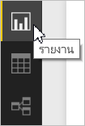
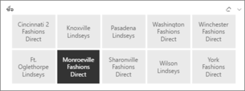
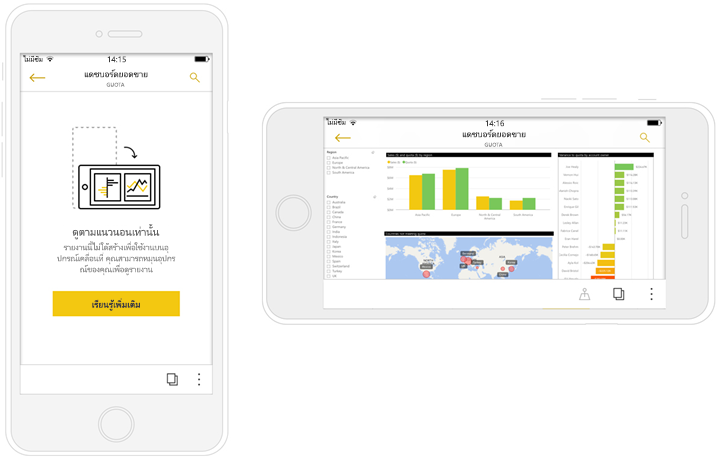

# สร้างรายงานที่ปรับให้เหมาะสมสำหรับแอป Power BI บนโทรศัพท์
เมื่อคุณ[สร้างรายงานใน Power BI Desktop](desktop-report-view.md) คุณก็สามารถปรับปรุงประสบการณ์การใช้งานรายงานในแอปสำหรับอุปกรณ์เคลื่อนที่บนโทรศัพท์ได้โดยสร้างรายงานในรูปแบบเฉพาะสำหรับโทรศัพท์ คุณสามารถปรับเปลี่ยนรายงานสำหรับโทรศัพท์ของคุณได้โดยจัดเรียงและปรับขนาดภาพใหม่แต่อาจไม่ต้องทำทั้งหมด ทั้งนี้เพื่อให้ได้รับประสบการณ์การใช้งานที่เหมาะสม และคุณยังสามารถสร้างภาพ[ *แบบตอบสนอง*](#optimize-a-visual-for-any-size)และ[ตัวแบ่งส่วนข้อมูลแบบตอบสนอง](#enhance-slicers-to-to-work-well-in-phone-reports)ที่ปรับขนาดใหม่ให้เหมาะสมสำหรับการดูผ่านโทรศัพท์ได้ นอกจากนี้ ถ้าคุณเพิ่มตัวกรองให้รายงานของคุณ ตัวกรองเหล่านั้นก็จะปรากฏขึ้นโดยอัตโนมัติในรายงานโทรศัพท์ ผู้อ่านรายงานของคุณสามารถดูรายงานเหล่านั้น และกรองรายงานด้วยตัวกรองดังกล่าว

## จัดเค้าโครงหน้ารายงานสำหรับโทรศัพท์ใน Power BI Desktop
หลังจากที่คุณ[สร้างรายงานใน Power BI Desktop](desktop-report-view.md) คุณก็สามารถปรับรายงานให้เหมาะสมกับโทรศัพท์ได้

1. ใน Power BI Desktop ให้เลือก**มุมมองรายงาน**ในแถบนำทางด้านซ้าย
   
    
2. ที่แท็บ**มุมมอง** ให้เลือก**เค้าโครงโทรศัพท์**  
   
    
   
    คุณจะเห็นพื้นที่ทำงานว่างสำหรับโทรศัพท์ ภาพทั้งหมดในหน้ารายงานต้นฉบับจะปรากฏอยู่ในบานหน้าต่างการแสดงภาพด้านขวา
3. เมื่อต้องการเพิ่มภาพลงในเค้าโครงโทรศัพท์ ให้ลากภาพจากบานหน้าต่างการแสดงภาพไปยังพื้นที่ทำงานสำหรับโทรศัพท์
   
    รายงานโทรศัพท์จะใช้เค้าโครงแบบเส้นตาราง ขณะที่คุณลากภาพไปยังพื้นที่ทำงานสำหรับอุปกรณ์เคลื่อนที่ จะจัดภาพให้ชิดกับเส้นตารางนั้น
   
    
   
    คุณสามารถเพิ่มภาพของหน้ารายงานหลักบางส่วน หรือทั้งหมดลงในหน้ารายงานโทรศัพท์ได้ คุณสามารถเพิ่มภาพได้ครั้งละหนึ่งภาพเท่านั้น
4. คุณสามารถปรับขนาดภาพของคุณบนเส้นตารางได้ใหม่ตามที่คุณต้องการสำหรับไทล์บนแดชบอร์ดและแดชบอร์ดสำหรับอุปกรณ์เคลื่อนที่
   
   > [!NOTE]
   > เส้นตารางรายงานโทรศัพท์จะปรับขนาดให้สอดคล้องกับโทรศัพท์ขนาดต่างๆ เพื่อให้รายงานของคุณดูเหมาะสมกับโทรศัพท์ทั้งที่มีหน้าจอขนาดใหญ่และขนาดเล็ก
   > 
   > 
   
   

## ปรับภาพให้เหมาะสมตามขนาดต่างๆ
คุณสามารถตั้งค่าภาพในแดชบอร์ดหรือรายงานของคุณให้เป็นแบบ*ตอบสนอง* เพื่อให้เกิดการเปลี่ยนแปลงที่ชัดเจนในการแสดงข้อมูลและข้อมูลเชิงลึกให้ได้มากที่สุด โดยไม่ขึ้นกับขนาดของหน้าจอได้ 

เมื่อเปลี่ยนขนาดภาพ Power BI ก็จะจัดลำดับความสำคัญมุมมองข้อมูล ตัวอย่างเช่น เอาช่องว่างภายในออก และย้ายคำอธิบายแผนภูมิไปไว้ด้านบนสุดของภาพโดยอัตโนมัติ เพื่อให้ภาพยังคงแสดงข้อมูลได้ แม้ว่าจะมีขนาดเล็กลงก็ตาม

คุณเลือกว่าจะเปิดใช้งานการตอบสนองสำหรับแต่ละภาพหรือไม่ อ่านข้อมูลเพิ่มเติมเกี่ยวกับ[การปรับภาพให้เหมาะสม](visuals/desktop-create-responsive-visuals.md)

## ข้อควรพิจารณาเมื่อสร้างเค้าโครงรายงานโทรศัพท์
* สำหรับรายงานที่มีหลายหน้า คุณสามารถปรับหน้าทั้งหมดนั้นให้เหมาะสมหรือปรับเพียงไม่กี่หน้าให้เหมาะสมก็ได้ 
* ถ้าคุณได้กำหนดสีพื้นหลังให้หน้ารายงาน รายงานโทรศัพท์ก็จะมีสีพื้นหลังแบบเดียวกัน
* คุณไม่สามารถปรับเปลี่ยนการตั้งค่าการจัดรูปแบบให้โทรศัพท์เพียงอย่างเดียวได้ การจัดรูปแบบจะสอดคล้องกันระหว่างเค้าโครงต้นแบบและเค้าโครงสำหรับอุปกรณ์เคลื่อนที่ ตัวอย่างเช่น ขนาดแบบอักษรจะเหมือนกัน
* เมื่อต้องการเปลี่ยนภาพ เช่น การเปลี่ยนแปลงการจัดรูปแบบ ชุดข้อมูล ตัวกรอง หรือแอตทริบิวต์ต่างๆ ให้กลับไปยังโหมดการเขียนรายงานทั่วไป
* Power BI จะแสดงชื่อเรื่องเริ่มต้นและชื่อหน้าสำหรับรายงานโทรศัพท์ในแอปสำหรับอุปกรณ์เคลื่อนที่ ถ้าคุณได้สร้างภาพข้อความสำหรับชื่อเรื่องและชื่อหน้าในรายงานของคุณ ให้ระลึกไว้ว่าจะไม่เพิ่มเข้าไปในรายงานโทรศัพท์ของคุณ     

## ลบภาพออกจากเค้าโครงโทรศัพท์
* เมื่อต้องการลบภาพออก ให้คลิก X ที่ด้านบนขวาของภาพในพื้นที่ทำงานสำหรับโทรศัพท์ หรือเลือกภาพนั้นๆ แล้วกด**ลบ**
  
   การลบภาพในส่วนนี้จะลบเฉพาะภาพออกจากพื้นที่ทำงานสำหรับเค้าโครงโทรศัพท์เท่านั้น จะไม่ส่งผลต่อภาพและรายงานต้นฉบับ
  
   

## เพิ่มตัวแบ่งส่วนข้อมูลเพื่อให้ทำงานได้อย่างเหมาะสมในรายงานโทรศัพท์
ตัวแบ่งส่วนข้อมูลมีการกรองในพื้นที่ทำงานสำหรับข้อมูลรายงาน เมื่อคุณออกแบบตัวแบ่งส่วนข้อมูลในโหมดการเขียนรายงานทั่วไป คุณก็สามารถปรับเปลี่ยนการตั้งค่าตัวแบ่งส่วนข้อมูลบางรายการ เพื่อให้สามารถใช้งานในรายงานโทรศัพท์ได้สะดวกขึ้น:

* ตัดสินใจว่าจะให้ผู้อ่านรายงานสามารถเลือกได้เพียงหนึ่งรายการหรือมากกว่า
* วางกล่องรอบตัวแบ่งส่วนข้อมูลเพื่อให้สามารถสแกนรายงานได้สะดวกขึ้น
* สร้างตัวแบ่งส่วนข้อมูลแนวตั้ง แนวนอน หรือ*แบบตอบสนอง* 

ถ้าคุณสร้างตัวแบ่งส่วนข้อมูลให้เป็นแบบตอบสนอง เมื่อคุณเปลี่ยนขนาดและรูปร่าง ตัวแบ่งส่วนข้อมูลแบบตอบสนองก็่จะแสดงตัวเลือกมากขึ้นหรือน้อยลง ซึ่งสามารถเป็นแบบสูง เตี้ย กว้างหรือแคบ ถ้าคุณปรับให้มีขนาดเล็กพอ จะกลายเป็นเพียงไอคอนตัวกรองที่อยู่ในหน้ารายงาน 

อ่านข้อมูลเพิ่มเติมเกี่ยวกับ[การสร้างตัวแบ่งส่วนข้อมูลแบบตอบสนอง](power-bi-slicer-filter-responsive.md)

## เผยแพร่รายงานโทรศัพท์
* เมื่อต้องการเผยแพร่รายงานในเวอร์ชันโทรศัพท์ คุณจะ[เผยแพร่รายงานหลักจาก Power BI Desktop ไปยังบริการของ Power BI](desktop-upload-desktop-files.md) และเวอร์ชันโทรศัพท์จะเผยแพร่ในเวลาเดียวกัน
  
    อ่านข้อมูลเพิ่มเติมเกี่ยวกับ[การแชร์และสิทธิ์ใน Power BI](service-how-to-collaborate-distribute-dashboards-reports.md)

## ดูรายงานที่ปรับให้เหมาะสมและยังไม่ได้ปรับให้เหมาะสมในโทรศัพท์ของคุณ
ในแอปสำหรับอุปกรณ์เคลื่อนที่ในโทรศัพท์ Power BI จะตรวจพบรายงานโทรศัพท์ที่ปรับให้เหมาะสมและยังไม่ได้ปรับให้เหมาะสมโดยอัตโนมัติ ถ้ามีรายงานที่ปรับให้เหมาะสมกับโทรศัพท์อยู่ แอป Power BI บนโทรศัพท์จะเปิดรายงานในโหมดรายงานโทรศัพท์โดยอัตโนมัติ

ถ้าไม่มีรายงานที่ปรับให้เหมาะสมกับโทรศัพท์อยู่ รายงานก็จะเปิดขึ้นในมุมมองตามแนวนอนที่ไม่ได้ปรับให้เหมาะสม  

เมื่ออยู่ในรายงานโทรศัพท์ การเปลี่ยนทิศทางการวางแนวของโทรศัพท์เป็นแนวนอนจะเปิดรายงานในมุมมองที่ไม่ได้ปรับให้เหมาะสมด้วยเค้าโครงรายงานต้นฉบับ ไม่ว่ารายงานนั้นจะปรับให้เหมาะสมหรือไม่ก็ตาม

ถ้าคุณปรับเพียงหน้าบางหน้าให้เหมาะสม ผู้อ่านก็จะเห็นข้อความในมุมมองตามแนวตั้งซึ่งหมายความว่ารายงานจะพร้อมใช้งานในแนวนอน

ผู้อ่านรายงานสามารถพลิกโทรศัพท์ไปทางด้านข้าง เพื่อดูหน้าในโหมดแนวนอน อ่านข้อมูลเพิ่มเติมเกี่ยวกับ[การโต้ตอบกับรายงาน Power BI ที่ปรับให้เหมาะสมกับโทรศัพท์ของคุณ](consumer/mobile/mobile-apps-view-phone-report.md)

## ขั้นตอนถัดไป
* [สร้างมุมมองโทรศัพท์สำหรับแดชบอร์ดใน Power BI](service-create-dashboard-mobile-phone-view.md)
* [ดูรายงาน Power BI ที่ปรับให้เหมาะสมกับโทรศัพท์ของคุณ](consumer/mobile/mobile-apps-view-phone-report.md)
* [สร้างภาพแบบตอบสนองที่ปรับให้เหมาะสมตามขนาดต่างๆ](visuals/desktop-create-responsive-visuals.md)
* มีคำถามเพิ่มเติมหรือไม่ [ลองถามชุมชน Power BI](http://community.powerbi.com/)

