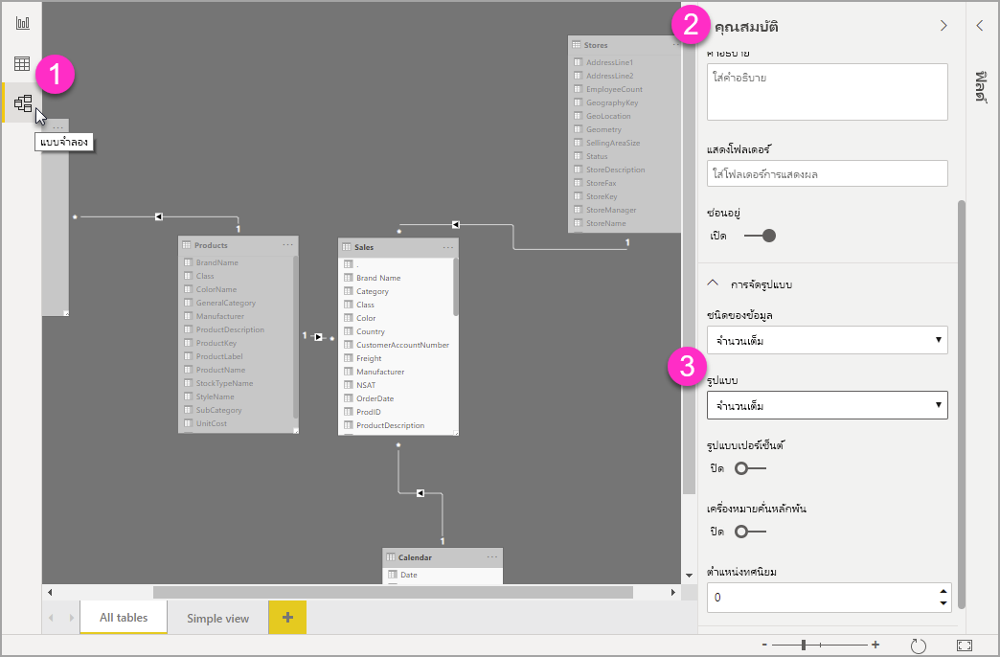

# ใช้สตริงรูปแบบแบบกำหนดเองใน Power BI Desktop

ด้วยสตริงรูปแบบแบบกำหนดเองใน **Power BI Desktop**  คุณสามารถกำหนดวิธีที่เขตข้อมูลจะปรากฏในวิชวล และตรวจสอบให้แน่ใจว่ารายงานของคุณมีลักษณะเหมือนกับที่คุณต้องการอยากให้เป็น

## วิธีการใช้สตริงรูปแบบแบบกำหนดเอง

เมื่อต้องการสร้างสตริงรูปแบบแบบกำหนดเอง ให้เลือกเขตข้อมูลในมุมมอง**แบบจำลอง** จากนั้นเลือก**รูปแบบ**จากบานหน้าต่าง**คุณสมบัติ**

หลังจากที่คุณเลือก **กำหนดเอง** จาก**รูปแบบ** ในรายการดรอปดาวน์แล้วคุณสามารถเลือกจากรายการของสตริงรูปแบบที่ใช้กันทั่วไป 

## ไวยากรณ์รูปแบบที่กำหนดเองที่ได้รับการสนับสนุน

สตริงรูปแบบแบบกำหนดเองทำตามไวยากรณ์ลักษณะ VBA ซึ่งใช้ทั่วไปสำหรับ Excel และผลิตภัณฑ์อื่น ๆ ของ Microsoft แต่ไม่สนับสนุนไวยากรณ์ทั้งหมดที่ใช้ในผลิตภัณฑ์อื่น ๆ 

ตารางต่อไปนี้กำหนดไวยากรณ์ที่ได้รับการสนับสนุนใน Power BI

ตารางต่อไปนี้แสดง**สัญลักษณ์วันที่**ที่ได้รับการสนับสนุน:

| **สัญลักษณ์** | **ช่วง** |
| --- | --- |
| _d_ | 1-31 (วันของเดือนโดยไม่มีศูนย์นำหน้า) |
| _dd_ | 01-31 (วันของเดือนโดยมีศูนย์นำหน้า) |
| _m_ | 1-12 (เดือนของปี โดยไม่มีศูนย์นำหน้า เริ่มต้นด้วยเดือนมกราคม = 1) |
| _mm_ | 01-12 (เดือนของปี โดยมีศูนย์นำหน้า เริ่มต้นด้วยเดือนมกราคม = 01) |
| _mmm_ | แสดงชื่อเดือนที่เป็นตัวย่อ (ชื่อเดือน Hijri ไม่มีตัวย่อ) |
| _mmmm_ | แสดงชื่อเต็มเดือน |
| _yy_ | 00-99 (สองหลักสุดท้ายของปี) |
| _yyyy_ | 100-9999 (ปีสามหรือสี่หลัก) |

ตารางต่อไปนี้แสดง**สัญลักษณ์เวลา**ที่ได้รับการสนับสนุน:

| **สัญลักษณ์** | **ช่วง** |
| --- | --- |
| _h_ | 0-23 (1-12 ที่มี &quot;AM&quot; หรือ &quot;PM&quot; ต่อท้าย) (ชั่วโมงของวัน โดยไม่มีศูนย์นำหน้า) |
| _hh_ | 00-23 (01-12 ที่มี &quot;AM&quot; หรือ &quot;PM&quot; ต่อท้าย) (ชั่วโมงของวัน โดยมีศูนย์นำหน้า) |
| _n_ | 0-59 (นาทีของชั่วโมง โดยไม่มีศูนย์นำหน้า) |
| _nn_ | 00-59 (นาทีของชั่วโมง โดยมีศูนย์นำหน้า) |
| _m_ | 0-59 (นาทีของชั่วโมง โดยไม่มีศูนย์นำหน้า) เฉพาะในกรณีที่นำหน้าด้วย _h_ หรือ _hh_ |
| _mm_ | 00-59 (นาทีของชั่วโมง โดยมีศูนย์นำหน้า) เฉพาะในกรณีที่นำหน้าด้วย _h_ หรือ _hh_ |
| _s_ | 0-59 (วินาทีของนาที โดยไม่มีศูนย์นำหน้า) |
| _ss_ | 00-59 (วินาทีของนาที โดยมีศูนย์นำหน้า) |

คุณสามารถดู[ตัวอย่าง](https://docs.microsoft.com/office/vba/language/reference/user-interface-help/format-function-visual-basic-for-applications#example)ของวิธีการจัดรูปแบบสตริงของค่าแบบกำหนดเอง

นิพจน์รูปแบบที่ผู้ใช้กำหนดเองสำหรับตัวเลขสามารถมาจากหนึ่งถึงสามส่วนที่คั่นด้วยเครื่องหมายอัฒภาค ถ้าคุณใช้เครื่องหมายอัฒภาคที่ไม่มีสิ่งใดระหว่างเครื่องหมาย ส่วนที่ขาดหายไปจะไม่แสดงขึ้นมา&quot;(จะเป็น&quot;) ถ้าไม่มีการระบุเครื่องหมายอัฒภาค จะใช้รูปแบบค่าบวก

ต่อไปนี้คือตัวอย่างของรูปแบบที่แตกต่างกันสำหรับสตริงของค่าที่แตกต่างกัน:

|   | **สตริงรูปแบบแบบ** |   |   |   |
| --- | --- | --- | --- | --- |
| **ค่า** | **0.00;-0.0;&quot;ศูนย์&quot;** | **0.00;;** | **0.00;-0.0;** | **0.00;** |
| **-1.234** | -1.2 | &quot;&quot; | -1.2 | &quot;&quot; |
| **0** | &quot;ศูนย์&quot; | &quot;&quot; | &quot;&quot; | 0.00 |
| **1.234** | 1.23 | 1.23 | 1.23 | 1.23 |

ตารางต่อไปนี้ระบุ **รูปแบบวันที่และเวลาที่ระบุชื่อ** และกำหนดไว้ล่วงหน้า:

| **ชื่อรูปแบบ** | **คำอธิบาย** |
| --- | --- |
| **วันที่ทั่วไป** | แสดงวันที่และ/หรือเวลา ตัวอย่างเช่น 4/3/93 05:34 น. ถ้าไม่มีเศษส่วน ให้แสดงเฉพาะวันที่ ตัวอย่างเช่น 4/3/93 ถ้าไม่มีจำนวนเต็ม ให้แสดงเวลาเท่านั้น ตัวอย่างเช่น 05:34 น. การแสดงวันที่จะถูกกำหนดโดยการตั้งค่าระบบของคุณ |
| **วันที่แบบยาว** | แสดงวันที่ตามรูปแบบวันที่แบบยาวในระบบของคุณ |
| **วันที่แบบสั้น** | แสดงวันที่โดยใช้รูปแบบวันที่แบบสั้นในระบบของคุณ |
| **เวลาแบบยาว** | แสดงเวลาโดยใช้รูปแบบเวลาแบบยาวในระบบของคุณมีชั่วโมง นาที วินาที |
| **เวลาแบบสั้น** | แสดงเวลาโดยใช้รูปแบบ 24 ชั่วโมง ตัวอย่างเช่น 17:45 |

รูปแบบตัวเลขที่ระบุชื่อ

ตารางต่อไปนี้ระบุ **รูปแบบตัวเลขที่ระบุชื่อ** และกำหนดไว้ล่วงหน้า:

| **ชื่อรูปแบบ** | **คำอธิบาย** |
| --- | --- |
| **หมายเลขทั่วไป** | แสดงตัวเลขที่ไม่มีตัวคั่นหลักพัน |
| **สกุลเงิน** | แสดงตัวเลขที่มีตัวคั่นหลักพัน ถ้าเหมาะสม แสดงสองหลักทางด้านขวาของตัวคั่นทศนิยม ผลลัพธ์จะขึ้นอยู่กับการตั้งค่าภาษาของระบบ |
| **แบบคงที่** | แสดงอย่างน้อยหนึ่งหลักทางซ้ายและสองหลักทางด้านขวาของตัวคั่นทศนิยม |
| **มาตรฐาน** | แสดงตัวเลขที่มีตัวคั่นหลักพัน อย่างน้อยหนึ่งหลักทางซ้ายและสองหลักทางด้านขวาของตัวคั่นทศนิยม |
| **เปอร์เซ็นต์** | แสดงตัวเลขที่คูณด้วย 100 พร้อมด้วยเครื่องหมายเปอร์เซ็นต์ ( **%** ) ต่อท้ายทางขวา; แสดงสองหลักทางด้านขวาของตัวคั่นทศนิยมเสมอ |
| **เชิงวิทยาศาสตร์** | ใช้สัญกรณ์ทางวิทยาศาสตร์มาตรฐาน |

ตารางต่อไปนี้ระบุอักขระที่คุณสามารถใช้เพื่อสร้าง**รูปแบบวันที่/เวลาที่ผู้ใช้กำหนด**

| **อักขระ** | **คำอธิบาย** |
| --- | --- |
| ( **:** ) | ตัวคั่นเวลา ในบางพื้นที่ อาจใช้อักขระอื่นเพื่อแทนตัวคั่นเวลา ตัวคั่นเวลาจะแยกข้อมูลชั่วโมง นาที และวินาทีเมื่อมีการจัดรูปแบบค่าเวลา อักขระจริงที่ใช้เป็นตัวคั่นเวลาในผลลัพธ์ที่จัดรูปแบบไว้ถูกกำหนดโดยการตั้งค่าระบบของคุณ |
| ( **/** ) | ตัวคั่นวันที่ ในบางพื้นที่ อาจใช้อักขระอื่นเพื่อแทนตัวคั่นวันที่ ตัวคั่นวันที่จะแยกข้อมูลวัน เดือน และปีเมื่อมีการจัดรูปแบบค่าวันที่ อักขระจริงที่ใช้เป็นตัวคั่นวันที่ในผลลัพธ์ที่จัดรูปแบบไว้ถูกกำหนดโดยการตั้งค่าระบบของคุณ |
| d | แสดงวันที่เป็นตัวเลขโดยไม่มีเลขศูนย์นำหน้า (1-31) |
| dd | แสดงวันที่เป็นตัวเลขโดยมีเลขศูนย์นำหน้า (01-31) |
| ddd | แสดงวันเป็นตัวอักษรย่อ (อา-ส) แปลภาษาแล้ว |
| dddd | แสดงวันเป็นชื่อเต็ม (วันอาทิตย์ - วันเสาร์) แปลภาษาแล้ว |
| m | แสดงเดือนเป็นตัวเลขโดยไม่มีเลขศูนย์นำหน้า (1–12) ถ้า m ตามหลัง h หรือ hh ทันที นาทีจะแสดงในรูปแบบเดือน |
| mm | แสดงเดือนเป็นตัวเลขโดยมีเลขศูนย์นำหน้า (01–12) ถ้า m ตามหลัง h หรือ hh ทันที นาทีจะแสดงในรูปแบบเดือน |
| mmm | แสดงเดือนเป็นตัวอักษรย่อ (ม.ค. - ธ.ค.) แปลภาษาแล้ว |
| mmmm | แสดงเดือนเป็นชื่อเต็ม (มกราคม - ธันวาคม) แปลภาษาแล้ว |
| yy | แสดงปีเป็นตัวเลข 2 หลัก (00 – 99) |
| yyyy | แสดงปีเป็นตัวเลข 4 หลัก (100 – 9999) |
| h | แสดงชั่วโมงเป็นตัวเลขโดยไม่มีเลขศูนย์นำหน้า (0–23) |
| hh | แสดงชั่วโมงเป็นตัวเลขโดยมีเลขศูนย์นำหน้า (00–23) |
| n | แสดงนาทีเป็นตัวเลขโดยไม่มีเลขศูนย์นำหน้า (0–59) |
| nn | แสดงนาทีเป็นตัวเลขโดยมีเลขศูนย์นำหน้า (00–59) |
| s | แสดงวินาทีเป็นตัวเลขโดยไม่มีเลขศูนย์นำหน้า (0–59) |
| ss | แสดงวินาทีเป็นตัวเลขโดยมีเลขศูนย์นำหน้า (00–59) |
| AM/PM | ใช้นาฬิกาแบบ 12 ชั่วโมงและแสดง AM ตัวพิมพ์ใหญ่พร้อมด้วยเวลาก่อนเที่ยง แสดง PM ตัวพิมพ์ใหญ่พร้อมด้วยเวลาระหว่างเวลาเที่ยงและ11:59 P.M. |

ตารางต่อไปนี้ระบุอักขระที่คุณสามารถใช้เพื่อสร้าง**รูปแบบตัวเลขที่ผู้ใช้กำหนด**

| **อักขระ** | **คำอธิบาย** |
| --- | --- |
| ไม่มี | แสดงตัวเลขที่ไม่มีการจัดรูปแบบ |
| ( **0** ) | ตัวแทนตัวเลข แสดงตัวเลขหรือศูนย์ ถ้านิพจน์มีตัวเลขในตำแหน่งที่ 0 ปรากฏในสตริงรูปแบบ จะแสดงตัวเลขขึ้น มิฉะนั้นจะแสดงศูนย์ในตำแหน่งนั้น ถ้าตัวเลขมีจำนวนหลักน้อยกว่ามีเลขศูนย์ (ด้านหนึ่งของทศนิยม) ในนิพจน์รูปแบบ จะแสดงเลขศูนย์นำหน้าหรือต่อท้าย ถ้าตัวเลขมีจำนวนหลักทางด้านขวาของตัวคั่นทศนิยมมากกว่ามีเลขศูนย์ทางด้านขวาของตัวคั่นทศนิยมในนิพจน์รูปแบบ ให้ปัดเศษตัวเลขเป็นจุดทศนิยมมากเท่าที่มีเลชศูนย์ ถ้าตัวเลขมีจำนวนหลักทางด้านซ้ายของตัวคั่นทศนิยมมากกว่ามีเลขศูนย์ทางด้านซ้ายของตัวคั่นทศนิยมในนิพจน์รูปแบบ จะแสดงตัวเลขพิเศษโดยไม่มีการแก้ไข |
| ( **#** ) | ตัวแทนตัวเลข แสดงตัวเลขหรือไม่มี ถ้านิพจน์มีตัวเลขในตำแหน่งที่ # ปรากฏในสตริงรูปแบบ จะแสดงตัวเลขขึ้น มิฉะนั้นจะไม่แสดงอะไรในตำแหน่งนั้น สัญลักษณ์นี้ทำงานเหมือนกับตัวแทนเลข 0 ยกเว้นว่าเลขศูนย์นำหน้าและต่อท้ายจะไม่แสดงขึ้นมาถ้าตัวเลขมีจำนวนหลักเท่ากันหรือน้อยกว่ามี # อักขระที่อยู่ด้านใดด้านหนึ่งของตัวคั่นทศนิยมในนิพจน์รูปแบบ |
| ( **.** ) | ตัวแทนทศนิยม ในบางพื้นที่ ใช้จุลภาคเป็นตัวคั่นทศนิยม ตัวแทนทศนิยมจะกำหนดจำนวนหลักที่แสดงทางด้านซ้ายและด้านขวาของตัวคั่นทศนิยม ถ้านิพจน์รูปแบบประกอบด้วยเครื่องหมายตัวเลขทางด้านซ้ายของสัญลักษณ์นี้เท่านั้น จำนวนที่น้อยกว่า 1 จะเริ่มต้นด้วยตัวคั่นทศนิยม เมื่อต้องการแสดงศูนย์นำหน้าพร้อมด้วยตัวเลขเศษส่วน ให้ใช้ 0 เป็นตัวแทนหลักแรกทางด้านซ้ายของตัวคั่นทศนิยม อักขระจริงที่ใช้เป็นตัวแทนทศนิยมในผลลัพธ์ที่จัดรูปแบบไว้จะขึ้นอยู่กับรูปแบบตัวเลขที่ระบบของคุณรู้จัก |
| ( **%)** | ตัวแทนเปอร์เซ็นต์ นิพจน์จะคูณด้วย 100 อักขระเปอร์เซ็นต์ ( **%** ) ถูกแทรกในตำแหน่งที่ปรากฏในสตริงรูปแบบ |
| ( **,** ) | ตัวคั่นหลักพัน ในบางพื้นที่ ใช้เครื่องหมายมหัพภาคเป็นตัวคั่นหลักพัน ตัวคั่นหลักพันจะแยกจำนวนหลักพันออกจากหลักร้อยภายในตัวเลขที่มีสี่ตำแหน่งขึ้นไปทางด้านซ้ายของตัวคั่นทศนิยม การใช้งานมาตรฐานของตัวคั่นหลักพันถูกระบุไว้หากรูปแบบมีตัวคั่นหลักพันล้อมรอบด้วยตัวแทนตัวเลข (**0**  หรือ  **#** ) ตัวคั่นหลักพันสองตัวที่อยู่ติดกันหรือตัวคั่นหลักพันทางด้านซ้ายของตัวคั่นทศนิยม (ไม่ว่าจะระบุทศนิยมหรือไม่ก็ตาม) หมายถึง &quot;การปรับจำนวนโดยการหารด้วย 1,000 การปัดเศษตามต้องการ&quot; ตัวอย่างเช่น คุณสามารถใช้สตริงรูปแบบ &quot;##0,,&quot; เพื่อแสดง 100,000,000 เป็น 100 ตัวเลขที่มีน้อยกว่า 1,000,000 จะแสดงเป็น 0 ตัวคั่นหลักพันสองตัวที่ติดกันในตำแหน่งใด ๆ นอกเหนือจากทางด้านซ้ายของตัวคั่นทศนิยมจะถือเป็นเพียงแค่การระบุการใช้ตัวคั่นหลักพัน อักขระจริงที่ใช้เป็นตัวคั่นหลักพันในผลลัพธ์ที่จัดรูปแบบไว้จะขึ้นอยู่กับรูปแบบตัวเลขที่ระบบของคุณรู้จัก |
| ( **:** ) | ตัวคั่นเวลา ในบางพื้นที่ อาจใช้อักขระอื่นเพื่อแทนตัวคั่นเวลา ตัวคั่นเวลาจะแยกข้อมูลชั่วโมง นาที และวินาทีเมื่อมีการจัดรูปแบบค่าเวลา อักขระจริงที่ใช้เป็นตัวคั่นเวลาในผลลัพธ์ที่จัดรูปแบบไว้ถูกกำหนดโดยการตั้งค่าระบบของคุณ |
| ( **/** ) | ตัวคั่นวันที่ ในบางพื้นที่ อาจใช้อักขระอื่นเพื่อแทนตัวคั่นวันที่ ตัวคั่นวันที่จะแยกข้อมูลวัน เดือน และปีเมื่อมีการจัดรูปแบบค่าวันที่ อักขระจริงที่ใช้เป็นตัวคั่นวันที่ในผลลัพธ์ที่จัดรูปแบบไว้ถูกกำหนดโดยการตั้งค่าระบบของคุณ |
| ( **E- E+ e- e+** ) | รูปแบบทางวิทยาศาสตร์ ถ้านิพจน์รูปแบบประกอบด้วยตัวแทนตัวเลขอย่างน้อยหนึ่งตัว ( **0**  หรือ  **#** ) ทางด้านขวาของ E-, E+, e-หรือ e+ ตัวเลขจะแสดงในรูปแบบทางวิทยาศาสตร์และ E หรือ e ถูกแทรกระหว่างตัวเลขและเลขชี้กำลัง จำนวนของตัวแทนตัวเลขทางด้านขวาจะกำหนดจำนวนหลักในเลขชี้กำลัง ใช้ E-หรือ e-เพื่อใส่เครื่องหมายลบถัดจากเลขชี้กำลังที่เป็นลบ ใช้ E+ หรือ e+ เพื่อใส่เครื่องหมายลบถัดจากเลขชี้กำลังที่เป็นลบและเครื่องหมายบวกถัดจากเลขชี้กำลังที่เป็นบวก |
| **- + $**  ( ) | แสดงอักขระสัญพจน์ เมื่อต้องการแสดงอักขระอื่นนอกเหนือจากหนึ่งในอักขระเหล่านั้นที่ระบุไว้ ให้นำหน้าด้วยเครื่องหมายทับขวา (\)หรือใส่ไว้ในอัญประกาศคู่ (&quot;&quot;) |
| ( * *\** ) | แสดงอักขระถัดไปในสตริงรูปแบบ เมื่อต้องการแสดงอักขระที่มีความหมายพิเศษเป็นอักขระสัญพจน์ ให้นำหน้าด้วยเครื่องหมายทับขวา (\) เครื่องหมายทับขวาของตัวเองจะไม่แสดงขึ้น การใช้เครื่องหมายทับขวาจะเหมือนกับการล้อมอักขระถัดไปในอัญประกาศคู่ หากต้องการแสดงเครื่องหมายทับขวา ให้ใช้เครื่องหมายทับขวาสองเครื่องหมาย (\\) ตัวอย่างของอักขระที่ไม่สามารถแสดงเป็นอักขระสัญพจน์เป็นอักขระการจัดรูปแบบวันที่และอักขระการจัดรูปแบบเวลา (a, c, d, h, m, n, p, q, s, t, w, / และ:), อักขระการจัดรูปแบบตัวเลข (#, 0,%, E, e, จุลภาค และจุด) และ อักขระการจัดรูปแบบสตริง (@, &amp;, \&lt;, \&gt;, และ !) |
| (&quot;ABC&quot;) | แสดงสตริงที่อยู่ภายในเครื่องหมายอัญประกาศคู่ (&quot; &quot;) |

## ขั้นตอนถัดไป
คุณอาจสนใจบทความต่อไปนี้:

* [สตริงรูปแบบแบบ VBA](https://docs.microsoft.com/office/vba/language/reference/user-interface-help/format-function-visual-basic-for-applications#example)
* [มาตรการในเดสก์ทอป Power BI](desktop-measures.md)
* [ชนิดข้อมูลใน Power BI Desktop](desktop-data-types.md)
* [การจัดรูปแบบตามเงื่อนไขในตาราง](desktop-conditional-table-formatting.md)

