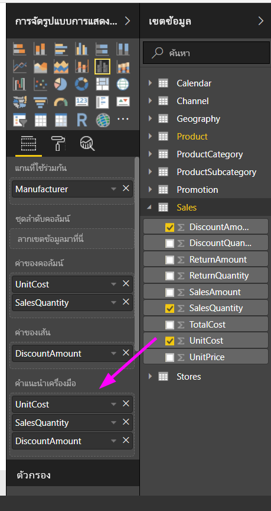
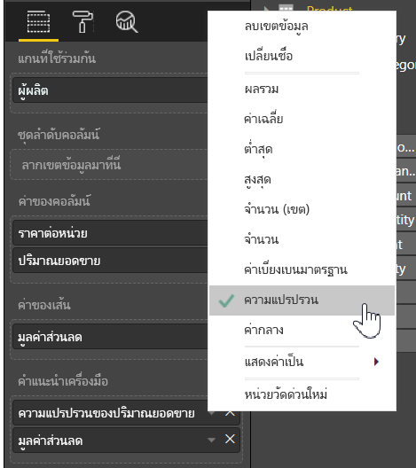

# การกำหนดคำแนะนำเครื่องมือเองใน Power BI Desktop
คำแนะนำเครื่องมือเป็นวิธีที่เหมาะสมในการให้ข้อมูลตามบริบทและรายละเอียดไปยังจุดข้อมูลบนภาพได้มากกว่า รูปต่อไปนี้แสดงคำแนะนำเครื่องมือที่นำไปใช้กับแผนภูมิใน Power BI Desktop

เมื่อมีการสร้างภาพ คำแนะนำเครื่องมือเริ่มต้นจะแสดงค่าและประเภทของจุดข้อมูล มีหลายตัวอย่างที่ความสามารถในการกำหนดข้อมูลคำแนะนำเครื่องมือจะเป็นประโยชน์ได้ และจะให้บริบทและข้อมูลเพิ่มเติมสำหรับผู้ใช้ที่ดูภาพ คำแนะนำเครื่องมือแบบกำหนดเองช่วยให้คุณสามารถระบุจุดข้อมูลเพิ่มเติมที่แสดงเป็นส่วนหนึ่งของคำแนะนำดังกล่าว

## วิธีการกำหนดคำแนะนำเครื่องมือด้วยตนเอง
เมื่อต้องสร้างคำแนะนำแบบกำหนดเอง ในแอ่ง**ช่องข้อมูล**ของพื้นที่**การแสดงภาพ** เพียงแค่ลากช่องข้อมูลลงในบักเก็ต**คำแนะนำเครื่องมือ**ที่แสดงในรูปต่อไปนี้ ในรูปต่อไปนี้ มีสองเขตข้อมูลถูกใส่ไว้ในบักเก็ต**คำแนะนำเครื่องมือ**

เมื่อเพิ่มคำแนะนำเครื่องมือเข้าไปยังช่องเขตข้อมูลแล้ว โฮเวอร์เหนือจุดข้อมูลบนการแสดงภาพ จะแสดงค่าสำหรับเขตข้อมูลเหล่านั้นในคำแนะนำเครื่องมือ

## กำหนดคำแนะนำเครื่องมือด้วยตนเองด้วยการรวมหรือ Quick Calcs (คำนวณด่วน)
คุณสามารถกำหนดคำแนะนำเครื่องมือเพิ่มเติมได้โดยการเลือกฟังก์ชันการรวมหรือ*คำนวณด่วน*โดยการเลือกลูกศรข้างช่องข้อมูลในบักเก็ต**คำแนะนำเครื่องมือ** และเลือกจากตัวเลือกที่ใช้งานได้

มีหลายวิธีในการกำหนด**คำแนะนำเครื่องมือ**ด้วยตนเอง นั่นคืิอ โดยใช้ช่องข้อมูลใด ๆ ที่พร้อมใช้งานในชุดข้อมูลของคุณ การสื่อข้อมูลอย่างรวดเร็วและข้อมูลเชิงลึกกับผู้ใช้ที่ดูแดชบอร์ดหรือรายงานของคุณ

