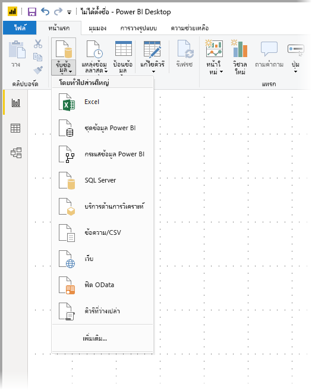
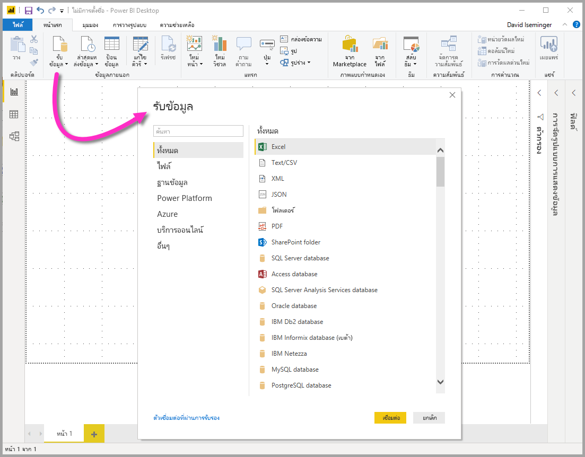
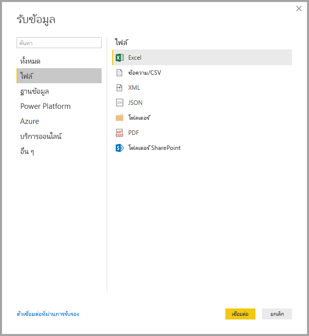
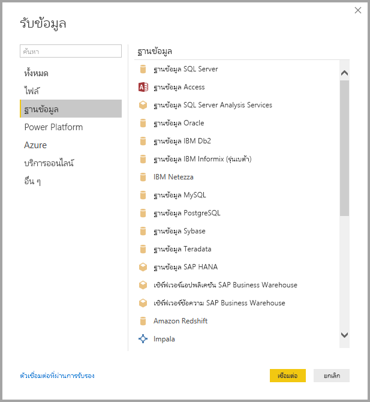
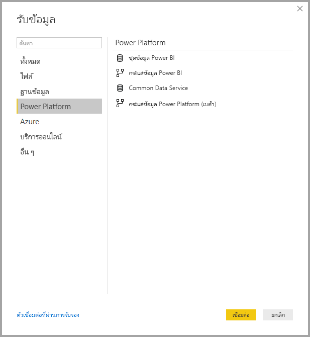
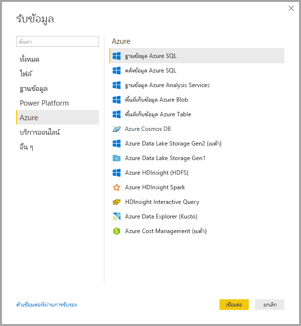
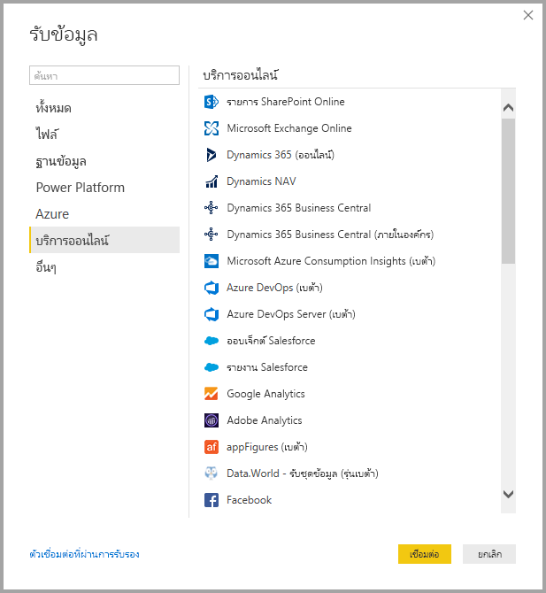
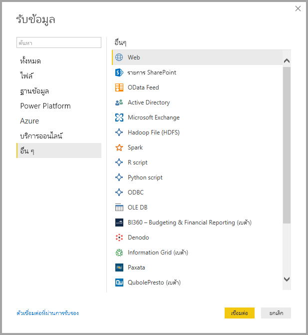
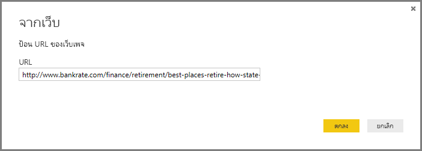
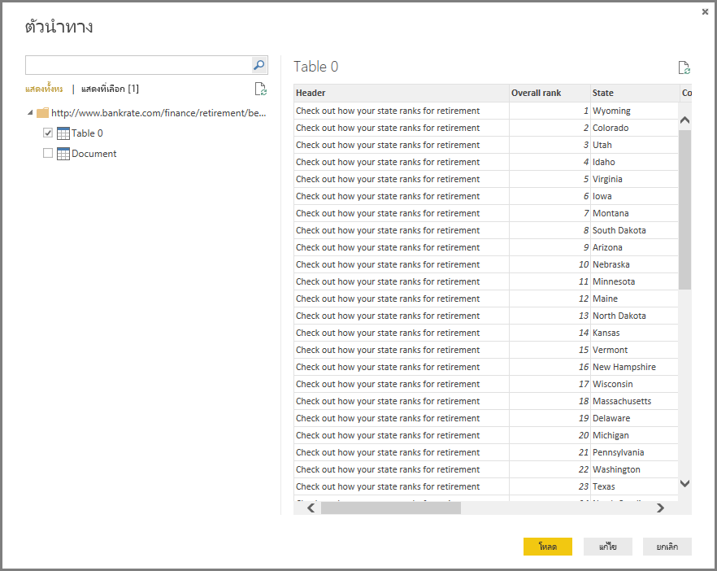

# <a name="data-sources-in-power-bi-desktop"></a>แหล่งข้อมูลใน Power BI Desktop

คุณสามารถเชื่อมต่อกับข้อมูลจากแหล่งต่าง ๆ มากมายด้วย Power BI Desktop สำหรับรายการทั้งหมดของแหล่งข้อมูลที่พร้อมใช้งาน ให้ดู[แหล่งข้อมูล Power BI](power-bi-data-sources.md)

เมื่อต้องการเชื่อมต่อกับข้อมูล ให้เลือก**รับข้อมูล**จาก**ribbon** หน้าแรก เลือกลูกศรชี้ลง หรือเลือกข้อความ**รับข้อมูล**บนปุ่ม แสดงเมนูชนิดข้อมูล**ใช้บ่อยที่สุด**ตามที่แสดงในรูปต่อไปนี้:



เลือก**เพิ่มเติม...** จากเมนู**ใช้บ่อยที่สุด**ที่แสดงในหน้าต่าง**รับข้อมูล** คุณสามารถทำให้หน้าต่าง**รับข้อมูล** แสดงขึ้นได้ (และข้ามเมนู**ใช้บ่อยที่สุด**) โดยการเลือก**ปุ่มไอคอน** **รับข้อมูล**โดยตรง



> [!NOTE]
> ทีม Power BI จะขยายแหล่งข้อมูลที่พร้อมใช้งานอย่างต่อเนื่องไปยัง**Power BI Desktop**และ**บริการ Power BI** ดังนั้นคุณมักจะเห็นงานระหว่างแหล่งข้อมูลที่กำลังดำเนินการอยู่ในช่วงเริ่มต้นได้รับการทำเครื่องหมายเป็น*เบต้า*หรือ*แสดงตัวอย่าง* แหล่งข้อมูลใด ๆ ที่ได้รับการทำเครื่องหมายเป็น*เบต้า*หรือ*แสดงตัวอย่าง*มีการจำกัดการสนับสนุนและฟังก์ชันการทำงาน และไม่ควรใช้ในสภาพแวดล้อมการผลิต นอกจากนี้ แหล่งข้อมูลใดๆ ที่ทำเครื่องหมายเป็น*เบต้า* หรือ*แสดงตัวอย่าง*สำหรับ **Power BI Desktop** อาจไม่สามารถใช้งานได้ใน**บริการของ Power BI** หรือบริการอื่นๆ ของ Microsoft จนกว่าแหล่งข้อมูลจะพร้อมใช้งานโดยทั่วไป (GA)

> [!NOTE]
> มีตัวเชื่อมต่อข้อมูลจำนวนมากสำหรับ Power BI Desktop ที่จำเป็นต้องใช้ Internet Explorer 10 (หรือใหม่กว่า) สำหรับการรับรองความถูกต้อง 


## <a name="data-sources"></a>แหล่งข้อมูล
ชนิดข้อมูลจะได้รับการจัดระเบียบในประเภทต่อไปนี้:

* ทั้งหมด
* ไฟล์
* ฐานข้อมูล
* Power BI
* Azure
* บริการออนไลน์
* อื่นๆ

ประเภท**ทั้งหมด**รวมถึงชนิดการเชื่อมต่อข้อมูลทั้งหมดจากประเภททั้งหมด

ประเภท**ไฟล์**มีการเชื่อมต่อข้อมูลต่อไปนี้:

* Excel
* ข้อความ/CSV
* XML
* JSON
* โฟลเดอร์
* PDF
* โฟลเดอร์ SharePoint

รูปภาพต่อไปนี้แสดงหน้าต่าง**รับข้อมูล**สำหรับ**ไฟล์**



ประเภท**ฐานข้อมูล**มีการเชื่อมต่อข้อมูลต่อไปนี้:

* ฐานข้อมูล SQL Server
* ฐานข้อมูล Access
* ฐานข้อมูล SQL Server Analysis Services
* ฐานข้อมูล Oracle
* ฐานข้อมูล IBM DB2
* ฐานข้อมูล IBM Informix (รุ่นเบต้า)
* IBM Netezza
* ฐานข้อมูล MySQL
* ฐานข้อมูล PostgreSQL
* ฐานข้อมูล Sybase
* Teradata
* ฐานข้อมูล SAP HANA
* เซิร์ฟเวอร์แอปพลิเคชัน SAP Business Warehouse
* เซิร์ฟเวอร์ข้อความ SAP Business Warehouse
* Amazon Redshift
* Impala
* Google BigQuery
* Vertica
* Snowflake
* Essbase
* คิวบ์ AtScale
* BI Connector
* Dremio
* Exasol
* Indexima (เบต้า)
* InterSystems IRIS (เบต้า)
* Jethro (รุ่นเบต้า)
* วิสาหกิจ Kyligence (เบต้า)
* MarkLogic (เบต้า)

> [!NOTE]
> ตัวเชื่อมต่อฐานข้อมูลบางอย่างจำเป็นต้องให้คุณเปิดใช้งานโดยการเลือก**ไฟล์ > ตัวเลือกและการตั้งค่า > ตัวเลือก**จากนั้นเลือก**คุณลักษณะการแสดงตัวอย่าง**และเปิดใช้งานตัวเชื่อมต่อ ถ้าคุณไม่เห็นตัวเชื่อมต่อที่กล่าวถึงด้านบน และต้องการใช้งานตัวเชื่อมต่อเหล่านั้น โปรดตรวจสอบการตั้งค่าของ**คุณลักษณะการแสดงตัวอย่าง** และโปรดทราบว่าแหล่งข้อมูลใด ๆ ที่ได้รับการทำเครื่องหมายเป็น*เบต้า*หรือ*แสดงตัวอย่าง*มีการจำกัดการสนับสนุนและฟังก์ชันการทำงาน และไม่ควรใช้ในสภาพแวดล้อมการผลิต

รูปภาพต่อไปนี้แสดงหน้าต่าง**รับข้อมูล**สำหรับ**ไฟล์**



ประเภท **Power Platform** มีการเชื่อมต่อข้อมูลดังต่อไปนี้

* ชุดข้อมูล Power BI
* กระแสข้อมูล Power BI
* Common Data Service
* กระแสข้อมูล Power Platform

รูปภาพต่อไปนี้แสดงหน้าต่าง**รับข้อมูล**สำหรับ **Power Platform**



ประเภท **Azure** มีการเชื่อมต่อข้อมูลดังต่อไปนี้

* ฐานข้อมูล Azure SQL
* คลังข้อมูล Azure SQL
* ฐานข้อมูล Azure Analysis Services
* พื้นที่เก็บข้อมูล Azure Blob
* พื้นที่เก็บข้อมูล Azure Table
* Azure Cosmos DB
* Azure Data Lake Storage Gen2
* Azure Data Lake Storage Gen1
* Azure HDInsight (HDFS)
* Azure HDInsight Spark
* HDInsight Interactive Query
* Azure Data Explorer (Kusto)
* Azure Cost Management
* Azure Time Series Insights (เบต้า)

แสดงรูปภาพต่อไปนี้**รับข้อมูล**สำหรับ**Azure**



ประเภท**บริการออนไลน์**มีการเชื่อมต่อข้อมูลต่อไปนี้:

* รายการ SharePoint Online
* Microsoft Exchange Online
* Dynamics 365 (ออนไลน์)
* Dynamics NAV
* Dynamics 365 Business Central
* Dynamics 365 Business Central (ภายในองค์กร)
* Microsoft Azure Consumption Insights (เบต้า)
* Azure DevOps (เบต้า)
* Azure DevOps Server (เบต้า)
* ออบเจ็กต์ Salesforce
* รายงาน Salesforce
* Google Analytics
* Adobe Analytics
* appFigures (เบต้า)
* Data.World - รับชุดข้อมูล (เบต้า)
* Facebook
* GitHub (เบต้า)
* MailChimp (เบต้า)
* Marketo (เบต้า)
* Mixpanel (เบต้า)
* Planview Enterprise One - PRM (เบต้า)
* Planview Projectplace (เบต้า)
* QuickBooks Online (เบต้า)
* Smartsheet
* SparkPost (เบต้า)
* Stripe (เบต้า)
* SweetIQ (เบต้า)
* Planview Enterprise One - CMT (เบต้า)
* Twilio (เบต้า)
* tyGraph (เบต้า)
* Webtrends (เบต้า)
* Zendesk (เบต้า)
* Dynamics 365 Customer Insights (Beta)
* แหล่งข้อมูล Emigo (เบต้า)
* Entersoft Business Suite (เบต้า)
* Industrial App Store
* คลังข้อมูล Intune (เบต้า)
* การรักษาความปลอดภัยของ Microsoft Graph
* Quick Base
* TeamDesk (เบต้า)


รูปภาพต่อไปนี้แสดงหน้าต่าง**รับข้อมูล**สำหรับ**บริการออนไลน์**



ประเภท**อื่น ๆ**มีการเชื่อมต่อข้อมูลต่อไปนี้:

* เว็บ
* รายการ SharePoint
* ตัวดึงข้อมูล OData
* Active Directory
* Microsoft Exchange
* ไฟล์ Hadoop (HDFS)
* Spark
* สคริปต์ R
* สคริปต์ Python
* ODBC
* OLE DB
* BI360 - การรายงานการจัดทำงบประมาณและการเงิน (เบต้า)
* Denodo
* เส้นตารางข้อมูล (เบต้า)
* Paxata 
* QubolePresto (เบต้า)
* Roamler (เบต้า)
* SurveyMonkey(เบต้า)
* Tenforce (Smart)List (เบต้า)
* Workforce Dimensions (เบต้า)
* คิวรีที่ว่างเปล่า

รูปภาพต่อไปนี้แสดงหน้าต่าง**รับข้อมูล**สำหรับ**อื่น ๆ**



> [!NOTE]
> ในขณะนี้คุณไม่สามารถเชื่อมต่อกับแหล่งข้อมูลแบบกำหนดเองที่รักษาความปลอดภัยโดยใช้ Azure Active Directory

## <a name="connecting-to-a-data-source"></a>เชื่อมต่อกับแหล่งข้อมูล
เลือกแหล่งข้อมูลจากหน้าต่าง**รับข้อมูล**และเลือก**เชื่อมต่อ**เพื่อเชื่อมต่อกับแหล่งข้อมูล ในรูปต่อไปนี้**เว็บ**ได้รับการเลือกจากประเภทการเชื่อมต่อข้อมูล**อื่น ๆ**


หน้าต่างการเชื่อมต่อจะแสดงขึ้นตามชนิดของการเชื่อมต่อข้อมูล คุณจะได้รับพร้อมท์เพื่อแจ้งให้ป้อนข้อมูลประจำตัว หากจำเป็นต้องใช้ รูปต่อไปนี้แสดง URL ที่ป้อนเพื่อเชื่อมต่อกับแหล่งข้อมูลเว็บ



เมื่อป้อนข้อมูลการเชื่อมต่อ URL หรือทรัพยากรแล้ว ให้เลือก**ตกลง** Power BI Desktop ทำการเชื่อมต่อกับแหล่งข้อมูล และแสดงแหล่งข้อมูลพร้อมใช้งานใน**ตัวนำทาง**



คุณสามารถโหลดข้อมูลโดยการเลือกปุ่ม**โหลด**ที่ด้านล่างของบานหน้าต่าง**ตัวนำทาง** หรือแก้ไขคิวรีก่อนโหลดข้อมูลโดยการเลือกปุ่ม**แก้ไข**ปุ่ม

นั่นคือทั้งหมดของการเชื่อมต่อกับแหล่งข้อมูลใน Power BI Desktop ลองเชื่อมต่อกับข้อมูลจากรายการของแหล่งข้อมูลที่เรากำลังพัฒนา และกลับมาตรวจสอบบ่อยๆ - เราจะดำเนินการเพื่อเพิ่มลงในรายการนี้อยู่ตลอดเวลา

## <a name="using-pbids-files-to-get-data"></a>การใช้ไฟล์ PBIDS เพื่อรับข้อมูล

ไฟล์ PBIDS เป็นไฟล์ Power BI Desktop ที่มีโครงสร้างเฉพาะและมี ส่วนขยาย PBIDS เพื่อระบุว่าเป็นไฟล์แหล่งข้อมูล Power BI

คุณสามารถสร้างได้ ไฟล์ PBIDS เพื่อปรับปรุงประสบการณ์ **รับข้อมูล** ประสบการณ์การใช้งานสำหรับผู้สร้างรายงานในองค์กรของคุณ ขอแนะนำให้ผู้ดูแลระบบสร้างไฟล์เหล่านี้สำหรับการเชื่อมต่อที่ใช้กันทั่วไปเพื่ออำนวยความสะดวกในการใช้ไฟล์ PBIDS สำหรับผู้สร้างรายงานใหม่ 

เมื่อผู้สร้างเปิดขึ้น Power BI Desktop ไฟล์ PBIDS จะเปิดขึ้นและแสดงพร้อมท์ผู้ใช้สำหรับข้อมูลประจำตัวในการรับรองความถูกต้องและเชื่อมต่อกับแหล่งข้อมูลที่ระบุไว้ในไฟล์ กล่องโต้ตอบการนำทางจะปรากฏขึ้นและผู้ใช้ต้องเลือกตารางจากแหล่งข้อมูลดังกล่าวเพื่อโหลดลงในแบบจำลอง นอกจากนี้ผู้ใช้อาจจำเป็นต้องเลือกฐานข้อมูลถ้าไม่ได้ระบุหนึ่งใน ไฟล์ PBIDS 

จากจุดนั้นไปข้างหน้า ผู้ใช้สามารถเริ่มสร้างการจัดรูปแบบการแสดงข้อมูล หรือเยี่ยมชม*แหล่งข้อมูลล่าสุด*ใหม่เพื่อโหลดชุดตารางใหม่ลงในแบบจำลอง 

ในขณะนี้ ไฟล์ PBIDS สนับสนุนสนับสนุนแหล่งข้อมูลเดียวในหนึ่งไฟล์เท่านั้น การระบุแหล่งข้อมูลมากกว่าหนึ่งผลลัพธ์ในข้อผิดพลาด 

เพื่อสร้าง ไฟล์ PBIDS ผู้ดูแลระบบต้องระบุการป้อนข้อมูลที่จำเป็นสำหรับการเชื่อมต่อเพียงครั้งเดียวและสามารถระบุโหมดของการเชื่อมต่อได้เนื่องจาก **DirectQuery**  หรือ **นำเข้า** อย่างใดอย่างหนึ่ง ถ้า **โหมด** หายไป/null ในไฟล์ผู้ใช้ที่เปิดไฟล์ใน Power BI Desktop ได้รับพร้อมท์ให้เลือก DirectQuery หรือนำเข้า 

### <a name="pbids-file-examples"></a>ตัวอย่างไฟล์ PBIDS

ส่วนนี้แสดงตัวอย่างจากแหล่งข้อมูลที่ใช้กันทั่วไป ไฟล์ PBIDS รองรับเฉพาะการเชื่อมต่อข้อมูลที่ได้รับการสนับสนุนใน Power BI Desktop ด้วยสองข้อยกเว้น: การเชื่อมต่อไลฟ์สดและคิวรีที่ว่างเปล่า 

ไฟล์ PBIDS *ไม่รวมถึง*การมีข้อมูลการรับรองความถูกต้องและข้อมูลตารางและ schema  

ต่อไปนี้เป็นตัวอย่างทั่วไปเกี่ยวกับไฟล์ PBIDS และไม่สมบูรณ์หรือครอบคลุม สำหรับแหล่งข้อมูลอื่นๆ คุณสามารถอ้างอิงไปยังรูปแบบ [Data การอ้างอิงแหล่งข้อมูล (DSR) สำหรับโพรโทคอลและข้อมูลที่อยู่ ](https://docs.microsoft.com/azure/data-catalog/data-catalog-dsr#data-source-reference-specification)

ตัวอย่างเหล่านี้มีไว้เพื่อความสะดวกเท่านั้นไม่ได้หมายถึงการครอบคลุมและไม่ได้รวมตัวเชื่อมต่อที่ได้รับการสนับสนุนทั้งหมดในรูปแบบ DSR ผู้ดูแลระบบหรือองค์กรสามารถสร้างแหล่งข้อมูลของตนเองโดยใช้ตัวอย่างเหล่านี้เป็นคำแนะนำจากที่พวกเขาสามารถสร้างและสนับสนุนไฟล์แหล่งข้อมูลของตนเองได้ 


**Azure AS**
```
{ 
    "version": "0.1", 
    "connections": [ 
    { 
        "details": { 
        "protocol": "analysis-services", 
        "address": { 
            "server": "server-here" 
        }, 
        } 
    } 
    ] 
}
```


 

**โฟลเดอร์**
```
{ 
  "version": "0.1", 
  "connections": [ 
    { 
      "details": { 
        "protocol": "folder", 
        "address": { 
            "path": "folder-path-here" 
        } 
      } 
    } 
  ] 
} 
```

**OData**
```
{ 
  "version": "0.1", 
  "connections": [ 
    { 
      "details": { 
        "protocol": "odata", 
        "address": { 
            "url": "URL-here" 
        } 
      } 
    } 
  ] 
} 
```
 
**SAP BW**
```
{ 
  "version": "0.1", 
  "connections": [ 
    { 
      "details": { 
        "protocol": "sap-bw-olap", 
        "address": { 
          "server": "server-name-here", 
          "systemNumber": "system-number-here", 
          "clientId": "client-id-here" 
        }, 
      } 
    } 
  ] 
} 
```
 
**SAP Hana**
```
{ 
  "version": "0.1", 
  "connections": [ 
    { 
      "details": { 
        "protocol": "sap-hana-sql", 
        "address": { 
          "server": "server-name-here:port-here" 
        }, 
      } 
    } 
  ] 
} 
```

**รายการ SharePoint**

URL ต้องชี้ไปยังไซต์ SharePoint เองและไม่ได้อยู่ในรายการภายในไซต์ ผู้ใช้จะได้รับตัวนำทางที่ช่วยให้พวกเขาสามารถเลือกอย่างน้อยหนึ่งรายการจากไซต์นั้นแต่ละอันจะกลายเป็นตารางในแบบจำลอง 
```
{ 
  "version": "0.1", 
  "connections": [ 
    { 
      "details": { 
        "protocol": "sharepoint-list", 
        "address": { 
          "url": "URL-here" 
        }, 
       } 
    } 
  ] 
} 
```
 
 
**SQL Server**
```
{ 
  "version": "0.1", 
  "connections": [ 
    { 
      "details": { 
        "protocol": "tds", 
        "address": { 
          "server": "server-name-here", 
          "database": "db-name-here (optional) "
        } 
      }, 
      "options": {}, 
      "mode": "DirectQuery" 
    } 
  ] 
} 
```
 

**ไฟล์ข้อความ**
```
{ 
  "version": "0.1", 
  "connections": [ 
    { 
      "details": { 
        "protocol": "file", 
        "address": { 
            "path": "path-here" 
        } 
      } 
    } 
  ] 
} 
```
 

**เว็บ**
```
{ 
  "version": "0.1", 
  "connections": [ 
    { 
      "details": { 
        "protocol": "http", 
        "address": { 
            "url": "URL-here" 
        } 
      } 
    } 
  ] 
} 
```
 

**กระแสข้อมูล**
```
{
  "version": "0.1",
  "connections": [
    {
      "details": {
        "protocol": "powerbi-dataflows",
        "address": {
          "workspace":"workspace id (Guid)",
          "dataflow":"optional dataflow id (Guid)",
          "entity":"optional entity name"
        }
       }
    }
  ]
}
```


## <a name="next-steps"></a>ขั้นตอนถัดไป
มีมากมายหลากหลายสิ่งที่คุณสามารถทำได้ด้วย Power BI Desktop สำหรับข้อมูลเพิ่มเติมเกี่ยวกับขีดความสามารถ กรุณาดูแหล่งทรัพยากรต่อไปนี้:

* [Power BI Desktop คืออะไร](desktop-what-is-desktop.md)
* [ภาพรวมคิวรี่กับ Power BI Desktop](desktop-query-overview.md)
* [ชนิดข้อมูลใน Power BI Desktop](desktop-data-types.md)
* [จัดรูปทรง และรวมข้อมูลด้วย Power BI Desktop](desktop-shape-and-combine-data.md)
* [งานคิวรี่ที่ใช้บ่อยใน Power BI Desktop](desktop-common-query-tasks.md)    
