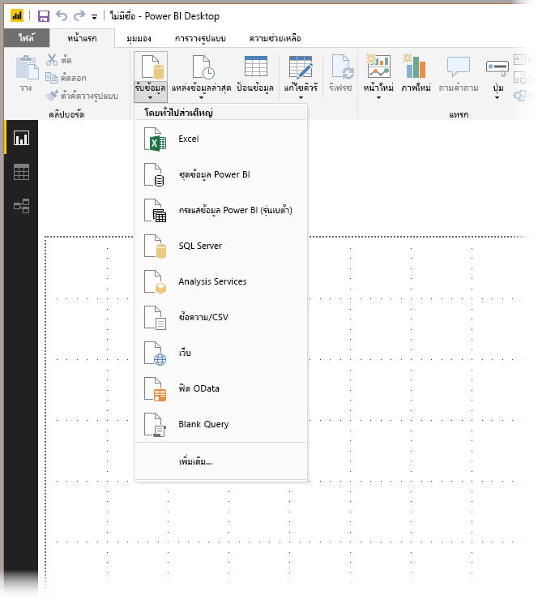
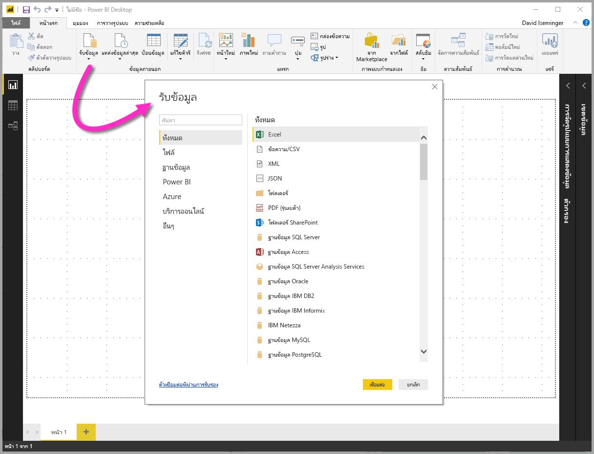
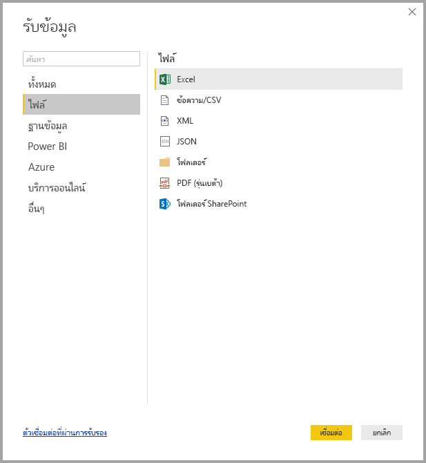
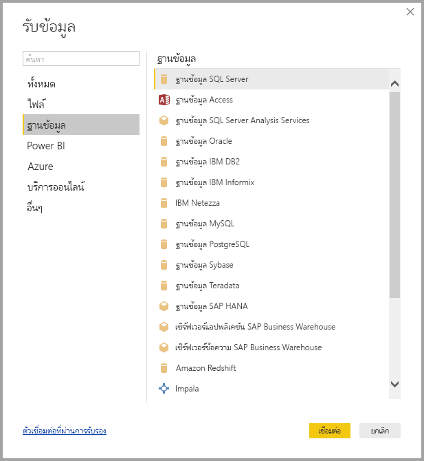
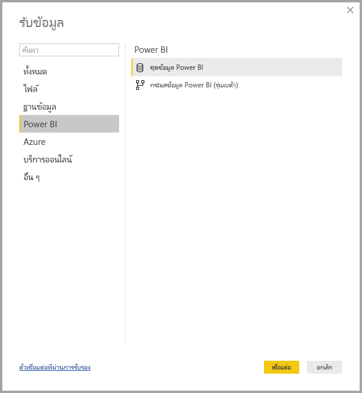
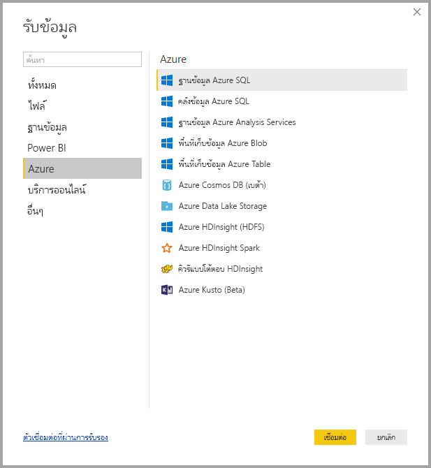
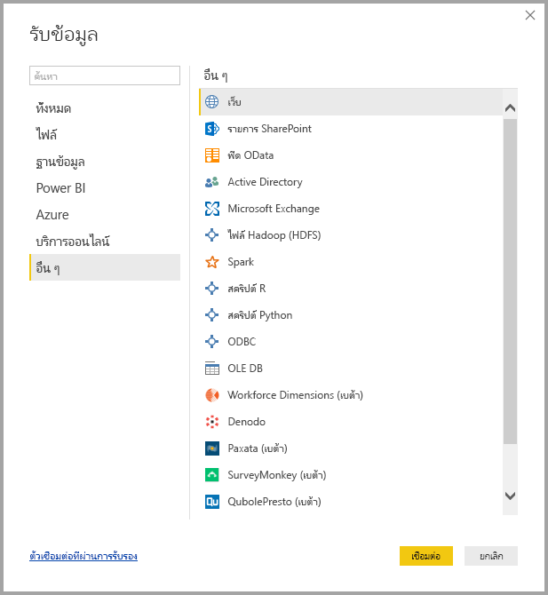
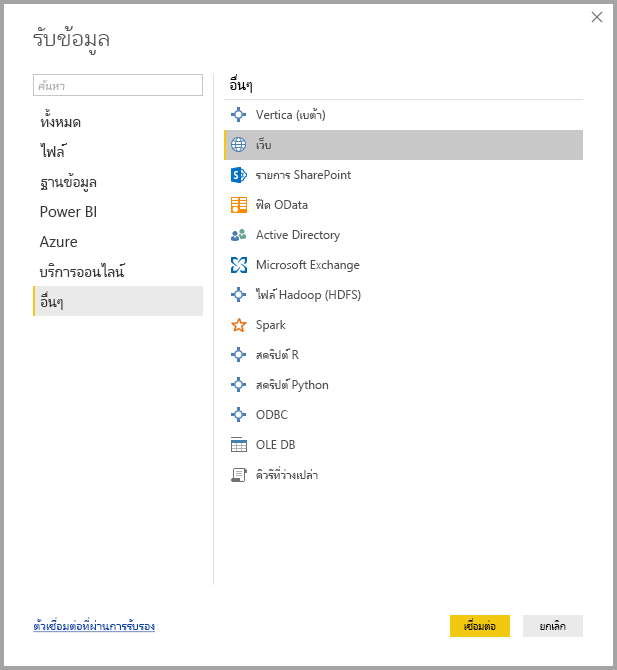

# แหล่งข้อมูลใน Power BI Desktop
คุณสามารถเชื่อมต่อกับข้อมูลจากแหล่งต่าง ๆ มากมายด้วย Power BI Desktop รายการทั้งหมดของแหล่งข้อมูลที่พร้อมใช้งานอยู่ที่ด้านล่างของหน้านี้

เมื่อต้องการเชื่อมต่อกับข้อมูล ให้เลือก**รับข้อมูล**จาก**ribbon** หน้าแรก เลือกลูกศรชี้ลง หรือเลือกข้อความ**รับข้อมูล**บนปุ่ม แสดงเมนูชนิดข้อมูล**ใช้บ่อยที่สุด**ตามที่แสดงในรูปต่อไปนี้:

เลือก**เพิ่มเติม...** จากเมนู**ใช้บ่อยที่สุด**ที่แสดงในหน้าต่าง**รับข้อมูล** คุณสามารถทำให้หน้าต่าง**รับข้อมูล** แสดงขึ้นได้ (และข้ามเมนู**ใช้บ่อยที่สุด**) โดยการเลือกปุ่มไอคอน**รับข้อมูล** **โดยตรง**

> [!NOTE]
> ทีม Power BI จะขยายแหล่งข้อมูลที่พร้อมใช้งานอย่างต่อเนื่องไปยัง**Power BI Desktop**และ**บริการ Power BI** ดังนั้นคุณมักจะเห็นงานระหว่างแหล่งข้อมูลที่กำลังดำเนินการอยู่ในช่วงเริ่มต้นได้รับการทำเครื่องหมายเป็น*เบต้า*หรือ*แสดงตัวอย่าง* แหล่งข้อมูลใด ๆ ที่ได้รับการทำเครื่องหมายเป็น*เบต้า*หรือ*แสดงตัวอย่าง*มีการจำกัดการสนับสนุนและฟังก์ชันการทำงาน และไม่ควรใช้ในสภาพแวดล้อมการผลิต
> 
> 

## แหล่งข้อมูล
ชนิดข้อมูลจะได้รับการจัดระเบียบในประเภทต่อไปนี้:

* ทั้งหมด
* ไฟล์
* ฐานข้อมูล
* Power BI
* Azure
* บริการออนไลน์
* อื่นๆ

ประเภท**ทั้งหมด**รวมถึงชนิดการเชื่อมต่อข้อมูลทั้งหมดจากประเภททั้งหมด

ประเภท**ไฟล์**มีการเชื่อมต่อข้อมูลต่อไปนี้:

* Excel
* ข้อความ/CSV
* XML
* JSON
* โฟลเดอร์
* PDF (รุ่นเบต้า)
* โฟลเดอร์ SharePoint

รูปภาพต่อไปนี้แสดงหน้าต่าง**รับข้อมูล**สำหรับ**ไฟล์**

ประเภท**ฐานข้อมูล**มีการเชื่อมต่อข้อมูลต่อไปนี้:

* ฐานข้อมูล SQL Server
* ฐานข้อมูล Access
* ฐานข้อมูล SQL Server Analysis Services
* ฐานข้อมูล Oracle
* ฐานข้อมูล IBM DB2
* ฐานข้อมูล IBM Informix
* IBM Netezza
* ฐานข้อมูล MySQL
* ฐานข้อมูล PostgreSQL
* ฐานข้อมูล Sybase
* ฐานข้อมูล Teradata
* ฐานข้อมูล SAP HANA
* เซิร์ฟเวอร์แอปพลิเคชัน SAP Business Warehouse
* เซิร์ฟเวอร์ข้อความ SAP Business Warehouse (เบต้า)
* Amazon Redshift
* Impala
* Google BigQuery
* Snowflake
* Exasol (รุ่นเบต้า)
* Jethro (รุ่นเบต้า)

> [!NOTE]
> ตัวเชื่อมต่อฐานข้อมูลบางอย่างจำเป็นต้องให้คุณเปิดใช้งานโดยการเลือก**ไฟล์ > ตัวเลือกและการตั้งค่า > ตัวเลือก**จากนั้นเลือก**คุณลักษณะการแสดงตัวอย่าง**และเปิดใช้งานตัวเชื่อมต่อ ถ้าคุณไม่เห็นตัวเชื่อมต่อที่กล่าวถึงด้านบน และต้องการใช้งานตัวเชื่อมต่อเหล่านั้น โปรดตรวจสอบการตั้งค่าของ**คุณลักษณะการแสดงตัวอย่าง** และโปรดทราบว่าแหล่งข้อมูลใด ๆ ที่ได้รับการทำเครื่องหมายเป็น*เบต้า*หรือ*แสดงตัวอย่าง*มีการจำกัดการสนับสนุนและฟังก์ชันการทำงาน และไม่ควรใช้ในสภาพแวดล้อมการผลิต
> 
> 

รูปภาพต่อไปนี้แสดงหน้าต่าง**รับข้อมูล**สำหรับ**ไฟล์**

ประเภท **Power BI** มีการเชื่อมต่อข้อมูลดังต่อไปนี้

* ชุดข้อมูล Power BI
* กระแสข้อมูล Power BI (รุ่นเบต้า)

รูปภาพต่อไปนี้แสดงหน้าต่าง**รับข้อมูล**สำหรับ **Power BI**

ประเภท **Azure** มีการเชื่อมต่อข้อมูลดังต่อไปนี้

* ฐานข้อมูล Azure SQL
* คลังข้อมูล Azure SQL
* ฐานข้อมูล Azure Analysis Services
* พื้นที่เก็บข้อมูล Azure Blob
* พื้นที่เก็บข้อมูล Azure Table
* Azure Cosmos DB (เบต้า)
* Azure Data Lake Store
* Azure HDInsight (HDFS)
* Azure HDInsight Spark
* คิวรีแบบโต้ตอบ HDInsight (เบต้า)
* Azure KustoDB (เบต้า)

แสดงรูปภาพต่อไปนี้**รับข้อมูล**สำหรับ**Azure**

ประเภท**บริการออนไลน์**มีการเชื่อมต่อข้อมูลต่อไปนี้:

* รายการ SharePoint Online
* Microsoft Exchange Online
* Dynamics 365 (ออนไลน์)
* Dynamics NAV (เบต้า)
* Dynamics 365 Business Central
* Common Data Service สำหรับแอป (เบต้า)
* Common Data Service (เบต้า)
* Microsoft Azure Consumption Insights (เบต้า)
* Visual Studio Team Services (เบต้า)
* ออบเจ็กต์ Salesforce
* รายงาน Salesforce
* Google Analytics
* Adobe Analytics
* appFigures (เบต้า)
* comScore Digital Analytix (เบต้า)
* Dynamics 365 for Customer Insights
* Data.World - รับชุดข้อมูล (เบต้า)
* Facebook
* GitHub (เบต้า)
* MailChimp (เบต้า)
* Marketo (เบต้า)
* Mixpanel (เบต้า)
* Planview Enterprise One - PRM (เบต้า)
* Planview Projectplace (เบต้า)
* QuickBooks Online (เบต้า)
* Smartsheet
* SparkPost (เบต้า)
* Stripe (เบต้า)
* SweetIQ (เบต้า)
* Planview Enterprise One - CMT (เบต้า)
* Twilio (เบต้า)
* tyGraph (เบต้า)
* Webtrends (เบต้า)
* Zendesk (เบต้า)
* TeamDesk (เบต้า)

รูปภาพต่อไปนี้แสดงหน้าต่าง**รับข้อมูล**สำหรับ**บริการออนไลน์**

ประเภท**อื่น ๆ**มีการเชื่อมต่อข้อมูลต่อไปนี้:

* Vertica (เบต้า)
* เว็บ
* รายการ SharePoint
* ฟีด OData
* Active Directory
* Microsoft Exchange
* ไฟล์ Hadoop (HDFS)
* Spark
* สคริปต์ R
* สคริปต์ Python
* ODBC
* OLE DB
* Blank Query

รูปภาพต่อไปนี้แสดงหน้าต่าง**รับข้อมูล**สำหรับ**อื่น ๆ**

> [!NOTE]
> ในขณะนี้คุณไม่สามารถเชื่อมต่อกับแหล่งข้อมูลแบบกำหนดเองที่รักษาความปลอดภัยโดยใช้ Azure Active Directory
> 
> 

## เชื่อมต่อกับแหล่งข้อมูล
เลือกแหล่งข้อมูลจากหน้าต่าง**รับข้อมูล**และเลือก**เชื่อมต่อ**เพื่อเชื่อมต่อกับแหล่งข้อมูล ในรูปต่อไปนี้**เว็บ**ได้รับการเลือกจากประเภทการเชื่อมต่อข้อมูล**อื่น ๆ**

หน้าต่างการเชื่อมต่อจะแสดงขึ้นตามชนิดของการเชื่อมต่อข้อมูล คุณจะได้รับพร้อมท์เพื่อแจ้งให้ป้อนข้อมูลประจำตัว หากจำเป็นต้องใช้ รูปต่อไปนี้แสดง URL ที่ป้อนเพื่อเชื่อมต่อกับแหล่งข้อมูลเว็บ

เมื่อป้อนข้อมูลการเชื่อมต่อ URL หรือทรัพยากรแล้ว ให้เลือก**ตกลง** Power BI Desktop ทำการเชื่อมต่อกับแหล่งข้อมูล และแสดงแหล่งข้อมูลพร้อมใช้งานใน**ตัวนำทาง**

คุณสามารถโหลดข้อมูลโดยการเลือกปุ่ม**โหลด**ที่ด้านล่างของบานหน้าต่าง**ตัวนำทาง** หรือแก้ไขคิวรีก่อนโหลดข้อมูลโดยการเลือกปุ่ม**แก้ไข**ปุ่ม

นั่นคือทั้งหมดของการเชื่อมต่อกับแหล่งข้อมูลใน Power BI Desktop ลองเชื่อมต่อกับข้อมูลจากรายการของแหล่งข้อมูลที่เรากำลังพัฒนา และกลับมาตรวจสอบบ่อยๆ - เราจะดำเนินการเพื่อเพิ่มลงในรายการนี้อยู่ตลอดเวลา

## ขั้นตอนถัดไป
มีมากมายหลากหลายสิ่งที่คุณสามารถทำได้ด้วย Power BI Desktop สำหรับข้อมูลเพิ่มเติมเกี่ยวกับขีดความสามารถ กรุณาดูแหล่งทรัพยากรต่อไปนี้:

* [Power BI Desktop คืออะไร](desktop-what-is-desktop.md)
* [ภาพรวมคิวรี่กับ Power BI Desktop](desktop-query-overview.md)
* [ชนิดข้อมูลใน Power BI Desktop](desktop-data-types.md)
* [จัดรูปทรง และรวมข้อมูลด้วย Power BI Desktop](desktop-shape-and-combine-data.md)
* [งานคิวรี่ที่ใช้บ่อยใน Power BI Desktop](desktop-common-query-tasks.md)    
