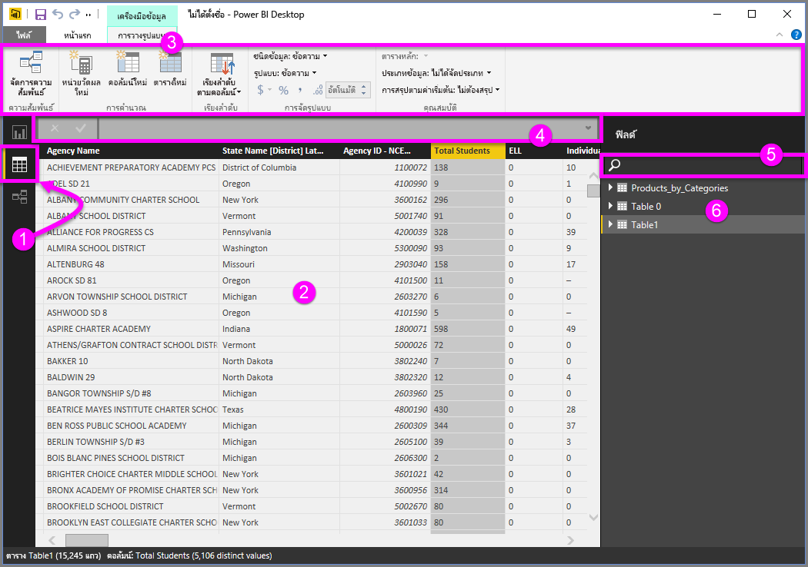
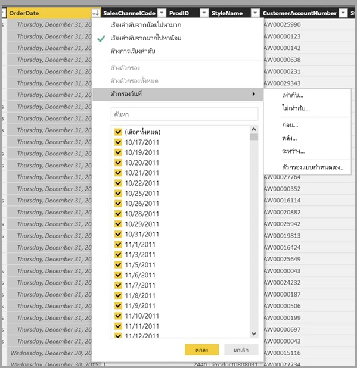

# มุมมองข้อมูลใน Power BI Desktop
**มุมมองข้อมูล** ช่วยให้คุณตรวจสอบ สำรวจ และทำความเข้าใจข้อมูลแบบจำลอง **Power BI Desktop** ซึ่งจะแตกต่างจากวิธีที่คุณดูตาราง คอลัมน์ และข้อมูลใน**ตัวแก้ไขแบบสอบถาม** ด้วยมุมมองข้อมูล คุณกำลังดูข้อมูลของคุณ*หลังจาก*ที่โหลดเข้ามาในรูปแบบเรียบร้อยแล้ว

เมื่อคุณทำแบบจำลองข้อมูลของคุณ บางครั้งคุณอาจต้องการดูว่ามีอะไรอยู่ในตารางหรือคอลัมน์จริง ๆ โดยไม่ต้องสร้างภาพบนพื้นที่รายงาน ซึ่งมักจะลงลึกไปในระดับแถว จะเป็นประโยชน์มาก โดยเฉพาะอย่างยิ่งเมื่อคุณกำลังจะสร้างการวัดและคอลัมน์จากการคำนวณ หรือคุณจำเป็นต้องระบุชนิดข้อมูลหรือประเภทข้อมูล

ลองมาดูรายละเอียดองค์ประกอบที่พบใน**มุมมองข้อมูล**กันบ้าง

1. **ไอคอนมุมมองข้อมูล**– เลือกไอคอนนี้เพื่อเข้าสู่มุมมองข้อมูล

2. **เส้นตารางข้อมูล** – ส่วนนี้แสดงตารางที่เลือกและคอลัมน์รวมถึงแถวทั้งหมดในตารางด้วย คอลัมน์ที่ซ่อนจาก**มุมมองรายงาน**จะเป็นสีเทา คุณสามารถคลิกขวาบนคอลัมน์สำหรับตัวเลือก

3. **สร้างแบบจำลอง Ribbon** – ต่อไปนี้เป็นวิธีที่คุณสามารถจัดการความสัมพันธ์ สร้างการคำนวณ เปลี่ยนชนิดข้อมูล รูปแบบ ประเภทข้อมูลสำหรับคอลัมน์

4. **แถบสูตร** – ใส่สูตร DAX สำหรับการวัดและคอลัมน์จากคำนวณ

5. **ค้นหา** – ค้นหาตารางหรือคอลัมน์ในแบบจำลองของคุณ

6. **รายการช่องข้อมูล** – เลือกตารางหรือคอลัมน์เพื่อดูในตารางข้อมูล

## การกรองในมุมมองข้อมูล

นอกจากนี้ คุณยังสามารถกรองและเรียงลำดับข้อมูลใน**มุมมองข้อมูล**ได้ แต่ละคอลัมน์แสดงไอคอนที่ระบุทิศทางการเรียงลำดับ (ถ้ามีการใช้)

คุณสามารถกรองค่าแต่ละค่าได้ หรือใช้การกรองขั้นสูงตามข้อมูลในคอลัมน์ 

> [!NOTE]
> เมื่อสร้างแบบจำลอง Power BI ในวัฒนธรรมที่แตกต่างจากอินเทอร์เฟซผู้ใช้ปัจจุบันของคุณ (ตัวอย่าง แบบจำลองถูกสร้างขึ้นเป็นภาษาอังกฤษแบบสหรัฐอเมริกาและคุณกำลังดูเป็นภาษาสเปน) กล่องค้นหาจะไม่ปรากฏในอินเทอร์เฟซผู้ใช้ในมุมมองข้อมูลสำหรับฟิลด์อื่นนอกเหนือจากฟิลด์ข้อความ
