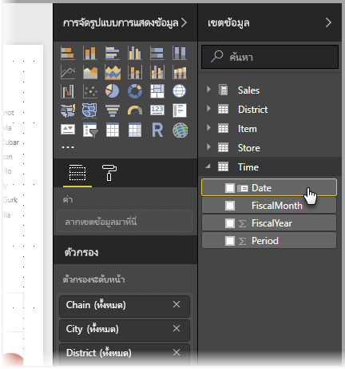
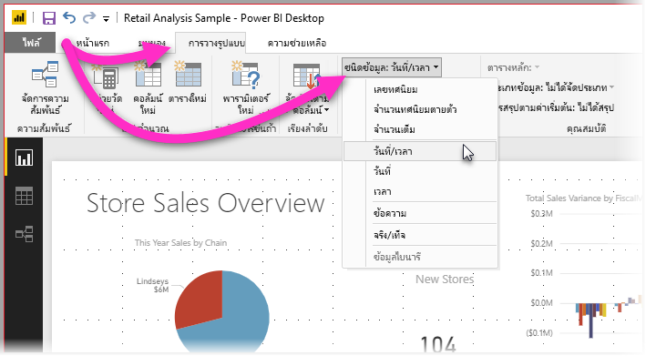

# ตั้งค่า และใช้งานตารางวันที่ใน Power BI Desktop

**Power BI Desktop** กำหนดตารางให้เป็น**ตารางวันที่**อยู่เบื้องหลัง แล้วสร้างลำดับชั้นของวันที่ และเปิดให้ใช้เมตาดาต้าสำหรับรูปแบบข้อมูลของคุณ โดยอัตโนมัติ คุณสามารถใช้ลำดับชั้นที่มีอยู่แล้วเหล่านี้ตอนสร้างรายงาน เช่นวิชวล ตาราง การวัดผลด่วน ตัวแบ่งส่วนข้อมูล และอื่น ๆ Power BI Desktop ทำงานโดยการสร้างตารางที่ซ่อนอยู่ภายในให้กับคุณ ที่คุณสามารถนำไปใช้ต่อในรายงานและนิพจน์ DAX ของคุณ

นักวิเคราะห์ข้อมูลหลายคนต้องการสร้างตารางวันที่ของพวกเขาเองมากกว่า ซึ่งก็สามารถทำได้ ใน **Power BI Desktop** คุณสามารถระบุตารางที่คุณต้องการใช้เป็น**ตารางวันที่** และสร้างวิชวล ตาราง การวัดผลด่วน ฯลฯ ที่เกี่ยวกับวันที่ โดยใช้ข้อมูลของตารางดังกล่าว เมื่อคุณระบุตารางวันที่ของคุณเอง คุณควบคุมลำดับชั้นของวันที่ ที่สร้างขึ้นในรูปแบบของคุณ และใช้งานใน**การวัดผลด่วน**และการดำเนินการอื่น ๆ ที่ใช้ตารางวันที่ของรูปแบบคุณ 

## การตั้งค่าตารางวันของคุณเอง

เมื่อต้องการตั้งค่า**ตารางวันที่** เลือกตารางคุณต้องการใช้เป็นตารางวันที่ในบานหน้าต่าง**เขตข้อมูล** จากนั้นคลิกขวาที่ตารางแล้วเลือก**ทำเครื่องหมายเป็นตารางวันที่ > ทำเครื่องหมายเป็นตารางวันที่** ในเมนูที่ปรากฏขึ้น ดังแสดงในรูปต่อไปนี้

คุณยังสามารถเลือกตาราง แล้วเลือก**ทำเครื่องหมายเป็นตารางวันที่** จาก ribbon **การวางรูปแบบ** ดังแสดงในที่นี้

เมื่อคุณระบุ**ตารางวันที่**ด้วยตนเอง Power BI Desktop จะทำการตรวจสอบคอลัมน์และข้อมูลของมัน เพื่อให้แน่ใจว่าข้อมูลดังกล่าว:

* มีค่าที่ไม่ซ้ำกัน
* ไม่มีค่า null
* มีวันที่ต่อเนื่องกัน (จากเริ่มต้นถึงสิ้นสุด)
* ถ้าเป็นชนิดข้อมูล **วันที่/เวลา** แต่ละค่าจะต้องประทับเวลาเดียวกัน

มีสองสถานการณ์ที่คุณน่าจะได้การสร้างตารางวันที่ของคุณเอง ซึ่งล้วนสมเหตุสมผล:

* สถานการณ์แรกคือ เมื่อคุณใช้ตารางวันที่และลำดับชั้น มาตรฐานหรือพื้นฐาน ซึ่งก็คือตารางในข้อมูลคุณ ที่ผ่านเกณฑ์การตรวจสอบตารางวันที่ ที่ได้อธิบายไว้ก่อนหน้านี้ 

* สถานการณ์ที่สองคือ เมื่อคุณใช้ตารางจาก Analysis Services ที่มีเขตข้อมูล *dim date* ที่คุณต้องการใช้เป็นตารางวันที่ของคุณ เป็นต้น 

หลังจากที่คุณระบุตารางวันที่แล้ว คุณสามารถเลือกคอลัมน์ในตารางที่จะเป็นคอลัมน์วันที่ คุณสามารถระบุคอลัมน์ที่จะใช้ โดยการเลือกตารางในบานหน้าต่าง**เขตข้อมูล** จากนั้นคลิกขวาที่ตาราง แล้วเลือก **ทำเครื่องหมายเป็นตารางวันที่ > การตั้งค่าตารางวันที่** หน้าต่างต่อไปนี้จะปรากฏขึ้นมา ซึ่งคุณสามารถเลือกคอลัมน์ที่จะใช้เป็นตารางวันที่จากกล่องรายการดรอปดาวน์

สิ่งสำคัญที่ต้องทราบคือ เมื่อคุณระบุตารางวันที่ของคุณเอง **Power BI Desktop** จะไม่สร้างลำดับชั้นโดยอัตโนมัติลงในรูปแบบของคุณ ถ้าคุณยกเลิกเลือกตารางวันที่ของคุณในภายหลัง (และไม่มีตารางวันที่ที่กำหนดด้วยตนเองอีก) Power BI Desktop จะสร้างตารางวันที่ใหม่ให้โดยอัตโนัติ สำหรับคอลัมน์วันที่ในตาราง

อีกสิ่งสำคัญที่ต้องทราบคือ เมื่อคุณกำหนดตารางให้เป็นตารางวันที่ ตารางวันที่ภายในที่ Power BI Desktop สร้างขึ้นโดยอัตโนมัติ จะถูกเอาออก และวิชวลหรือนิพจน์ DAX ที่คุณสร้างไว้ก่อนหน้านี้โดยใช้ตารางดังกล่าวจะไม่ทำงานอีกต่อไป 

## การกำหนดชนิดข้อมูลของตารางวันที่ให้เหมาะสม

เมื่อคุณระบุ**ตารางวันที่**ของตัวเอง คุณจะต้องแน่ใจว่า ชนิดข้อมูลถูกตั้งค่าอย่างเหมาะสม คุณจะต้องการตั้งค่า**ชนิดข้อมูล** ไปเป็น **วันที่/เวลา** หรือ **วันที่** ให้ทำตามขั้นตอนต่อไปนี้:

1. เลือก**ตารางวันที่**ของคุณจากบานหน้าต่าง**เขตข้อมูล** ขยายมันถ้าจำเป็น จากนั้นเลือกคอลัมน์ที่จะใช้เป็นวันที่
   
     

2. บนแท็บ**การวางรูปแบบ** เลือก**ชนิดข้อมูล:** แล้วคลิกลูกศรดรอปดาวน์เพื่อแสดงชนิดข้อมูลที่มีให้

    

3. ระบุชนิดข้อมูลสำหรับคอลัมน์ของคุณ 

## ขั้นตอนถัดไป

คุณอาจสนใจบทความต่อไปนี้

* [ชนิดข้อมูลใน Power BI Desktop](desktop-data-types.md)

 