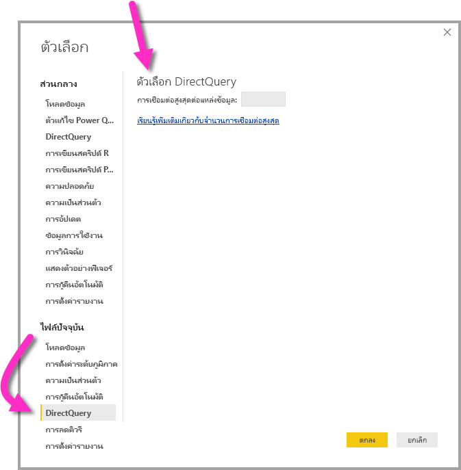

# การใช้ DirectQuery ใน Power BI
คุณสามารถเชื่อมต่อกับแหล่งข้อมูลต่าง ๆ ได้ทุกประเภท เมื่อใช้**Power BI Desktop**หรือ**บริการ Power BI**และคุณสามารถทำการเชื่อมต่อข้อมูลเหล่านั้นด้วยวิธีต่าง ๆ ได้ คุณสามารถ*นำเข้า*ข้อมูลไปยัง Power BI ซึ่งเป็นวิธีทั่วไปในการรับข้อมูล หรือคุณสามารถเชื่อมต่อโดยตรงไปยังข้อมูลในที่เก็บแหล่งข้อมูลดั้งเดิม หรือที่เรียกว่า**DirectQuery** บทความนี้อธิบาย**DirectQuery**และความสามารถของDirectQuery:

* ตัวเลือกการเชื่อมต่อที่แตกต่างกันสำหรับ DirectQuery
* คำแนะนำว่าเมื่อใดที่คุณควรใช้ DirectQuery แทนการนำเข้า
* ข้อเสียของการใช้ DirectQuery
* แนวทางปฏิบัติที่ดีที่สุดสำหรับการใช้ DirectQuery

โดยสรุป แนวทางปฏิบัติที่ดีที่สุดสำหรับการใช้การนำเข้าและ DirectQuery มีดังนี้:

* คุณควร**นำเข้า**ข้อมูลไปยัง Power BI ทุกที่ที่เป็นไปด้ การนำเข้าใช้ประโยชน์จากกลไกการค้นหาที่มีประสิทธิภาพสูงของ Power BIและมอบประสบการณ์ที่มีการโต้ตอบสูงและโดดเด่นให้กับข้อมูลของคุณ
* ถ้าเป้าหมายของคุณไม่สามารถดำเนินการนำเข้าข้อมูล โปรดพิจารณาการใช้**DirectQuery** ตัวอย่างเช่น ถ้าข้อมูลมีการเปลี่ยนแปลงบ่อย และรายงานต้องแสดงข้อมูลล่าสุด การใช้ DirectQuery อาจที่ดีที่สุด อย่างไรก็ตาม จะสามารถใช้ DirectQuery ได้เมื่อแหล่งข้อมูลต้นแบบมีคิวรีแบบโต้ตอบ (น้อยกว่า 5 วินาที) สำหรับคิวรีรวมทั่วไป และสามารถจัดการกับการโหลดคิวรีที่จะสร้างขึ้น นอกจากนี้ ควรพิจารณารายการของข้อจำกัดที่มาพร้อมกับการใช้งาน DirectQuery อย่างรอบคอบ เพื่อให้แน่ใจว่ายังคงสามารถดำเนินการตามเป้าหมายของคุณ

ชุดของความสามารถที่เสนอ โดย Power BI สำหรับทั้งสองวิธีการเชื่อมต่อ ได้แก่ การนำเข้าและ DirectQuery จะมีการพัฒนาตลอดเวลา ซึ่งจะรวมถึงการให้ความยืดหยุ่นมากขึ้นเมื่อมีการใช้ข้อมูลที่นำเข้า และการนำเข้านั้นสามารถใช้ได้ในหลายกรณี ตลอดจนสามารถกำจัดข้อเสียบางส่วนของการใช้ DirectQuery เมื่อใช้ DirectQuery ประสิทธิภาพของแหล่งข้อมูลต้นแบบจะยังคงเป็นการพิจารณาหลักอยู่เสมอ โดยไม่คำนึงถึงการปรับปรุง ถ้าแหล่งข้อมูลต้นแบบนั้นช้า ให้ใช้ DirectQuery และแหล่งข้อมูลนั้นจะยังไม่สามารถดำเนินการได้

บทความนี้ครอบคลุม DirectQuery กับ Power BI แต่ไม่รวมถึง SQL Server Analysis Services และ DirectQuery ยังเป็นคุณลักษณะของ**SQL Server Analysis Services**และรายละเอียดจำนวนมากที่อธิบายไว้ด้านล่างจะนำไปใช้กับการใช้งาน แม้ว่าจะมีความแตกต่างที่สำคัญ สำหรับข้อมูลเกี่ยวกับการใช้ DirectQuery กับ SQL Server Analysis Services ดูที่[เอกสารทางเทคนิคที่อธิบายรายละเอียดของ DirectQuery ใน SQL Server Analysis Services 2016](http://download.microsoft.com/download/F/6/F/F6FBC1FC-F956-49A1-80CD-2941C3B6E417/DirectQuery%20in%20Analysis%20Services%20-%20Whitepaper.pdf)  

บทความนี้มุ่งเน้นไปที่สมุดงานที่แนะนำสำหรับ DirectQuery ซึ่งรายงานจะถูกสร้างใน**Power BI Desktop**แต่ยังคง ครอบคลุมถึงการเชื่อมต่อโดยตรงใน**บริการ Power BI**

## โหมดการเชื่อมต่อ Power BI
Power BI เชื่อมต่อกับแหล่งข้อมูลที่แตกต่างกันจำนวนมาก ครอบคลุมไปถึง:

* บริการออนไลน์ (Salesforce, Dynamics 365 และอื่น ๆ)
* ฐานข้อมูล (SQL Server, Access, Amazon Redshift และอื่น ๆ)
* ไฟล์แบบง่าย (Excel, JSON และอื่น ๆ)
* แหล่งข้อมูลอื่น ๆ (Spark, เว็บไซต์, Microsoft Exchange และอื่น ๆ)

สำหรับแหล่งข้อมูลเหล่านี้ จะสามารถนำเข้าข้อมูลไปยัง Power BI ได้ บางแหล่งข้อมูลยังสามารถเชื่อมต่อโดยใช้ DirectQuery ชุดแหล่งข้อมูลที่สนับสนุน DirectQuery จะอธิบายไว้ในบทความ[แหล่งข้อมูลที่ได้รับการสนับสนุนโดย DirectQuery](desktop-directquery-data-sources.md) แหล่งข้อมูลเพิ่มเติมที่จะเปิดใช้งาน DirectQuery ในอนาคต จะมุ่งเน้นที่แหล่งข้อมูลที่คาดว่าจะสามารถแสดงประสิทธิภาพการทำงานคิวรีแบบโต้ตอบได้ดี

**SQL Server Analysis Services**เป็นกรณีพิเศษ เมื่อเชื่อมต่อกับ SQL Server Analysis Services คุณสามารถเลือกที่จะนำเข้าข้อมูล หรือใช้*การเชื่อมต่อโดยตรง*ได้  การใช้การเชื่อมต่อโดยตรง จะคล้ายกับการใช้ DirectQuery เนื่องจากไม่มีการนำเข้าข้อมูล และแหล่งข้อมูลต้นแบบจะได้รับการคิวรีเพื่อรีเฟรชวิชวลอยู่เสมอ แต่*การเชื่อมต่อโดยตรง*จะแตกต่างกันไปในหลาย ๆ เรื่อง ดังนั้นจะมีการใช้คำที่แตกต่าง (*live*versus*DirectQuery*)

ตัวเลือกสำหรับการเชื่อมต่อกับข้อมูลทั้งสามตัวเลือกนี้ **นำเข้า**, **DirectQuery**และ**การเชื่อมต่อโดยตรง** จะอธิบายโดยละเอียดในส่วนต่อไปนี้

### นำเข้าการเชื่อมต่อ
เมื่อใช้**รับข้อมูล**ใน**Power BI Desktop**เพื่อเชื่อมต่อกับแหล่งข้อมูลเช่น SQL Server และคุณเลือก**นำเข้า**ลักษณะการทำงานของการเชื่อมต่อจะเป็นดังนี้:

* ในระหว่างประสบการณ์การใช้งาน**รับข้อมูล**เริ่มต้น ชุดของตารางที่เลือกแต่ละชุดจะกำหนดคิวรีที่จะส่งชุดของข้อมูลกลับ (คิวรีเหล่านั้นสามารถแก้ไขก่อนที่จะโหลดข้อมูล ตัวอย่างเช่น เมื่อมีการใช้ตัวกรอง หรือรวบรวมข้อมูล หรือเชื่อมตารางที่แตกต่างกัน)
* เมื่อมีการโหลด ข้อมูลทั้งหมดที่กำหนดโดยคิวรีเหล่านั้นจะได้รับการนำเข้าลงในแคช Power BI
* เมื่อสร้างวิชวลภายใน**Power BI Desktop**ข้อมูลที่นำเข้าจะได้รับการคิวรี Power BI store ช่วยให้มั่นใจได้ว่าจะมีการคิวรีอย่างรวดเร็ว ดังนั้นการเปลี่ยนแปลงการแสดงผลด้วยภาพทั้งหมดจะมีผลทันที
* การเปลี่ยนแปลงใด ๆ ที่ทำกับข้อมูลต้นแบบจะไม่มีผลกับวิชวล จำเป็นต้อง*รีเฟรช* เพื่อให้มีการนำเข้าข้อมูลอีกครั้ง
* เมื่อมีการเผยแพร่รายงาน (ไฟล์.pbix) ไปยัง**บริการ Power BI**ชุดข้อมูลจะได้รับการสร้าง และอัปโหลดไปยังบริการ Power BI  ข้อมูลนำเข้าจะรวมอยู่ในชุดข้อมูลนั้น จากนั้นจะสามารถตั้งค่าการรีเฟรชตามกำหนดการของข้อมูล ตัวอย่างเช่น นำเข้าข้อมูลอีกครั้งทุกวัน อาจจำเป็นต้องกำหนดค่าเกตเวย์ข้อมูลภายในองค์กรโดยขึ้นอยู่กับตำแหน่งที่ตั้งของแหล่งข้อมูลต้นฉบับ
* เมื่อเปิดรายงานที่มีอยู่แล้วใน**บริการ Power BI**หรือเขียนรายงานใหม่ ข้อมูลนำเข้าจะได้รับการคิวรีอีกครั้ง เพื่อยืนยันการโต้ตอบ
* วิชวลหรือหน้ารายงานทั้งหมดสามารถปักหมุดเป็นไทล์แดชบอร์ด ไทล์จะถูกรีเฟรชโดยอัตโนมัติเมื่อมีการรีเฟรชชุดข้อมูลต้นแบบ  

### การเชื่อมต่อ DirectQuery
เมื่อใช้**รับข้อมูล**ใน**Power BI Desktop**เพื่อเชื่อมต่อกับแหล่งข้อมูล เช่น และคุณเลือก**DirectQuery**ลักษณะการทำงานของการเชื่อมต่อจะเป็นดังนี้:

* ในระหว่างประสบการณ์การใช้งาน**รับข้อมูล** เริ่มต้น แหล่งข้อมูลจะถูกเลือก สำหรับแหล่งข้อมูลเชิงสัมพันธ์ ชุดตารางจะถูกเลือก และแต่ละชุดยังคงกำหนดคิวรีที่จะส่งกลับชุดข้อมูลอย่างมีเหตุผล สำหรับแหล่งข้อมูลหลายมิติ เช่น SAP BW จะเลือกเฉพาะแหล่งข้อมูลเท่านั้น
* อย่างไรก็ตาม เมื่อมีการโหลด จะไม่มีการนำเข้าข้อมูลใด ๆ ไปยัง Power BI store แทนที่จะสร้างวิชวลภายใน**Power BI Desktop**คิวรี่จะถูกส่งไปยังแหล่งข้อมูลต้นแบบเพื่อดึงข้อมูลจำเป็น เวลาที่ใช้ในการรีเฟรชวิชวลจะขึ้นอยู่กับประสิทธิภาพของแหล่งข้อมูลต้นแบบ
* การเปลี่ยนแปลงใด ๆ ที่ทำกับข้อมูลต้นแบบจะไม่มีผลกับวิชวลที่มีอยู่ทันที ยังคงจำเป็นต้องรีเฟรช เพื่อให้คิวรีที่จำเป็นถูกส่งอีกครั้งสำหรับแต่ละวิชวล และอัปเดตวิชวลตามความจำเป็น
* เมื่อมีการเผยแพร่รายงานไปยัง**บริการของ Power BI**จะส่งผลกับชุดข้อมูลในบริการของ Power BI เหมือนกับการนำเข้าอีกครั้ง อย่างไรก็ตาม*ไม่มีข้อมูลใด*รวมกับชุดข้อมูลนั้น
* เมื่อเปิดรายงานที่มีอยู่ใน**บริการ Power BI**หรือเขียนรายงานใหม่ แหล่งข้อมูลต้นแบบจะถูกคิวรีอีกครั้งเพื่อดึงข้อมูลจำเป็น อาจจำเป็นต้องกำหนดค่าเกตเวย์ข้อมูลภายในองค์กรโดยขึ้นอยู่กับตำแหน่งที่ตั้งของแหล่งข้อมูลต้นฉบับ ตามที่จำเป็นต้องกำหนดสำหรับโหมดนำเข้าหากข้อมูลถูกรีเฟรช
* วิชวลหรือหน้ารายงานทั้งหมดสามารถปักหมุดเป็นไทล์แดชบอร์ด เพื่อให้แน่ใจว่าการเปิดแดชบอร์ดจะเป็นไปอย่างรวดเร็ว ไทล์จะถูกรีเฟรชโดยอัตโนมัติตามกำหนดการ (ตัวอย่าง เช่น ทุกชั่วโมง) คุณสามารถควบคุมความถี่ของการรีเฟรชนี้ เพื่อแสดงความถี่ที่ข้อมูลมีการเปลี่ยนแปลงและความสำคัญในการดูข้อมูลล่าสุด ดังนั้นเมื่อเปิดแดชบอร์ด ไทล์จะแสดงข้อมูลตามเวลาการรีเฟรชล่าสุด และไม่จำเป็นต้องมีการเปลี่ยนแปลงล่าสุดที่ทำกับแหล่งข้อมูลต้นแบบ สามารถรีเฟรชแดชบอร์ดแบบเปิดได้เสมอเพื่อให้แน่ใจว่าแดชบอร์ดมีการอัปเดตล่าสุด    

### การเชื่อมต่อโดยตรง
เมื่อเชื่อมต่อกับ**SQL Server Analysis Services** (SSAS) จะมีตัวเลือกเพื่อให้นำเข้าข้อมูลจากแบบจำลองข้อมูลที่เลือก หรือเชื่อมต่อโดยตรงไปยังแบบจำลองข้อมูลที่เลือก ถ้าคุณเลือก**นำเข้า**ให้คุณกำหนดคิวรีสำหรับแหล่งข้อมูล SSAS ภายนอกนั้น และข้อมูลจะถูกนำเข้าตามปกติ ถ้าคุณเลือก**เชื่อมต่อแบบสด** จะไม่มีการกำหนดคิวรีใด ๆ และแบบจำลองภายนอกทั้งหมดจะแสดงในรายการเขตข้อมูล ถ้าคุณเลือก**DirectQuery**เป็นวิชวลที่จะสร้าง คิวรีจะถูกส่งไปยังแหล่งข้อมูล SSAS ภายนอก อย่างไรก็ตามจะแตกต่างกับ DirectQuery คือจะไม่มีเหตุผลในการสร้าง*แบบจำลอง*ใหม่ กล่าวคือไม่สามารถกำหนดคอลัมน์คำนวณ ลำดับชั้น ความสัมพันธ์และอื่น ๆ ได้ใหม่ แต่คุณสามารถเชื่อมต่อโดยตรงกับรูปแบบ SSAS ภายนอกได้

สถานการณ์ที่อธิบายไว้ในย่อหน้าก่อนหน้านี้สามารถนำไปใช้กับการเชื่อมต่อกับแหล่งข้อมูลต่อไปนี้เช่นกัน เว้นแต่ว่าไม่มีตัวเลือกการนำเข้าข้อมูล:

* ชุดข้อมูล power BI (ตัวอย่างเช่น เมื่อเชื่อมต่อกับชุดข้อมูล Power BI ที่ได้รับการสร้าง และเผยแพร่ไปยังบริการก่อนหน้านี้เพื่อสร้างรายงานใหม่)
* บริการข้อมูลทั่วไป

ลักษณะการทำงานของรายงานด้วย SSAS เมื่อมีการเผยแพร่ไปยัง**บริการ Power BI**จะมีลักษณะคล้ายกับรายงาน DirectQuery ดังต่อไปนี้:

* เมื่อเปิดรายงานที่มีอยู่ใน**บริการ Power BI**หรือเขียนรายงานใหม่ แหล่งข้อมูล SSAS ต้นแบบจะได้รับการคิวรี (อาจต้องใช้เกตเวย์ข้อมูลภายในองค์กร)
* ไทล์แดชบอร์ดที่จะรีเฟรชโดยอัตโนมัติตามกำหนดการ (เช่น ทุกชั่วโมง หรือตามความถี่ที่กำหนด)

อย่างไรก็ตามยังมีความแตกต่างที่สำคัญอยู่ ซึ่งรวมถึงการเชื่อมต่อโดยตรง ข้อมูลประจำตัวของผู้ใช้ที่เปิดรายงานจะถูกส่งต่อไปยังแหล่งข้อมูล SSAS ต้นแบบเสมอ

จากการเปรียบเทียบเหล่านี้ มาโฟกัสที่**DirectQuery**ในส่วนเหลือของบทความนี้เท่านั้น

## DirectQuery จะมีประโยชน์เมื่อไหร่
ตารางต่อไปนี้อธิบายสถานการณ์ที่การเชื่อมต่อด้วย DirectQuery จะเป็นประโยชน์อย่างมาก รวมถึงกรณีที่การทิ้งข้อมูลในแหล่งข้อมูลต้นฉบับจะเป็นประโยชน์ คำอธิบายรวมถึงการอภิปรายว่าสถานการณ์ที่ระบุมีอยู่ใน Power BI หรือไม่

| ข้อจำกัด | คำอธิบาย |
| --- | --- |
| ข้อมูลมีการเปลี่ยนแปลงอยู่บ่อยครั้ง และจำเป็นต้องมีการรายงานแบบ "เรียลไทม์" |สามารถรีเฟรชแบบจำลองที่มีข้อมูลนำเข้าได้มากที่สุดหนึ่งครั้งต่อชั่วโมง ดังนั้น ถ้าข้อมูลมีการเปลี่ยนแปลงอย่างต่อเนื่อง และจำเป็นสำหรับรายงานเพื่อที่จะต้องแสดงข้อมูลล่าสุด ดังนั้นการใช้การนำเข้าที่มีการรีเฟรชตามกำหนดการอาจไม่ตรงกับความต้องการเหล่านั้น โปรดทราบว่ายังสามารถสตรีมข้อมูลไปยัง Power BI โดยตรง แม้ว่าจะมีข้อจำกัดปริมาณข้อมูลที่สนับสนุนสำหรับกรณีนี้     ในทางตรงกันข้าม การใช้ DirectQuery หมายความว่าการเปิด หรือการรีเฟรชรายงานหรือแดชบอร์ดจะแสดงข้อมูลล่าสุดในแหล่งข้อมูลเสมอ นอกจากนี้ยังสามารถอัปเดตไทล์แดชบอร์ดได้บ่อยมากขึ้น (อัปเดตได้ทุก 15 นาที) |
| ข้อมูลมีขนาดใหญ่มาก |ถ้าข้อมูลมีขนาดใหญ่มาก และไม่สามารถนำเข้าข้อมูลทั้งหมดได้แน่นอน ในทางตรงกันข้าม DirectQuery ต้องไม่มีการถ่ายโอนข้อมูลขนาดใหญ่เนื่องจากมีการคิวรรีข้อมูลในสถานที่     อย่างไรก็ตาม ข้อมูลขนาดใหญ่อาจหมายความว่า ประสิทธิภาพการทำงานของคิวรีกับแหล่งข้อมูลต้นแบบนั้นช้าเกินไป (ตามที่อธิบายไว้ในบทความนี้ภายหลังในส่วนของ*ผลกระทบจากการใช้ DirectQuery*) และไม่จำเป็นต้องนำเข้าข้อมูลรายละเอียดเต็มรูปแบบเสมอไป แต่สามารถรวมข้อมูลล่วงหน้าได้ในระหว่างการนำเข้า (และ**ตัวแก้ไขคิวรี**ทำให้ดำเนินการนี้ได้โดยง่าย) และในที่สุดก็จะสามารถนำเข้าข้อมูลรวมที่จำเป็นสำหรับแต่ละการแสดงผลด้วยภาพ DirectQuery จึงเป็นวิธีง่ายที่สุดในการเข้าถึงข้อมูลขนาดใหญ่ คุณควรจำไว้เสมอว่าการนำเข้าข้อมูลรวมอาจเสนอวิธีแก้ปัญหาหากแหล่งข้อมูลต้นแบบช้าเกินไป |
| กฎการรักษาความปลอดภัยจะได้รับการกำหนดในแหล่งข้อมูลต้นแบบ |เมื่อนำเข้าข้อมูลแล้ว Power BI จะเชื่อมต่อกับแหล่งข้อมูลโดยใช้ข้อมูลประจำตัวของผู้ใช้ปัจจุบัน (จาก Power BI Desktop) หรือข้อมูลประจำตัวที่กำหนดไว้เป็นส่วนหนึ่งของการกำหนดค่าการรีเฟรชตามกำหนดการ (จากบริการ Power BI) ดังนั้นในการเผยแพร่และแบ่งปันรายงานดังกล่าวต้องมีการดูแลเฉพาะเมื่อแบ่งปันกับผู้ใช้ที่ได้รับอนุญาตให้ดูข้อมูลเดียวกัน หรือกำหนดให้ Row Level Security เป็นส่วนหนึ่งของชุดข้อมูล     และจะเป็นการดีเนื่องจาก DirectQuery จะทำการคิวรีแหล่งข้อมูลต้นแบบเสมอ ซึ่งจะช่วยให้มีการรักษาความปลอดภัยในแหล่งข้อมูลต้นแบบที่นำมาใช้ อย่างไรก็ตามทุกวันนี้ Power BI จะเชื่อมต่อกับแหล่งข้อมูลต้นแบบโดยใช้ข้อมูลปรจะตัวเดียวกับที่จะใช้สำหรับการนำเข้าเสมอ     ดังนั้น จนกว่า Power BI ช่วยให้สำหรับข้อมูลเฉพาะตัวของผู้ใช้รายงานจะส่งผ่านไปยังแหล่งข้อมูลต้นแบบ DirectQuery จะไม่ก่อให้เกิดผลดีสำหรับการรักษาความปลอดภัยของแหล่งข้อมูล |
| ใช้ข้อจำกัดด้านอำนาจข้อมูล |องค์กรบางแห่งมีนโยบายรอบด้านเกี่ยวกับอำนาจข้อมูล ซึ่งหมายความว่า ข้อมูลดังกล่าวไม่สามารถออกจากสถานที่ขององค์กรได้ การแก้ปัญหาที่ยึดตามการนำเข้าจะแสดงปัญหาอย่างชัดเจน ในทางกลับกัน ด้วย DirectQuery ที่ยังคงมีข้อมูลอยู่ในแหล่งข้อมูลต้นแบบ     อย่างไรก็ตาม ถึงแม้จะใช้ DirectQuery แคชบางแคชของข้อมูลในระดับวิชวลจะยังคงอยู่ในบริการ Power BI (เนื่องจากการรีเฟรชตามกำหนดการของไทล์) |
| แหล่งข้อมูลต้นแบบคือ แหล่งข้อมูล OLAP ที่ประกอบด้วยหน่วยวัด |ถ้าแหล่งข้อมูลต้นแบบประกอบด้วย*หน่วยวัด*(เช่น SAP HANA หรือ SAP Business Warehouse), การนำเข้าข้อมูลจะทไให้เกิดปัญหาอื่น ๆ นั่นหมายความว่า ข้อมูลนำเข้าดังกล่าวอยู่ในระดับเฉพาะของการรวม ตามที่กำหนดไว้โดยคิวรี ตัวอย่างเช่น วัด “ยอดขาย” โดยชั้น ปี และเมือง จากนั้นถ้าวิชวลถูกสร้างขึ้นเพื่อขอข้อมูลในการรวมระดับสูงกว่า (เช่น TotalSales ตามปี) จะเป็นการรวมมูลค่ารวมเพิ่มเติม นี่เป็นวิธีที่ดีสำหรับหน่วยวัดเสริม (เช่น รวม ขั้นต่ำ) แต่เป็นปัญหาสำหรับหน่วยวัดที่ไม่ใช่หน่วยวัดเสริม (เช่น ค่าเฉลี่ย นับที่แตกต่างกัน)     จำเป็นจะต้องส่งคิวรีต่อวิชวลแต่ละอัน เช่นเดียวกับใน DirectQuery เพื่อทำให้การรับข้อมูลรวมที่ถูกต้อง (ตามที่จำเป็นสำหรับวิชวลเฉพาะ) โดยตรงจากแหล่งมาง่ายขึ้น     เมื่อเชื่อมต่อกับ SAP Business Warehouse (BW) การเลือก DirectQuery จะช่วยให้สามารถจัดการหน่วยวัดได้ การสนับสนุนสำหรับ SAP BW จะครอบคลุมเพิ่มเติมใน[DirectQuery และ SAP BW](desktop-directquery-sap-bw.md)     อย่างไรก็ตาม ขณะนี้ DirectQuery บน SAP HANA ถือว่าเหมือนกันกับแหล่งข้อมูลเชิงสัมพันธ์ และด้วยเหตุนี้จึงมีลักษณะการทำงานคล้ายคลึงกับการนำเข้า ซึ่งจะครอบคลุมเพิ่มเติมใน[DirectQuery และ SAP HANA](desktop-directquery-sap-hana.md) |

โดยสรุป เมื่อพิจารณาจากความสามารถในปัจจุบันของ DirectQuery ใน Power BI สถานการณ์ที่ให้ประโยชน์มีดังนี้

* ข้อมูลมีการเปลี่ยนแปลงอยู่บ่อยครั้ง และจำเป็นต้องมีการรายงานแบบ "เรียลไทม์"
* จัดการข้อมูลขนาดใหญ่มาก โดยไม่จำเป็นต้องรวบรวมไว้ล่วงหน้า
* ใช้ข้อจำกัดด้านอำนาจข้อมูล
* แหล่งข้อมูลเป็นแหล่งข้อมูลแบบหลายมิติที่ประกอบด้วยหน่วยวัด (เช่น SAP BW)

โปรดทราบว่ารายละเอียดในรายการก่อนหน้านี้เกี่ยวข้องกับการใช้ Power BI เท่านั้น มีตัวเลือกแทนการใช้แบบจำลอง SQL Server Analysis Services แบบภายนอก (หรือ Azure Analysis Services) เพื่อนำเข้าข้อมูล จากนั้นใช้ Power BI เพื่อเชื่อมต่อกับแบบจำลอง แม้ว่าวิธีการดังกล่าวจะต้องใช้ทักษะเพิ่มเติม แต่ก็ช่วยให้มีความยืดหยุ่นมากขึ้น ตัวอย่างเช่น สามารถนำเข้าข้อมูลปริมาณที่มากขึ้น และไม่มีข้อจำกัดเรื่องความถี่ในการรีเฟรชข้อมูล

## ข้อเสียของการใช้ DirectQuery
การใช้**DirectQuery**มีผลกระทบเชิงลบ ซึ่งจะอธิบายตามรายละเอียดในส่วนนี้ ข้อจำกัดบางข้อจะแตกต่างกันเล็กน้อยโดยขึ้นอยู่กับแหล่งข้อมูลที่ใช้งาน ซึ่งจะถูกเรียกใช้ตามความเหมาะสม และแยกบทความให้ครอบคลุมแหล่งข้อมูลที่แตกต่างกันอย่างมาก  

### ประสิทธิภาพการทำงานและการโหลดบนแหล่งข้อมูลต้นแบบ
เมื่อใช้**DirectQuery**ประสบการณ์การใช้งานโดยรวมจะขึ้นอยู่กับประสิทธิภาพของแหล่งข้อมูลต้นแบบ ถ้าการรีเฟรชแต่ละการแสดงผลด้วยภาพ (ตัวอย่างเช่น หลังการเปลี่ยนแปลงค่าตัวแบ่งส่วน) ใช้เวลาไม่กี่วินาที (< 5 วิ) จะถือว่าประสบการณ์การใช้งานเหมาะสม แต่อาจจะรู้สึกว้ายังช้าเมื่อเทียบกับการตอบสนองแบบทันทีที่เราเคยใช้เมื่อนำเข้าข้อมูลไปยัง Power BI แต่ถ้าความล่าช้าของแหล่งข้อมูลคือ แต่ละวิชวลใช้เวลารีเฟรชนานกว่านั้น (หลายสิบวินาที) จะถือว่าประสบการณ์การใช้งานแย่มาก อาจถึงจุดที่การคิวรีหมดเวลา

ด้วยประสิทธิภาพของแหล่งต้นแบบ ควรพิจารณาภาระที่จะถูกวางไว้อย่างรอบคอบ (มักจะส่งผลกระทบต่อประสิทธิภาพการทำงาน) ตามที่อภิปรายเพิ่มเติมด้านล่าง ผู้ใช้แต่ละรายที่เปิดรายงานที่ใช้ร่วมกัน และแต่ละไทล์แดชบอร์ดที่มีการรีเฟรชตามระยะ จะส่งคิวรีอย่างน้อยหนึ่งคิวรีสำหรับแต่ละวิชวลไปยังแหล่งข้อมูลต้นแบบ ข้อเท็จจริงนี้จำเป็นต้องมีแหล่งข้อมูลที่สามารถจัดการภาระคิวรีดังกล่าว โดยยังคงรักษาประสิทธิภาพการทำงานอย่างเหมาะสม

### จำกัดให้กับแหล่งข้อมูลเดียว
เมื่อมีการนำเข้าข้อมูล อาจเป็นไปได้ที่จะรวมข้อมูลจากหลายแหล่งให้อยู่ในแบบจำลองเดี่ยว ตัวอย่างเช่น สามารถเชื่อมโยงข้อมูลบางส่วนจากฐานข้อมูล SQL Server ขององค์กรกับข้อมูลในเครื่องบางส่วนที่เก็บไว้เป็นไฟล์ Excel ได้อย่างง่ายดาย ซึ่งจะไม่สามารถดำเนินการได้เมื่อมีการใช้ DirectQuery เมื่อเลือก DirectQuery สำหรับแหล่งข้อมูล จะสามารถใช้ข้อมูลจากแหล่งข้อมูลเดี่ยวดังกล่าว (เช่นฐานข้อมูล SQL Server เดี่ยว)

### การแปลงข้อมูลที่จำกัด
ในทำนองเดียวกัน มีข้อจำกัดในการเปลี่ยนแปลงข้อมูลที่สามารถนำไปใช้ภายใน**ตัวแก้ไขคิวรี** ด้วยข้อมูลนำเข้า ชุดการแปลงที่มีความซับซ้อนสามารถนำมาใช้เพื่อทำความสะอาดและปรับแต่งข้อมูลก่อนที่จะใช้เพื่อสร้างวิชวลได้อย่างง่ายดาย (เช่น การแยกวิเคราะห์เอกสาร JSON หรือการหมุนข้อมูลจากคอลัมน์ไปเป็นรูปแบบแถวที่กำหนด) การแปลงเหล่านั้นจะถูกจำกัดมากขึ้นใน DirectQuery ก่อนอื่น เมื่อเชื่อมต่อกับแหล่งข้อมูล OLAP เช่น SAP Business Warehouse จะไม่สามารถกำหนดการแปลงได้เลย และจะนำ ’รูปแบบ’ ภายนอกทั้งหมดมาจากแหล่งข้อมูล สำหรับแหล่งข้อมูลเชิงสัมพันธ์ เช่น SQL Server จะยังคงสามารถกำหนดชุดของการแปลงต่อคิวรีได้ แต่จะมีการจำกัดการแปลงเหล่านั้นเพื่อเหตุผลด้านประสิทธิภาพการทำงาน การแปลงดังกล่าวจะถูกนำไปใช้กับทุกการคิวรีแหล่งข้อมูลต้นแบบ โดยทำมากกว่าหนึ่งครั้งในการรีเฟรชข้อมูล ดังนั้นจึงมีข้อจำกัดสำหรับการแปลงข้อมูลที่สามารถแปลเป็นคิวรีเนทิฟเดี่ยวได้อย่างสมเหตุสมผล ถ้าคุณใช้การแปลงแบบที่มีความซับซ้อนเกินไป คุณจะได้รับข้อผิดพลาดที่ต้องลบ หรือแบบจำลองที่เปลี่ยนเป็นโหมดนำเข้า

นอกจากนี้ คิวรีที่เป็นผลลัพธ์จากกล่องโต้ตอบ**รับข้อมูล**หรือ**ตัวแก้ไขคิวรี**จะถูกใช้ในการเลือกย่อยภายในคิวรีที่สร้างขึ้น และส่งไปเพื่อดึงข้อมูลจำเป็นสำหรับวิชวล ดังนั้น คิวรีที่กำหนดไว้ในตัวแก้ไขคิวรีต้องถูกต้องภายในบริบทนี้ ซึ่งหมายความว่าไม่สามารถใช้คิวรีโดยนิพนธ์ตารางทั่วไป หรือสิ่งที่เรียกใช้ Stored Procedures

### ข้อจำกัดของการสร้างแบบจำลอง
ความหมายของ*การสร้างแบบจำลอง*ในบริบทนี้หมายถึงการกลั่นกรองและปรับปรุงข้อมูลดิบให้เป็นส่วนหนึ่งของการเขียนรายงานที่ใช้งานการสร้างแบบจำลอง ตัวอย่างเช่น

* กำหนดความสัมพันธ์ระหว่างตาราง
* เพิ่มการคำนวณใหม่ (คอลัมน์และหน่วยวัดจากการคำนวณ)
* เปลี่ยนชื่อและซ่อนคอลัมน์และการวัด
* กำหนดลำดับชั้น
* กำหนดการจัดรูปแบบ ข้อสรุปเริ่มต้นและจัดเรียงลำดับของคอลัมน์
* จัดกลุ่ม หรือแบ่งกลุ่มค่า

เมื่อใช้**DirectQuery**จะยังสามารถดำเนินการการเสริมสร้างแบบจำลองต่าง ๆ เหล่านี้ และแน่นอนว่ายังคงมีหลักการที่ว่าข้อมูลดิบจะได้รับการเสริมสร้าง เพื่อปรับปรุงการบริโภคในภายหลัง อย่างไรก็ตาม เมื่อใช้ DirectQuery จะมีความสามารถในการสร้างแบบจำลองบางอย่างที่ไม่พร้อมใช้งาน หรือจะถูกจำกัด ข้อจำกัดที่จะนำไปใช้เพื่อหลีกเลี่ยงปัญหาเกี่ยวกับประสิทธิภาพการทำงาน ชุดของข้อจำกัดที่ใช้โดยทั่วไปกับแหล่งข้อมูล DirectQuery ทั้งหมด จะแสดงอยู่ในรายการหัวข้อย่อยต่อไปนี้ ข้อจำกัดเพิ่มเติมอาจนำไปใช้กับแหล่งข้อมูลแต่ละแหล่ง ตามที่อธิบายไว้ใน*รายละเอียดเฉพาะของแหล่งข้อมูล*ที่พบใกล้ส่วนท้ายของบทความนี้

* **ไม่มีลำดับชั้นวันที่ในตัว:** เมื่อนำเข้าข้อมูล จากนั้นปรับทุกคอลัมน์วันที่/วันที่และเวลาเป็นค่าเริ่มต้น จะมีลำดับชั้นวันที่ในตัวที่พร้อมใช้งานตามค่าเริ่มต้น ตัวอย่างเช่น ถ้านำเข้าตาราง ใบสั่งขายรวมถึงคอลัมน์ วันที่สั่งซื้อ และเมื่อใช้ วันที่สั่งซื้อ ในวิชวล จะสามารถเลือกระดับที่เหมาะสม (ปี, เดือน, วัน) ที่จะใช้ ลำดับชั้นของวันแบบ built-in นี้ไม่พร้อมใช้งานเมื่อใช้มีการโหมด DirectQuery โปรดทราบว่าถึงแม้จะมีตารางวันที่พร้อมใช้งานในแหล่งข้อมูลเบื้องต้น (เป็นเรื่องทั่วไปในคลังข้อมูลมากมาย) ฟังก์ชัน DAX Time Intelligence จะยังสามารถใช้งานได้ตามปกติ
* **ข้อจำกัดในคอลัมน์จากการคำนวณ:** คอลัมน์จากการคำนวณจะถูกจำกัดอยู่ภายในแถว คอลัมน์เหล่านั้นสามารถดูค่าของคอลัมน์อื่น ๆ ในตารางเดียวกันได้โดยไม่ต้องใช้ฟังก์ชันรวมใด ๆ นอกจากนี้ฟังก์ชัน DAX scalar (เช่น LEFT()) ที่ได้รับอนุญาต จะถูกจำกัดให้เฉพาะฟังก์ชันที่สามารถผลักดันไปยังแหล่งข้อมูลต้นแบบได้ ดังนั้นจะแตกต่างกันไปขึ้นอยู่กับความสามารถที่แท้จริงของแหล่งข้อมูล ฟังก์ชันที่ไม่ได้รับการสนับสนุนจะไม่แสดงในการเติมข้อความอัตโนมัติ เมื่อเขียน DAX สำหรับคอลัมน์จากการคำนวณ และจะส่งผลกับข้อผิดพลาดหากมีการใช้
* **ไม่มีการสนับสนุนสำหรับฟังก์ชัน DAX หลัก-รอง:** เมื่ออยู่ในแบบจำลอง DirectQuery จะไม่สามารถใช้งานตระกูลของฟังก์ชัน DAX PATH() ซึ่งโดยทั่วไปแล้วจะจัดการกับโครงสร้างหลัก-รอง (เช่นแผนภูมิของบัญชี หรือลำดับชั้นของพนักงาน)
* **ข้อจำกัดสำหรับหน่วยวัด:** ฟังก์ชัน DAX และนิพจน์ที่สามารถใช้ในหน่วยวัดจะถูกจำกัด นอกจากนั้นการเติมข้อความอัตโนมัติจะจำกัดฟังก์ชันที่ระบุไว้ และข้อผิดพลาดจะเกิดขึ้นหากมีการใช้ฟังก์ชันหรือนิพจน์ที่ไม่ถูกต้อง เหตุผลคือเพียงเพื่อให้แน่ใจว่าหน่วยวัดจะถูกจำกัดให้เป็นหน่วยวัดแบบง่ายซึ่งไม่น่าจะเป็นสาเหตุให้เกิดปัญหาด้านประสิทธิภาพการทำงานใดๆ
* **ตารางการคำนวณไม่ได้รับการสนับสนุน:** ความสามารถในการกำหนดตารางการคำนวณโดยใช้นิพจน์ DAX ไม่ได้รับการสนับสนุนในโหมด DirectQuery
* **การกรองความสัมพันธ์จะถูกจำกัดให้เป็นทิศทางเดียว:** เมื่อใช้ DirectQuery จะไม่สามารถตั้งค่าทิศทางตัวกรองข้ามในความสัมพันธ์กับ "ทั้งสอง" ตัวอย่างเช่น จากสามตารางด้านล่าง จะไม่สามารถสร้างวิชวลที่แสดงลูกค้าแต่ละราย [เพศ] และหมายเลขของผลิตภัณฑ์ [ประเภท] ที่ซื้อแต่ละรายการ การใช้ตัวกรองสองทิศทางดังกล่าวจะอธิบาย[ไว้ในเอกสารทางเทคนิคโดยละเอียดนี้](http://download.microsoft.com/download/2/7/8/2782DF95-3E0D-40CD-BFC8-749A2882E109/Bidirectional%20cross-filtering%20in%20Analysis%20Services%202016%20and%20Power%20BI.docx)(กระดาษจะแสดงตัวอย่างในบริบทของ SQL Server Analysis Services แต่จะมีการใช้จุดพื้นฐานเช่นเดียวกับ Power BI)
  
  
  
  นอกจากนี้ ข้อจำกัดจะได้รับการกำหนดขึ้นเนื่องจากผลกระทบทางประสิทธิภาพการทำงาน หนึ่งแอปพลิเคชันที่สำคัญอย่างมากของสิ่งนี้คือ เมื่อกำหนดให้ Row Level Security เป็นส่วนหนึ่งของรายงาน เนื่องจากรูปแบบทั่วไปคือการมีความสัมพันธ์แบบหลายต่อหลายความสัมพันธ์ระหว่างผู้ใช้และเอนทิตีที่ได้รับอนุญาตให้เข้าใช้ และจำเป็นต้องใช้ตัวกรองแบบสองทิศทางเพื่อบังคับใช้สิ้งนี้ อย่างไรก็ตาม การใช้ตัวกรองแบบสองทิศทางสำหรับแบบจำลอง DirectQuery ควรใช้อย่างรอบคอบโดยให้ความสนใจเป็นพิเศษกับผลกระทบที่เป็นอันตรายต่อประสิทธิภาพการทำงาน  
* **ไม่มีคลัสเตอร์ริ่ง:** เมื่อใช้ DirectQuery จะไม่สามารถใช้ความสามารถในการคลัสเตอร์ริ่งเพื่อค้นหากลุ่มโดยอัตโนมัติ

### ข้อจำกัดด้านการรายงาน
ความสามารถในการรายงานเกือบทั้งหมดได้รับการสนับสนุนสำหรับแบบจำลอง DirectQuery ดังนั้นตราบเท่าที่แหล่งข้อมูลต้นแบบมีประสิทธิภาพในระดับที่เหมาะสม จะสามารถใช้ชุดการแสดงวิชวลเดียวกันได้ อย่างไรก็ตาม ยังมีข้อจำกัดที่สำคัญบางข้อในบางส่วนของความสามารถอื่น ๆ ใน**บริการ Power BI**หลังจากรายงานได้รับการเผยแพร่ ตามที่อธิบายไว้ในหัวข้อย่อยต่อไปนี้

* **ไม่รองรับข้อมูลเชิงลึกด่วน:** ข้อมูลเชิงลึกด่วนของ Power BI จะค้นหาเซตย่อยที่ต่างกันของชุดข้อมูลของคุณในขณะที่ใช้ชุดอัลกอริทึมที่ซับซ้อนในการค้นหาแนวโน้มข้อมูลเชิงลึกที่น่าสนใจ กำหนดความต้องการสำหรับคิวรีที่มีประสิทธิภาพสูงมาก ความสามารถนี้ไม่สามารถใช้ได้กับชุดข้อมูลที่ใช้ DirectQuery
* **การถามตอบไม่ได้รับการสนับสนุน:** การถามตอบของ Power BI อนุญาตให้คุณสำรวจข้อมูลโดยใช้ความสามารถทางภาษาที่เป็นธรรมชาติและใช้งานง่าย และรับคำตอบในรูปแบบของแผนภูมิและกราฟ อย่างไรก็ตาม ถามตอบไม่ได้รับการสนับสนุนในชุดข้อมูลที่ใช้ DirectQuery ในขณะนี้
* **การใช้ Explore ใน Excel อาจส่งผลให้เกิดประสิทธิภาพการทำงานที่แย่ลง:** คุณสามารถสำรวจข้อมูลของคุณโดยใช้ความสามารถ "Explore ใน Excel" บนชุดข้อมูล การสำรวจจะทำให้ตาราง Pivot และแผนภูมิ Pivot ได้รับการสร้างใน Excel แม้ว่าความสามารถนี้ได้รับการสนับสนุนในชุดข้อมูลที่ใช้ DirectQuery แต่โดยทั่วไปแล้วประสิทธิภาพการทำงานช้ากว่าการสร้างวิชวลใน Power BI ดังนั้น ถ้าการใช้ Excel เป็นสิ่งสำคัญสำหรับสถานการณ์ของคุณ สิ่งนี้ควรนำมาพิจารณาในการตัดสินใจใช้ DirectQuery

### การรักษาความปลอดภัย
ดังที่กล่าวไว้ก่อนหน้าในบทความนี้ รายงานที่ใช้**DirectQuery**จะใช้ข้อมูลประจำตัวคงที่เดียวกันเสมอเพื่อเชื่อมต่อกับแหล่งข้อมูลต้นแบบ หลังจากเผยแพร่ไปยัง**บริการ Power BI** นอกจากนี้ โปรดทราบว่าสิ่งนี้อ้างอิงถึง DirectQuery โดยเฉพาะ ไม่ต้องเชื่อมต่อโดยตรงกับ SQL Server Analysis Services ซึ่งแตกต่างกันในแง่นี้ ดังนั้น หลังจากเผยแพร่รายงาน DirectQuery จำเป็นต้องกำหนดค่าข้อมูลประจำตัวของผู้ใช้ที่จะใช้โดยทันที จนกว่าการดำเนินนี้จะเสร็จสิ้น การเปิดรายงานในบริการ Power BI จะส่งผลให้เกิดข้อผิดพลาด

เมื่อได้รับข้อมูลประจำตัวผู้ใช้ จะมีการใช้ข้อมูลประจำตัวเหล่านั้น*โดยไม่คำนึงถึงผู้ใช้ที่เปิดรายงาน* ในแง่นี้จะเหมือนกับข้อมูลที่นำเข้า คือผู้ใช้ทุกคนจะเห็นข้อมูลเดียวกัน เว้นแต่ว่ามีการกำหนด Row Level Security ให้เป็นส่วนหนึ่งของรายงาน ดังนั้นต้องให้ความสนใจเหมือนกันกับการแบ่งปันรายงาน ถ้ามีกฎความปลอดภัยใด ๆ ที่กำหนดไว้ในแหล่งข้อมูลต้นแบบ

### ลักษณะการทำงานในบริการ Power BI
ในส่วนนี้จะอธิบายลักษณะการทำงานของรายงาน**DirectQuery**ใน**บริการ Power BI**โดยเบื้องต้นคือเพื่อให้สามารถทำความเข้าใจระดับของภาระที่จะถูกวางในแหล่งข้อมูลหลังบ้าน กำหนดจำนวนผู้ใช้ที่จะแบ่งปันรายงานและแดชบอร์ดด้วย ความซับซ้อนของรายงาน และเพื่อดูว่ามีการกำหนด Row Level Security ในรายงานหรือไม่

#### รายงาน – การเปิด การโต้ตอบกับ การแก้ไข
เมื่อเปิดรายงาน วิชวลทั้งหมดบนหน้าที่มองเห็นในขณะนี้จะรีเฟรช โดยทั่วไปแต่ละวิชวลจำเป็นต้องมีคิวรีอย่างน้อยหนึ่งคิวรีไปยังแหล่งข้อมูลต้นแบบ วิชวลบางอย่างอาจจำเป็นต้องมากกว่าหนึ่งคิวรี (ตัวอย่างเช่น ถ้าแสดงค่ารวมจากตารางข้อเท็จจริงที่แตกต่างกันสองตาราง หรือประกอบด้วยหน่วยวัดที่ซับซ้อนมากขึ้น หรือประกอบด้วยผลรวมของหน่วยวัดที่ไม่ใช่แบบเพิ่ม เช่น นับจำนวนที่แตกต่างกัน) การย้ายไปยังหน้าใหม่จะทำให้วิชวลเหล่านั้นได้รับการรีเฟรช ส่งผลให้ชุดคิวรีใหม่ที่ไปยังแหล่งข้อมูลต้นแบบ

การโต้ตอบของผู้ใช้ทั้งหมดในรายงานอาจทำให้มีการรีเฟรชวิชวล ตัวอย่างเช่น การเลือกค่าที่แตกต่างกันในตัวแบ่งส่วนจะต้องส่งชุดคิวรี่ใหม่เพื่อรีเฟรชการแสดงผลด้วยภาพที่ได้รับผลกระทบทั้งหมด เช่นเดียวกับการคลิกที่วิชวลเพื่อเน้นแบบไขว้ที่วิชวลอื่น ๆ หรือเปลี่ยนตัวกรอง  

ในทำนองเดียวกัน การแก้ไขรายงานใหม่จะจำเป็นต้องมีคิวรีที่จะส่งสำหรับแต่ละขั้นตอนในเส้นทางเพื่อสร้างวิชวลที่ต้องการขั้นสุดท้าย

เนื่องจากมีการแคชผลลัพธ์บางส่วน ดังนั้นการรีเฟรชวิชวลจะเกิดขึ้นทันทีหากได้ผลลัพธ์ที่เหมือนกันเมื่อเร็ว ๆ นี้ แคชดังกล่าวจะไม่ใช้ร่วมกันกับผู้ใช้ ถ้ามีการกำหนดให้ Row Level Security เป็นส่วนหนึ่งของรายงาน

#### การรีเฟรชแดชบอร์ด
สามารถผักหมุดวิชวลส่วนบุคคล หรือทั้งหน้า เป็นไทล์ในแดชบอร์ด ไทล์ที่ยึดตามชุดข้อมูล**DirectQuery**จะได้รับการรีเฟรชโดยอัตโนมัติตามกำหนดการ ส่งผลให้มีการส่งคิวรีไปยังแหล่งข้อมูลหลังบ้าน ตามค่าเริ่มต้น สิ่งนี้จะเกิดขึ้นทุกๆชั่วโมง แต่สามารถกำหนดค่าให้เป็นส่วนหนึ่งของการตั้งค่า ชุดข้อมูล ให้เป็นระหว่างรายสัปดาห์ และทุก ๆ 15 นาที

ถ้าไม่มีการกำหนด Row Level Security ในแบบจำลอง ซึ่งหมายความว่าแต่ละไทล์จะได้รับการรีเฟรชหนึ่งครั้ง และผลลัพธ์จะใช้ร่วมกันกับผู้ใช้ทั้งหมด ถ้ามีการกำหนด Row Level Security อาจมีผลคูณที่มีขนาดใหญ่ โดยแต่ละไทล์ต้องมีคิวรีแยกสำหรับแต่ละผู้ใช้เพื่อส่งไปยังแหล่งข้อมูลต้นแบบ  

ดังนั้นแดชบอร์ดที่มีไทล์สิบไทล์ที่ใช้ร่วมกับผู้ใช้ 100 ราย และสร้างในชุดข้อมูลโดยใช้**DirectQuery**ที่มี Row Level Security และกำหนดค่าการรีเฟรชทุก 15 นาที จะส่งผลให้มีการส่งคิวรีอย่างน้อย 1000 คิวรีไปยังแหล่งข้อมูลหลังบ้านในทุก ๆ 15 นาที

ดังนั้นจะต้องพิจารณาอย่างรอบคอบในการใช้ Row Level Security และการกำหนดค่ากำหนดการรีเฟรช

#### หมดเวลา
การหมดเวลาภายในสี่นาทีจะนำไปใช้กับแต่ละคิวรีใน**บริการของ Power BI**และคิวรีที่ใช้เวลานานกว่านั้นจะไม่สำเร็จ ตามที่ได้กล่าวเน้นมาก่อนหน้านี้ เราขอแนะนำให้ใช้ DirectQuery สำหรับแหล่งที่มาที่มีประสิทธิภาพการทำงานของคิวรีแบบโต้ตอบที่ใกล้เคียง ดังนั้นข้อจำกัดนี้จึงมีจุดประสงค์เพื่อป้องกันปัญหาจากการดำเนินการที่นานเกินไป

### ผลกระทบอื่น ๆ
ผลกระทบทั่วไปอื่น ๆ จากการใช ้**DirectQuery** มีดังต่อไปนี้:

* **ถ้าข้อมูลมีการเปลี่ยนแปลง จำเป็นต้องรีเฟรชเพื่อให้แน่ใจว่ามีข้อมูลล่าสุดแสดงอยู่:** การใช้แคชจะไม่รับประกันว่าวิชวลจะแสดงข้อมูลล่าสุดอยู่ตลอดเวลา ตัวอย่างเช่น วิชวลอาจแสดงธุรกรรมในวันสุดท้าย เนื่องจากมีการเปลี่ยนแปลงตัวแบ่งส่วน ดังนั้นอาจมีการรีเฟรชเพื่อแสดงธุรกรรมในสองวันที่ผ่านมา รวมถึงบางธุรกรรมล่าสุด และธุรกรรมที่เพิ่งมาถึง การส่งกลับตัวแบ่งส่วนไปยังค่าเดิมจะส่งผลให้มีการแสดงค่าแคชที่ได้รับก่อนหน้านี้อีกครั้ง ซึ่งจะไม่รวมถึงธุรกรรมที่เพิ่งมาถึงที่เคยเห็นก่อนหน้านี้
  
  การเลือกรีเฟรชจะล้างแคชต่าง ๆ และรีเฟรชวิชวลทั้งหมดในหน้าเพื่อแสดงข้อมูลล่าสุด
* **ถ้าข้อมูลมีการเปลี่ยนแปลง จะไม่มีการรับประกันความสอดคล้องระหว่างวิชวล:** สำหรับวิชวลอื่นไม่ว่าจะอยู่ในหน้าเดียวกันหรือหน้าอื่น อาจถูกรีเฟรชในเวลาที่ต่างกัน ดังนั้นถ้ามีการเปลี่ยนแปลงข้อมูลในแหล่งข้อมูลต้นแบบ จะไม่สามารถรับประกันได้ว่า แต่ละวิชวลจะสามารถแสดงข้อมูล ณ จุดเวลาเดียวกัน โดยความเป็นจริงแล้วในบางครั้งจำเป็นต้องมีคิวรีมากกว่าหนึ่งคิวรีสำหรับวิชวลเดี่ยว (ตัวอย่างเช่น เพื่อขอรับรายละเอียดและผลรวม) จึงไม่สามารถรับประกันความสอดคล้องแม้กระทั่งภายในวิชวลแบบเดียว เเมื่อต้องการรับประกัน อาจจำเป็นต้องเสียค่าใช้จ่ายการสำหรับการรีเฟรชวิชวลทั้งหมดเมื่อใดก็ตามที่มีการรีเฟรชวิชวลต่าง ๆ ควบคู่ไปกับการใช้คุณสมบัติที่มีราคาแพง เช่น Snapshot Isolation ในแหล่งข้อมูลต้นแบบ
  
  ปัญหานี้สามารถบรรเทาลงได้อย่างมากโดยการเลือก รีเฟรช เพื่อรีเฟรชวิชวลทั้งหมดในหน้า และควรทราบว่า ถึงแม้ว่าจะใช้โหมดการนำเข้า แต่จะยังคงเกิดปัญหาเช่นเดียวกับการรับประกันความสอดคล้อง ถ้ามีการนำเข้าข้อมูลจากตารางมากกว่าหนึ่งตาราง
* **จำเป็นต้องรีเฟรชใน Power BI Desktop เพื่อแสดงการเปลี่ยนแปลง Metadata:** หลังจากเผยแพร่รายงานแล้ว จะมีการรีเฟรชวิชวลในรายงาน ถ้ามีการเปลี่ยนแปลงสคีมาของแหล่งข้อมูลต้นแบบ จะไม่มีการนำการเปลี่ยนแปลงเหล่านั้นมาใช้โดยอัตโนมัติเพื่อเปลี่ยนแปลงเขตข้อมูลที่มีอยู่ในรายการเขตข้อมูล ดังนั้นถ้ามีการลบตารางหรือคอลัมน์ออกจากแหล่งข้อมูลต้นแบบ อาจทำให้เกิดความล้มเหลวของของคิวรีเมื่อมีการรีเฟรช การเปิดรายงานใน Power BI Desktop และการเลือก รีเฟรช จะอัปเดตเขตข้อมูลในแบบจำลองเพื่อให้สอดคล้องกับการเปลี่ยนแปลง
* **ข้อจำกัดของการส่งกลับแถวหนึ่งล้านแถวในคิวรีใด ๆ** มีข้อจำกัดคงที่ของการวางแถวหนึ่งล้านแถวในแถวจำนวนมากที่สามารถส่งกลับในรูปแบบคิวรีเดี่ยวต่าง ๆ ไปยังแหล่งข้อมูลเบื้องต้น และโดยทั่วไปไม่มีผลกระทบในทางปฏิบัติ และตัววิชวลเองจะไม่แสดงหลายจุด อย่างไรก็ตาม ข้อจำกัดอาจเกิดขึ้นในกรณีที่ Power BI ไม่มีการปรับให้เหมาะสมกับคิวรีที่ส่งได้อย่างสมบูรณ์ และมีการขอผลลัพธ์ขั้นกลางที่เกินข้อจำกัด นอกจากนี้ยังสามารถเกิดขึ้นได้ในขณะที่สร้างวิชวลในเส้นทางสู่สถานะสุดท้ายที่สมเหตุสมผลยิ่งขึ้น ตัวอย่างเช่น การรวมทั้ง ลูกค้า และ ปริมาณยอดขายรวม จะทำให้ถึงข้อจำกัดนี้หากมีลูกค้ามากกว่า 1 ล้านราย จนกว่าจะมีการใช้ตัวกรองบางชนิด
  
  ข้อผิดพลาดที่ส่งคืนจะเป็น "ผลลัพธ์ของการคิวรีไปยังแหล่งข้อมูลภายนอกเกินขนาดสูงสุดที่อนุญาตคือ '1000000' แถว
* **ไม่สามารถเปลี่ยนจากโหมดนำเข้าเป็นโหมด DirectQuery:**  โปรดทราบว่า โดยทั่วไปสามารถเปลี่ยนแบบจำลองจากโหมด DirectQuery ไปใช้โหมดการนำเข้าได้ แต่ต้องมีการนำเข้าข้อมูลที่จำเป็นทั้งหมด นอกจากนี้ยังไม่สามารถสลับกลับไปได้ (เบื้องต้นเนื่องมาจากชุดของคุณลักษณะไม่ได้รับการสนับสนุนในโหมด DirectQuery) นอกจากนี้แบบจำลอง DirectQuery ผ่านแหล่งข้อมูลหลายมิติ เช่น SAP BW ยังไม่สามารถเปลี่ยนจาก DirectQuery ไปเป็นการนำเข้า เนื่องจากการจัดการที่แตกต่างกันของหน่วยวัดภายนอก

## DirectQuery ในบริการ Power BI
แหล่งข้อมูลทั้งหมดได้รับการสนับสนุนจาก**Power BI Desktop** แหล่งข้อมูลบางแหล่งพร้อมใช้งานจากภายใน**บริการ Power BI**โดยตรง ตัวอย่างเช่น ผู้ใช้ทางธุรกิจอาจสามารถใช้ Power BI เพื่อเชื่อมต่อกับข้อมูลของพวกเขาใน Salesforce และรับแดชบอร์ดได้ทันทีโดยไม่ต้องใช้**Power BI Desktop**

แหล่งข้อมูลที่เปิดใช้ DirectQuery เพียงสองแหล่งจะพร้อมใช้งานในบริการโดยตรง

* Spark
* คลังข้อมูล Azure SQL

อย่างไรก็ตาม เราขอแนะนำเป็นอย่างยิ่งว่าการใช้**DirectQuery**ผ่านทั้งสองแหล่งข้อมูลนั้นควรเริ่มต้นภายใน**Power BI Desktop** เหตุผลคือเมื่อมีการการเชื่อมต่อเบื้องต้นใน**บริการ Power BI**จะมีการนำข้อจำกัดหลักจำนวนมากไปใช้ ซึ่งหมายความว่าถึงแม้ว่าจุดเริ่มต้นจะง่ายดาย (เริ่มต้นในบริการ Power BI) แต่จะมีข้อจำกัดเกี่ยวกับการปรับรายงานผลใด ๆ ให้เหมาะสม (ตัวอย่างเช่น ไม่สามารถสร้างการคำนวณใด ๆ หรือใช้คุณลักษณะการวิเคราะห์หลายอย่าง หรือแม้กระทั่งรีเฟรชเมตาดาต้าเพื่อให้สอดคล้องกับการเปลี่ยนแปลงใด ๆ ของสคีมาต้นแบบ)   

## คำแนะนำสำหรับการใช้ DirectQuery อย่างเป็นผลสำเร็จ
ถ้าคุณกำลังใช้**DirectQuery** ในส่วนนี้จะแสดงคำแนะนำระดับสูงบางส่วนเกี่ยวกับวิธีการตรวจสอบความสำเร็จ คำแนะนำในส่วนนี้ได้รับมาจากผลกระทบของการใช้ DirectQuery ที่มีการอธิบายไว้ในบทความนี้

### ประสิทธิภาพของแหล่งข้อมูลหลังบ้าน
คุณควรตรวจสอบว่า วิชวลอย่างง่ายจะรีเฟรชในสมเหตุสมผลครั้ง ซึ่งควรอยู่ภายใน 5 วินาทีเพื่อให้ประสบการณ์แบบโต้ตอบเหมาะสม และแน่นอนว่าถ้าวิชวลใช้เวลานานกว่า 30 วินาที จะเป็นไปอย่างมากว่าเกิดปัญหาเพิ่มเติมขึ้นจากการเผยแพร่รายงาน ซึ่งจะทำให้การแก้ปัญหาไม่ได้ผล

ถ้าคิวรีใช้เวลานาน จุดแรกที่ควรตรวจสอบคือตรวจสอบว่าคิวรีที่ถูกส่งไปยังแหล่งข้อมูลต้นแบบ และสังเกตุเหตุผลสำหรับประสิทธิภาพการทำงานของคิวรี หัวข้อนี้ไม่ครอบคลุมถึงแนวทางปฏิบัติที่ดีที่สุดในการเพิ่มประสิทธิภาพฐานข้อมูลทั่วทั้งชุดของแหล่งข้อมูลต้นแบบที่มีประสิทธิภาพทั้งหมด แต่จะนำไปใช้กับแนวทางปฏิบัติฐานข้อมูลมาตรฐานที่นำไปใช้กับสถานการณ์ส่วนใหญ่

* โดยทั่วไปแล้วความสัมพันธ์ที่ยึดตามคอลัมน์จำนวนเต็มจะทำงานได้ดีกว่าการรวมอยู่ในคอลัมน์ของชนิดข้อมูลอื่น ๆ
* ดัชนีที่เหมาะสมควรได้รับการสร้าง ซึ่งโดยทั่วไปหมายถึงการใช้ดัชนีจัดเก็บคอลัมน์ในแหล่งข้อมูลที่สนับสนุนดัชนีนั้น (ตัวอย่างเช่น SQL Server)
* สถิติจำเป็นใด ๆ ในแหล่งข้อมูลควรได้รับการอัปเดต

### คำแนะนำการออกแบบแบบจำลอง
เมื่อกำหนดแบบจำลอง ควรดำเนินการดังต่อไปนี้

* **หลีกเลี่ยงคิวรีที่ซับซ้อนในตัวแก้ไขคิวรี** คิวรีที่กำหนดไว้ใน ตัวแก้ไขคิวรี จะถูกแปลให้เป็นคิวรี SQL เดี่ยว ซึ่งจะถูกรวมไว้ในการเลือกย่อยของทุกคิวรีที่ส่งไปยังตารางนั้น ถ้าคิวรีมีความซับซ้อน อาจทำให้เกิดปัญหาเกี่ยวกับประสิทธิภาพการทำงานในทุกคิวรีที่ส่ง สามารถรับคิวรี SQL ที่แท้จริงสำหรับชุดขั้นตอนได้โดยการเลือกขั้นตอนสุดท้ายใน ตัวแก้ไขคิวรี แล้วเลือก*มุมมองคิวรีเนทิฟ*จากเมนูบริบทได้
* **เก็บหน่วยวัดแบบง่าย** อย่างน้อยที่สุดเราขอแนะนำให้จำกัดหน่วยวัดให้เป็นผลรวมอย่างง่ายในครั้งแรก หากมีการดำเนินการในลักษณะที่น่าพึงพอใจ จะสามารถกำหนดหน่วยวัดที่ซับซ้อนมากขึ้นได้ แต่ควรให้ความสนใจกับประสิทธิภาพของแต่ละหน่วยวัดด้วยเช่นกัน
* **หลีกเลี่ยงความสัมพันธ์ในคอลัมน์จากการคำนวณ** สิ่งนี้เกี่ยวข้องกับฐานข้อมูลที่มีความจำเป็นที่จะต้องดำเนินการรวมแบบหลายคอลัมน์ Power BI ปัจจุบันนี้ไม่อนุญาตให้ความสัมพันธ์ยึดตามคอลัมน์หลายคอลัมน์เหมือนกับ FK/PK การแก้ไขปัญหาชั่วคราวคือ การรวมคอลัมน์เข้าด้วยกันโดยใช้คอลัมน์จากการคำนวณและสร้างฐานการรวม ในขณะที่แก้ไขปัญหาชั่วคราวนี้เหมาะสมสำหรับข้อมูลนำเข้า แต่ในกรณีของ**DirectQuery**การแก้ไขปัญหาชั้วคราวนี้จะส่งผลกับการรวมในนิพจน์ ซึ่งมักจะป้องกันไม่ให้ใช้ดัชนีใด ๆ และทำให้ประสิทธิภาพการทำงานแย่ลง การแก้ไขปัญหาชั่วคราวคือการทำให้หลายคอลัมน์กลายเป็นคอลัมน์เดี่ยวในฐานข้อมูลต้นแบบ
* **หลีกเลี่ยงความสัมพันธ์บนคอลัมน์ตัวระบุที่ไม่ซ้ำกัน** Power BI ไม่สนับสนุนชนิดข้อมูลของตัวระบุที่ไม่ซ้ำกัน ดังนั้นการระบุความสัมพันธ์ระหว่างคอลัมน์ของชนิดคอลัมน์ตัวระบุที่ไม่ซ้ำกันจะส่งผลให้มีการคิวรีด้วยการรวมที่เกี่ยวข้องกับ Cast นอกจากนี้ มักจะทำให้ประสิทธิภาพการทำงานแย่ลง จนกว่ากรณีนี้จะได้รับการปรับให้เหมาะสม การแก้ไขปัญหาชั่วคราวเป็นเพียงกาสร้างคอลัมน์ของประเภททางเลือกในฐานข้อมูลต้นแบบเท่านั้น
* **ซ่อน*ไปยัง*คอลัมน์ในความสัมพันธ์** *ไปยัง*คอลัมน์ในความสัมพันธ์ (โดยทั่วไปเป็นคีย์หลักใน*ไปยัง* ตาราง) ควรซ่อน จึงทำให้ไม่ปรากฏในรายการเขตข้อมูล ดังนั้นจึงไม่สามารถใช้ในวิชวลได้ บ่อยครั้งที่คอลัมน์ที่ความสัมพันธ์เป็นไปตามความเป็นจริง*คอลัมน์ระบบ*(ตัวอย่างเช่น คีย์สำรองในคลังข้อมูล) และอย่างไรก็ตามการซ่อนคอลัมน์ดังกล่าวเป็นแนวทางปฏิบัติที่ดี ถ้าคอลัมน์มีความหมาย ให้เปิดคอลัมน์จากการคำนวณที่มองเห็นได้ และที่มีนิพจน์อย่างง่ายที่เท่ากับคีย์หลัก ตัวอย่างเช่น:
  
      ProductKey_PK   (Destination of a relationship, hidden)
      ProductKey (= [ProductKey_PK],   visible)
      ProductName
      ...
  
  เหตุผลสำหรับการดำเนินการนี้คือ เพื่อหลีกเลี่ยงปัญหาเกี่ยวกับประสิทธิภาพการทำงานที่อาจเกิดขึ้นได้มิฉะนั้นวิชวลจะรวมกับคอลัมน์คีย์หลัก
* **ตรวจสอบการใช้งานทั้งหมดของคอลัมน์จากการคำนวณและการเปลี่ยนแปลงชนิดข้อมูล** การใช้ความสามารถเหล่านี้จะไม่เป็นอันตราย แต่จะส่งผลให้คิวรีถูกส่งไปยังแหล่งข้อมูลต้นแบบที่ประกอบด้วยนิพจน์แทนที่จะเป็นการอ้างถึงอย่างง่ายไปที่คอลัมน์ ซึ่งอาจทำให้ไม่ได้ใช้งานดัชนี  
* **หลีกเลี่ยงการใช้ตัวกรองแบบไขว้สองทิศทางในความสัมพันธ์** การใช้การกรองแบบไขว้สองทิศทางสามารถทำให้คำสั่งคิวรีทำงานได้ไม่ดี
* **การทดลองกับการตั้งค่า *Assume referential integrity*.** การตั้งค่า *Assume Referential Integrity* ในความสัมพันธ์ทำให้คิวรีสามารถใช้งานคำสั่ง INNER JOIN แทนการใช้คำสั่ง OUTER JOIN ซึ่งโดยทั่วไปแล้วจะช่วยปรับปรุงประสิทธิภาพการทำงานของคิวรี แม้ว่าจะขึ้นอยู่กับข้อมูลจำเพาะของแหล่งข้อมูล
* **อย่าใช้การกรองข้อมูลสัมพัทธ์ในตัวแก้ไขคิวรี** คุณสามารถกำหนดการกรองวันที่สัมพัทธ์ในตัวแก้ไขคิวรีได้ ตัวอย่างเช่น การกรองแถวที่วันที่ที่อยู่ใน 14 วันที่ผ่านมา
  
  
  
  อย่างไรก็ตาม ตัวกรองจะถูกแปลให้เป็นตัวกรองที่ยึดตามวันที่คงที่ ตามเวลาที่คิวรีถูกสร้างขึ้น ซึ่งคุณสามารถดูได้จากการดูคิวรีเนทิฟ
  
  
  
  นี่เกือบไม่ใช่สิ่งที่ต้องการ เพื่อให้แน่ใจว่าตัวกรองถูกนำไปใช้ตามวันที่ตามเวลาที่รายงานถูกเรียกใช้ และใช้ตัวกรองในรายงานเป็นตัวกรองรายงานแทน ในปัจจุบันนี้ สิ่งนี้สามารถดำเนินการให้เสร็จได้โดยการสร้างคอลัมน์จากการคำนวณจำนวนวันที่ผ่านมา (โดยใช้ฟังก์ชัน DAX DATE ()) และใช้คอลัมน์จากคำนวณในตัวกรอง

### คำแนะนำการออกแบบรายงาน
เมื่อสร้างรายงานโดยใช้การเชื่อมต่อ DirectQuery โปรทำตามคำแนะนำต่อไปนี้

* **พิจารณาการใช้ตัวเลือกการลดคิวรี:** Power BI มีตัวเลือกในรายงานเพื่อให้ส่งคิวรีน้อยลง และเพื่อปิดใช้งานการโต้ตอบบางอย่างที่จะส่งผลให้ประสบการณ์การทำงานแย่ลง หากคิวรีที่เป็นผลลัพธ์ใช้เวลานานในการดำเนินการ เมื่อต้องการเข้าถึงตัวเลือกเหล่านี้ใน**Power BI Desktop**ไปที่**ไฟล์ > ตัวเลือกและการตั้งค่า > ตัวเลือก**แล้วเลือก**การลดคิวรี** 

   

    การทำเครื่องหมายที่กล่องการเลือกใน**การลดคิวรี**จะช่วยให้คุณปิดใช้งานการเน้นแบบไขว้กับรายงานทั้งหมดของคุณ คุณยังสามารถแสดงปุ่ม*นำไปใช้*ไปยังตัวแบ่งส่วนข้อมูลและ/หรือการเลือกตัวกรอง ซึ่งจะช่วยให้คุณสร้างตัวแบ่งส่วนข้อมูล และการเลือกตัวกรองจำนวนมากก่อนที่จะนำไปใช้ ซึ่งจะไม่มีการส่งคิวรีจนกว่าคุณจะเลือกปุ่ม**นำไปใช้** ในตัวแบ่งส่วนข้อมูล จากนั้นการเลือกของคุณจะสามารถใช้เพื่อกรองข้อมูลได้

    ตัวเลือกเหล่านี้จะนำไปใช้กับรายงานของคุณในขณะที่คุณโต้ตอบกับตัวเลือกใน**Power BI Desktop**และเมื่อผู้ใช้ของคุณใช้รายงานในการ**บริการ Power BI**

* **ใช้ตัวกรองเป็นอันดับแรก:** ใช้ตัวกรองที่เหมาะสมทุกครั้งเมื่อเริ่มสร้างวิชวล ตัวอย่างเช่น แทนที่จะลากใน ยอดขายรวม ชื่อผลิตภัณฑ์ จากนั้นกรองเป็นปีใดปีหนึ่ง แต่คุณสามารถใช้ตัวกรองกับ ปี ตั้งแต่เริ่มต้นได้ ทั้งนี้เนื่องจากแต่ละขั้นตอนของการสร้างวิชวลจะส่งคิวรี และคุณสามารถทำการเปลี่ยนแปลงอื่น ๆ ก่อนทีคิวรีแรกจะเสร็จสิ้นได้ การดำเนินการนี้จะทิ้งภาระที่ไม่จำเป็นในแหล่งข้อมูลต้นแบบ การใช้ตัวกรองในช่วงแรก โดยทั่วไปแล้วจะทำให้คิวรีขั้นกลางมีค่าใช้จ่ายน้อย นอกจากนี้ การที่ไม่สามารถใช้ตัวกรองได้ในช่วงแรกอาจส่งผลให้ถึงขีดจำกัดแถว 1 ล้านแถวที่กล่าวไว้ด้านบน
* **จำกัดจำนวนของวิชวลในหน้า:** เมื่อเปิดหน้าขึ้น (หรือเมื่อมีการเปลี่ยนแปลงตัวแบ่งส่วนข้อมูลระดับหน้าหรือตัวกรอง) จากนั้นวิชวลทั้งหมดในหน้าจะได้รับการรีเฟรช และยังมีขีดจำกัดในเรื่องจำนวนของคิวรีที่จะถูกส่งในแบบขนาน ดังนั้นจำนวนของวิชวลจึงเพิ่มขึ้น วิชวลบางส่วนจะถูกรีเฟรชในลักษณะอนุกรม ทำให้เวลาที่ใช้ในการรีเฟรชทั้งหน้าเพิ่มขึ้น ด้วยเหตุผลนี้ เราขอแนะนำให้จำกัดจำนวนของวิชวลในหน้าเดียว แทนที่จะมีหน้าได้ง่ายขึ้น จำนวนหลายหน้า
* **พิจารณาปิดการโต้ตอบระหว่างวิชวล:** ตามค่าเริ่มต้น สามารถใช้การแสดงภาพบนหน้ารายงานเพื่อกรองแบบไขว้และไฮไลท์ข้ามไปยังแสดงภาพอื่น ๆ ในหน้าดังกล่าว ตัวอย่างเช่น เลือก "1999" ในแผนภูมิวงกลม และแผนภูมิคอลัมน์จะถูกเน้นแบบไขว้เพื่อแสดงยอดขายตามประเภทสำหรับ "1999"                                                                  
  
  
  
  ใน DirectQuery การกรองแบบไขว้และการเน้นแบบไขว้ดังกล่าวจำเป็นต้องใช้คิวรีเพื่อส่งไปยังแหล่งข้อมูลต้นแบบ ดังนั้นการโต้ตอบควรถูกปิดหากเวลาที่ใช้ในการตอบสนองต่อการเลือกของผู้ใช้ใช้เวลานานเกินไป อย่างไรก็ตาม คุณสามารถปิดการโต้ตอบนี้สำหรับรายงานทั้งหมด (ตามที่อธิบายไว้ด้านบนสำหรับ*ตัวเลือกการลดคิวรี*) หรือในแต่ละกรณีตามที่อธิบายไว้[ในบทความนี้](consumer/end-user-interactions.md)

นอกเหนือจากรายการแนะนำด้านบน โปรดสังเกตว่าแต่ละความสามารถในการรายงานต่อไปนี้อาจก่อให้เกิดปัญหาด้านประสิทธิภาพการทำงาน

* **ตัวกรองหน่วยวัด:** วิชวลที่มีหน่วยวัด (หรือการรวมของคอลัมน์) อาจมีตัวกรองในหน่วยวัดเหล่านั้น ตัวอย่างเช่น วิชวลด้านล่างแสดง “ยอดขาย” ตาม “ประเภท” แต่เพียงแค่รวมประเภทเหล่านั้นกับยอดขายที่มากกว่า 20 ล้าน
  
  
  
  ซึ่งจะส่งผลให้มีการส่งคิวรีสองคิวรีไปยังแหล่งข้อมูลต้นแบบ
  
  * คิวรีแรกจะเรียกใช้ “ประเภท” ที่ตรงตามเงื่อนไข (ยอดขาย > 20 ล้าน)
  * คิวรีที่สองจะเรียกใช้ข้อมูลจำเป็นสำหรับวิชวล รวมถึง “ประเภท” ที่ตรงตามเงื่อนไขในคำสั่ง WHERE  
  
  ซึ่งโดยทั่วไปแล้วจะดำเนินการได้ดีหากมีหลายร้อยหรือหลายพันประเภท ตามตัวอย่างนี้ ประสิทธิภาพการทำงานจะลดลงถ้าจำนวนของประเภทมีขนาดใหญ่มาก (และคิวรีจะล้มเหลวถ้ามีมากกว่าหนึ่งล้านประเภทที่ตรงตามเงื่อนไข เนื่องจากขีดจำกัดแถวคือหนึ่งล้านแถวตามที่กล่าวไว้ก่อนหน้านี้)
* **ตัวกรอง TopN:** คุณสามารถกำหนดตัวกรองขั้นสูงเพื่อกรองเฉพาะค่า N สูงสุด (หรือต่ำสุด) ที่จัดอันดับโดยหน่วยวัดบางหน่วย เช่น เพื่อรวมเฉพาะ ประเภท 10 อันดับสูงสุดในวิชวลด้านบนเท่านั้น ซึ่งจะส่งผลให้มีการส่งคิวรีสองคิวรีไปยังแหล่งข้อมูลต้นแบบ อย่างไรก็ตาม คิวรีแรกจะส่งกลับทุกประเภทจากแหล่งข้อมูลต้นแบบ และ TopN จะถูกกำหนดโดยยึดตามผลลัพธ์ที่ส่งกลับ ขึ้นอยู่กับคาร์ดินัลลิติ้ของคอลัมน์เกี่ยวข้อง ซึ่งอาจทำให้เกิดปัญหาด้านประสิทธิภาพการทำงาน (หรือความล้มเหลวของคิวรีเนื่องจากขีดจำกัดแถว 1 ล้านแถว)
* **ค่ากลาง:** โดยทั่วไปแล้ว การรวมใด ๆ (ผลรวม นับจำนวนค่าที่ไม่ซ้ำ และอื่นๆ) จะถูกผลักไปยังแหล่งข้อมูลเบื้องต้น อย่างไรก็ตาม นี่ไม่ถูกต้องสำหรับค่ามัธยฐาน เนื่องจากการรวมนี้ไม่ได้รับการสนับสนุนโดยแหล่งข้อมูลต้นแบบ ในกรณีดังกล่าว ข้อมูลรายละเอียดจะถูกดึงมาจากแหล่งข้อมูลต้นแบบ และคำนวณค่ามัธยฐานจากผลลัพธ์ที่ส่งกลับ การทำเช่นนี้จะเหมาะสมเมื่อมีการคำนวณค่ามัธยฐานจากจำนวนผลลัพธ์ที่ค่อนข้างเล็ก แต่ปัญหาด้านประสิทธิภาพการทำงาน (หรือความล้มเหลวของคิวรีเนื่องจากขีดจำกัดแถว 1 ล้านแถว) จะเกิดขึ้นหากคาร์ดินัลลิติ้มีขนาดใหญ่  ตัวอย่างเช่น จำนวนประชากรประเทศโดยเฉลี่ยอาจเหมาะสม แต่ราคาขายโดยเฉลี่ยนอาจไม่เหมาะสม
* **ตัวกรองข้อความขั้นสูง ("ประกอบด้วย" และคล้ายกัน):** เมื่อกรองข้อมูลในคอลัมน์ข้อความ การกรองขั้นสูงจะอนุญาตตัวกรองเช่น "ประกอบด้วย" และ "เริ่มต้นด้วย" และอื่น ๆ ตัวกรองเหล่านี้อาจทำให้ประสิทธิภาพการทำงานลดลงสำหรับแหล่งข้อมูลบางแหล่ง และไม่ควรใช้ตัวกรอง 'ประกอบด้วย' ตามค่าเริ่มต้นหากสิ่งที่ต้องการคือการจับคู่แบบตรงทั้งหมด ('ใช่' หรือ 'ไม่ใช่') แม้ว่าผลลัพธ์อาจจะเหมือนกัน โดยขึ้นอยู่กับข้อมูลจริง ประสิทธิภาพการทำงานอาจแตกต่างกันอย่างมากเนื่องจากการใช้ดัชนี
* **ตัวแบ่งส่วนข้อมูลแบบหลายตัวเลือก:** ตามค่าเริ่มต้น ตัวแบ่งส่วนข้อมูลจะอนุญาตให้ดำเนินการเลือกเดียวเท่านั้น การอนุญาตให้เลือกหลายรายการในตัวกรองอาจก่อให้เกิดปัญหาด้านประสิทธิภาพการทำงาน เนื่องจากผู้ใช้เลือกชุดของรายการในตัวแบ่งส่วนข้อมูล (ตัวอย่างเช่น ผู้ใช้สนใจผลิตภัณฑ์สิบตัว) จากนั้นแต่ละการเลือกใหม่จะทำให้คิวรีถูกส่งไปยังแหล่งข้อมูลหลังบ้าน ผู้ใช้สามารถเลือกรายการถัดไปก่อนที่จะดำเนินการคิวรีให้เสร็จสิ้น ซึ่งจะส่งผลให้เกิดภาระส่วนเกินในแหล่งข้อมูลต้นแบบ

* **พิจารณาปิดผลรวมในวิชวล:** ตามค่าเริ่มต้น ตารางและเมทริกซ์จะแสดงผลรวมและผลรวมย่อย ในหลายกรณี คิวรีแบบแยกต้องถูกส่งไปยังแหล่งข้อมูลต้นแบบเพื่อรับค่าสำหรับผลรวมดังกล่าว สิ่งนี้จะนำไปใช้เมื่อใดก็ตามที่มีการใช้การรวมของ*DistinctCount*หรือในกรณีทั้งหมดที่ใช้ DirectQuery ผ่าน SAP BW หรือ SAP HANA ผลรวมดังกล่าวควรจะปิด (โดยใช้บานหน้าต่าง**รูปแบบ**) ถ้าไม่จำเป็นต้องใช้ 

### จำนวนสูงสุดของตัวเลือกการเชื่อมต่อสำหรับ DirectQuery

คุณสามารถตั้งค่าจำนวนสูงสุดของการเชื่อมต่อ DirectQuery เปิดขึ้นสำหรับแต่ละแหล่งข้อมูลต้นแบบ และเพื่อควบคุมจำนวนของคิวรีที่ส่งไปยังแต่ละแหล่งข้อมูลพร้อมกัน 

จำนวนสูงสุดเริ่มต้นของการเชื่อมต่อพร้อมกันที่ DirectQuery เปิดขึ้นคือสิบ คุณสามารถเปลี่ยนข้อมูลนี้สำหรับไฟล์ปัจจุบันใน**Power BI Desktop**ไปยัง**ไฟล์ > ตัวเลือกและการตั้งค่า > ตัวเลือก**จากนั้นในการ**ไฟล์ปัจจุบัน**ส่วนในบานหน้าต่างด้านซ้าย เลือก**DirectQuery** 

การตั้งค่าจะเปิดใช้งานเฉพาะเมื่อมีอย่างน้อยหนึ่งแหล่งข้อมูล DirectQuery ในรายงานปัจจุบัน ค่านำไปใช้ กับแหล่งข้อมูล DirectQuery ทั้งหมด และแหล่งข้อมูล DirectQuery ใด ๆ ใหม่ถูกเพิ่มลงในรายงานเดียวกัน

เพิ่มการ**เชื่อมต่อสูงสุด**ค่าให้แน่ใจว่า คิวรีเพิ่มเติม (สูงสุดจำนวนสูงสุดที่ระบุ) สามารถถูกส่งไปยังแหล่งข้อมูลพื้นฐาน ซึ่งจะเป็นประโยชน์เมื่อภาพมากมายอยู่บนหน้าเดียว หรือรายงานที่เข้าถึงของผู้ใช้หลายคน ในครั้งเดียวกัน เมื่อถึงขีดจำกัดจำนวนสูงสุดของการเชื่อมต่อ เพิ่มเติมคิวรีอยู่ในคิวจนกว่าการเชื่อมต่อจะพร้อมใช้งาน เพิ่มขีดจำกัดนี้ส่งผลในการโหลดบนแหล่งข้อมูลต้นแบบ เพิ่มเติมเพื่อให้การตั้งค่าไม่รับประกันว่า จะปรับปรุงประสิทธิภาพโดยรวม

เมื่อรายงานถูกเผยแพร่ จำนวนสูงสุดของคิวรีพร้อมกันที่ส่งไปยังแหล่งข้อมูลพื้นฐานยังขึ้นอยู่กับถาวรขีดจำกัด ซึ่งขึ้นอยู่กับสภาพแวดล้อมเป้าหมายที่เผยแพร่รายงาน สภาพแวดล้อมต่าง ๆ (เช่น Power BI, Power BI Premium หรือ เซิร์ฟเวอร์รายงาน Power BI) แต่ละรายการสามารถกำหนดขีดจำกัดที่แตกต่างกัน

### การวินิจฉัยปัญหาด้านประสิทธิภาพการทำงาน
ส่วนนี้จะอธิบายวิธีการวินิจฉัยปัญหาด้านประสิทธิภาพการทำงาน หรือวิธีการรับข้อมูลรายละเอียดเพิ่มเติมเพื่ออนุญาตให้รายงานได้รับการปรับให้เหมาะสม

เราขอแนะนำอย่างยิ่งว่า การวินิจฉัยใด ๆ ของปัญหาด้านประสิทธิภาพการทำงานเริ่มต้นใน**Power BI Desktop**แทนที่จะเป็นใน**บริการ Power BI** โดยปกติแล้วปัญหาด้านประสิทธิภาพการทำงานจะขึ้นอยู่กับระดับประสิทธิภาพของแหล่งข้อมูลต้นแบบ และการวินิจฉัยเหล่านี้จะได้รับการระบุและวินิจฉัยได้ง่ายขึ้นในสภาพแวดล้อมที่แยกตัวมากขึ้นของ**Power BI Desktop**และจะกำจัดคอมโพเนนต์บางอย่างในช่วงแรก (เช่น เกตเวย์ Power BI) เฉพาะในกรณีที่ปัญหาด้านประสิทธิภาพการทำงานพบว่าไม่มีอยู่ใน Power BI Desktop ควรให้ความสำคัญกับการตรวจสอบข้อมูลเฉพาะของรายงานในบริการ BI Power

ในทำนองเดียวกัน เราขอแนะนำให้ก่อนอื่นลองแยกปัญหาต่าง ๆ ให้กับแต่ละวิชวล แทนการแยกให้กับหลายวิชวลในหน้าเดียว

สมมติว่าขั้นตอนเหล่านั้น (ในย่อหน้าก่อนหน้าในส่วนนี้) ดำเนินการเรียบร้อยแล้ว ตอนนี้เราจะมีวิชวลเดี่ยวบนหน้าใน**Power BI Desktop**ที่อาจยังคงช้าอยู่ กำหนดคิวรีที่ถูกส่งไปยังแหล่งข้อมูลต้นแบบโดย Power BI Desktop คุณสามารถดูร่องรอย หรือข้อมูลการวินิจฉัยที่อาจถูกส่งโดยแหล่งที่มานั้น ร่องรอยดังกล่าวอาจประกอบด้วยข้อมูลที่เป็นประโยชน์เกี่ยวกับรายละเอียดของวิธีดำเนินการของคิวรี และวิธีดังการปรับปรุงคิวรี

นอกจากนี้ แม้ในกรณีที่ไม่มีร่องรอยดังกล่าวจากแหล่งที่มา คุณสามารถดคิวรีที่ส่งโดย Power BI พร้อมกับเวลาในการดำเนินการ ตามที่อธิบายไว้ต่อจะจากนี้

#### การกำหนดคิวรีที่ถูกส่ง โดย Power BI Desktop
ตามค่าเริ่มต้นเหตุการณ์ของไฟล์บันทึก**Power BI Desktop** ในระหว่างเซสชันที่กำหนดให้กับไฟล์การติดตามที่เรียกว่า FlightRecorderCurrent.trc

สำหรับแหล่งข้อมูล**DirectQuery**บางแหล่ง ไฟล์บันทึกนี้ประกอบด้วยคิวรีทั้งหมดที่ส่งไปยังแหล่งข้อมูลต้นแบบ (แหล่งข้อมูล DirectQuery ที่เหลือจะรวมอยู่ในแหล่งข้อมูลอนาคต) แหล่งข้อมูลที่ส่งคิวรีไปยังไฟล์บันทึกมีดังนี้:

* SQL Server
* Azure SQL Database
* คลังข้อมูล Azure SQL
* Oracle
* Teradata
* SAP HANA

สามารถพบแฟ้มการติดตามในโฟลเดอร์**AppData**สำหรับผู้ใช้ปัจจุบัน

    \<User>\AppData\Local\Microsoft\Power BI Desktop\AnalysisServicesWorkspaces

ต่อไปนี้คือวิธีอย่างง่ายสำหรับเข้าถึงโฟลเดอร์นี้: ใน **Power BI Desktop** เลือก**ไฟล์ > ตัวเลือกและการตั้งค่า > ตัวเลือก** แล้วเลือก**การวินิจฉัย** หน้าต่างกล่องโต้ตอบต่อไปนี้ปรากฏขึ้น

เมื่อคุณเลือกลิงก์*เปิดโฟลเดอร์ตดตาม*ที่อยู่ภายใต้**ตัวเลือกการวินิจฉัย**โฟลเดอร์ต่อไปนี้จะเปิดขึ้น

    \<User>\AppData\Local\Microsoft\Power BI Desktop\Traces

การนำทางไปยังโฟลเดอร์หลักของโฟลเดอร์นั้นจะแสดงโฟลเดอร์ที่ประกอบด้วย*AnalysisServicesWorkspaces*ซึ่งจะประกอบด้วยโฟลเดอร์ย่อยของพื้นที่ทำงานหนึ่งสำหรับทุก ๆ อินสแตนซ์เปิดของ**Power BI Desktop** โฟลเดอร์ย่อยเหล่านี้จะได้รับการตั้งชื่อคำต่อท้ายที่เป็นจำนวนเต็ม เช่น*AnalysisServicesWorkspace2058279583*

ภายในโฟลเดอร์นั้นคือโฟลเดอร์ย่อย *\\ข้อมูล*ที่ประกอบด้วยไฟล์การติดตาม FlightRecorderCurrent.trc สำหรับเซสชัน Power BI ปัจจุบัน โฟลเดอร์พื้นที่ทำงานที่สอดคล้องกันจะถูกลบเมื่อสิ้นสุดเซสชัน Power BI Desktop ที่เชื่อมโยง

ไฟล์การติดตามสามารถอ่านได้โดยใช้เครื่องมือ**ตัวสร้างโพรไฟล์ของ SQL Server** ซึ่งสามารถดาวน์โหลดได้ฟรีเนื่องจากส่วนหนึ่งของ **SQL Server Management Studio** คุณสามารถรับเครื่องมือได้จาก[ตำแหน่งที่ตั้งนี้](https://msdn.microsoft.com/library/mt238290.aspx)

เมื่อคุณดาวน์โหลด และติดตั้ง**SQL Server Management Studio**เรียกใช้**ตัวสร้างโพรไฟล์ของ SQL Server**

เมื่อต้องเปิดไฟล์การติดตาม ทำตามขั้นตอนต่อไปนี้

1. ใน**ตัวสร้างโพรไฟล์ของ SQL Server**เลือก**ไฟล์ > เปิด > ไฟล์การติดตาม**
2. ใส่เส้นทางไปยังไฟล์ติดตามสำหรับเซสชัน Power BI เปิดอยู่ในปัจจุบัน เช่น
   
         C:\Users\<user>\AppData\Local\Microsoft\Power BI Desktop\AnalysisServicesWorkspaces\AnalysisServicesWorkspace2058279583\Data
3. เปิด FlightRecorderCurrent.trc

เหตุการณ์ทั้งหมดจากเซสชันปัจจุบันจะปรากฏขึ้น ตัวอย่างที่มีคำอธิบายประกอบจะแสดงด้านล่าง ซึ่งเน้นกลุ่มของเหตุการณ์ แต่ละกลุ่มมีดังต่อไปนี้

* เหตุการณ์*คิวรีเริ่มต้น*และ*คิวรีสิ้นสุด*ซึ่งแสดงจุดเริ่มต้นและสิ้นสุดของคิวรี DAX ที่สร้างขึ้น โดย UI (ตัวอย่างเช่น จากวิชวลแบบ หรือ จากการเติมข้อมูลรายการของค่าในตัวกรอง UI)
* เหตุการณ์*DirectQuery เริ่มต้น*และ*DirectQuery สิ้นสุด*อย่างน้อยหนึ่งคู่ ซึ่งแสดงคิวรีที่ถูกส่งไปยังแหล่งข้อมูลต้นแบบ เป็นส่วนหนึ่งของการประเมินผลคิวรี DAX

โปรดทราบว่าคิวรี DAX หลายรายการสามารถดำเนินการในแบบขนานได้ ดังนั้นเหตุการณ์จากกลุ่มที่แตกต่างกันสามารถสอดแทรกกันได้ ค่าของ ActivityID สามารถใช้เพื่อกำหนดว่าเหตุการณ์ใดที่อยู่ในกลุ่มเดียวกัน

คอลัมน์อื่น ๆ ที่สนใจมีดังนี้:

* **ข้อมูลข้อความ:** รายละเอียดข้อความของเหตุการณ์ สำหรับเหตุการณ์ "คิวรีเริ่มต้น/สิ้นสุด" ซึ่งจะเป็นคิวรี DAX สำหรับเหตุการณ์ " เริ่มต้น/สิ้นสุด DirectQuery " ซึ่งจะเป็นคิวรี SQL ที่ส่งไปยังแหล่งข้อมูลต้นแบบ TextData สำหรับเหตุการณ์ที่เลือกในปัจจุบันจะแสดงในบริเวณที่ด้านล่าง
* **เวลาสิ้นสุด:** เมื่อเหตุการณ์เสร็จสมบูรณ์
* **ระยะเวลา:** ระยะเวลาที่ใช้ในการดำเนินการคิวรี DAX หรือ SQL ในหน่วยมิลลิวินาที
* **ข้อผิดพลาด:** บ่งชี้ว่ามีข้อผิดพลาดเกิดขึ้นหรือไม่ (ในกรณีนี้เหตุการณ์ที่แสดงจะเป็นสีแดง)

โปรดทราบว่าในภาพด้านบน คอลัมน์ที่ดูไม่น่าสนใจบางส่วนได้รับการจำกัดให้แคบลง เพื่อให้สามารถมองเห็นได้คอลัมน์ที่น่าสนใจง่ายขึ้น

วิธีแนะนำสำหรับการจับภาพการติดตามเพื่อช่วยในการวินิจฉัยปัญหาด้านประสิทธิภาพการทำงานอาจเกิดขึ้นมีดังนี้

* เปิดเซสชัน**Power BI Desktop**เดี่ยว (เพื่อหลีกเลี่ยงความสับสนของโฟลเดอร์พื้นที่ทำงานหลายรายการ)
* ดำเนินการชุดของการกระทำที่น่าสนใจใน**Power BI Desktop** รวมถึงการดำเนินการเพิ่มเติมบางอย่างนอกเหนือจากนั้น เพื่อให้แน่ใจว่าเหตุการณ์ที่น่าสนใจจะถูกใส่ลงในไฟล์การติดตาม
* เปิด**ตัวสร้างโพรไฟล์ของ SQL Server**และตรวจสอบการติดตาม ตามที่อธิบายไว้ก่อนหน้านี้ โปรดทราบว่า ไฟล์การติดตามจะถูกลบเมื่อปิด**Power BI Desktop** นอกจากนี้ยัง การดำเนินการเพิ่มเติมใน Power BI Desktop จะไม่ปรากฏทันที ควรจะปิดไฟล์การติดตาม และเปิดใหม่อีกครั้งเพื่อดูเหตุการณ์ใหม่
* เก็บแต่ละเซสชันให้มีขนาดค่อนขนาดเล็ก (สิบวินาทีของการดำเนินการ ไม่ใช่หลายร้อย) เพื่อทำให้ง่ายต่อการแปลไฟล์การติดตาม (และเนื่องจากมีขีดจำกัดเกี่ยวกับขนาดของไฟล์การติดตาม ดังนั้นสำหรับเซสชันที่มีความยาวมาก จึงมีโอกาสที่เหตุการณ์ในช่วงแรกจะถูกทิ้งไป)

#### การทำความเข้าใจเกี่ยวกับรูปแบบของคิวรีที่ถูกส่งโดย Power BI Desktop
รูปแบบทั่วไปของคิวรีที่สร้าง และส่งโดย**Power BI Desktop**ใช้การเลือกย่อยสำหรับแต่ละตารางอ้างอิง ที่การเลือกย่อยได้รับการกำหนดโดยคิวรีที่กำหนดไว้ใน**ตัวแก้ไขคิวรี** ตัวอย่างเช่น สมมติว่าตาราง TPC DS ต่อไปนี้อยู่ใน SQL Server

พิจารณาคิวรีต่อไปนี้

คิวรีนั้นจะส่งผลในวิชวลต่อไปนี้

การรีเฟรชวิชวลนั้นจะส่งผลในคิวรี SQL ที่แสดงอยู่ด้านล่างของย่อหน้าถัดไป ตามที่คุณสามารถบอกได้ว่ามีการเลือกย่อยสามส่วนสำหรับ Web Sales Item และ Date_dim ซึ่งแต่ะละส่วนจะส่งคืนคอลัมน์ทั้งหมดในตารางที่เกี่ยวข้อง แม้ว่าจะมีเพียงสี่คอมลัมน์ที่การอ้างอิงโดยวิชวล คิวรีเหล่านี้ในการเลือกย่อย (คิวรีจะถูกแรเงา) จะตรงกับผลลัพธ์ของคิวรีที่กำหนดไว้ใน**ตัวแก้ไขคิวรี** ไม่พบว่าการใช้การเลือกย่อยในลักษณะนี้มีผลกระทบต่อประสิทธิภาพการทำงาน สำหรับแหล่งข้อมูลที่ได้รับการสนับสนุนสำหรับ DirectQuery แหล่งข้อมูล เช่น SQL Server จะปรับการอ้างอิงไปยังคอลัมน์อื่น ๆ ให้เหมาะสม

เหตุผลหนึ่งที่ Power BI ใช้เป็นรูปแบบนี้เนื่องจากคิวรี SQL ที่ใช้สามารถระบุได้โดยตรงจากนักวิเคราะห์ดังนั้นจึงใช้ "ตามที่ระบุ" โดยไม่ต้องพยายามเขียนขึ้นใหม่

## ขั้นตอนถัดไป
บทความนี้อธิบายลักษณะของ**DirectQuery**ที่ใช้กันทั่วทั้งแหล่งข้อมูลทั้งหมด มีรายละเอียดที่เฉพาะเจาะจงสำหรับแต่ละแหล่งข้อมูล ดูหัวข้อต่อไปนี้ที่ครอบคลุมแหล่งข้อมูลที่เฉพาะ

* [DirectQuery และ SAP HANA](desktop-directquery-sap-hana.md)
* [DirectQuery และ SAP BW](desktop-directquery-sap-bw.md)

สำหรับข้อมูลเพิ่มเติมเกี่ยวกับ **DirectQuery** กรุณาดูที่แหล่งที่มาต่อไปนี้:

* [แหล่งข้อมูลที่ได้รับการสนับสนุนโดย DirectQuery](desktop-directquery-data-sources.md)

