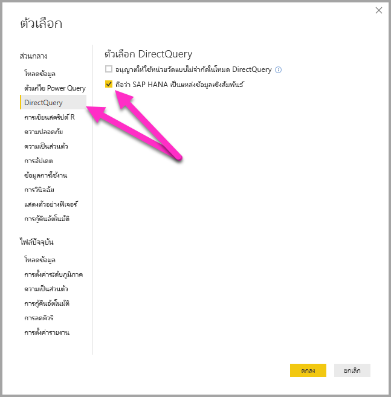
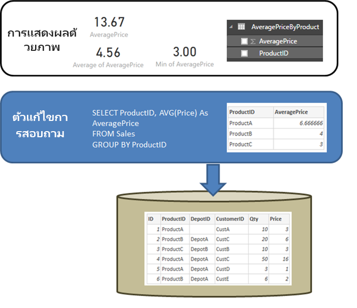

# DirectQuery และ SAP HANA
คุณสามารถเชื่อมต่อกับแหล่งข้อมูล **SAP HANA** ได้โดยตรงโดยใช้ **DirectQuery** มีตัวเลือกสองตัวเลือกในการเชื่อมต่อกับ SAP HANA:

* **ถือว่า SAP HANA เป็นแหล่งข้อมูลหลายมิติ (ค่าเริ่มต้น):** ในกรณีนี้ ลักษณะการทำงานจะคล้ายกับกรณีที่ Power BI ่เชื่อมต่อกับแหล่งข้อมูลหลายมิติอื่นๆ เช่น SAP Business Warehouse หรือ Analysis Services เมื่อเชื่อมต่อกับ SAP HANA ที่ใช้การตั้งค่านี้ มุมมองการวิเคราะห์หรือการคำนวณเดียวจะถูกเลือก และหน่วยวัด ลำดับชั้นและแอตทริบิวต์ทั้งหมดของมุมมองนั้นจะพร้อมใช้งานในรายการเขตข้อมูล เมื่อสร้างการแสดงผลด้วยภาพแล้ว ข้อมูลรวมจะถูกเรียกใช้จาก SAP HANA เสมอ วิธีนี้เป็นวิธีที่แนะนำ และเป็นค่าเริ่มต้นสำหรับรายงาน DirectQuery ใหม่ผ่าน SAP HANA

* **ถือว่า SAP HANA เป็นแหล่งข้อมูลเชิงสัมพันธ์:** ในกรณีนี้ Power BI จะถือว่า SAP HANA เป็นแหล่งข้อมูลเชิงสัมพันธ์ ซึ่งทำให้มีความยืดหยุ่นมากขึ้น แต่ต้องใช้ความระมัดระวังเพื่อให้แน่ใจว่า มีการรวมหน่วยวัดตามที่คาดไว้ และเพื่อเป็นการหลีกเลี่ยงปัญหาด้านประสิทธิภาพการทำงาน

วิธีที่ใช้เพื่อเชื่อมต่อจะถูกกำหนดโดยตัวเลือกเครื่องมือส่วนกลางซึ่งตั้งค่าโดยการเลือก **ไฟล์ > ตัวเลือกและการตั้งค่า** แล้วเลือก **ตัวเลือก > DirectQuery** จากนั้นเลือกตัวเลือก  **ถือว่า SAP HANA เป็นแหล่งข้อมูลเชิงสัมพันธ์** ดังที่แสดงในภาพดังต่อไปนี้ 

ตัวเลือกที่ถือว่า SAP HANA เป็นแหล่งข้อมูลเชิงสัมพันธ์จะควบคุมวิธีที่ใช้สำหรับรายงาน *ใหม่*ใดๆ โดยใช้ DirectQuery ผ่าน SAP HANA ซึ่งไม่มีผลต่อการเชื่อมต่อ SAP HANA ใด ๆ ที่มีอยู่ในรายงานปัจจุบัน และไม่มีผลต่อการเชื่อมต่อในรายงานอื่นใดที่เปิดอยู่ด้วย ดังนั้น ถ้าในขณะนี้ยังไม่ได้เลือกตัวเลือก เมื่อมีการเพิ่มการเชื่อมต่อใหม่กับ SAP HANA ก็จะใช้ **รับข้อมูล** ซึ่งสามารถสร้างการเชื่อมต่อโดยถือ SAP HANA เป็นแหล่งข้อมูลหลายมิติได้ อย่างไรก็ตาม ถ้ามีการเปิดรายงานอื่นที่เชื่อมต่อกับ SAP HANA ด้วย รายงานนั้นก็จะยังคงทำงานตามตัวเลือกที่ตั้งค่าไว้ *ในเวลาที่ถูกสร้างขึ้น* ซึ่งก็หมายความว่า รายงานใด ๆ ที่เชื่อมต่อกับ SAP HANA ที่สร้างขึ้นก่อนเดือนกุมภาพันธ์ 2018 จะยังคงถือว่า SAP HANA เป็นแหล่งข้อมูลเชิงสัมพันธ์ต่อไป 

ทั้งสองวิธีดังกล่าวประกอบไปด้วยลักษณะการทำงานที่แตกต่างกันอย่างมาก และไม่สามารถสลับรายงานที่มีอยู่จากวิธีการหนึ่งไปเป็นอีกวิธีหนึ่งได้ 

มาดูรายละเอียดเพิ่มเติมเกี่ยวกับสองวิธีเหล่านี้แต่ละวิธีตามลำดับ

## ถือว่า SAP HANA เป็นแหล่งข้อมูลหลายมิติ (ค่าเริ่มต้น)

การเชื่อมต่อกับ SAP HANA ใหม่ทั้งหมดจะใช้วิธีการเชื่อมต่อนี้ตามค่าเริ่มต้นโดยถือ SAP HANA เป็นแหล่งข้อมูลหลายมิติ ในการที่จะถือว่าการเชื่อมต่อกับ SAP HANA เป็นแหล่งข้อมูลเชิงสัมพันธ์ คุณต้องเลือก **ไฟล์ > ตัวเลือกและการตั้งค่า > ตัวเลือก** แล้วเลือกกล่องภายใต้ **Direct Query > ถือว่า SAP HANA เป็นแหล่งข้อมูลเชิงสัมพันธ์** ในขณะที่คุณลักษณะนี้อยู่ใน**ตัวอย่าง**รายงานที่สร้างขึ้นโดยใช้วิธีแบบหลายมิติ*ไม่สามารถ*สามารถเผยแพร่ไปยังบริการ Power BI และการทำเช่นนั้นจะทำให้เกิดข้อผิดพลาดเมื่อเปิดรายงานภายใน บริการ Power BI  

เมื่อเชื่อมต่อกับ SAP HANA เป็นแหล่งข้อมูลหลายมิติ จะมีการนำไปใช้ดังนี้:

* ใน **รับตัวนำทางข้อมูล** จะสามารถเลือกมุมมอง SAP HANA เดียวได้ ไม่สามารถเลือกหน่วยวัดหรือแอตทริบิวต์ทีละรายการได้ ไม่มีแบบสอบถามที่กำหนดไว้ในเวลาที่มีการเชื่อมต่อซึ่งจะแตกต่าง จากการนำเข้าข้อมูลหรือในกรณีที่ใช้ DirectQuery ในขณะที่ถือ SAP HANA เป็นแหล่งข้อมูลเชิงสัมพันธ์ นอกจากนี้ ยังหมายความว่า ไม่สามารถใช้แบบสอบถาม SAP HANA SQL ได้โดยตรงเมื่อเลือกวิธีการเชื่อมต่อนี้

* หน่วยวัด ลำดับชั้น และแอตทริบิวต์ทั้้งหมดของมุมมองที่เลือกไว้จะแสดงในรายการเขตข้อมูล 

* ขณะที่ใช้หน่วยวัดการแสดงผลด้วยภาพ SAP HANA จะสอบถามเพื่อเรียกใช้ข้อมูลค่าหน่วยวัดที่ระดับการรวมที่จำเป็นสำหรับการแสดงผลด้วยภาพ ดังนั้น เมื่อจัดการกับหน่วยวัดที่ไม่ใช่แบบเพิ่ม (ตัวนับ อัตราส่วนและอื่น ๆ) การรวมทั้งหมดก็จะดำเนินการโดย SAP HANA และไม่มีการดำเนินการรวมเพิ่มเติมโดย Power BI อีก 

* เพื่อให้แน่ใจว่า จะได้ค่ารวมที่ถูกต้องเสมอสจาก SAP HANA จึงต้องกำหนดข้อจำกัดบางประการ ตัวอย่างเช่น ไม่สามารถเพิ่มคอลัมน์จากการคำนวณหรือผสมรวมข้อมูลจากมุมมอง SAP HANA หลายมุมมองภายในรายงานเดียวกันได้ 

การถือว่า SAP HANA เป็นแหล่งข้อมูลหลายมิตินั้นไม่ได้ทำให้มีความยืดหยุ่นมากขึ้นโดยใช้วิธี *เชิงสัมพันธ์* แบบทางเลือก แต่ก็เป็นวิธีที่ง่ายกว่า และทำให้แน่ใจได้ว่า มีค่ารวมที่ถูกต้องเมื่อจัดการกับหน่วยวัด SAP HANA ที่ซับซ้อนมากยิ่งขึ้น และโดยทั่วไปแล้วจะส่งผลให้เกิดประสิทธิภาพที่สูงขึ้น 

รายการ **เขตข้อมูล** จะประกอบด้วยหน่วยวัด แอตทริบิวต์ และลำดับชั้นทั้งหมดจากมุมมอง SAP HANA โปรดทราบว่า จะมีลักษณะการทำงานดังต่อไปนี้้เมื่อใช้วิธีการเชื่อมต่อนี้:

* แอตทริบิวต์ใด ๆ ที่รวมอยู่ในลำดับชั้นอย่างน้อยหนึ่งลำดับจะถูกซ่อนตามค่าเริ่มต้น อย่างไรก็ตาม สามารถดูแอตทริบิวต์เหล่านี้ได้ถ้าจำเป็นโดยการเลือก **มุมมองที่ซ่อนไว้** จากเมนูบริบทบนรายการเขตข้อมูล จากเมนูบริบทเดียวกัน สามารถมองเห็นแอตทริบิวต์เหล่านี้ได้ถ้าจำเป็น

* ใน SAP HANA สามารถกำหนดแอตทริบิวต์เพื่อใช้แอตทริบิวต์อื่นเป็นป้ายชื่อได้ ตัวอย่างเช่น **Product** (ที่มีค่า 1,2,3 และอื่น ๆ) สามารถใช้ **ProductName** (ที่มีค่า Bike,Shirt,Gloves และอื่น ๆ) เป็นป้ายชื่อได้ ในกรณีนี้ เขตข้อมูล **Product** เดียวจะแสดงในรายการเขตข้อมูลซึ่งค่าจะเป็นป้ายชื่อ Bike,Shirt,Gloves และอื่น ๆ แต่เรียงลำดับตามและกำหนดแบบไม่ซ้ำกันโดยค่าคีย์ 1,2,3 คอลัมน์ **Product.Key** แบบซ่อนก็จะถูกสร้างขึ้นด้วยโดยมีการอนุญาตให้เข้าถึงค่าคีย์พื้นฐานถ้าจำเป็น 

ตัวแปรใด ๆ ที่กำหนดไว้ในมุมมอง SAP HANA พื้นฐานจะแสดงไว้ในขณะที่มีการเชื่อมต่อ และสามารถป้อนค่าที่จำเป็นได้ สามารถเปลี่ยนแปลงค่าเหล่านั้นได้ในภายหลังโดยเลือก **แก้ไขแบบสอบถาม** จาก ribbon แล้วจึง **จัดการพารามิเตอร์** จากเมนูดรอปดาวน์ที่แสดงไว้ 

ปฏิบัติการสร้างโมเดลที่ได้รับอนุญาตจะจำกัดเข้มงวดมากกว่ากรณีทั่วไปและปัญหาเมื่อใช้ DirectQuery ที่ระบุความจำเป็นเพื่อให้แน่ใจว่า สามารถได้รับข้อมูลรวมที่ถูกต้องจาก SAP HANA เสมอ อย่างไรก็ตาม ยังคงสามารถทำการเพิ่มเติมและการเปลี่ยนแปลงต่างๆ รวมถึงการกำหนดหน่วยวัด การเปลี่ยนชื่อและการซ่อนเขตข้อมูล และกำหนดรูปแบบการแสดงผลได้ การเปลี่ยนแปลงดังกล่าวทั้งหมดจะถูกเก็บรักษาไว้ในการรีเฟรช และจะมีการใช้การเปลี่ยนแปลงที่ไม่ขัดแย้งกันใดๆ กับมุมมอง SAP HANA 

### ข้อจำกัดเกี่ยวกับแบบจำลองเพิ่มเติม

ข้อจำกัดเกี่ยวกับแบบจำลองเพิ่มเติมหลักเมื่อเชื่อมต่อกับ SAP HANA โดยใช้ DirectQuery (ถือเป็นแหล่งข้อมูลหลายมิติ) มีดังนี้: 

* **ไม่มีการสนับสนุนสำหรับคอลัมน์จากการคำนวณ:** ความสามารถในการสร้างคอลัมน์จากการคำนวณจะถูกปิดใช้งาน นอกจากนี้ ก็ยังหมายความอีกด้วยว่า การจัดกลุ่มและการจัดคลัสเตอร์ซึ่งสร้างคอลัมน์จากการคำนวณจะไม่พร้อมใช้งาน
* **ข้อจำกัดเพิ่มเติมสำหรับหน่วยวัด:** มีข้อจำกัดเพิ่มเติมที่กำหนดบนนิพจน์ DAX ซึ่งสามารถใช้ในหน่วยวัดเพื่อแสดงระดับการสนับสนุนที่เสนอโดย SAP HANA
* **ไม่มีการสนับสนุนสำหรับการกำหนดความสัมพันธ์:** สามารถสอบถามได้เพียงมุมมองเดียวภายในรายงาน และเมื่อเป็นเช่นนั้น ก็จะไม่มีการสนับสนุนสำหรับการกำหนดความสัมพันธ์
* **ไม่มีมุมมองข้อมูล:****มุมมองข้อมูล**ที่แสดงข้อมูลระดับรายละเอียดในตารางได้ตามปกติ โดยกำหนดลักษณะของแหล่งข้อมูล OLAP เช่น SAP HANA มุมมองนี้ไม่พร้อมใช้งานผ่าน SAP HANA
* **มีการแก้ไขรายละเอียดคอลัมน์และหน่วยวัด:** มีการแก้ไขรายการของคอลัมน์และหน่วยวัดที่เห็นในรายการเขตข้อมูลโดยแหล่งข้อมูลพื้นฐานและไม่สามารถปรับเปลี่ยนได้ ตัวอย่างเช่น จะไม่สามารถลบคอลัมน์และ่เปลี่ยนแปลง datatype (อย่างไรก็ตาม สามารถเปลี่ยนชื่อได้)
* **ข้อจำกัดเพิ่มเติมใน DAX:** มีข้อจำกัดเพิ่มเติมเกี่ยวกับ DAX ที่สามารถใช้ในการกำหนดหน่วยวัดเพื่อสะท้อนถึงขีดจำกัดในแหล่งข้อมูล ตัวอย่างเช่น ไม่สามารถใช้ฟังก์ชันรวมผ่านตารางได้

### ข้อจำกัดในการการจัดรูปแบบการแสดงข้อมูลเพิ่มเติม

มีข้อจำกัดในภาพเมื่อเชื่อมต่อกับ SAP HANA ใช้ DirectQuery (ถือเป็นแหล่งข้อมูลหลายมิติ): 
* **ไม่มีการรวมคอลัมน์:** ไม่สามารถเปลี่ยนแปลงการรวมสำหรับคอลัมนในการแสดงผลด้วยภาพ และเป็น *อย่าสรุป*เสมอ

## ถือว่า SAP HANA เป็นแหล่งข้อมูลเชิงสัมพันธ์ 

เมื่อเลือกการเชื่อมต่อกับ SAP HANA เป็นแหล่งข้อมูลเชิงสัมพันธ์ ความยืดหยุ่นเพิ่มเติมบางระดับก็จะพร้อมใช้งาน ตัวอย่างเช่น คุณสามารถสร้างคอลัมน์จากการคำนวณ รวมข้อมูลจากมุมมอง SAP HANA หลายมุมมอง และสร้างความสัมพันธ์ระหว่างตารางที่เป็นผลลัพธ์ได้ อย่างไรก็ตาม เมื่อใช้ SAP HANA ในลักษณะนี้ เป็นสิ่งสำคัญที่จะต้องทำความเข้าใจบางแง่มุมที่ว่า จะถือว่าการเชื่อมต่ออยู่ในลักษณะใดเพื่อให้แน่ใจเกี่ยวกับสิ่งต่อไปนี้: 

* ผลลัพธ์จะเป็นไปตามที่คาดไว้เมื่อมุมมอง SAP HANA ประกอบด้วยหน่วยวัดที่ไม่ใช่แบบเพิ่ม (ตัเช่น จำนวนนับหรือค่าเฉลี่ยที่แตกต่างกันชัดเจนแทนผลรวมอย่างง่าย)
* แบบสอบถามที่ได้จะมีประสิทธิภาพยิ่งขึ้น

ซึ่งเป็นประโยชน์ที่จะเริ่มโดยทำให้ลักษณะการทำงานของแหล่งข้อมูลเชิงสัมพันธ์ เช่น SQL Server มีความชัดเจนเมื่อแบบสอบถามที่กำหนดไว้ใน **รับข้อมูล** หรือ**ตัวแก้ไขแบบสอบถาม** ดำเนินการรวม ในตัวอย่างต่อไปนี้ แบบสอบถามที่กำหนดไว้ใน **ตัวแก้ไขแบบสอบถามจะ** ส่งกลับราคาเฉลี่ยตาม*ProductID*  

ถ้ามีการนำข้อมูลเข้าไปใน Power BI (เทียบกับการใช้ DirectQuery) ก็จะส่งผลดังนี้:

* จะนำเข้าข้อมูลในระดับการรวมที่กำหนดโดยแบบสอบถามที่สร้างขึ้น ใน**ตัวแก้ไขแบบสอบถาม** ตัวอย่างเช่น ราคาเฉลี่ยตามผลิตภัณฑ์ ซึ่งส่งผลให้ตารางมีสองคอลัมน์ ได้แก่ *ProductID*และ *AveragePrice*ที่สามารถใช้ได้ในการแสดงผลด้วยภาพ
* ในการแสดงผลด้วยภาพ การรวมในภายหลังใด ๆ (เช่น *Sum*, *Average*, *Min*และอื่นๆ) จะดำเนินการผ่านข้อมูลที่นำเข้ามานั้น ตัวอย่างเช่น *AveragePrice* ในการแสดงผลด้วยภาพจะใช้ *Sum* รวมตามค่าเริ่มต้น และจะส่งกลับผลรวมผ่าน *AveragePrice*สำหรับแต่ละ  *ProductID* ซึ่งในกรณีตัวอย่างนี้น่าจะเป็น 13.67 ลักษณะเดียวกันนี้จะใชได้้กับฟังก์ชันการรวมที่เป็นทางเลือกใด ๆ (เช่น*Min*, *Average* และอื่น ๆ) ซึ่งใชในการแสดงผลด้วยภาพ ตัวอย่างเช่น*Average* ของ*AveragePrice* จะส่งกลับค่าเฉลี่ยของ 6.66, 4 และ 3 ซึ่งเท่ากับ 4.56 และไม่ส่งกลับค่าเฉลี่ยของ *ราคา*บนระเบียน 6 ระเบียนในตารางพื้นฐานซึ่งเป็น 5.17
  
ถ้าใช้ **DirectQuery** (ผ่านแหล่งเชิงสัมพันธ์เดียวกันนั้น) แทนการนำเข้า ความหมายเดียวกันนี้ก็นำไปใชได้้ และผลลัพธ์ก็น่าจะเหมือนกันทุกประการ:  

* กำหนดแบบสอบถามเดียวกันโดยแสดงข้อมูลที่เหมือนกันทุกประการในเชิงตรรกะในชั้นรายงาน – แม้ว่าจริง ๆ แล้วจะไม่สามารถทำการนำเข้าข้อมูลได้ก็ตาม

* ในการแสดงผลด้วยภาพ การรวมในภายหลังใด ๆ (เช่น *Sum*, *Average*, *Min*และอื่นๆ) จะดำเนินการอีกครั้งผ่านตารางตรรกะจากแบบสอบถาม และอีกครั้ง การแสดงผลด้วยภาพที่ประกอบด้วย*Average*ของ*AveragePrice* จะส่งกลับค่า 4.56 เดียวกัน
  
ตอนนี้มาพิจารณาถึง SAP HANA เมื่อถือว่าการเชื่อมต่อเป็นแหล่งข้อมูลเชิงสัมพันธ์ Power BI สามารถทำงานกับทั้ง *มุมมองการวิเคราะห์* และ*มุมมองคำนวณ*ใน SAP HANA ซึ่งทั้งสองมุมมองสามารถประกอบด้วยหน่วยวัด แม้กระทั่งวันนี้ วิธีสำหรับ SAP HANA ก็ยังเป็นไปตามหลักการเดียวกันตามที่อธิบายไว้ก่อนหน้านี้ในส่วนนี้: แบบสอบถามที่กำหนดไว้ใน **รับข้อมูล** หรือ**ตัวแก้ไขแบบสอบถาม** จะกำหนดข้อมูลที่พร้อมใช้งาน จากนั้น การรวมในภายหลังใด ๆ ในการแสดงผลด้วยภาพก็จะเป็นไปตามข้อมูลนั้น และนำไปใช้กับทั้งการนำเข้าและ DirectQuery ได้เช่นเดียวกัน  
อย่างไรก็ตาม โดยการกำหนดลักษณะของ SAP HANA แบบสอบถามที่กำหนดไว้ในกล่องโต้ตอบ **รับข้อมูล** เริ่มแรกหรือ**ตัวแก้ไขแบบสอบถาม** มักเป็นแบบสอบถามรวม และโดยทั่วไปแล้วจะมีหน่วยวัดซึ่งการรวมจริงที่จะถูกใช้นั้นจะถูกกำหนดโดยมุมมอง SAP HANA

ในตัวอย่าง SQL Server ที่เทียบเท่าข้างต้น จะมีมุมมอง SAP HANA ที่ประกอบด้วย *ID*, *ProductID*, *DepotID* และหน่วยวัดซึ่งรวมถึง  *AveragePrice* ที่กำหนดในมุมมองเป็น *Average of Price*  
    
ถ้าในประสบการณ์ **รับข้อมูล** การเลือกกระทำสำหรับหน่วยวัด **ProductID** และ **AveragePrice** ก็จะกำหนดแบบสอบถามผ่านมุมมองซึ่งเป็นการร้องขอข้อมูลรวมนั้น (ในตัวอย่างก่อนหน้า เพื่อความง่าย จะมีการใช้ SQL เทียมที่ไม่ตรงกับไวยากรณ์ของ SQL SAP HANA ทุกประการ) จากนั้น การรวมเพิ่มเติมใด ๆ ที่กำหนดไว้ในการแสดงผลด้วยภาพก็จะรวมผลลัพธ์ของแบบสอบถามดังกล่าวเพิ่มเติม กล่าวอีกครั้งก็คือ ตามที่อธิบายไวข้างต้นสำหรับ SQL Server การดำเนินการนี้จะใช้ได้สำหรับทั้งกรณีการนำเข้าและ DirectQuery โปรดทราบว่า ในกรณี DirectQuery แบบสอบถามจาก **รับข้อมูล** หรือ**ตัวแก้ไขแบบสอบถาม** จะถูกใช้ในการเลือกย่อยภายในแบบสอบถามเดียวที่ส่งไปยัง SAP HANA และดังนั้น จึงไม่ใช่กรณีที่แท้จริงที่ว่า ข้อมูลทั้งหมดจะถูกอ่านก่อนที่จะทำการรวมเพิ่มเติม  

ข้อควรพิจารณาและลักษณะการทำงานเหล่านี้ทั้งหมดทำให้จำเป็นต้องมีข้อควรพิจารณาสำคัญดังต่อไปนี้เมื่อใช้ DirectQuery ผ่าน SAP HANA:  

* ควรให้ความสนใจในการรวมเพิ่มเติมใด ๆ ที่ดำเนินการในการแสดงผลด้วยภาพเมื่อใดก็ตามที่หน่วยวัดใน SAP HANA ที่ไม่ใช่แบบเพิ่ม (เช่น ไม่ใช่ *Sum*, *Min* หรือ *Max*อย่างง่าย)

* ใน **รับข้อมูล** หรือ**ตัวแก้ไขแบบสอบถาม** เฉพาะคอลัมน์ที่จำเป็นควรจะรวมอยู่ในการเรียกใช้ข้อมูลที่จำเป็นซึ่งสะท้อนถึงข้อเท็จจริงที่ว่า ผลลัพธ์จะเป็นแบบสอบถามที่ต้องเป็นแบบสอบถามที่สมเหตุสมผลซึ่ง่สามารถส่งไปยัง SAP HANA ได้ ตัวอย่างเช่น ถ้าคอลัมน์จำนวนมากถูกเลือก ด้วยความคิดที่ว่า อาจจำเป็นต้องมในการแสดงผลด้วยภาพในภายหลัง แม้กระทั่งสำหรับ DirectQuery การแสดงผลด้วยภาพอย่างง่ายก็จะหมายถึง แบบสอบถามรวมที่ใช้ในการเลือกย่อย ก็จะประกอบด้วยคอลัมน์จำนวนมากเหล่านั้นซึ่งโดยทั่วไปแล้วจะดำเนินการได้ไม่ดีเลย
  
มาลองดูตัวอย่างกัน ในตัวอย่างต่อไปนี้ การเลือกห้าคอลัมน์ (**CalendarQuarter**, **Color**, **LastName**, **ProductLine**,  **SalesOrderNumber**) ในกล่องโต้ตอบ **รับข้อมูล** พร้อมกับหน่วยวัด *OrderQuantity*จะหมายความว่า การสร้างการแสดงผลด้วยภาพอย่างง่ายในภายหลังซึ่งประกอบด้วย Min OrderQuantity จะส่งผลลัพธ์ในแบบสอบถาม SQL ต่อไปนี้กับ SAP HANA ส่วนที่แรเงาจะเป็นการเลือกย่อยที่ประกอบด้วยแบบสอบถามจาก **รับข้อมูล** / **ตัวแก้ไขแบบสอบถาม** ถ้าการเลือกย่อยนี้ให้ผลลัพธ์เป็นจำนวนนับที่สูงมาก ประสิทธิภาพการทำงานของ SAP HANA ที่ได้ก็มีแนวโน้มว่าจะอยู่ในเกณฑ์ไม่ดี  

   
เนื่องด้วยลักษณะการทำงานนี้ เราจึงขอแนะนำรายการที่เลือกใน **รับข้อมูล**หรือ**ตัวแก้ไขแบบสอบถาม**ว่าควรจำกัดอยู่ที่รายการที่จำเป็นเหล่านั้นในขณะที่ยังคงได้ผลลัพธ์เป็นแบบสอบถามที่เหมาะสมสำหรับ SAP HANA  

## แนวทางปฏิบัติที่ดีที่สุด 

สำหรับทั้งสองวิธีการเชื่อมต่อกับ SAP HANA คำแนะนำสำหรับการใช้ DirectQuery ยังนำไปใช้ได้กับ SAP HANA โดยเฉพาะอย่างยิ่ง คำแนะนำเหล่านั้นที่เกี่ยวข้องกับการทำให้แน่ใจว่ามีประสิทธิภาพการทำงานที่ดี คำแนะนำเหล่านี้จะอธิบายไว้ในรายละเอียดในบทความ [การใช้ DirectQuery ใน Power BI](desktop-directquery-about.md)
   
## ข้อจำกัด

รายการต่อไปนี้อธิบายถึงคุณลักษณะ SAP HANA ทั้งหมดที่ไม่มีการรองรับเต็มที่หรือคุณลักษณะที่มีลักษณะการทำงานแตกต่างกันเมื่อใช้ Power BI 

* **ลำดับชั้นหลัก-ลูก**  - ลำดับชั้นหลัก-ลูกจะไม่สามารถมองเห็นได้ใน Power BI
ทั้งนี้ เนื่องจาก Power BI จะเข้าถึง SAP HANA โดยใช้ส่วนติดต่อ SQL และลำดับชั้นหลัก-ลูกจะไม่สามารถเข้าถึงได้ทั้งหมดผ่าน SQL
* **เมตาดาต้าลำดับชั้นอื่น ๆ** - โครงสร้างพื้นฐานของลำดับชันจะแสดงใน Power BI อย่างไรก็ตาม เมตาดาต้าลำดับชั้นบางชุด (เช่นการควบคุมลักษณะการทำงานของลำดับชั้นที่ไม่ตรงกัน) จะไม่มีผลใดๆ
กล่าวอีกครั้งก็คือ มีสาเหตุเนื่องมาจากข้อจำกัดที่กำหนดโดยส่วนติดต่อ SQL
* **การเชื่อมต่อโดยใช้ SSL** - คุณไม่สามารถเชื่อมต่อกับอินสแตนซ์ SAP HANA ที่กำหนดค่าให้ใช้ SSL ได้
* **การสนับสนุนสำหรับมุมมองแอตทริบิวต์** - Power BI สามารถเชื่อมต่อกับมุมมองการวิเคราะห์และการคำนวณได้ แต่ไม่สามารถเชื่อมต่อกับมุมมองแอตทริบิวต์ได้โดยตรง
* **การสนับสนุนสำหรับวัตถุแค็ตตาล็อก** - Power BI จะไม่สามารถเชื่อมต่อกับวัตถุแค็ตตาล็อกได้
* **การเปลี่ยนแปลงของตัวแปรหลังจากเผยแพร่** - คุณไม่สามารถเปลี่ยนแปลงค่าสำหรับตัวแปร SAP HANA ใด ๆ ได้โดยตรงในบริการ Power BI หลังจากที่มีการเผยแพร่รายงาน 
 
## ปัญหาที่ทราบแล้ว 
รายการต่อไปนี้จะอธิบายถึงปัญหาที่ทราบแล้วทั้งหมดเมื่อเชื่อมต่อกับ SAP HANA (DirectQuery) โดยใช้ Power BI 

* **ปัญหา SAP HANA ในกรณีแบบสอบถามสำหรับตัวนับและหน่วยวัดอื่น ๆ** - ข้อมูลที่ไม่ถูกต้องจะถูกส่งกลับจาก SAP HANA ถ้าเชื่อมต่อกับมุมมองการวิเคราะห์ และหน่วยวัดตัวนับและหน่วยวัดอัตราส่วนอื่น ๆ รวมอยู่ในการแสดงผลด้วยภาพเดียวกัน ซึ่งจะครอบคลุมโดย SAP Note 2128928 (ผลลัพธ์ที่ไม่คาดคิดในกรณีที่สอบถามคอลัมน์จากคำนวณและตัวนับ) หน่วยวัดอัตราส่วนจะไม่ถูกต้องในกรณีนี้ 

* **คอลัมน์ Power BI หลายคอลัมน์จากคอลัมน์ SAP HANA เดียว** - สำหรับมุมมองคำนวณบางมุมมองในกรณีที่คอลัมน์ SAP HANA ถูกใช้ในลำดับชั้นมากกว่าหนึ่งรายการ SAP HANA จะแสดงสิ่งนี้เป็นสองแอตทริบิวต์แยกต่างหาก ซึ่งส่งผลใหได้สองคอลัมน์ที่สร้างขึ้นใน Power BI  อย่างไรก็ตาม คอลัมน์เหล่านั้นจะถูกซ่อนอยู่ตามค่าเริ่มต้น และแบบสอบถามทั้งหมดที่เกี่ยวข้องกับลำดับชั้น หรือคอลัมน์โดยตรงจะทำงานอย่างถูกต้อง 
 
## ขั้นตอนถัดไป

สำหรับข้อมูลเพิ่มเติมเกี่ยวกับ DirectQuery โปรดดูที่ทรัพยากรดังต่อไปนี้:

* [DirectQuery ใน Power BI](desktop-directquery-about.md)
* [แหล่งข้อมูลที่สนับสนุนโดย DirectQuery](desktop-directquery-data-sources.md)
* [DirectQuery และ SAP BW](desktop-directquery-sap-bw.md)
* [เกตเวย์ข้อมูลภายในองค์กร](service-gateway-onprem.md)

