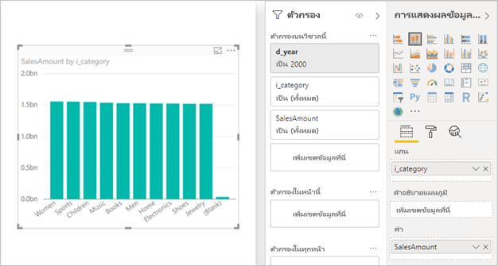

# <a name="troubleshoot-developing-directquery-models-in-power-bi-desktop"></a>แก้ไขปัญหาการพัฒนาแบบจำลอง DirectQuery ใน Power BI Desktop

บทความนี้มีเป้าหมายสำหรับผู้สร้างแบบจำลองข้อมูลที่กำลังพัฒนาแบบจำลอง Power BI DirectQuery ซึ่งพัฒนาโดยใช้ Power BI Desktop หรือบริการของ Power BI ซึ่งจะอธิบายวิธีการวินิจฉัยปัญหาด้านประสิทธิภาพการทำงานและวิธีการรับข้อมูลรายละเอียดเพิ่มเติมเพื่ออนุญาตให้มีการปรับให้เหมาะสมกับรายงาน

## <a name="performance-analyzer"></a>ตัววิเคราะห์ประสิทธิภาพ

เราขอแนะนำอย่างยิ่งว่าการวินิจฉัยใด ๆ ของปัญหาด้านประสิทธิภาพการทำงานเริ่มต้นใน Power BI Desktop แทนที่จะเป็นใน Power BI (บริการหรือเซิร์ฟเวอร์รายงาน Power BI) โดยปกติแล้ว ปัญหาด้านประสิทธิภาพการทำงานจะขึ้นอยู่กับระดับประสิทธิภาพของแหล่งข้อมูลต้นแบบ และการวินิจฉัยเหล่านี้จะได้รับการระบุและวินิจฉัยได้ง่ายขึ้นในสภาพแวดล้อมที่แยกตัวมากขึ้นของ Power BI Desktop และจะกำจัดคอมโพเนนต์บางอย่างในช่วงแรก (เช่น เกตเวย์ Power BI) เฉพาะในกรณีที่พบว่าไม่มีปัญหาด้านประสิทธิภาพการทำงานอยู่ใน Power BI Desktop ควรให้ความสำคัญกับการตรวจสอบข้อมูลเฉพาะของรายงานใน Power BI [ตัววิเคราะห์ประสิทธิภาพ](desktop-performance-analyzer.md)เป็นเครื่องมือที่มีประโยชน์สำหรับการระบุปัญหาตลอดกระบวนการนี้

ในทำนองเดียวกัน เราขอแนะนำให้ก่อนอื่นลองแยกปัญหาต่าง ๆ ให้กับแต่ละวิชวล แทนการแยกให้กับหลายวิชวลในหน้าเดียว

สมมติว่าขั้นตอนเหล่านั้น (ในย่อหน้าก่อนหน้าของหัวข้อส่วนนี้) ดำเนินการเรียบร้อยแล้ว ตอนนี้เราจะมีวิชวลเดียวบนหน้าใน Power BI Desktop ที่อาจยังคงช้าอยู่ หากต้องการกำหนดคิวรีที่จะส่งไปยังแหล่งข้อมูลต้นแบบโดย Power BI Desktop คุณสามารถใช้ตัววิเคราะห์ประสิทธิภาพ นอกจากนี้ยังสามารถดูการติดตาม/ข้อมูลการวินิจฉัยที่อาจมีการออกโดยแหล่งข้อมูลเบื้องต้น การติดตามดังกล่าวอาจมีข้อมูลที่เป็นประโยชน์เกี่ยวกับรายละเอียดของวิธีดำเนินการคิวรี และวิธีการปรับปรุงคิวรี

นอกจากนี้ แม้ในกรณีที่ไม่มีร่องรอยดังกล่าวจากแหล่งที่มา คุณสามารถดคิวรีที่ส่งโดย Power BI พร้อมกับเวลาในการดำเนินการ ตามที่อธิบายไว้ต่อจะจากนี้

## <a name="review-trace-files"></a>ตรวจทานไฟล์การติดตาม

ตามค่าเริ่มต้น Power BI Desktop จะบันทึกเหตุการณ์ในระหว่างเซสชันที่กำหนดไว้ไปยังไฟล์การติดตามที่ชื่อ **FlightRecorderCurrent.trc**

สำหรับแหล่งข้อมูล DirectQuery บางแหล่ง ไฟล์บันทึกนี้ประกอบด้วยคิวรีทั้งหมดที่ส่งไปยังแหล่งข้อมูลต้นแบบ (แหล่งข้อมูล DirectQuery ที่เหลืออาจได้รับการสนับสนุนในอนาคต) แหล่งข้อมูลที่เขียนคิวรีไปยังไฟล์บันทึกมีดังนี้:

- SQL Server
- Azure SQL Database
- คลังข้อมูล Azure SQL
- Oracle
- Teradata
- SAP HANA

สามารถพบแฟ้มการติดตามในโฟลเดอร์**AppData**สำหรับผู้ใช้ปัจจุบัน _\\\<User>\AppData\Local\Microsoft\Power BI Desktop\AnalysisServicesWorkspaces_

ต่อไปนี้คือวิธีอย่างง่ายสำหรับเข้าถึงโฟลเดอร์นี้: ใน Power BI Desktop เลือก _ไฟล์ > ตัวเลือกและการตั้งค่า > ตัวเลือก_ แล้วเลือกหน้า **การวินิจฉัย** หน้าต่างกล่องโต้ตอบต่อไปนี้ปรากฏขึ้น


เมื่อคุณเลือกลิงก์**เปิดโฟลเดอร์บันทึกข้อมูลหยุดทำงาน/การติดตาม**ที่อยู่ภายใต้คอลเลกชันบันทึกข้อมูลการหยุดทำงาน โฟลเดอร์ต่อไปนี้จะเปิดขึ้น _\\\<User>\AppData\Local\Microsoft\Power BI Desktop\Traces_

การนำทางไปยังโฟลเดอร์หลักของโฟลเดอร์นั้นจะแสดงโฟลเดอร์ที่ประกอบด้วย_AnalysisServicesWorkspaces_ซึ่งจะประกอบด้วยโฟลเดอร์ย่อยของพื้นที่ทำงานหนึ่งสำหรับทุก ๆ อินสแตนซ์ที่เปิดของ Power BI Desktop โฟลเดอร์ย่อยเหล่านี้จะได้รับการตั้งชื่อคำต่อท้ายที่เป็นจำนวนเต็ม เช่น_AnalysisServicesWorkspace2058279583_

ภายในโฟลเดอร์นั้นคือโฟลเดอร์ย่อย _\Data_ ที่ประกอบด้วยไฟล์การติดตาม FlightRecorderCurrent.trc สำหรับเซสชัน Power BI ปัจจุบัน โฟลเดอร์พื้นที่ทำงานที่สอดคล้องกันจะถูกลบเมื่อสิ้นสุดเซสชัน Power BI Desktop ที่เชื่อมโยง

ไฟล์การติดตามสามารถเปิดขึ้นได้โดยใช้เครื่องมือตัวสร้างโพรไฟล์ของ SQL Server ซึ่งสามารถดาวน์โหลดได้ฟรีเนื่องจากส่วนหนึ่งของ SQL Server Management Studio คุณสามารถรับเครื่องมือได้จาก[ตำแหน่งที่ตั้งนี้](/sql/ssms/download-sql-server-management-studio-ssms?view=sql-server-2017)

เมื่อคุณดาวน์โหลด และติดตั้งSQL Server Management Studio ให้เรียกใช้ ตัวสร้างโพรไฟล์ของ SQL Server


เมื่อต้องเปิดไฟล์การติดตาม ทำตามขั้นตอนต่อไปนี้

1. ในตัวสร้างโพรไฟล์ของ SQL Server เลือก _ไฟล์ > เปิด > ไฟล์การติดตาม_
2. ใส่เส้นทางไปยังไฟล์ติดตามสำหรับเซสชัน Power BI เปิดอยู่ในปัจจุบัน เช่น _\\\<User>\AppData\Local\Microsoft\Power BI Desktop\AnalysisServicesWorkspaces\AnalysisServicesWorkspace2058279583\Data_
3. เปิด _FlightRecorderCurrent.trc_

เหตุการณ์ทั้งหมดจากเซสชันปัจจุบันจะปรากฏขึ้น ตัวอย่างที่มีคำอธิบายประกอบจะแสดงด้านล่าง ซึ่งเน้นกลุ่มของเหตุการณ์ แต่ละกลุ่มมีดังต่อไปนี้

- เหตุการณ์_คิวรีเริ่มต้น_และ_คิวรีสิ้นสุด_ซึ่งแสดงจุดเริ่มต้นและสิ้นสุดของคิวรี DAX ที่สร้างขึ้น โดย UI (ตัวอย่างเช่น จากวิชวลแบบ หรือ จากการเติมข้อมูลรายการของค่าในตัวกรอง UI)
- เหตุการณ์_DirectQuery เริ่มต้น_และ_DirectQuery สิ้นสุด_อย่างน้อยหนึ่งคู่ ซึ่งแสดงคิวรีที่ถูกส่งไปยังแหล่งข้อมูลต้นแบบ เป็นส่วนหนึ่งของการประเมินผลคิวรี DAX

โปรดทราบว่าคิวรี DAX หลายรายการสามารถดำเนินการในแบบขนานได้ ดังนั้นเหตุการณ์จากกลุ่มที่แตกต่างกันสามารถสอดแทรกกันได้ ค่าของ ActivityID สามารถใช้เพื่อกำหนดว่าเหตุการณ์ใดที่อยู่ในกลุ่มเดียวกัน


คอลัมน์อื่น ๆ ที่สนใจมีดังนี้:

- **ข้อมูลข้อความ:** รายละเอียดข้อความของเหตุการณ์ สำหรับเหตุการณ์ _คิวรีเริ่มต้น/สิ้นสุด_ จะเป็นคิวรี DAX สำหรับเหตุการณ์ _DirectQuery เริ่มต้น/สิ้นสุด_ จะเป็นคิวรี SQL ที่ส่งไปยังแหล่งข้อมูลต้นแบบ ค่า _TextData_ สำหรับเหตุการณ์ที่เลือกในปัจจุบันจะแสดงในบริเวณที่ด้านล่าง
- **เวลาสิ้นสุด:** เมื่อเหตุการณ์เสร็จสมบูรณ์
- **ระยะเวลา:** ระยะเวลาที่ใช้ในการดำเนินการคิวรี DAX หรือ SQL ในหน่วยมิลลิวินาที
- **ข้อผิดพลาด:** บ่งชี้ว่ามีข้อผิดพลาดเกิดขึ้นหรือไม่ ในกรณีนี้เหตุการณ์ที่แสดงจะเป็นสีแดง

โปรดทราบว่าในภาพด้านบน คอลัมน์ที่ดูไม่น่าสนใจบางส่วนได้รับการจำกัดให้แคบลง เพื่อให้สามารถมองเห็นได้คอลัมน์ที่น่าสนใจง่ายขึ้น

วิธีแนะนำสำหรับการจับภาพการติดตามเพื่อช่วยในการวินิจฉัยปัญหาด้านประสิทธิภาพการทำงานอาจเกิดขึ้นมีดังนี้

- เปิดเซสชัน Power BI Desktop เดียว (เพื่อหลีกเลี่ยงความสับสนของโฟลเดอร์พื้นที่ทำงานหลายรายการ)
- ใช้ชุดการดำเนินการที่น่าสนใจใน Power BI Desktop รวมถึงการดำเนินการเพิ่มเติมบางอย่างนอกเหนือจากนั้น เพื่อให้แน่ใจว่าเหตุการณ์ที่น่าสนใจจะถูกใส่ลงในไฟล์การติดตาม
- เปิดตัวสร้างโพรไฟล์ของ SQL Server และตรวจสอบการติดตาม ตามที่อธิบายไว้ก่อนหน้านี้ โปรดทราบว่าไฟล์การติดตามจะถูกลบเมื่อปิด Power BI Desktop นอกจากนี้ การดำเนินการเพิ่มเติมใน Power BI Desktop จะไม่ปรากฏทันที ควรจะปิดไฟล์การติดตามและเปิดใหม่อีกครั้งเพื่อดูเหตุการณ์ใหม่
- เก็บแต่ละเซสชันให้มีขนาดค่อนขนาดเล็ก (สิบวินาทีของการดำเนินการ ไม่ใช่หลายร้อย) เพื่อทำให้ง่ายต่อการแปลไฟล์การติดตาม (และเนื่องจากมีขีดจำกัดเกี่ยวกับขนาดของไฟล์การติดตาม ดังนั้นสำหรับเซสชันที่มีความยาวมาก จึงมีโอกาสที่เหตุการณ์ในช่วงแรกจะถูกทิ้งไป)

## <a name="understand-queries-sent-to-the-source"></a>ทำความเข้าใจแบบสอบถามที่ส่งไปยังแหล่งข้อมูล

รูปแบบทั่วไปของคิวรีที่สร้างและส่งโดย Power BI Desktop จะใช้การคิวรีย่อยสำหรับแต่ละตารางแบบจำลองที่อ้างอิง โดยที่การคิวรีย่อยจะถูกกำหนดขึ้นโดยคิวรี Power Query ตัวอย่างเช่น สมมติว่าตาราง TPC DS ต่อไปนี้อยู่ในฐานข้อมูลเชิงสัมพันธ์ของ SQL Server


พิจารณาวิชวลต่อไปนี้และการกำหนดค่าโดยการสังเกตหน่วยวัด **SalesAmount** ที่กำหนดด้วยนิพจน์ดังต่อไปนี้:

```dax

SalesAmount = SUMX(Web_Sales, [ws_sales_price] * [ws_quantity])

```



การรีเฟรชวิชวลนั้นจะส่งผลในคิวรี SQL ที่แสดงอยู่ด้านล่างของย่อหน้าถัดไป ตอนนี้คุณสามารถบอกได้ว่าการคิวรีย่อยสามแบบสำหรับตารางแบบจำลองได้แก่ **Web_Sales**,**Item**และ **Date_dim** แต่ละตารางเหล่านี้ส่งกลับคอลัมน์ตารางแบบจำลองทั้งหมดแม้ว่าจะมีเพียงสี่คอลัมน์ที่ถูกอ้างอิงโดยวิชวลเท่านั้น การคิวรีย่อยเหล่านี้ (แรเงา) เป็นข้อกำหนดของคิวรี Power Query อย่างแน่นอน ไม่พบว่าการใช้การคิวรีในลักษณะนี้มีผลกระทบต่อประสิทธิภาพการทำงาน สำหรับแหล่งข้อมูลที่ได้รับการสนับสนุนสำหรับ DirectQuery แหล่งข้อมูล เช่น SQL Server จะปรับการอ้างอิงไปยังคอลัมน์ที่ไม่ได้ใช้งานให้เหมาะสม

เหตุผลหนึ่งที่ทำให้ Power BI ใช้รูปแบบนี้เนื่องจากคุณสามารถกำหนดคิวรี Power Query เพื่อใช้คำสั่งคิวรีที่เฉพาะเจาะจง ดังนั้นจึงใช้ "ตามที่ระบุ" โดยไม่ต้องพยายามเขียนใหม่ โปรดทราบว่ารูปแบบนี้จำกัดการใช้คำสั่งคิวรีที่ใช้ Common Table Expressions (CTEs) และ Stored Procedure ไม่สามารถใช้คำสั่งเหล่านี้ในการคิวรีย่อย


## <a name="gateway-performance"></a>ประสิทธิภาพของเกตเวย์

สำหรับข้อมูลเกี่ยวกับการแก้ไขปัญหาประสิทธิภาพการทำงานของเกตเวย์ ให้อ่านบทความ [แก้ไขปัญหาเกตเวย์-Power BI](service-gateway-onprem-tshoot.md)

## <a name="next-steps"></a>ขั้นตอนถัดไป

สำหรับข้อมูลเพิ่มเติมเกี่ยวกับ DirectQuery โปรดดูที่ทรัพยากรดังต่อไปนี้:

- [ใช้ DirectQuery ใน Power BI Desktop](desktop-use-directquery.md)
- [แบบจำลอง DirectQuery ใน Power BI Desktop](desktop-directquery-about.md)
- [คำแนะนำแบบจำลอง DirectQuery ใน Power BI Desktop](guidance/directquery-model-guidance.md)
- มีคำถามหรือไม่ [ลองถามชุมชน Power BI](https://community.powerbi.com/)
