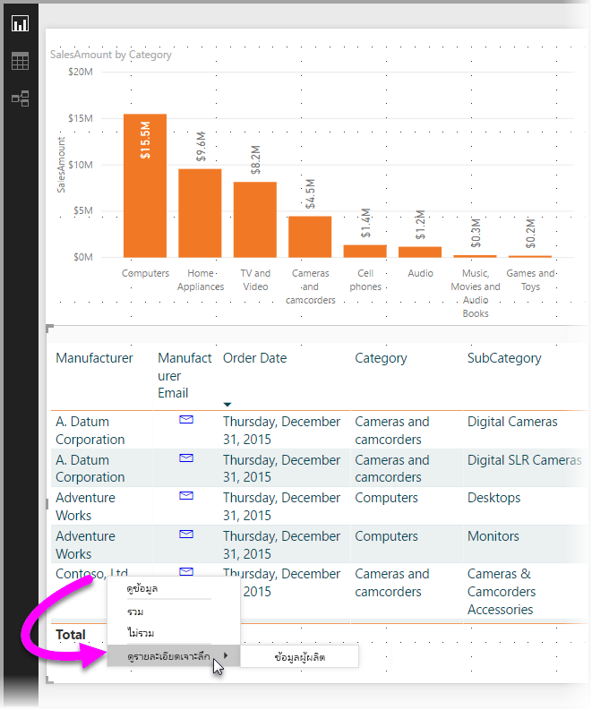
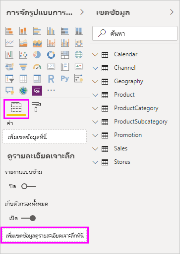
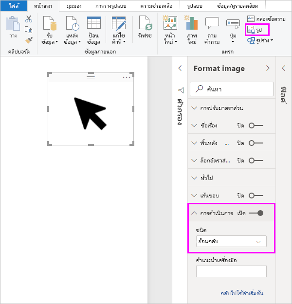
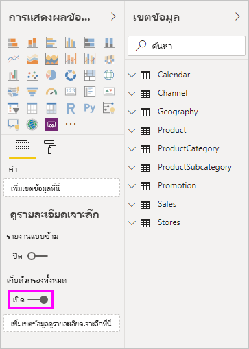
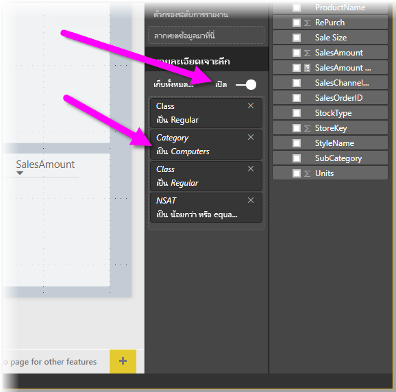
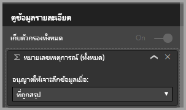

# ใช้ Drillthrough ใน Power BI Desktop
ด้วย **Drillthrough** ใน **Power BI Desktop** คุณสามารถสร้างหน้าในรายงานของคุณ ที่มุ่งเน้นไปยังรายการที่ระบุ เช่น ผู้จัดหา ลูกค้า หรือผู้ผลิต ผู้ใช้สามารถคลิกขวาที่จุดข้อมูลในหน้ารายงานอื่นๆ แล้วเข้าถึงรายละเอียดในหน้ารายงานที่เน้นนั้น เพื่อดูรายละเอียดที่กรองตามบริบทดังกล่าว

## การใช้ Drillthrough
1. เพื่อใช้ **Drillthrough** สร้างหน้ารายงานที่มีวิชวลที่คุณต้องการดู สำหรับรายการที่คุณจะให้มีการเข้าถึงรายละเอียด 

    ตัวอย่างเช่น ถ้าคุณสนใจให้เข้าถึงรายละเอียดเกี่ยวกับผู้ผลิต คุณอาจสร้างหน้า Drillthrough ด้วยภาพที่แสดงยอดขายรวม จำนวนหน่วยรวมที่จัดส่ง ยอดขายตามประเภท ยอดขายตามภูมิภาค และอื่นๆ ด้วยวิธีดังกล่าว เมื่อคุณเข้าถึงรายละเอียดในหน้านั้น วิชวลก็จะแสดงเฉพาะผู้ผลิตที่คุณเลือก

2. จากนั้น ในหน้าการเข้าถึงรายละเอียดนั้น ในส่วน**เขตข้อมูล**ของบานหน้าต่าง**การจัดรูปแบบการแสดงข้อมูล** ให้ลากเขตข้อมูลที่คุณต้องการเข้าถึงรายละเอียดใน**ตัวกรอง Drillthrough**

    

    เมื่อคุณเพิ่มเขตข้อมูลไปยัง**ตัวกรองการเข้าถึงรายละเอียด**ตามที่เหมาะสม **Power BI Desktop** ก็จะสร้างปุ่ม*ย้อนกลับ*ให้โดยอัตโนมัติ ภาพดังกล่าวจะกลายเป็นปุ่มในรายงานที่เผยแพร่ และช่วยให้ผู้ใช้ที่กำลังใช้งานรายงานของคุณใน**บริการของ Power BI** สามารถกลับไปยังหน้ารายงานที่ออกมา (หน้าซึ่งได้เลือกไว้ เพื่อเข้าถึงรายละเอียด) ได้อย่างสะดวก

    

## ใช้รูปภาพของคุณเองสำหรับปุ่มย้อนกลับ    
 เนื่องจากปุ่มย้อนกลับเป็นรูปภาพ คุณสามารถเปลี่ยนรูปภาพของวิชวลนั้นให้เป็นรูปใด ๆ ที่คุณต้องการ และจะยังคงทำงานเป็นปุ่มย้อนกลับ เพื่อให้ผู้ใช้รายงานกลับไปยังหน้าเดิม

1. บนแท็บ**หน้าแรก** คลิก**รูป** แล้วค้นหารูปภาพของคุณ และวางบนหน้าการเข้าถึงรายละเอียด
2. เลือกรูปภาพใหม่ของคุณบนหน้าการเข้าถึงรายละเอียด และภาย ใต้ส่วน ฟอร์แมตรูปภาพ ตั้งค่าตัวเลื่อน**ลิงค์**เพื่อเปิด และตั้งค่า**ชนิด**เป็น**ย้อนกลับ** รูปของคุณตอนนี้ทำหน้าที่เป็นปุ่มย้อนกลับ

    

    เมื่อหน้า**การเข้าถึงรายละเอียด**ของคุณเสร็จสมบูรณ์แล้ว และผู้ใช้คลิกขวาที่จุดข้อมูลในรายงานของคุณ ที่ใช้เขตข้อมูลที่คุณวางลงใน**ตัวกรอง Drillthrough** เมนูบริบทจะปรากฏเพื่อสนับสนุนการเข้าถึงรายละเอียดไปยังหน้านั้น

    

    เมื่อผู้ใช้รายงานเลือกที่จะเข้าถึงรายละเอียด หน้าจะถูกกรองให้แสดงข้อมูลเกี่ยวกับจุดข้อมูลที่คลิกขวา ตัวอย่างเช่น ถ้าพวกเขาคลิกขวาบนจุดข้อมูลที่เกี่ยวกับ Contoso (ผู้ผลิต) และเลือกที่จะเข้าถึงรายละเอียด หน้าการเข้าถึงรายละเอียดที่พาไปจะถูกกรองสำหรับ Contoso

## ส่งผ่านตัวกรองทั้งหมดในการเข้าถึงรายละเอียด

เริ่มตั้งแต่รุ่นพฤษภาคม 2018 ของ **Power BI Desktop** คุณสามารถส่งผ่านกล่องตัวกรองเพื่อไปใช้กับหน้าต่างการเข้าถึงรายละเอียดได้ ตัวอย่างเช่น คุณอาจเลือกเฉพาะบางประเภทของผลิตภัณฑ์ และวิชวลถูกกรองเฉพาะประเภทนั้น จากนั้นคุณเลือกเข้าถึงรายละเอียด คุณอาจสนใจว่าหน้าการเข้ารายละเอียด จะมีลักษณะอย่างไรถ้าตัวกรองเหล่านี้ถูกนำไปใช้

เพื่อเก็บตัวกรองที่นำไปใช้ทั้งหมด ในส่วน **Drillthrough** ของบานหน้าต่าง**การจัดรูปแบบการแสดงข้อมูล** เพียงตั้งค่า**เก็บตัวกรองทั้งหมด**ให้เป็น**เปิด** 

ใน **Power BI Desktop** รุ่นก่อนที่เดือนพฤษภาคม 2018 ลักษณะการทำงานจะเหมือนกับการตั้งค่าการสลับนี้เป็น**ปิด**

เมื่อคุณเข้าถึงรายละเอียดบนวิชวล คุณสามารถดูว่าตัวกรองไหนถูกนำไปใช้ ซึ่งเป็นผลจากการที่วิชวลต้นทางมีการใช้ตัวกรองชั่วคราว ในหน้าต่าง Drillthrough ตัวกรองชั่วคราวเหล่านั้นจะแสดงเป็นตัวเอียง 

สังเกตว่า คุณสามารถทำเช่นนี้ได้กับหน้าคำแนะนำเครื่องมือ แต่จะเป็นประสบการณ์ที่แปลก (คำแนะนำเครื่องมือจะดูเหมือนทำงานไม่ถูกต้อง) จึงไม่แนะนำให้ทำกับคำแนะนำเครื่องมือ

## เพิ่มหน่วยวัดกับการเข้าถึงรายละเอียด

นอกเหนือจากการส่งผ่านตัวกรองทั้งหมดไปยังหน้าต่าง drillthrough คุณยังสามารถเพิ่มหน่วยวัด (หรือคอลัมน์ตัวเลขสรุป) ไปยังพื้นที่ drillthrough เพียงลากเขตข้อมูลการเข้าถึงรายละเอียด ไปยังการ์ด Drillthrough เพื่อนำไปใช้ 

เมื่อคุณเพิ่มหน่วยวัด (หรือคอลัมน์ตัวเลขสรุป) คุณสามารถเจาะลึกไปยังหน้า เมื่อเขตข้อมูลถูกใช้ใน*ค่า*ของวิชวลได้

และนั่นคือวิธีทั้งหมดในการใช้งาน **Drillthrough** ในรายงานของคุณ ซึ่งเป็นวิธีการที่ดีเยี่ยม เมื่อต้องการดูข้อมูลในมุมมองขยายสำหรับข้อมูลเอนทิตีซึ่งคุณเลือกไว้สำหรับตัวกรองการเข้าถึงรายละเอียด

## ขั้นตอนถัดไป

คุณอาจสนใจบทความต่อไปนี้:

* [การใช้ตัวแบ่งส่วนข้อมูล Power BI Desktop](desktop-slicers.md)

