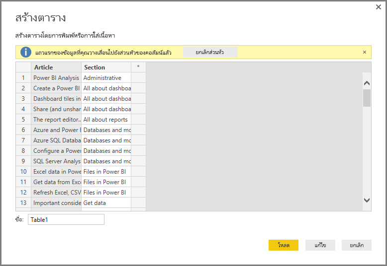
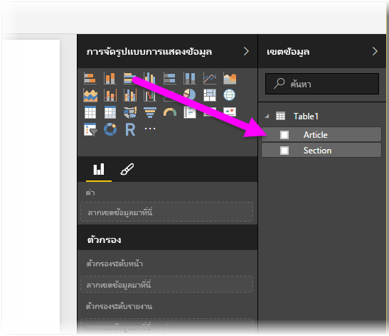

# ใส่ข้อมูลโดยตรงลงใน Power BI Desktop
ด้วย Power BI Desktop คุณก็สามารถใส่ข้อมูลได้โดยตรง และใช้ข้อมูลนั้นในรายงานและการแสดงภาพของคุณ ตัวอย่างเช่น คุณสามารถคัดลอกเวิร์กบุ๊กหรือเว็บเพจบางส่วน จากนั้นวางลงใน Power BI Desktop

เมื่อต้องการใส่ข้อมูลลงใน Power BI Desktop โดยตรงในรูปแบบของตารางใหม่ให้**เลือกป้อนข้อมูล**จาก ribbon **หน้าแรก**

Power BI Desktop อาจพยายามทำการเปลี่ยนแปลงข้อมูลเพียงเล็กน้อยตามความเหมาะสม ในลักษณะเดียวกับที่ดำเนินการ เมื่อคุณโหลดข้อมูลจากแหล่งข้อมูลต่างๆ ตัวอย่างเช่น ในกรณีต่อไปนี้ จะมีการเลื่อนระดับแถวแรกของข้อมูลในหัวกระดาษ

ถ้าคุณต้องการจัดรูปแบบข้อมูลที่คุณใส่ (หรือวาง) แล้ว คุณก็สามารถเลือกปุ่มแก้ไขเพื่อแสดง**ตัวแก้ไขคิวรี** ที่คุณสามารถจัดรูปแบบ และแปลงข้อมูลก่อนที่นำมาลงใน Power BI Desktop ได้ หรือคุณสามารถเลือกปุ่ม **โหลด** เพื่อนำเข้าข้อมูล ตามที่ปรากฏได้

เมื่อคุณเลือก**โหลด** Power BI Desktop จะสร้างตารางใหม่จากข้อมูลของคุณ และทำให้ตาารางพร้อมใช้งานในบานหน้าต่าง**เขตข้อมูล** ในรูปต่อไปนี้ Power BI Desktop จะแสดงตารางใหม่ของฉัน ซึ่งเรียกว่า*ตารางที่ 1*ตามค่าเริ่มต้น และเขตข้อมูลสองรายการภายในตารางดังกล่าวที่สร้างขึ้น

และเพียงเท่านี้เอง คุณก็สามารถใส่ข้อมูลลงใน Power BI Desktop ได้อย่างง่ายดาย

ตอนนี้คุณก็พร้อมที่จะใช้ข้อมูลนำเข้าจากเวิร์กบุ๊ก Excel ของคุณใน Power BI Desktop เพื่อสร้างภาพ รายงาน หรือโต้ตอบกับข้อมูลอื่น ๆ ที่คุณอาจต้องการเชื่อมต่อ และนำเข้า เช่น เวิร์กบุ๊ก Excel ฐานข้อมูล หรือแหล่งข้อมูลอื่น ๆ

## ขั้นตอนถัดไป
มีข้อมูลหลากหลายประเภทที่คุณสามารถเชื่อมต่อโดยใช้ Power BI Desktop สำหรับข้อมูลเพิ่มเติมเกี่ยวกับแหล่งข้อมูล โปรดดูทรัพยากรต่อไปนี้:

* [Power BI Desktop คืออะไร](desktop-what-is-desktop.md)
* [แหล่งข้อมูลใน Power BI Desktop](desktop-data-sources.md)
* [จัดรูปทรงและรวมข้อมูลด้วย Power BI Desktop](desktop-shape-and-combine-data.md)
* [เชื่อมต่อกับเวิร์กบุ๊ก Excel ใน Power BI Desktop](desktop-connect-excel.md)   
* [เชื่อมต่อกับไฟล์ CSV ใน Power BI Desktop](desktop-connect-csv.md)   

