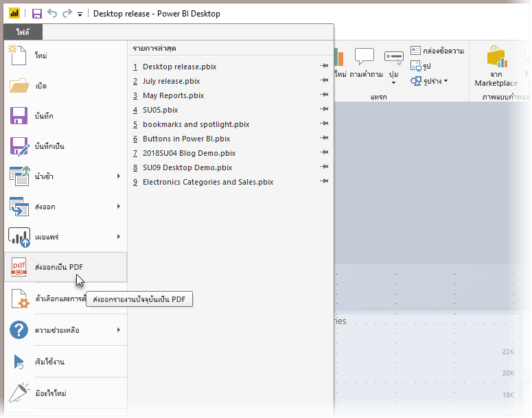
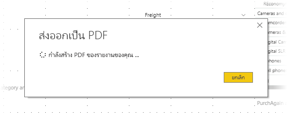

# ส่งออกรายงานเป็น PDF จาก Power BI Desktop
ใน**Power BI Desktop**หรือ บริการ Power BI คุณสามารถส่งออกรายงานไปยังไฟล์ PDF และดังนั้นจึงได้อย่างง่ายดายแชร์ หรือพิมพ์รายงานของคุณจาก PDF นั้นได้

กระบวนการส่งออกรายงานของคุณจาก**Power BI Desktop**เป็น PDF เป็นเรื่องไม่ยุ่งยาก เพื่อให้คุณสามารถพิมพ์เป็น PDF หรือแชร์เอกสาร PDF นั้นกับผู้อื่น เพียงแค่เลือก**ไฟล์ > ส่งออกเป็น PDF**จาก Power BI Deskop

กระบวนการ**ส่งออกเป็น PDF**จะส่งออกหน้าในรายงาน*ที่เห็น*ทั้งหมด พร้อมกับแต่ละหน้ารายงานที่ส่งออกเป็นหน้าเดียวใน PDF หน้ารายงานที่ไม่สามารถมองเห็นได้ในขณะนี้ เช่น หน้าคำแนะนำเครื่องมือหรือหน้าที่ซ่อน จะไม่ถูกส่งออกเป็นไฟล์ PDF 

เมื่อคุณเลือก**ไฟล์ > ส่งออกเป็น PDF** การส่งออกจะเริ่มขึ้น และกล่องโต้ตอบจะปรากฏขึ้นเพื่อแสดงกระบวนการส่งออกอยู่ในระหว่างดำเนินการ กล่องโต้ตอบยังคงอยู่บนหน้าจอจนกว่ากระบวนการส่งออกเสร็จสมบูรณ์ ในระหว่างกระบวนการส่งออก การโต้ตอบกับรายงานที่จะถูกส่งออกทั้งหมดถูกปิดใช้งาน วิธีเดียวที่จะโต้ตอบกับรายงานได้ คือ ต้องรอจนกว่ากระบวนการส่งออกเสร็จสมบูรณ์ หรือยกเลิกการส่งออก 

เมื่อการส่งออกเสร็จสมบูรณ์ PDF จะถูกโหลดลงในตัวแสดง PDF เริ่มต้นบนคอมพิวเตอร์ 

## ข้อควรพิจารณาและข้อจำกัด
มีข้อควรพิจารณาสองสามอย่างที่ควรคำนึงถึงกับคุณลักษณะ**การส่งออกเป็น PDF**:

* คุณลักษณะจะส่งออกวิชวล Power BI แต่*ไม่*ส่งออกรูปพื้นหลังใด ๆ ที่คุณอาจใช้กับรายงาน

เนื่องจากรูปพื้นหลังจะถูกส่งออกเป็น PDF คุณควรใส่ใจรายงานที่ใช้รูปพื้นหลังสีเข้มเป็นพิเศษ ถ้าข้อความในรายงานของคุณเป็นสีขาวหรือสีอ่อนเพื่อให้โดดเด่นกับรูปพื้นหลังสีเข้มของคุณ จะสามารถอ่านได้ยากหรือไม่สามารถอ่านได้ในกระบวนการส่งออกเป็น PDF เนื่องจากรูปพื้นหลังจะไม่ถูกส่งออกไปกับรายงานที่เหลือ 

## ขั้นตอนถัดไป
มีหลายองค์ประกอบภาพและคุณลักษณะใน**Power BI Desktop**ที่น่าสนใจ สำหรับข้อมูลเพิ่มเติมเกี่ยวกับข้อมูล โปรดดูทรัพยากรต่อไปนี้:

* [ใช้องค์ประกอบภาพเพื่อปรับปรุงรายงาน Power BI](desktop-visual-elements-for-reports.md)
* [Power BI Desktop คืออะไร](desktop-what-is-desktop.md)

