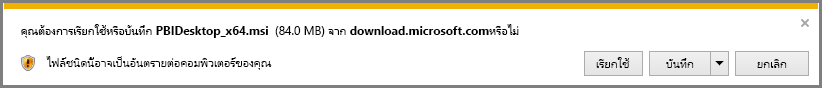

# รับ Power BI Desktop
**Power BI Desktop** ช่วยให้คุณสร้างคิวรีขั้นสูง รูปแบบข้อมูล และรายงานที่แสดงข้อมูลเป็นภาพ ด้วย **Power BI Desktop** คุณสามารถสร้างรูปแบบข้อมูล สร้างรายงาน และแชร์งานของคุณ โดยการเผยแพร่ไปยังบริการของ Power BI ได้  **Power BI Desktop** มีให้ดาวน์โหลดฟรี

คุณสามารถรับ **Power BI Desktop** ได้สองวิธี ซึ่งจะอธิบายไว้ในส่วนต่อไป:

* **ดาวน์โหลด**โดยตรง (แพคเกจ MSI ที่คุณดาวน์โหลด และติดตั้งบนคอมพิวเตอร์ของคุณ)
* ติดตั้งเป็นแอปจาก **Microsoft Store**

ไม่ว่าจะติดตั้งวิธีใด ก็จะได้รับ **Power BI Desktop** เวอร์ชันล่าสุดในคอมพิวเตอร์ของคุณ แต่มีความแตกต่างบางอย่างที่ควรทราบ ซึ่งจะอธิบายในส่วนต่อไปนี้

## ดาวน์โหลด Power BI Desktop
เพื่อดาวน์โหลด **Power BI Desktop** เวอร์ชันล่าสุด คุณสามารถเลือกไอคอนดาวน์โหลดจากมุมบนขวาของบริการของ Power BI และเลือก **Power BI Desktop** ได้

คุณยังสามารถดาวน์โหลด Power BI Desktop เวอร์ชันล่าสุดจากหน้าการดาวน์โหลดต่อไปนี้:

* [**ดาวน์โหลด Power BI Desktop** (ทั้งเวอร์ชัน 32 และ 64 บิต)](https://powerbi.microsoft.com/desktop)
  
  

ไม่ว่าคุณจะเลือกดาวน์โหลดด้วยวิธีไหน ทันทีที่ **Power BI Desktop** ถูกดาวน์โหลดแล้ว คุณจะได้รับพร้อมท์ให้เรียกใช้แฟ้มการติดตั้ง:

**Power BI Desktop** จะติดตั้งแบบแอปพลิเคชัน และทำงานบนเดสก์ท็อปของคุณ

> [!NOTE]
> ไม่รองรับการติดตั้งเวอร์ชันดาวน์โหลด (MSI) และเวอร์ชัน **Microsoft Store** ของ **Power BI Desktop** บนคอมพิวเตอร์เครื่องเดียวกัน (ในบางครั้งเรียกว่าการติดตั้ง*ข้างกัน*)
> 
> 

## ติดตั้งเป็นแอปจาก Microsoft Store
คุณยังสามารถรับ **Power BI Desktop** จาก Microsoft Store โดยใช้ลิงก์ต่อไปนี้:

* [ติดตั้ง **Power BI Desktop** จาก **Microsoft Store**](http://aka.ms/pbidesktopstore)

มีข้อดีบางประการของ **Power BI Desktop** จาก Microsoft Store:

* **อัปเดตอัตโนมัติ** - Windows จะดาวน์โหลดเวอร์ชันล่าสุดในพื้นหลังโดยอัตโนมัติทันทีที่มี ดังนั้นเวอร์ชันของคุณจะเป็นเวอร์ชันล่าสุดเสมอ
* **ดาวน์โหลดมีขนาดเล็กกว่า** - **Microsoft Store** ช่วยให้มั่นใจว่า เฉพาะคอมโพเนนต์ที่มีการเปลี่ยนแปลงในการอัปเดตแต่ละครั้ง จะถูกดาวน์โหลดลงเครื่องของคุณ ดาวน์โหลดจึงมีขนาดเล็กกว่าสำหรับแต่ละอัปเดต
* **ไม่จำเป็นต้องมีสิทธิ์ผู้ดูแลระบบ** - เมื่อคุณดาวน์โหลด MSI โดยตรงและติดตั้ง คุณต้องเป็นผู้ดูแลระบบเพื่อให้การติดตั้งสำเร็จ เมื่อคุณรับ **Power BI Desktop** จาก Microsoft Store สิทธิ์ผู้ดูแลระบบจะ*ไม่*จำเป็น
* **เปิดใช้งานการเผยแพร่ IT** - เวอร์ชัน **Microsoft Store** สามารถปรับใช้ หรือ*เผยแพร่*ให้ทุกคนในองค์กรของคุณ และสามารถทำให้ **Power BI Desktop** มีให้บริการผ่าน **Microsoft Store สำหรับธุรกิจ**
* **ตรวจหาภาษา** - เวอร์ชัน **Microsoft Store** รวมทุกภาษาที่สนับสนุนทั้งหมด และตรวจว่าภาษาไหนที่ใช้บนคอมพิวเตอร์ทุกครั้งที่เรียกใช้ ซึ่งจะมีผลกับภาษาของรูปแบบที่สร้างขึ้นใน **Power BI Desktop** ตัวอย่างเช่น ลำดับชั้นวันที่ จะตรงกับภาษาที่ **Power BI Desktop** ใช้เมื่อสร้างไฟล์ .pbix

มีข้อพิจารณาและข้อจำกัดสำหรับการติดตั้ง **Power BI Desktop** จาก Microsoft Store ดังต่อไปนี้:

* ถ้าคุณใช้ตัวเชื่อมต่อ SAP คุณอาจต้องย้ายไฟล์โปรแกรมควบคุม SAP ของคุณไปยังโฟลเดอร์ *Windows\System32*
* การติดตั้ง **Power BI Desktop** จาก Microsoft Store ไม่คัดลอกการตั้งค่าผู้ใช้จากเวอร์ชัน MSI คุณอาจต้องเชื่อมต่อกับแหล่งข้อมูล ที่คุณเชื่อมต่อเมื่อเร็ว ๆ นี้ และใส่ข้อมูลประจำตัวของแหล่งข้อมูลคุณอีกครั้ง 

> [!NOTE]
> ไม่รองรับการติดตั้งเวอร์ชันดาวน์โหลด (MSI) และ **Microsoft Store** ของ **Power BI Desktop** บนคอมพิวเตอร์เครื่องเดียวกัน (ในบางครั้งเรียกว่าการติดตั้ง*ข้างกัน*) คุณควรถอนการติดตั้ง **Power BI Desktop** ด้วยตนเอง ก่อนที่จะดาวน์โหลดจาก **Microsoft Store**
> 
> [!NOTE]
> **Power BI Desktop** รุ่นเซิร์ฟเวอร์รายงาน Power BI เป็นเวอร์ชันแยกต่างหากจากเวอร์ชันที่อธิบายในบทความนี้ สำหรับข้อมูลเกี่ยวกับ **Power BI Desktop** เวอร์ชันเซิร์ฟเวอร์รายงาน ดูบทความ[สร้างรายงาน Power BI สำหรับเซิร์ฟเวอร์รายงาน Power BI](report-server/quickstart-create-powerbi-report.md)
> 
> 

## การใช้ Power BI Desktop
เมื่อคุณเรียกใช้ **Power BI Desktop** หน้าจอ*ยินดีต้อนรับ*จะแสดงขึ้นมา

ถ้านี่เป็นครั้งแรกที่คุณใช้ **Power BI Desktop** (ถ้าเป็นติดตั้งใหม่ ไม่ใช่การอัปเกรด) คุณจะได้รับพร้อมท์ให้กรอกแบบฟอร์ม และตอบคำถาม หรือลงชื่อเข้าใช้ใน **บริการของ Power BI** ก่อนที่คุณจะสามารถ สามารถดำเนินต่อ

จากนั้น คุณสามารถสร้างรูปแบบข้อมูล หรือรายงาน แล้วแชร์ให้กับผู้อื่นบนบริการของ Power BI ลองดูลิงก์**ข้อมูลเพิ่มเติม**ที่ส่วนท้ายของบทความนี้ สำหรับลิงก์ไปยังคำแนะนำที่สามารถช่วยให้คุณเริ่มต้นใช้งาน **Power BI Desktop**

## ข้อกำหนดขั้นต่ำ
ต่อไปนี้คือข้อกำหนดขั้นต่ำเพื่อใช้ **Power BI Desktop**:

* Windows 7 / Windows Server 2008 R2 หรือใหม่กว่า
* .NET 4.5
* Internet Explorer 9 หรือใหม่กว่า
* **หน่วยความจำ (RAM):** มีหน่วยความจำว่างอย่างน้อย 1 GB, แนะนำ 1.5 GB หรือมากกว่า
* **จอภาพ:** อย่างน้อย 1440 x 900, แนะนำ 1600 x 900 (16:9) ความละเอียดต่ำกว่า เช่น 1024 x 768 หรือ 1280 x 800 ไม่แนะนำ เพราะตัวควบคุมบางอย่าง (เช่นการปิดหน้าจอเริ่มต้น) จะแสดงเลยหน้าจอ
* **การตั้งค่าการแสดงผลของ Windows:** ถ้าตั้งค่าการแสดงผล ให้ขนาดของข้อความ แอป และรายการอื่น ๆ มีค่ามากกว่า 100% คุณอาจไม่สามารถเห็นกล่องโต้ตอบบางอย่างที่ต้องปิด หรือตอบกลับเพื่อดำเนินต่อโดยใช้ **Power BI Desktop** ถ้าคุณพบปัญหานี้ ตรวจสอบ**การตั้งค่าการแสดงผล**ของคุณ โดยไปที่**การตั้งค่า > ระบบ > การแสดงผล**ใน Windows และการใช้แถบเลื่อนเพื่อตั้งค่ากลับไปเป็น 100%
* **CPU:** แนะนำตัวประมวลผล x86- หรือ x64-บิต 1 กิกะเฮิร์ตซ์ (GHz) หรือเร็วกว่า

## ข้อควรพิจารณาและข้อจำกัด

เราต้องการให้ประสบการณ์การใช้งาน Power BI Desktop ของคุณดีเยี่ยมเสมอ อาจมีโอกาสที่คุณจะประสบปัญหากับ Power BI Desktop ดังนั้นในส่วนนี้จะประกอบด้วยวิธีแก้ไขปัญหาหรือคำแนะนำในการจัดการปัญหาที่อาจเกิดขึ้น 

### ปัญหาจากรุ่นก่อนหน้าของ Power BI Desktop

ผู้ใช้บางส่วนจะพบข้อผิดพลาดคล้ายกับต่อไปนี้ เมื่อใช้ **Power BI Desktop** เวอร์ชันที่ล้าสมัย: 

    "We weren't able to restore the saved database to the model" 

อัปเดตเป็น Power BI Desktop รุ่นปัจจุบัน มักจะแก้ไขปัญหานี้ได้

### การปิดการแจ้งให้ทราบ
เราขอแนะนำให้อัปเดตเป็นเวอร์ชันล่าสุดของ Power BI Desktop เพื่อประโยชน์จากความก้าวหน้าในคุณลักษณะ, ประสิทธิภาพ, เสถียรภาพ และการปรับปรุงอื่น ๆ บางองค์กรอาจไม่ต้องการให้ผู้ใช้อัปเดตเป็นเวอร์ชันใหม่ คุณสามารถปิดการแจ้งเตือนได้โดยการปรับเปลี่ยนรีจิสทรี ด้วยขั้นตอนต่อไปนี้:

1. การใช้ตัวแก้ไขรีจิสทรี นำทางไปที่ *HKEY_LOCAL_MACHINE\SOFTWARE\Microsoft\Microsoft Power BI Desktop*
2. สร้างรายการใหม่ที่มีการตั้งค่าต่อไปนี้: *REG_DWORD: DisableUpdateNotification*
3. ตั้งค่าของรายการใหม่นั้นเป็น **1**

คุณจะต้องรีสตาร์ตคอมพิวเตอร์เพื่อให้การเปลี่ยนแปลงมีผลบังคับใช้

### Power BI Desktop โหลดด้วยหน้าจอบางส่วน

ในบางกรณี รวมถึงบางการกำหนดค่าความละเอียดหน้าจอ ผู้ใช้บางรายอาจเห็น Power BI Desktop แสดงเนื้อหาด้วยพื้นที่สีดำขนาดใหญ่ นี่คือผลลัพธ์โดยทั่วไปของระบบปฏิบัติการล่าสุดที่มีผลต่อการแสดงรายการมากกว่าเป็นผลลัพธ์โดยตรงของการแสดงเนื้อหาของ Power BI Desktop หากไม่คำนึงว่าพื้นที่สีดำขนาดใหญ่ไม่สำคัญเท่าวิชวล เพื่อจัดการปัญหานี้ ให้ปฏิบัติตามขั้นตอนต่อไปนี้:

1. กดแป้น Start และพิมพ์คำว่า *blurry* ลงในแถบค้นหาที่ปรากฏ
2. ในกล่องโต้ตอบที่ปรากฏขึ้น เลือกตัวเลือก: *อนุญาตให้ Windows แก้ไขแอปที่ไม่ชัดเจน*
3. รีสตาร์ต Power BI Desktop

ปัญหานี้อาจหมดไปหลังจากมีการเผยแพร่อัปเดตของ Windows รุ่นถัดมา 
 

## ขั้นตอนถัดไป
เมื่อคุณได้ติดตั้ง **Power BI Desktop** แล้ว เนื้อหาต่อไปนี้สามารถช่วยให้คุณเริ่มต้น และใช้งานอย่างรวดเร็ว:

* [Power BI Desktop คืออะไร](desktop-what-is-desktop.md)
* [ภาพรวมคิวรี่กับ Power BI Desktop](desktop-query-overview.md)
* [แหล่งข้อมูลใน Power BI Desktop](desktop-data-sources.md)
* [เชื่อมต่อกับข้อมูลใน Power BI Desktop](desktop-connect-to-data.md)
* [จัดรูปร่างและรวมข้อมูลด้วย Power BI Desktop](desktop-shape-and-combine-data.md)
* [งานคิวรี่ที่ใช้บ่อยใน Power BI Desktop](desktop-common-query-tasks.md)   

